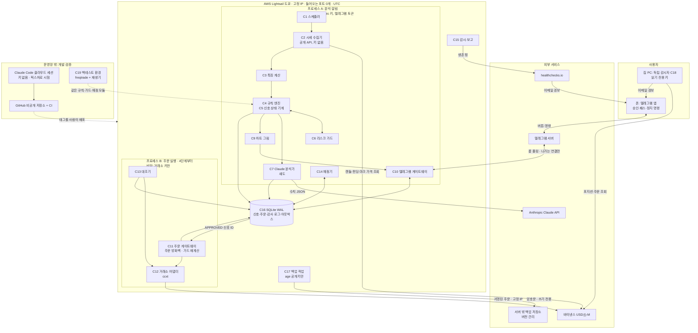
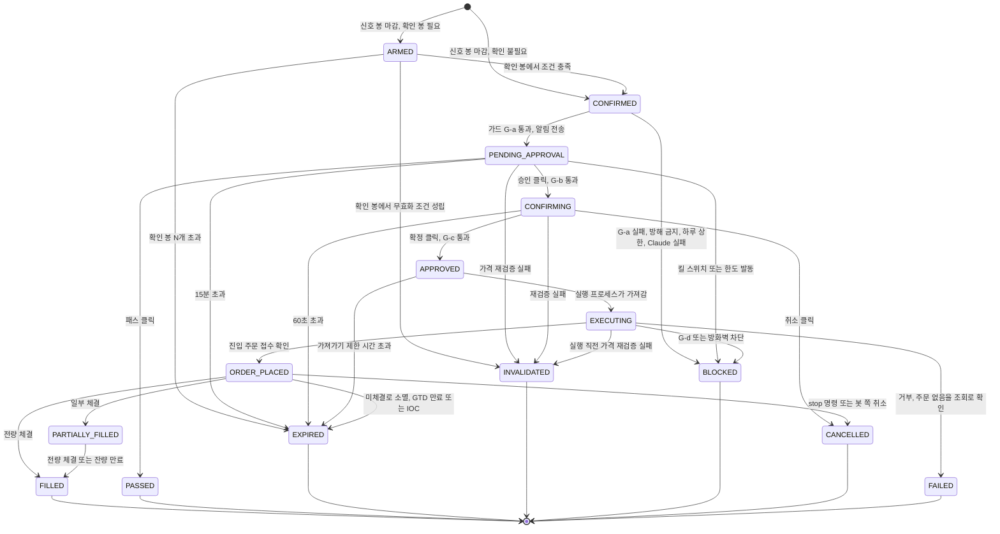
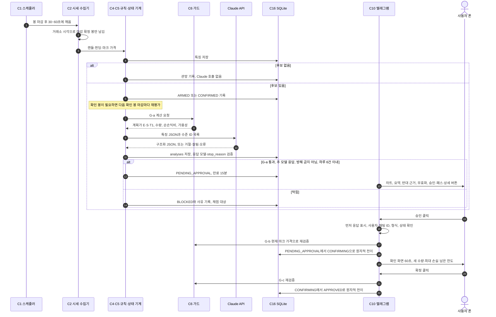
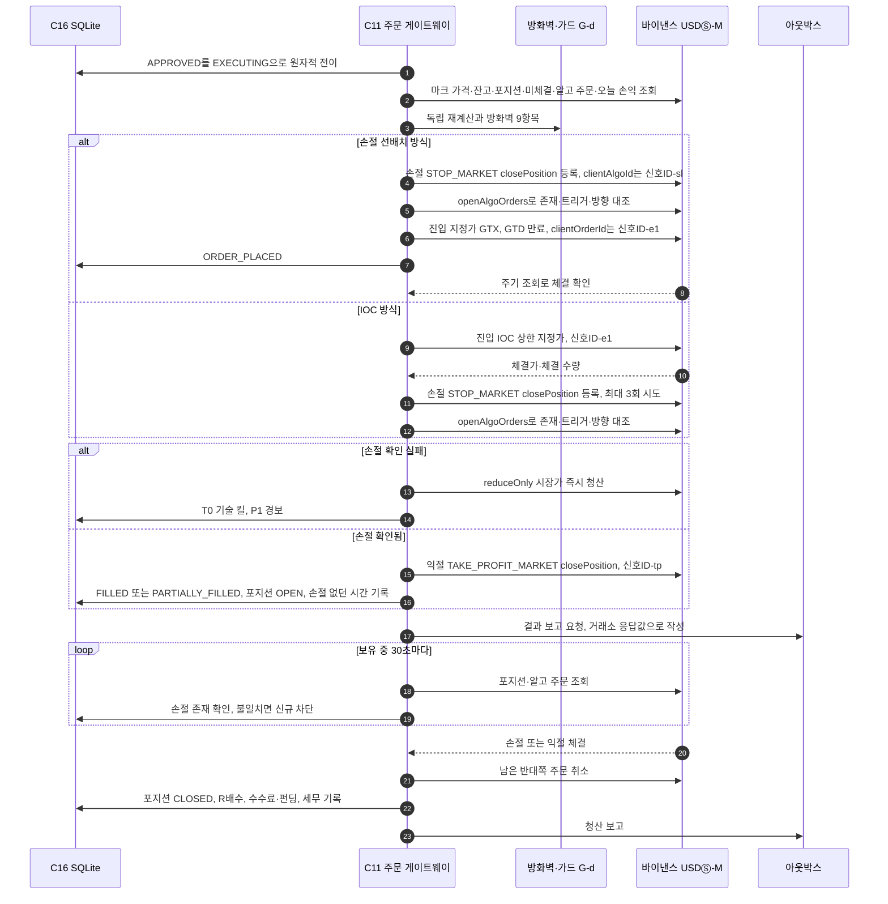
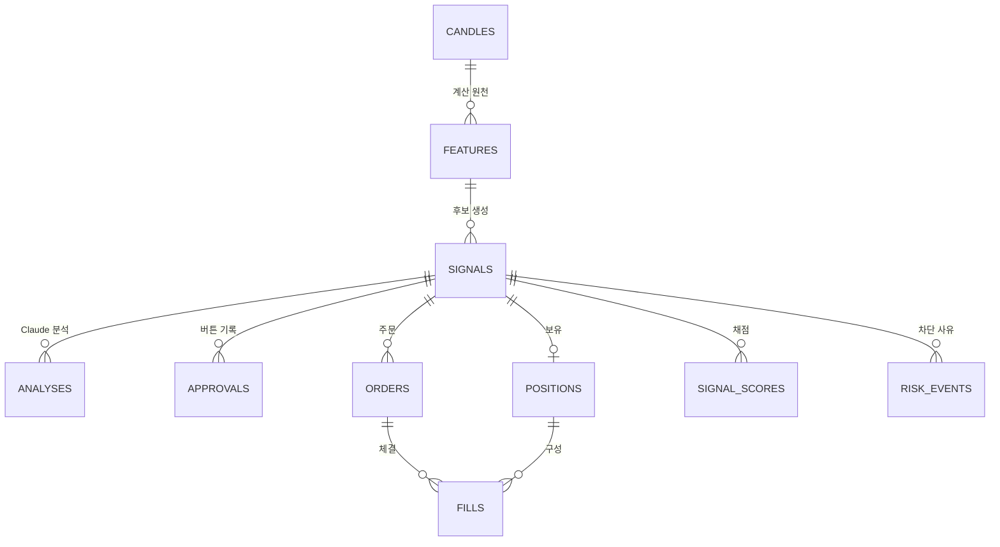

# 시스템 설계서 (ARCHITECTURE) — BTC/USDT 무기한 선물 반자동 매매 시스템

> 작성일: 2026-09-29 · 버전: **v0.1.1 (초안)** · 상태: 설계 문서 (코드 없음, 설치 없음)
> 읽는 사람: 사용자(코딩 비전문가), 그리고 이 설계를 보고 코드를 쓸 Claude 개발 세션
>
> **변경 기록**
> - v0.1.1 (2026-09-29): 텔레그램 채팅 구조를 고쳤다. 봇 하나와 사용자 한 명 사이의 1:1(private) 채팅은 하나뿐이다. 그래서 운영 봇 하나로 "승인 채팅 + 운영 채팅"을 따로 둘 수 없다. **운영 봇 채팅 하나에서 메시지마다 소리·무음을 나누는 방식(안 a)**으로 바꿨다. 봇 토큰은 개발·운영 2개 그대로다(§5.3.1, §5.3.4)
>
> **관련 문서**
> - [PLAN.md](./PLAN.md): 기획서. **숫자 기준값의 원본(결정표)은 PLAN에 둔다.** 이 문서의 숫자는 설계를 설명하려고 옮겨 적은 사본이다. 서로 다르면 PLAN 결정표를 따른다 [판정 Q4+F10]
> - [STRATEGY.md](./STRATEGY.md): 차트 기법. 규칙의 출처
> - `THREAT_MODEL.md`, `RUNBOOK.md`: **작성 예정.** 이 문서는 두 문서에 들어갈 요구사항만 정한다(§1.2, §6)
> - 조사 문서: [01 기존 시스템](../research/planning/01_existing_systems.md) · [02 차트 분석 방법](../research/planning/02_chart_methods.md) · [03 LLM 트레이딩](../research/planning/03_llm_trading.md) · [04 거래소·규제](../research/planning/04_exchanges_regulation.md) · [05 인프라·운영](../research/planning/05_infra_ops.md) · [06 소프트웨어 스택](../research/planning/06_software_stack.md) · [07 텔레그램 승인](../research/planning/07_telegram_hitl.md) · [08 리스크·검증](../research/planning/08_risk_backtest.md)
> - 이전 리서치: [research/README.md](../research/README.md) · [VERIFICATION.md](../research/VERIFICATION.md) · [워뇨띠 보고서](../research/wonyotti/REPORT.md) · [차트프로 보고서](../research/chartpro/REPORT.md)
>
> **표기**
> - **[직접]**: 원문을 직접 열어 확인했다
> - **(검색 요약)**: 검색 결과 요약으로만 확인했다
> - **확인 필요**: 확인하지 못했다. 추측하지 않았다
> - **(제안값)**: 근거 없는 출발값이다. 기록을 보고 조정한다
> - **결정 필요**: 사용자가 정할 항목이다. 권고값으로 설계해 두었다
> - **[판정 Q8]** 같은 번호: 2026-09-29 기획 검토에서 채택된 지적의 번호다
> - **[07 §2.3]** 같은 표기: 조사 문서 번호와 절이다. 원 출처 URL은 §12에 모았다

---

## 0. 먼저 읽을 것

### 0.1 이 문서가 정하는 것과 정하지 않는 것

**정하는 것**
- 부품(컴포넌트)을 어떻게 나누는지, 부품끼리 무엇을 주고받는지
- 신호 한 건이 생겨서 끝날 때까지 거치는 상태와 규칙
- 저장할 데이터의 모양
- 거래소·Claude·텔레그램과 붙는 규격
- 장애가 났을 때 어떻게 멈추고 어떻게 되살아나는지
- 설정과 환경(개발 / 페이퍼 / 테스트넷 / 실거래)을 나누는 방법
- 코드 폴더 배치

**정하지 않는 것**
- 매매 규칙의 세부 수치: STRATEGY와 1단계에서 고정할 규칙 명세서가 정한다
- 일정: PLAN이 정한다
- 위협 모델 전문: THREAT_MODEL이 정한다

### 0.2 한 장 요약

1. **코드가 신호를 만든다. Claude는 설명·반대 근거·의견을 붙인다. 사람이 승인한다. 코드가 가드를 다시 계산한 뒤 주문한다.**
   - Claude의 의견은 기록만 하고 주문 차단에 쓰지 않는다(섀도). [판정 Q3]
   - 가격·손익비·수량은 모두 코드가 계산한다.
2. **서버 한 대에 프로세스가 둘이다(4단계부터).** [판정 SEC-08]
   - 분석·알림 프로세스는 Anthropic 키와 텔레그램 토큰만 가진다.
   - 주문 실행 프로세스는 거래소 키만 가진다.
   - 둘은 SQLite 파일 하나로만 대화한다.
3. **신호는 상태 기계 하나로 관리한다.** 규칙·가드·체결 모델 코드는 백테스트, 페이퍼, 실거래가 **같은 코드를 함께 쓴다**. [판정 Q8, Q6]
4. **최상위 불변조건은 "손절이 거래소에 실제로 걸려 있는가"다.** 걸려 있지 않으면 즉시 청산하고 신규 진입을 막는다. [08 §3.1]
5. **모든 실패는 "주문 안 함"으로 끝난다(fail-closed).** 서버가 죽어도 거래소에 걸린 손절이 포지션을 지킨다. [05 §2.12]

### 0.3 이 설계가 전제하는 결정 (결정표 사본)

값의 원본은 PLAN 결정표다. 여기서는 설계에 필요한 만큼만 요약한다.

| 주제 | 이 설계에 쓰는 값 (요약) | 상태 |
|---|---|---|
| 분석 주기·타임프레임 | 두 설정을 모두 파라미터로 지원한다.<br>- **설정 1**(현행): 1H 신호 + 4H 방향 + 15m 확인<br>- **설정 2**: 4H 신호 + 일봉 방향 + 1H 확인<br>G1에서 지연·가용성을 반영한 성과로 비교하고, 비슷하면 설정 2를 기본으로 한다. 마감이 확정된 봉만 쓰고, 마감 후 약 30~60초 뒤에 실행한다. 시각은 내부적으로 UTC, 표시는 KST다. 신호 흐름은 공용 상태 기계로 관리한다: ARMED → CONFIRMED → PENDING_APPROVAL → APPROVED → ORDER_PLACED → FILLED 또는 EXPIRED/INVALIDATED/BLOCKED | **결정 필요** |
| Claude의 역할 | 관문(gate)이 아니다. 하는 일은 다섯 가지다.<br>- 수준 ID를 enum으로 선택<br>- 한 줄 요약<br>- 반대 근거<br>- 무효화 조건<br>- "승인 권고 / 패스 권고" 의견(섀도 기록)<br>가격·손익비·수량은 코드가 계산한다. 관문으로 승격하는 조건은 같은 특징 JSON을 쓰는 **코드 메타 필터**를 약 600건 비교에서 이기는 것이다 | **결정 필요** |
| Claude 모델·호출 | `claude-opus-5-5`, effort `medium`, 구조화 출력(JSON 스키마), max_tokens 약 16,000, 타임아웃 120초.<br>- 코드 후보가 있을 때만 호출한다<br>- `stop_reason`이 `end_turn`이 아니거나 검증에 실패하면 주문 없이 기록한다<br>- 서버측 fallbacks는 켜되, 폴백 모델이 답하면 승인 버튼을 만들지 않는다<br>- 실제 응답 모델 ID, 프롬프트·스키마 버전, 입력 스냅샷, 원본 응답을 저장한다<br>- Batch API, Haiku 4.5, Fable 5.1은 쓰지 않는다<br>- 전용 Workspace, 전용 키, 월 지출 한도를 둔다 | 확정 권고 |
| Claude 입력 | 코드가 계산한 수치 JSON이 주입력이다. 차트 이미지는 텔레그램에서 사람이 보는 용도다. Claude에게 이미지를 넣을지는 "나중"의 쌍 비교로 정한다. 뉴스·SNS 텍스트는 넣지 않는다 | 확정 권고 |
| 알림·승인 | 채널은 텔레그램 롱 폴링만 쓴다.<br>- 봇: 개발용과 운영용 토큰을 분리한다(토큰 2개)<br>- 채팅: 운영 봇과의 1:1 채팅 **하나**에 모두 보낸다. 메시지마다 `disable_notification`으로 소리(승인 요청·긴급)와 무음(결과·운영 알림·요약)을 나눈다. 봇 채팅은 음소거하지 않는다. 보내기 전용 운영 알림 봇을 추가하는 안(토큰 3개)은 대안이다(§5.3.1)<br>- 버튼: [승인]/[패스]/[상세]. 패스하면 사유를 받는다. 확인 화면은 60초 뒤 만료된다<br>- 버튼 데이터(`callback_data`): `v1:동작:랜덤신호ID`<br>- 권한: 숫자 사용자 ID와 private 채팅 ID를 모두 확인한다<br>- 방해 금지 00:30~07:30 KST(이 시간 신호는 기록만), 하루 승인 요청 최대 6건<br>- 요약: 아침 08:00, 주간<br>- 명령: `/stop`·`/pause`는 즉시, `/flat`은 2단계 확인, `/away` 있음<br>- 알림 첫 줄에 `[PAPER]`/`[TESTNET]`/`[LIVE]`<br>- Slack·Discord는 쓰지 않는다 | **결정 필요** |
| 거래소 | 바이낸스 USDⓈ-M BTCUSDT 무기한.<br>- 계정: 봇 전용 서브계정, One-way 모드, Single-Asset(USDT) 모드, 격리 마진, 거래소 레버리지 3배<br>- 키: 서버에서 만든 Ed25519. 권한은 선물 거래와 읽기만 켜고 출금·이체는 끈다. 고정 IP 1개만 허용한다<br>- 교체 방식: 거래소 어댑터와 설정표로 바꾼다. 예비 거래소는 OKX, 그다음 Bybit이며 "나중"에 만든다 | 확정 권고 |
| 주문 방식 | 진입: 계획가에 post-only(GTX) 지정가 + GTD 만료. 만료 시각은 max(현재+11분, 다음 확인 봉 마감)이고, 봇 쪽 취소도 이중으로 둔다.<br>- 조건: **PoC에서 "체결 전 closePosition 손절 선배치"가 될 때만**이 방식이 기본이다. 안 되면 IOC 상한 지정가가 기본이다<br>- 손절: algo STOP_MARKET(`closePosition`, `MARK_PRICE`, `priceProtect=false`, `clientAlgoId`=신호ID). 존재를 확인하고, 없으면 reduceOnly 시장가로 청산한다<br>- 익절: 단일 목표, 전량, algo TAKE_PROFIT_MARKET(`closePosition`)<br>- 모든 청산 주문은 reduceOnly 또는 closePosition이다<br>- 모든 주문은 주문 방화벽을 거친다 | 확정 권고 |
| 리스크 | R 자본을 기준으로 한다.<br>- 1회 위험 r 0.5%(상한 1.0%, G4 0.25%)<br>- 손절 ATR 밴드: 최소 max(0.4%, 1×ATR), 최대 min(2%, 3×ATR)<br>- 레버리지 3배 이하, 격리<br>- 증거금 ≤ R 자본 20%(명목 ≤ 0.6배), 최대 1포지션<br>- 한도: 일일 −3%/−3R, 24시간 3손절, 주간 −6%, 누적 −10%/−15%<br>- 순손익비 ≥ 1.5. 비용 차감 후, 계획 평균 진입가와 단일 목표가 기준<br>- 확신도는 기록만 한다<br>- 승인 유효 15분. 괴리 한도 min(0.25×손절 거리, 0.3%)<br>- T0 기술 킬 | **결정 필요** |
| 실행 엔진 | 자체 주문 게이트웨이(ccxt 직접)를 쓴다. 범위는 BTCUSDT, One-way, 1포지션이다. freqtrade는 백테스트·드라이런 전용이다. freqtrade REST `/forceenter` 방식(B2)은 채택하지 않는다 | 확정 권고 |
| 언어·라이브러리 | Python 3.14, uv + uv.lock(해시 고정, exclude-newer 7일, `uv sync --locked`)<br>- 핵심: ccxt 4.5.x(고정), pandas 3.0.x, anthropic 1.x, python-telegram-bot 22.8[job-queue], pydantic-settings, matplotlib. mplfinance는 pandas 3 호환이 확인될 때만 쓴다<br>- 내장: sqlite3, logging<br>- 개발 도구: pytest, ruff, gitleaks, pip-audit<br>- 금지: pandas-ta, backtrader, python-binance, binance-futures-connector, ta | 확정 권고 |
| 호스팅·배포 | AWS Lightsail 도쿄 2GB + 고정 IP. Docker Compose로 띄운다.<br>- 포트: `ports:`를 쓰지 않는다. 인바운드 0개<br>- 로그 10m×5, 봇 인스턴스 1개, 베이스 이미지 digest 고정<br>- 시간: UTC, chrony로 동기화, recvWindow 5000<br>- 자동 보안 업데이트를 켠다. SSH는 Tailscale로만 연다<br>- 배포: CI를 통과한 태그만 `deploy.sh`로 수동 배포하고, rollback 스크립트와 RUNBOOK을 둔다. 윈도 Docker는 운영에 쓰지 않는다 | 확정 권고 |
| DB·백업 | SQLite(WAL) 파일 하나를 쓴다.<br>- 감사 로그는 추가 전용이고, UPDATE·DELETE 차단 트리거를 둔다. 세무 기록 테이블을 둔다<br>- 매일 거래소 체결과 대조한다<br>- 매일 `.backup` → age로 암호화 → 쓰기 전용 자격증명으로 서버 밖에 올린다<br>- Lightsail 스냅샷을 병행하고, 월 1회 복구를 연습한다 | 확정 권고 |
| 모니터링 | 네 겹으로 감시한다.<br>① healthchecks.io 데드맨: 평시 65~75분, 미체결 주문·포지션이 있으면 짧게<br>② 운영 알림(운영 봇 채팅에 무음, 치명이면 소리): 오류 코드와 이상을 알리고, 신규 주문을 차단하고, 이메일을 보낸다<br>③ 매일 09:00 KST 생존 보고<br>④ 서버 밖 독립 감시자(실거래 전) | 확정 권고 |
| 비밀·저장소 | 저장소를 비공개로 전환하고 Secret scanning·push protection을 켠다. gitleaks를 pre-commit과 CI에서 돌린다.<br>- 비밀 전달: Compose secrets 파일로 한다. 환경 변수는 쓰지 않는다<br>- Claude Code 클라우드 세션에는 어떤 거래소 키도 넣지 않는다<br>- 2단계 인증은 SMS가 아닌 방식으로 한다<br>- LIVE 단계에서 한도를 완화하는 조작은 두 번째 기기에서만 한다 | 확정 권고 (저장소 전환은 사용자가 직접 해야 함) |
| 봇 계좌 규모 | 서브계정 잔고 상한은 "잃어도 생활에 지장 없는 금액"으로 정한다. 자동 충전은 하지 않는다. R 자본은 이 금액 이하로 둔다 | **결정 필요** |
| 모델 교체 | 새 모델을 같은 후보에 섀도로 병행 호출해 쌍으로 비교한다. 코드 규칙 트랙(G1, G4 성과)은 리셋하지 않는다 | 확정 권고 |
| 벤치마킹 | 워뇨띠·차트프로는 "가설 출처"로 표기한다. 성과 기준은 "무작위 진입 + 같은 리스크 규칙"과 "일봉 돈치안 앙상블"이다 | 확정 권고 |

### 0.4 PLAN v0.1에서 달라진 점

| PLAN v0.1 | 이 설계 | 근거 |
|---|---|---|
| Claude가 방향·진입·손절·익절·확신도를 제안한다 | 코드가 후보를 고르고 가격을 계산한다. Claude는 설명·반대 근거·의견만 낸다(섀도) | [판정 Q3], [03 §2.4.1] |
| 1시간봉 마감마다 한 번 분석하고 알린다 | 신호 **상태 기계**를 둔다. 확인 봉을 기다리는 상태(ARMED)가 있다 | [판정 Q8] |
| 버튼 [롱] [숏] [패스] | [승인] [패스] [상세] (결정 필요) | [07 §2.10], [판정 F12] |
| 확신도 0.6 미만이면 관망 | 확신도는 기록만 한다. 관문은 코드 체크리스트다 | [판정 Q11] |
| 프로그램 1개 | 4단계부터 프로세스 2개로 나눠 키를 분리한다 | [판정 SEC-08] |
| 리스크 검사를 한 번 한다 | 알림 전, 승인 클릭, 확정 클릭, 주문 실행 직전의 **네 곳**에서 검사한다 | [07 §2.6], [판정 SEC-09] |
| 진입과 손절을 "함께 등록" | 원자적 등록이 불가능하다. 그래서 순서를 강제한다: 손절 선배치 또는 진입 → 손절 → 존재 확인 → 실패 시 청산 | [08 §2.5] |
| ccxt로 "설정만 교체" | 거래소 어댑터 + 거래소 설정표 + 데모 통합 시험을 통과해야 교체할 수 있다 | [04 §2.7] |
| `.env` 파일 | Compose secrets 파일(`/run/secrets/`)로 넘긴다 | [판정 SEC-08], [I1] |
| "Slack은 공개 서버가 필요하다" | **틀렸다**(Socket Mode면 필요 없다). 텔레그램을 유지하는 이유는 개인용·모바일·단순함이다 | [07 §2.10], [06 §2.4.4] |
| (PLAN v0.2 초안 D5, [07 §3.1]) 운영 봇 하나로 승인 채팅(소리) + 운영 채팅(무음), 둘 다 1:1 | **성립하지 않는다.** 봇과 사용자 사이의 1:1 채팅은 하나뿐이다. 운영 봇 1:1 채팅 **하나**에 보내고, 메시지마다 소리·무음을 나눈다. 봇 토큰은 개발·운영 2개 그대로다 | [T13][직접], 분석. §5.3.1 |
| 백테스트는 7단계 | 2단계 G1이 Go/No-Go 관문이다 | [판정 Q1+F01] |
| APScheduler를 따로 쓴다 | python-telegram-bot의 JobQueue를 쓴다(내부가 APScheduler 3.x) | [06 §2.4.3] |
| 보유 중 관리 없음 | 단일 익절 + 거래소 손절, 부분 체결 처리, `/flat` | [판정 F12] |

### 0.5 용어 (처음 나오는 전문 용어)

| 용어 | 한 줄 설명 |
|---|---|
| 컴포넌트(부품) | 한 가지 일을 맡은 코드 묶음이다. 예: 시세 수집기 |
| 프로세스 | 서버에서 따로 도는 프로그램 하나다. 프로세스끼리는 메모리를 공유하지 않는다 |
| 상태 기계 | "지금 어느 단계인가"를 이름 붙은 상태로 기록한다. 정해진 화살표로만 다음 상태로 넘어가게 하는 설계다 |
| 원자적 전이 | "상태가 X일 때만 Y로 바꿔라"를 DB가 한 번에 처리하는 것이다. 동시에 두 요청이 와도 하나만 성공한다 |
| 멱등성 | 같은 요청이 두 번 와도 결과가 한 번 처리한 것과 같은 성질이다 |
| fail-closed | 뭔가 불확실하면 **실행하지 않는** 쪽으로 멈추는 원칙이다 |
| 섀도(shadow) | 결과를 기록만 하고 실제 결정에는 쓰지 않는 운영 방식이다 |
| R, R배수, R 자본 | R은 한 번 손절 시 잃는 금액이다. R배수 = 손익 ÷ R. R 자본은 모든 % 한도의 기준 금액이고, 사람이 서버에서 수동으로 갱신한다 |
| ATR | 최근 N개 봉의 평균 움직임 폭이다. 손절 폭이 소음에 비해 적당한지 볼 때 쓴다 |
| 마크 가격 | 여러 거래소 지수로 계산한 기준 가격이다. 청산·손절 판단에 쓴다 |
| GTX / GTD / IOC | GTX: post-only. 즉시 체결될 가격이면 거절된다. GTD: 정한 시각에 거래소가 자동 취소한다. IOC: 즉시 체결되는 만큼만 체결하고 나머지는 취소한다 |
| closePosition / reduceOnly | closePosition: 발동하면 그 방향 포지션을 전량 정리한다. reduceOnly: 포지션을 줄이기만 하고 새로 열지 못한다 |
| algo 주문 | 바이낸스가 2025-12-09부터 조건부 주문(손절·익절)을 따로 받는 주문 창구다 [X4][X5] |
| 롱 폴링 / 콜백 | 롱 폴링: 봇이 텔레그램에 먼저 접속해 새 소식을 가져오는 방식이다. 콜백: 버튼을 눌렀을 때 봇에 오는 이벤트다 |
| 무음 전송(`disable_notification`) | 메시지 하나를 소리 없이 보내는 텔레그램 옵션이다. 알림은 오지만 소리가 나지 않는다 [T13] |
| 운영 알림 | 체결·재시작·오류처럼 사람이 당장 결정할 필요가 없는 봇 상태 메시지다. 승인 요청과 **같은 채팅**에 무음으로 보낸다(§5.3.4). 이전 초안의 "운영 채팅"을 대신한다 |
| 아웃박스(outbox) | "보낼 알림" 대기열 테이블이다. 텔레그램 토큰이 없는 프로세스도 이 테이블에 적어서 알림을 부탁한다 |
| 리스(lease) | "지금 이 역할은 내가 맡고 있다"는 표시를 DB에 주기적으로 갱신하는 것이다. 같은 프로세스가 두 개 뜨는 것을 막는다 |
| WAL | SQLite의 쓰기 방식 중 하나다. 읽기와 쓰기가 서로 덜 막힌다 |
| 데드맨 스위치 | 봇이 "살아 있음" 신호를 주기적으로 보낸다. 신호가 끊기면 외부 서비스가 알린다 |
| 어댑터 | 거래소마다 다른 API를 같은 모양의 함수 묶음으로 감싼 층이다 |
| 픽스처 / 모의 객체 | 테스트용으로 저장해 둔 데이터 / 진짜 거래소 대신 정해진 답을 돌려주는 가짜 부품이다 |
| 불변조건 | 어떤 경우에도 깨지면 안 되는 규칙이다. 테스트로 먼저 고정한다 |
| 주문 방화벽 | 주문이 거래소로 나가기 직전에 심볼·수량·가격·방향을 검사하는 마지막 관문이다 [판정 SEC-09] |
| 가용성 마스크 | "그 시각에 사람이 실제로 승인할 수 있었나"(방해 금지, 하루 상한, 1포지션 등)를 표시하는 값이다 [판정 Q5] |

---

## 1. 전체 구성도

### 1.1 구성도

아래 그림은 **4단계 이후의 완성형**이다. 1~3단계에는 프로세스 B가 없고, 서버에 거래소 키도 없다(§1.3).



**그림 읽는 법 (정상 흐름)**
1. **C1 스케줄러**가 봉 마감 30~60초 뒤에 **C2**를 깨운다. C2는 키 없이 공개 API로 마감된 봉을 가져온다.
2. **C3**가 지표와 수준(기준가·허리 등)을 계산한다. **C4**가 규칙 조건을 보고 후보를 만든다. **C5**가 후보의 상태를 관리한다.
3. 후보가 확정되면 **C6**가 계획가·수량·손익비를 계산한다. **C7**이 Claude에게 수치 JSON을 보내 설명과 의견을 받는다.
4. **C10**이 차트와 요약을 텔레그램으로 보내고, 사람의 버튼을 받는다. 승인·확정이 되면 DB의 신호가 `APPROVED`가 된다.
5. 프로세스 B의 **C11**이 `APPROVED` 신호 ID를 가져간다. 자기 데이터로 가드를 **다시 계산**하고, 방화벽을 통과시킨 뒤 **C12**로 주문한다.
6. **C13**이 거래소와 DB를 계속 대조한다. 손절이 없으면 즉시 조치한다.
7. 결과 알림은 B가 **아웃박스**에 적는다. A가 그것을 텔레그램으로 보낸다(B는 텔레그램 토큰이 없다).

### 1.2 신뢰 경계와 비밀의 위치 (THREAT_MODEL 요구사항)

"한 구역이 뚫리면 어디까지 잃는가"를 먼저 정해 둔다. 전문은 THREAT_MODEL.md에 둔다. [판정 SEC-02, SEC-12]

| 구역 | 가진 비밀·권한 | 받는 외부 입력 | 뚫렸을 때 최대 피해 | 피해를 묶는 장치 |
|---|---|---|---|---|
| 폰(텔레그램 계정) | 승인 버튼, `/stop` `/pause` `/flat`, (페이퍼 단계까지) Tailscale SSH | — | 대기 신호를 가드 안에서 승인할 수 있다. `/flat`으로 청산할 수 있다 | 하드 가드, "텔레그램으로는 조이는 방향만" 권한, 2단계 인증 [07 §2.5, §3.4] |
| 프로세스 A (분석·알림) | Anthropic 키, 텔레그램 토큰, DB 쓰기 | 텔레그램 업데이트, Claude 응답, 공개 시세 | **승인 위조가 가능하다.** DB에 `APPROVED`를 직접 쓸 수 있기 때문이다. 텔레그램 계정 탈취와 같은 등급이다. 그 밖에 알림 위조와 Anthropic 비용(월 한도까지)이 있다 | B가 **자기 데이터와 거래소 조회값으로** 가드를 다시 계산한다. 한도 판정도 거래소 기준으로 한다(§2.3). Anthropic 월 한도를 건다 |
| 프로세스 B (주문 실행) | 거래소 키: 선물 거래·읽기, 출금 불가, IP 제한 | 거래소 응답, DB의 승인 신호 ID | 서버 침해와 같다 | 아래 "서버 전체"와 같다 |
| 서버 전체 (root) | 위 전부 | — | **봇 서브계정 잔고 전액.** 공격자는 화이트리스트에 등록된 이 서버에서 서명하므로 가드를 거치지 않는다 [판정 SEC-02] | 서브계정 잔고 상한(결정 필요), 자동 충전 없음, 출금 금지 키, **서버 밖 독립 감시자**(C18) |
| Claude Code 클라우드 세션 | 없음. 어떤 키도 넣지 않는다 | 웹 문서, 외부 원문 | 코드 오염(공급망, 간접 프롬프트 인젝션) | 수용 시험, 주문·가드 코드는 작성 세션과 다른 리뷰 세션이 검토, 외부 원문 수집 세션과 주문 코드 작성 세션 분리(주문 코드 세션에는 WebFetch 없음), CODEOWNERS, 의존성 허용목록 [판정 SEC-06] |
| GitHub | 코드 | — | 악성 코드가 배포될 수 있다 | 비공개 저장소, 브랜치 보호, CI 통과 태그만 사람이 배포 [05 §2.7] |
| 백업 저장소 | 암호문만. 서버에는 age **공개키**만 있다 | — | 서버 침입자가 백업을 지우거나 읽지 못해야 한다 | 쓰기 전용 자격증명, 버전 관리(Lightsail 지원 여부 **확인 필요**) [판정 SEC-10] |

- **프로세스 A 침해를 따로 적은 이유**: 두 프로세스가 같은 SQLite 파일을 읽고 쓰므로 테이블별 권한을 줄 수 없다. 그래서 B는 A가 쓴 값을 **"요청"으로만** 취급한다.
  - B가 믿는 값: 신호 ID와 계획가 E·S·T1(이 값도 다시 검사한다)
  - B가 다시 계산하는 값: 잔고·포지션·한도. 거래소 조회값으로 직접 계산한다
- 사람만 풀 수 있는 정지는 DB가 아니라 **실행 프로세스 전용 제어 파일**로 푼다(§7.5). A에는 이 파일을 마운트하지 않는다. (제안)

### 1.3 단계별로 켜지는 부품

단계 번호는 PLAN 결정표의 개발 단계(0~7)를 따른다. 기간은 모두 추정이다. [판정 Q1+F01, SEC-12]

| 단계 | 새로 켜지는 부품 | 모드 | 서버에 있는 키 |
|---|---|---|---|
| 0 준비·게이트 | 없음. 저장소 비공개, .gitignore 확장, gitleaks·CI 뼈대, THREAT_MODEL, 결정표 | — | 없음 |
| 1 데이터·지표 | C1, C2, C3, C4(규칙 명세 고정), C5, C6(계산 함수), C14(체결 모델 v1), C16, C20. **A6 전향 기록**(코드 규칙만, 24시간)과 OI·롱숏비 수집 시작 | FWD_SHADOW | 없음. 공개 데이터만 쓴다. 24시간 수집을 위해 **거래 키 없는 서버를 1단계 끝에 미리 만든다**(결정표의 "3단계 전에 구축"과 일치). 만든 직후 30분 동안 연결을 점검한다: 바이낸스 공개 API(451 여부), 텔레그램, Anthropic, 시계 오차 [05 §2.13.2] |
| 2 G1 백테스트 | C19(freqtrade + 재생기), 무작위·돈치안 기준선, 가용성 마스크. **통과 규칙이 0개면 여기서 멈춘다** | — (서버 밖) | 없음 |
| 3 섀도 분석 + 신호 | C7, C8(코드 메타 필터), C9, C10, 페이퍼 게이트웨이, C15, C17. G3 페이퍼 시작 | PAPER | Anthropic 키, 운영 봇 토큰(1개) |
| 4 주문 게이트웨이 | C11, C12, C13. **프로세스 분리**. 테스트넷용 staging 구성 추가. G2(1~2주) | PAPER(운영) + TESTNET(staging) | + 테스트넷 키(staging에만) |
| 5 운영 강화 | C18 독립 감시자, 백업 복구 연습, 비상 정지 연습, 탁상훈련 4종 | 같음 | 같음 |
| 6 소액 실거래 G4 | 실거래 게이트웨이. r 0.25% | LIVE | + 실거래 키(운영에만) |
| 7 확대 G5 | §8 확장 포인트 중 일부 | LIVE | 같음 |

---

## 2. 컴포넌트별 책임·입력·출력·기술

### 2.1 한눈에 보기

★는 **공용 모듈**이다. 백테스트(C19), 페이퍼, 실거래가 같은 코드를 쓴다. 이 모듈들이 달라지면 G1 결과가 실거래를 대표하지 못한다. [판정 Q6, Q8]

| ID | 부품 | 한 줄 책임 | 프로세스 | 단계 |
|---|---|---|---|---|
| C1 | 스케줄러 | 봉 마감·확인 봉·정기 작업을 정시에 깨운다 | A | 1 |
| C2 | 시세 수집기 | 마감이 확정된 봉과 보조 시세를 가져와 저장한다 | A | 1 |
| C3 | 특징 계산 | 지표와 수준 목록(수준 ID 포함)을 만든다 | A, C19 | 1 |
| C4★ | 규칙 엔진 | 시나리오 조건을 판정하고 계획가 E·S·T1을 정한다 | A, C19 | 1 |
| C5★ | 신호 상태 기계 | 신호 상태와 전이 규칙을 관리한다 | A, B, C19 | 1 |
| C6★ | 리스크 가드 | ATR 밴드, 순손익비, 사이징, 한도, 가용성을 판정한다 | A, B, C19 | 1 |
| C7 | Claude 분석가 | 설명·반대 근거·의견을 받아 검증하고 저장한다(섀도) | A | 3 |
| C8★ | 코드 메타 필터 | Claude와 같은 입력으로 기계적 "권고/패스"를 낸다(비교 기준선) | A, C19 | 3 |
| C9 | 차트 그림 | 사람이 볼 차트 이미지를 만든다 | A | 3 |
| C10 | 텔레그램 게이트웨이 | 알림 발송, 버튼·명령 처리, 권한 검사를 맡는다 | A | 3 |
| C11 | 주문 게이트웨이 | 승인 신호를 다시 검사하고 주문 순서를 강제한다. 방화벽이 여기 있다 | B | 4 (페이퍼판은 3) |
| C12 | 거래소 어댑터 | ccxt를 감싸 거래소 차이를 숨긴다. 오류 코드를 정규화한다 | B (공개 조회는 A도) | 1(공개) / 4(주문) |
| C13 | 대조기 | 시작 점검, 주기 대조, 손절 존재 확인, 고아 주문 정리를 맡는다 | B | 4 |
| C14★ | 채점기 | 하나의 체결·채점 모델로 모든 신호의 R을 매긴다 | A, C19 | 1 |
| C15 | 감시·보고 | 데드맨 핑, 운영 알림, 생존 보고, 요약, 토큰 이상 탐지를 맡는다 | A, B | 3 |
| C16 | 저장소·감사 로그 | SQLite 스키마, 추가 전용 감사 로그, 아웃박스를 관리한다 | A, B | 1 |
| C17 | 백업 작업 | 암호화 백업, 업로드, 월 CSV를 만든다 | 별도 작업 | 3 |
| C18 | 독립 감시자 | 서버 밖에서 읽기 전용으로 이상 주문을 탐지한다 | 집 PC | 5 |
| C19 | 백테스트 환경 | G1 검증을 한다(freqtrade + 공용 모듈 재생기) | 서버 밖 | 2 |
| C20 | 설정 로더·신원 확인 | 설정을 검증하고, 코드 상한과 대조하고, 환경 신원을 확인한다 | A, B | 1 |

### 2.2 부품 상세

#### C1 스케줄러
- **책임**: 정해진 시각에 작업을 깨운다. 모든 시각 계산은 UTC로 한다.
- **입력**: 설정의 타임프레임 프로필(설정 1 또는 2), 거래소 서버 시각.
- **출력**: 작업 호출.
- **기술**: python-telegram-bot의 **JobQueue**를 쓴다. 내부에서 APScheduler 3.x가 돈다 [06 §2.4.3], [T10].
- **규칙**:
  - 봉 마감 직후가 아니라 **마감 + 30~60초**에 실행한다. 거래소가 봉을 확정할 시간을 준다. 정확한 확정 지연은 **확인 필요** [06 §3.4-3].
  - 프로세스 B는 텔레그램 라이브러리를 쓰지 않는다. B의 주기 작업은 자체 asyncio 루프로 돈다.

| 작업 | 주기 (설정 1 / 설정 2) | 프로세스 |
|---|---|---|
| 신호 봉 분석 | 매시 정각+45초 / 4시간마다(UTC 0·4·8…) +45초 (제안값) | A |
| 확인 봉 재평가 (ARMED가 있을 때) | 15분마다 +45초 / 매시 +45초 | A |
| 펀딩·OI·롱숏비 수집 | 1시간. OI·롱숏비는 API가 최근 30일만 주므로 **빠짐없이** 모은다 [02 요약 3] | A |
| 승인 만료 처리 | 30초 (제안값) | A |
| 웹훅 점검 (`getWebhookInfo`) | 5분 [07 §3.5] | A |
| 승인 신호 가져가기 | 1초 폴링 (제안값) | B |
| 거래소 대조 | 포지션·미체결이 있으면 30초, 평시 5분 (제안값) | B |
| 시계 오차 점검 | 시작 시 + 매 분석 주기 | A, B |
| 아침 요약 / 생존 보고 | 08:00 KST / 09:00 KST (UTC 00:00, 일일 한도 초기화 시각) | A |
| 주간 리포트 | 일요일 (제안값) | A |
| 거래소 체결 대조(세무·감사) | 매일 | B |
| 백업 / 월 CSV | 매일 / 매월 | C17 |

#### C2 시세 수집기
- **책임**: 마감이 확정된 봉만 저장한다. 신선도(최신성)를 검사한다.
- **입력**: 바이낸스 **USDⓈ-M 무기한** 공개 API. 키가 필요 없다.
  - 캔들: 15m / 1H / 4H / 1D. 거래량과 테이커 매수 거래량 포함
  - 펀딩비, 마크 가격, 미결제약정(OI), 롱숏비
- **출력**: `candles`, `market_aux` 테이블.
- **기술**: ccxt(공개 호출), pandas.
- **규칙**:
  - 봉 마감 여부는 **거래소 서버 시각**으로 판정한다. 받은 목록의 마지막 봉이 아직 안 끝났으면 버린다 [05 §2.8].
  - 기대한 봉이 없으면 3분 안에 재시도한다. 그래도 없으면 이번 주기를 건너뛰고 운영 알림을 보낸다. **2회 연속이면 T0**(§2.3) (제안값).
  - 백테스트와 실거래 모두 **선물 캔들**을 쓴다. 현물 캔들은 쓰지 않는다 [판정 Q16].
  - OI·롱숏비는 수집만 한다. 6개월 이상 쌓이기 전에는 관문으로 쓰지 않는다 [판정 Q16].

#### C3 특징 계산
- **책임**: 지표와 **수준 목록**을 만든다. 수준마다 고정 이름 ID(슬롯)를 붙인다. 이 ID를 Claude 입력의 enum과 규칙 엔진이 함께 쓴다.
- **입력**: `candles`.
- **출력**: `features` 테이블. 들어가는 값은 다음과 같다.
  - MA 7/25/99, 거래량 배수, ATR(Wilder 14), 테이커 매수 비율
  - 기준봉, 허리, 기준가 후보(구간 VWAP 등), 스윙 고저, 윗꼬리 가격대, 라운드 넘버
  - 수준마다 `확정 시각`
- **기술**: pandas 3.0으로 직접 계산한다. 지표 라이브러리는 쓰지 않는다 [06 §2.3.5].
- **규칙**:
  - 수준마다 "확정 시각"을 저장한다. 스윙 고저처럼 나중에 확정되는 값은 그 시각 뒤에만 쓴다 [08 §2.7-3].
  - 지표 워밍업(계산에 필요한 과거 봉 수)은 백테스트와 실거래가 **같은 길이**를 쓴다 [08 §2.7-4].
  - 수준 슬롯 이름은 고정 목록이다(예: `BASE_PRICE`, `WAIST`, `BASE_LOW`, `BASE_HIGH`, `SWING_H1`, `SWING_L1`, `WICK_ZONE`, `ROUND_UP`, `ROUND_DN`). 목록을 바꾸면 스키마 버전을 올린다(§5.2).

#### C4★ 규칙 엔진 (공용)
- **책임**:
  - 시나리오 조건을 판정한다.
  - **계획가**를 정한다: 진입 E, 손절 S, 단일 목표 T1. 목표 선택 규칙은 사전에 고정한다 [판정 Q6].
  - 코드 체크리스트 점수를 낸다.
- **입력**: `features`, 상위 봉 방향.
- **출력**: 후보. 시나리오 코드, 방향, 확인 봉 필요 여부, 확인 조건, E·S·T1 수준 ID, 체크리스트 결과가 들어 있다.
- **기술**: 순수 Python 함수. 입력이 같으면 출력이 같아야 한다. 네트워크·DB 호출은 금지다.
- **규칙**:
  - 1차 G1 대상: **L1a, L1b, S2, S3** + 방향 필터 1~2종 + 1H/4H 비교 [판정 Q14].
    - L1a: ⑤ 없이 ②③ 조건에서 기준가에 지정가로 대기한다. 손절은 기준마디 저점이다.
    - L1b: ⑤ 확인 즉시 IOC 상한 주문으로 진입한다. 손절은 기준마디 저점이다 [판정 Q7].
  - 시나리오 하나당 파일 하나로 둔다. **규칙 버전**을 붙인다. 변형과 시도 횟수는 레지스트리(C19)에 기록한다 [08 §2.8].
  - 코드 체크리스트는 **관문**이다. 확신도 산식은 폐기한다(결정 필요) [판정 Q11].
  - 역추세(상위 봉 방향과 반대) 신호는 만들지 않는다 [ST §3].

#### C5★ 신호 상태 기계 (공용)
- **책임**: 신호 상태를 관리한다. 상태 목록, 허용 전이, 타이머, 종료 상태를 정한다. 전체 규칙은 §3.2에 있다.
- **입력**: 후보, 확인 봉, 버튼, 가드 결과, 주문 결과.
- **출력**: `signals`의 상태와 사유 코드. `audit_log`에는 전이 기록이 남는다.
- **기술**: 순수 함수(전이 규칙) + DB 원자적 갱신(적용).
- **규칙**:
  - 모든 전이는 "현재 상태가 X이고 버전이 v일 때만" 갱신한다. 바뀐 행이 1개일 때만 성공으로 본다 [07 §2.3.4].
  - 종료 상태에서는 어떤 전이도 허용하지 않는다.
  - 백테스트(C19)는 같은 전이 규칙을 **DB 없이 메모리에서** 돌린다.

#### C6★ 리스크 가드 (공용 계산 + 네 곳에서 적용)
- **책임**: 다음을 판정한다.
  - ATR 밴드
  - 비용 차감 후 순손익비
  - 위험 고정형 사이징
  - 한도 T0~T5
  - 가용성: 방해 금지, 하루 6건, 1포지션, 부재(/away)
- **입력**:
  - 계획가 E·S·T1과 현재 마크 가격
  - R 자본, 비용 모델: 테이커 0.05%, 메이커 0.02%, 슬리피지 가정, 펀딩 [08 §3.1-9]
  - 한도 상태
- **출력**: 통과 여부, 사유 코드, 계산값(수량·명목·예상 최대 손실 USDT와 %).
- **기술**: 순수 함수. 적용 지점은 네 곳이다(§2.3).
- **규칙**:
  - 수량 = (R 자본 × r) ÷ (|E − S| + 비용)을 계산하고 거래소 최소 단위로 **내림**한다.
  - 그다음 상한을 검사한다: 명목 ≤ R 자본 × 0.6, 코드 상수의 절대 명목 상한 이하.
  - 최소 주문 명목에 못 미치면 신호를 폐기한다. BTCUSDT 최소 명목은 **확인 필요** [08 §3.4-1].
  - 손절 거리가 ATR 밴드 밖이면 **신호를 폐기한다. 손절을 좁혀 맞추지 않는다** [08 §3.1-3].

#### C7 Claude 분석가 (섀도)
- **책임**: 코드 후보 하나에 대해 Claude를 한 번 호출한다. 응답을 검증하고 저장한다. 호출 규격은 §5.2에 있다.
- **입력**: 특징 JSON, 수준 목록(ID와 가격), 코드 계획(E·S·T1의 ID), 상위 봉 방향, 펀딩비.
  - 넣지 않는 것: 잔고·계좌 ID·키·개인정보 [03 §2.5.7]
- **출력**: `analyses` 한 행.
  - 의견: 승인 권고 / 패스 권고
  - 요약, 반대 근거, 무효화 조건
  - 제안 수준 ID
  - 확신도(기록 전용)
  - 실제 응답 모델, 토큰, 비용
- **기술**: anthropic 1.x SDK, 구조화 출력, pydantic 검증.
- **규칙**:
  - Claude 의견은 **주문 차단에 쓰지 않는다**.
  - 다만 Claude 호출이 **기술적으로 실패**하면 fail-closed다. 거절·잘림·검증 실패·폴백 모델 응답이 여기에 해당한다. 이때 승인 버튼을 만들지 않는다(결정표).
  - 이 구조에서는 Claude 장애가 곧 신호 중단이 된다. 실패율을 G3 지표(< 2%)로 감시한다 [08 §2.11].

#### C8★ 코드 메타 필터 (비교 기준선)
- **책임**: Claude와 **같은 특징 JSON**만 보고 기계적으로 "승인 권고 / 패스 권고"를 낸다. 섀도로 기록만 한다 [판정 Q3].
- **입력**: 특징 JSON의 보조 항목.
  - 예(제안): 펀딩 백분위가 극단인지, 테이커 매수 비율의 방향, 이평 전환 예고, 저변동 여부, 가장 가까운 반대편 수준까지의 거리
- **출력**: `signals.code_meta_opinion`.
- **규칙**:
  - 항목과 문턱은 **G3 시작 전에 고정**한다.
  - Claude 의견과 이 필터를 같은 후보에서 사후 R로 비교한다. 약 600건 뒤 Claude가 이길 때만 관문 승격을 검토한다.
  - 참고로 코드 체크리스트(C4)는 후보 생성 관문이다. 메타 필터는 그 뒤의 비교 기준선이다.

#### C9 차트 그림
- **책임**: 사람이 볼 이미지를 만든다. Claude 입력에는 넣지 않는다(이미지 쌍 비교는 "나중").
- **입력**: 캔들, MA, 코드 수준.
- **출력**: PNG 파일 경로와 해시.
- **기술**: matplotlib. mplfinance는 pandas 3에서 동작이 확인될 때만 쓴다 [06 §2.4.2].
- **규칙**:
  - 크기·색·봉 개수·축 눈금을 고정한다.
  - 이미지 안에는 한글을 넣지 않는다(폰트 문제). 설명은 캡션으로 보낸다 [06 §2.4.2].

#### C10 텔레그램 게이트웨이
- **책임**: 알림을 보내고, 버튼·명령을 처리하고, 권한을 검사하고, 아웃박스를 비운다. 세부 규격은 §5.3에 있다.
- **입력**: 텔레그램 업데이트(롱 폴링), `outbox`, `signals`.
- **출력**: 텔레그램 메시지, `approvals`, `processed_updates`, `commands`, 상태 전이 요청.
- **기술**: python-telegram-bot 22.8, 비동기(asyncio) [06 §2.3.2].
- **규칙**:
  - 받을 업데이트 종류는 `message`와 `callback_query`만이다 [07 §2.1].
  - 재시작할 때 밀린 업데이트를 버리지 않는다(`drop_pending_updates=False`). 오래된 `/stop`도 실행한다. 승인 클릭은 만료 규칙으로 거절한다 [07 §3.2], [T5].
  - Claude가 쓴 자유 텍스트는 서식 해석 없이 평문으로 보낸다. 가격·수량·손실액은 DB의 코드 계산값만 표시한다 [판정 SEC-11].
  - 보내는 곳은 운영 봇과 사용자의 1:1 채팅 **하나**다. 소리·무음은 메시지마다 등급으로 정한다(`disable_notification`, §5.3.1·§5.3.4).

#### C11 주문 게이트웨이 (주문 방화벽 포함)
- **책임**:
  - `APPROVED` 신호를 **한 개씩 원자적으로 가져간다**(`EXECUTING`).
  - 자기 조회값으로 가드를 다시 계산한다(G-d).
  - 방화벽을 통과시킨다.
  - 주문 순서를 강제한다(§3.5).
- **입력**: 신호 ID와 계획가. 거래소 조회값: 마크 가격, 잔고, 포지션, 미체결 주문, 알고 주문, 오늘 손익 내역.
- **출력**: `orders`, `fills`, `positions`, `risk_events`, `outbox`.
- **기술**: 구현을 셋으로 나눈다. 셋 다 **같은 인터페이스**를 쓴다.
  - `PaperGateway`: 채점기(C14)의 체결 모델로 체결을 흉내 낸다. 거래소 개인키를 읽지 않는다
  - `TestnetGateway`
  - `LiveGateway`
- **방화벽 검사** [판정 SEC-09]:
  1. 심볼 = BTCUSDT (코드 상수)
  2. 수량·명목 ≤ **코드 상수 절대 상한**. 설정으로는 낮출 수만 있다
  3. 주문가가 마크 가격 ±x% 안이다 (x 제안값: 1.0%)
  4. 방향 = DB 신호 방향
  5. 청산 주문은 반드시 reduceOnly 또는 closePosition이다
  6. 레버리지 ≤ 3, 격리, One-way. 위반이면 잠근다
  7. 잔고: 거래소 조회값과 DB 추정값의 차이가 기준(제안값: 1% 또는 5 USDT 중 큰 값)을 넘으면 잠근다
  8. 한 신호에 진입 주문은 한 번(`-e1`)만 낸다. 진입 전 포지션이 0이어야 한다
  9. 실행 모드와 키가 가리키는 환경이 같아야 한다(§7.3)
- **규칙**: 주문 요청은 **자동 재시도하지 않는다.** 응답이 끊기면 주문 ID로 **먼저 조회**한다 [06 §3.3-4].

#### C12 거래소 어댑터
- **책임**: 거래소마다 다른 점을 감추고 공통 동작을 제공한다(§5.1).
- **입력·출력**: 공통 동작의 인자와 결과. 오류는 내부 코드로 정규화한다: `REGION_BLOCKED`(451/403), `RATE_LIMIT`(429), `IP_BANNED`(418), `CLOCK_SKEW`(-1021), `ORDER_TYPE_UNSUPPORTED`(-4120) 등.
- **기술**: ccxt 4.5.x(버전 고정). 비상 예비로 바이낸스 공식 USDⓈ-M SDK를 둘 수 있다(허용목록 추가 필요) [06 §2.3.1].
- **규칙**: ccxt를 올릴 때마다 테스트넷에서 "진입 → 손절 존재 → 청산" 회귀 시험을 한다 [04 §3.3-5].

#### C13 대조기 (포지션 동기화)
- **책임**:
  - 시작 점검(§6.3)
  - 주기 대조: 포지션, 미체결, 알고 주문, 체결, 수수료, 펀딩
  - 손절 존재 확인
  - 고아 주문 정리: 포지션 없이 남은 손절·익절 등
  - "우리가 만들지 않은 주문" 탐지
- **입력**: 거래소 조회값, DB.
- **출력**: `positions` 갱신, `fills` 추가, `risk_events`, `outbox`.
- **규칙**:
  - **포지션·주문의 진실의 원천은 거래소**다. DB와 다르면 거래소 기준으로 맞춘다. 맞추기 전에는 신규 진입을 막는다 [05 §2.11].
  - 체결 이벤트는 처음에는 REST 조회로 받는다. 웹소켓 스트림은 확장 포인트다(§8).

#### C14★ 채점기 (공용 체결·채점 모델)
- **책임**: 하나의 체결 모델로 신호를 채점한다. 적용 범위는 세 가지다 [판정 Q6].
  - G1 백테스트
  - G3 페이퍼
  - 패스·만료·차단된 신호의 사후 채점
- **체결 모델 v1**:
  - 신호 시각 + 지연 L 뒤에 계획가 지정가를 건다.
  - 가격이 **관통해야** 체결로 본다(닿기만 하면 미체결).
  - GTD가 만료되면 미체결이다. IOC는 L 시점 가격이 상한 안일 때만 체결한다.
  - 지연 L: G1에서는 가정 분포(3/8/15분 민감도)를 쓴다. G3부터는 **실측한 클릭 시간 분포**로 바꾼다.
  - 한 봉에서 손절·익절이 모두 닿으면 1분봉으로 순서를 확인한다. 확인할 수 없으면 **손절**로 친다 [08 §2.7-5].
  - 비용: 테이커 0.05%, 메이커 0.02%, 슬리피지 가정, 실제 펀딩비.
  - 손절·익절까지 추적하고 시간 제한은 두지 않는다. 72시간을 넘긴 건은 "장기 미결"로 표시만 한다. 시간 손절은 G1 비교 항목이다.
- **출력**: `signal_scores`.
  - 전체 신호 vs 실행 가능 신호(가용성 마스크)
  - 시간대별: 낮 07:30~18:00 / 저녁 18:00~00:30 / 심야 00:30~07:30 KST (제안값) [판정 Q5]
- **규칙**:
  - Claude가 들어간 판단은 과거 백테스트하지 않는다. 전향 기록으로만 평가한다 [03 §2.3-④].

#### C15 감시·보고
- **책임**: 네 겹 감시 중 서버 안의 세 겹을 맡는다.
  1. healthchecks.io 핑. A는 분석 주기마다, B는 실행 루프마다 보낸다. B는 포지션·미체결이 있는 동안 **1분마다 핑**하고, 핑이 끊기면 유예 포함 **약 3분 안에 경보**가 온다(핑 주기와 경보 지연은 다르다, INFRA §7.2). 호스팅 서비스의 최소 주기는 **확인 필요** [판정 SEC-05]
  2. 운영 알림: 운영 봇 채팅에 무음(P3)으로 보낸다. 치명 항목은 P1(소리) + 이메일이다(§5.3.4)
  3. 09:00 KST 생존 보고
  - 추가로 `getWebhookInfo` 점검(5분), 시작 시 `getMe` 대조, 시계 점검, 비용 추적을 한다.
- **출력**: `outbox`, `risk_events`, healthchecks 핑.
- **규칙**:
  - 같은 오류는 10분에 1회로 묶는다 [05 §2.9].
  - 텔레그램이 의심스러우면(토큰 유출 징후) 경보는 **이메일 경로**로 보낸다 [07 §2.4].

#### C16 저장소·감사 로그
- **책임**: SQLite 스키마, 원자적 전이 도우미, 추가 전용 감사 로그, 아웃박스·명령 대기열을 관리한다.
- **기술**: 내장 sqlite3, WAL 모드.
  - 두 컨테이너가 **같은 호스트의 같은 로컬 볼륨**에서 한 파일을 쓴다.
  - WAL이 여러 프로세스 공유를 지원하되 네트워크 파일 시스템에서는 동작하지 않는다는 점은 SQLite 공식 문서에 있는 것으로 알려져 있으나, 이 세션에서 원문이 차단돼 **확인 필요**다 [I6].
- **규칙**:
  - `audit_log`에는 UPDATE·DELETE를 막는 트리거를 둔다.
  - 매일 거래소 체결 내역을 진실의 원천으로 삼아 DB와 대조한다 [판정 SEC-10].

#### C17 백업 작업
- **순서**: SQLite `.backup` → age로 암호화 → 쓰기 전용 자격증명으로 서버 밖 버전 관리 저장소에 업로드 → 30일 보관 [05 §2.11].
- **요점**:
  - age는 받는 사람의 **공개키로 암호화**하고, 복호화에는 개인키가 필요하다 [I7]. 그래서 **서버에는 공개키만** 둔다. 개인키는 오프라인 비밀번호 관리자에 둔다.
  - 월별 CSV를 내보낸다(세무용) [04 §3.4-2].
  - Lightsail 스냅샷을 병행한다. 월 1회 복구를 연습한다.

#### C18 독립 감시자 (서버 밖)
- **책임**: 집 PC에서 **읽기 전용 키**로 포지션·미체결 주문을 주기적으로 조회한다.
  - 우리 주문 ID 접두사(`sig-`)가 아닌 주문이 있으면 이메일로 경보한다.
  - 포지션이 있는데 손절이 없어도 이메일로 경보한다 [판정 SEC-02].
- **규칙**:
  - 서버와 **다른 기기, 다른 키, 다른 경보 경로**를 쓴다.
  - 읽기 전용 키의 IP 제한 정책은 **확인 필요**다. 바이낸스는 IP 제한 없는 시스템 발급 키를 읽기 전용으로만 허용한다는 요약이 있다(검색 요약) [04 §2.4].
  - 실거래(6단계) 전에 켠다.

#### C19 백테스트 환경 (서버 밖)
- **책임**: G1 관문을 판정한다.
- **구성**:
  - **재생기**: C3·C4·C5·C6·C14 공용 모듈로 과거 봉을 한 개씩 재생한다. 신호 목록과 R을 만든다. **G1 판정은 공용 체결 모델 결과로 한다.**
  - **freqtrade**: 교차 검증과 누수 점검용이다.
    - `lookahead-analysis`와 `recursive-analysis`로 미래 정보가 섞였는지, 워밍업 길이에 따라 결과가 달라지는지 점검한다 [08 §2.7].
    - 수수료·펀딩·격리 선물 처리를 대조한다.
    - 기준선 전략(일봉 돈치안 앙상블)을 돌린다.
  - **기준선**: 무작위 진입 + 같은 리스크 규칙, 일봉 돈치안 앙상블(변동성 목표, 명목 ≤ 0.6배) [판정 Q15+A3].
  - **레지스트리**: 모든 변형과 시도 횟수를 기록한다. DSR·PBO의 입력이다 [판정 Q14].
- **설계 쟁점 (알려 둠)**: freqtrade의 기본 백테스트 가정은 공용 체결 모델과 다르다.
  - freqtrade는 다음 봉 시가에 진입하고, 봉 범위 안이면 요청가에 슬리피지 없이 체결된다고 본다 [X9].
  - freqtrade에는 `custom_entry_price`, `check_entry_timeout`, `confirm_trade_entry`, `unfilledtimeout`이 있다 [X10][직접]. 이것으로 계획가·만료·가용성 마스크를 어디까지 재현할지 **2단계에서 확인**한다.
  - 두 결과가 크게 다르면 원인을 찾기 전에는 G1을 판정하지 않는다.
- **규칙**:
  - 운영망과 분리한다. freqtrade에는 거래소 키를 넣지 않는다.
  - freqtrade 텔레그램은 쓰지 않는다 [01 §3.1].

#### C20 설정 로더·신원 확인
- **책임**: 설정 4층(§7.1)을 읽고 검증한다. 코드 상한보다 느슨한 값이 있으면 **시작을 거부**한다. 거래소·텔레그램 신원을 확인한다(§7.3).
- **기술**: pydantic-settings. TOML 설정 파일과 비밀 파일 디렉터리(`secrets_dir`)를 모두 읽을 수 있다 [I3][직접].
- **규칙**: pydantic-settings의 기본 우선순위는 **환경 변수 > dotenv > 비밀 파일**이다 [I3]. 그래서 비밀 필드는 **비밀 파일에서만** 읽도록 설정 소스를 좁힌다. 그러지 않으면 떠돌던 환경 변수가 비밀을 덮을 수 있다.

### 2.3 가드 적용 지점 (네 곳)

같은 계산 함수(C6)를 네 번 부른다. 앞의 셋은 프로세스 A가, 마지막은 프로세스 B가 **독립적으로** 계산한다.

| 지점 | 언제 | 무엇을 보나 | 실패하면 |
|---|---|---|---|
| **G-a** 알림 전 | CONFIRMED 직후 | ATR 밴드, 계획가 기준 순손익비 ≥ 1.5, 사이징 가능 여부(최소 명목), 한도 T0~T5, 가용성(방해 금지·하루 6건·1포지션·/away·응답 가능 시간표), 데이터 신선도, Claude 결과 유효·주 모델 응답 여부 | `BLOCKED`(사유). 알림 없음. **채점은 한다** |
| **G-b** [승인] 클릭 | 버튼을 누른 순간 | 권한(§5.3) → 신호 상태·만료 → 킬 스위치·한도 → 현재 마크 가격 P로 재검증 R1~R5 [07 §2.6.2] | 팝업으로 사유를 알린다. `INVALIDATED` 또는 `BLOCKED`. 버튼을 없앤다 |
| **G-c** [확정] 클릭 | 확인 화면(60초) 안 | G-b를 한 번 더 한다(R6). 확인 화면이 보여 준 수량이 여전히 맞는지 본다 | 같음 |
| **G-d** 실행 직전 | B가 가져간 직후 | 거래소 조회값으로 다시 계산한다(잔고·포지션·오늘 손익·마크 가격). 방화벽 9항목을 검사한다 | `BLOCKED` 또는 `INVALIDATED`. 주문 없음 |

**재검증 규칙** (E = 계획 진입가, S = 손절가, T1 = 목표, P = 마크 가격, D = |E − S|) [07 §2.6.2]

| 규칙 | 내용 |
|---|---|
| R1 | 신호 이후 가격이 S 또는 T1에 한 번이라도 닿았으면 무효다. 1분봉 고저로 확인한다 |
| R2 | \|P − E\| ≤ min(0.25 × D, 0.3%) — 결정표 값 |
| R3 | 실제로 들어갈 가격으로 손절 폭 ≤ 2%, 순손익비 ≥ 1.5를 다시 계산한다. 지정가 대기형이면 E, IOC면 **상한가**(최악의 체결가)를 쓴다 |
| R4 | P가 손절 쪽으로 D의 70% 넘게 밀렸으면 무효다(P − S < 0.3 × D, 롱 기준) (제안값) |
| R5 | 현재 기준으로 수량을 다시 계산한다. 확인 화면에 새 수량과 예상 최대 손실(USDT·R 자본 %)을 보여 준다 |

**한도 체계** (판정 기준은 R 자본, 하루 경계는 UTC 00:00 = KST 09:00) [08 §2.6], [판정 Q10, F15]

| 단계 | 조건 | 자동 행동 | 해제 |
|---|---|---|---|
| T0 기술 킬 | 손절 조회 실패, -4120, 계정 모드 불일치, 손절 없는 포지션이 수 초 넘게 지속, 데이터 지연 2회 연속, 잔고 불일치, 시계 오차 > 1초, 451/418, 웹훅·409 이상, 모르는 주문 발견, EXECUTING 미해결 | 신규 진입 차단. **기존 손절은 유지** | 원인을 고친 뒤 **서버에서만** |
| T1 | 24시간 안 손절 3회 | 신규 차단 | 다음 날 09:00 KST 자동 |
| T2 | 하루 −3% 또는 −3R 중 먼저 | 신규 차단 | 다음 날 09:00 KST 자동 |
| T3 | 주 −6% | 다음 주 r 절반 | 주간 리뷰 후 |
| T4 | 누적 낙폭 −10% | r 절반 | 고점 회복 또는 리뷰. 서버에서만 |
| T5 | 누적 낙폭 −15% | 전면 정지, 페이퍼로 복귀 | 서면 리뷰 후 서버에서만 |
| 수동 | `/pause` / `/stop` / `/flat` | 신규 중지 / 신규 차단 + 미체결 진입 취소(손절·익절 유지) / 2단계 확인 후 전량 청산 + 주문 취소 | 서버에서만 |

- 프로세스 B는 T1~T5를 **거래소의 체결·손익 내역**으로 직접 계산한다. A가 쓴 값에 기대지 않는다(§1.2). ccxt의 바이낸스 손익 내역(income) 조회 매핑은 **확인 필요**다.
- 손실 계산에는 평가 손익, 수수료, 펀딩을 포함한다. 입출금은 낙폭 계산에서 따로 조정한다 [판정 Q10].

### 2.4 불변조건 (코드보다 테스트를 먼저 쓴다)

사용자가 코드를 읽지 않아도 **이 목록이 테스트로 지켜지는지**로 품질을 판단할 수 있게 한다. `tests/invariants/`는 CODEOWNERS로 보호한다 [판정 SEC-06].

| # | 불변조건 |
|---|---|
| I1 | 손절 가격이 없는 계획은 주문 게이트웨이를 통과할 수 없다 |
| I2 | 진입이 체결된 포지션은 N초 안에 거래소에서 손절이 **조회로 확인**되어야 한다(제안값 5초). 아니면 즉시 reduceOnly 시장가로 청산하고 T0을 건다 |
| I3 | 주문 심볼은 BTCUSDT 하나뿐이다 |
| I4 | 레버리지 ≤ 3, 격리, One-way, USDT 단일 자산. 다르면 주문 기능을 잠근다 |
| I5 | 1회 위험 ≤ r(상한 1.0%). 명목 ≤ R 자본 × 0.6. 명목 ≤ 코드 상수 절대 상한 |
| I6 | 동시 포지션 ≤ 1. 한 신호에 진입 주문은 한 번(`-e1`)뿐이다 |
| I7 | 모든 청산 주문은 reduceOnly 또는 closePosition이다 |
| I8 | 종료 상태의 신호는 어떤 상태로도 바뀌지 않는다 |
| I9 | 모든 상태 전이는 "현재 상태가 X일 때만"의 원자적 갱신으로만 일어난다 |
| I10 | 폴백 모델 응답, 거절, 잘림, 검증 실패가 나면 승인 버튼이 생기지 않는다 |
| I11 | 설정값이 코드 상한보다 느슨하면 프로그램이 시작하지 않는다 |
| I12 | PAPER 모드 프로세스는 거래소 개인키 파일을 열지 않는다 |
| I13 | `audit_log`는 수정·삭제할 수 없다 |
| I14 | 텔레그램으로는 어떤 한도도 완화할 수 없고 정지도 풀 수 없다 |
| I15 | 주문 요청은 자동 재시도하지 않는다. 불확실하면 주문 ID로 조회한 뒤 판단한다 |
| I16 | 텔레그램에 보이는 가격·수량·손실액은 코드가 계산해 DB에 저장한 값뿐이다 |

---

## 3. 신호 한 건의 수명주기

### 3.1 타임프레임 설정과 확인 봉

| 항목 | 설정 1 (현행) | 설정 2 |
|---|---|---|
| 방향 봉 | 4H | 1D |
| 신호 봉 | 1H | 4H |
| 확인 봉 | 15m | 1H |
| ARMED 유효 (확인 봉 개수) | 4개 = 1시간 (제안값, 규칙 명세에 고정) | 4개 = 4시간 (제안값) |
| ATR 기준 | 1H ATR | 4H ATR로 **다시 계산** |

- **확인 봉이 필요 없는 시나리오**는 신호 봉 마감에서 바로 `CONFIRMED`가 된다. 예: L1a는 ⑤ 없이 지정가로 대기한다.
- **확인 봉이 필요한 시나리오**는 `ARMED`로 기다린다. 확인 봉이 마감될 때마다 확인 조건과 무효화 조건을 다시 본다. 예: L1b의 ⑤, S3의 "되돌림 실패".
- 설정 2에서는 확인 봉이 1H라서 구조가 단순해지고 승인 지연 피해가 줄어든다 [판정 Q8, A2].

### 3.2 상태 기계



- **뼈대 상태**(결정표): ARMED → CONFIRMED → PENDING_APPROVAL → APPROVED → ORDER_PLACED → FILLED, 끝은 EXPIRED / INVALIDATED / BLOCKED.
- **보조 상태**(이 설계가 추가): CONFIRMING(확인 화면), EXECUTING(실행 프로세스가 잡음), PARTIALLY_FILLED, PASSED, CANCELLED, FAILED. 뼈대의 의미는 바꾸지 않는다.
- 신호가 `FILLED`로 끝나면 그다음은 **포지션 수명주기**(`positions`: OPEN → CLOSED)가 이어받는다(§3.7).
- **모든 종료 상태의 신호도 채점한다**(C14). 패스·만료·차단된 신호의 사후 R이 있어야 사람·Claude·규칙의 기여를 잴 수 있다 [03 §2.4.5].

| 상태 | 뜻 | 누가 바꾸나 | 타이머 |
|---|---|---|---|
| ARMED | 신호 봉 조건은 맞았다. 확인 봉을 기다린다 | A (C5) | 확인 봉 N개 |
| CONFIRMED | 후보가 확정됐다. 계획가가 정해졌다 | A | 즉시 G-a로 |
| PENDING_APPROVAL | 알림을 보냈다. 버튼을 기다린다 | A | **15분** (클릭 시간 분포로 조정) |
| CONFIRMING | 확인 화면을 보여 주는 중이다 | A | **60초** |
| APPROVED | 사람이 확정했다. 실행을 기다린다 | A가 쓰고 B가 읽음 | 30초 (제안값) |
| EXECUTING | B가 잡아서 주문 중이다. 불확실하면 이 상태로 남고 T0이 걸린다 | B | 대조로 해소 |
| ORDER_PLACED | 진입 주문이 거래소에 있다 | B | GTD 만료 = max(주문 시각+11분, 다음 확인 봉 마감) |
| PARTIALLY_FILLED | 일부 체결됐다. 손절이 전체를 덮는다(closePosition) | B | 잔량은 GTD까지 |
| FILLED | 진입이 끝났다(부분 체결 후 만료 포함, 체결 비율 기록) | B | — |
| PASSED / CANCELLED | 사람이 패스했다 / 확인 화면에서 취소했거나 `/stop`으로 취소했다 | A / A·B | — |
| EXPIRED / INVALIDATED / BLOCKED / FAILED | 시간 초과 / 가격·시나리오 조건 깨짐 / 시스템 규칙이 막음 / 주문 거부 | A·B | — |

**원래 요구한 단계와 상태 이름의 대응**

| 요구한 단계 | 상태 |
|---|---|
| 생성 | ARMED(조건 일부) → CONFIRMED(후보 확정) |
| 전송 | CONFIRMED → PENDING_APPROVAL 전이 때 알림 발송. 발송 실패는 아웃박스에서 재시도한다. 만료되면 EXPIRED |
| 승인대기 | PENDING_APPROVAL |
| 확인 | CONFIRMING |
| 가격 재검증·리스크 검사 | G-b·G-c(전이 조건) → APPROVED → G-d(EXECUTING 안에서) |
| 주문 | ORDER_PLACED |
| 체결 / 부분체결 | FILLED / PARTIALLY_FILLED |
| 실패 / 만료 / 취소 | FAILED / EXPIRED / CANCELLED(사람 패스는 PASSED) |

### 3.3 시퀀스 A: 봉 마감 → 알림 → 승인



**사람이 승인하는 대상**: "지정가 E, 손절 S, 목표 T1, 무효화 조건, 만료 시각"이 한 묶음이다. 체결은 거래소의 지정가·손절과 봇 감시가 자동으로 처리한다. 그래서 사람이 매번 가격을 쫓을 필요가 없다 [판정 A1, 조건부 채택].

### 3.4 진입 방식 결정표

어느 방식을 쓸지는 **테스트넷 PoC 결과**와 **시나리오**로 정한다. PoC 결과는 설정 플래그 `entry.pending_limit_allowed`에 적는다. 기본값은 `false`다(안전한 쪽).

| 상황 | 진입 방식 | 이유 |
|---|---|---|
| PoC 통과: 체결 전 closePosition 손절 선배치 가능 + L1a처럼 "계획가 대기" 시나리오 | **손절 선배치 → post-only(GTX) 지정가 + GTD** | 계획 손익비를 지키고 메이커 수수료를 낸다. 봇이 죽어도 손절이 이미 걸려 있다 [판정 SEC-05] |
| PoC 실패 (기본값) | **IOC 상한 지정가** (상한 = P × (1 ± 0.1%), 제안값) | 봇이 살아 있는 순간에 결과가 확정된다. 대기 중 무방비 체결이 없다 |
| L1b처럼 "확인 즉시 진입" 시나리오 | **IOC 상한 지정가** | [판정 Q7] |
| 어떤 경우든 | 순수 시장가 진입은 쓰지 않는다 | 슬리피지 상한이 없다 [07 §2.6.4] |

### 3.5 시퀀스 B: 주문 → 체결 → 보유 → 청산



- 진입과 손절을 한 요청으로 원자적으로 넣을 방법은 확인되지 않았다. 일괄 주문(batchOrders)은 최대 5개이고 일반 주문 창구로 간다. algo 주문을 넣을 수 있는지는 **확인 필요**다 [08 §2.5], [X1].
- **"손절 없이 열린 시간"**(진입 체결 ~ 손절 확인)을 매번 `positions.unprotected_ms`로 잰다 [08 §2.5-5].
- `countdownCancelAll`(데드맨 일괄 취소)은 algo 손절까지 지우는지 확인하기 전에는 쓰지 않는다 [08 §2.5-6].

### 3.6 페이퍼 모드에서 달라지는 점

- 상태 기계, 버튼, 가드 G-a~G-c는 실거래와 **완전히 같다**.
- G-d와 주문은 `PaperGateway`가 대신한다. 공용 체결 모델(C14)로 "실제 클릭 시각 + 계획가 + 관통 체결 + GTD 또는 IOC"를 흉내 낸다. 그래서 페이퍼의 지연 L은 **실측값**이다.
- 사이징은 설정의 R 자본(가상)으로 한다. 거래소 개인키는 열지 않는다(I12).
- 결과는 `orders`/`fills`/`positions`에 `mode=PAPER`로 남는다. 실거래 기록과 섞이지 않는다.

### 3.7 보유 중 관리 [판정 F12]

| 항목 | 기본값 | 비고 |
|---|---|---|
| 익절 | 단일 목표 T1, 전량, algo TAKE_PROFIT_MARKET(closePosition) | 분할 익절은 G1 비교 뒤 "나중" |
| 손절 | 거래소 algo STOP_MARKET(closePosition, MARK_PRICE) | 이동(트레일링)하지 않는다. 물타기 금지 [ST §7] |
| 부분 체결 | closePosition 손절·익절이 체결 수량 전체를 덮는다. 부분 체결 직후 **존재·방향을 다시 확인**한다. PoC에서 closePosition 익절이 안 되어 수량 기반 reduceOnly 지정가 익절을 쓰게 되면, **체결 수량 기준으로 다시 등록**한다 | [X1] closePosition은 수량·reduceOnly와 함께 쓸 수 없다 |
| 조기 청산 | `/flat`, 2단계 확인 | 되돌릴 수 없는 동작 |
| 시간 손절 | 없음(48시간은 G1 비교 후보) | [08 §3.1-10] |
| 청산 후 | 남은 반대쪽 주문을 취소한다. 고아 주문은 대조기가 정리한다 | 모든 청산 주문이 reduceOnly/closePosition이라 남아도 반대 포지션을 열 수 없다 [08 §2.5] |

---

## 4. 데이터 모델

### 4.1 원칙

- **시각**: 모든 시각은 UTC 밀리초 정수로 저장한다. 표시할 때만 KST로 바꾼다.
- **돈과 수량**: 주문·체결·포지션·세무 테이블의 가격·수량·금액은 **10진수 문자열**로 저장한다. 실수(float) 오차를 피하기 위해서다. 캔들·특징은 실수를 허용한다. (제안)
- **진실의 원천**: 포지션·주문·체결의 진실의 원천은 **거래소**다. DB는 기록과 대조용이다 [05 §2.11].
- **모드 컬럼**: 모든 실행 관련 행에 `mode`를 둔다. 값은 `FWD_SHADOW`, `PAPER`, `TESTNET`, `LIVE`다. 통계를 낼 때 섞지 않는다.
- **버전 컬럼**: 규칙·프롬프트·스키마·체결 모델·코드 버전을 행마다 남긴다. 무엇이 바뀌었는지 추적할 수 있어야 한다 [03 §2.3-⑤].
- **감사 로그**: 추가 전용이다. 다른 테이블은 갱신할 수 있지만, 모든 상태 변화를 `audit_log`에도 한 줄씩 남긴다.
- **비밀**: 키·토큰·서명·요청 헤더는 어떤 테이블에도 저장하지 않는다.

### 4.2 관계도



`audit_log`는 모든 테이블의 변화를 받아 적는다. 그림에서는 생략했다.

### 4.3 필수 10개 테이블의 주요 필드 (초안)

#### candles — 시세 캔들
| 필드 | 형식 | 설명 |
|---|---|---|
| exchange, market, symbol, timeframe, open_time_ms | 키 | 복합 기본키. market = `USDM_PERP` |
| open, high, low, close | 실수 | — |
| volume, quote_volume, taker_buy_base_volume, trades | 실수·정수 | 테이커 매수 거래량으로 CVD를 근사한다 [02 요약 3] |
| close_time_ms, is_final | 정수, 참/거짓 | 마감 확정 여부 |
| fetched_at_ms, source | 정수, 문자 | 받아 온 시각, 경로(REST) |

#### features — 지표와 수준
| 필드 | 형식 | 설명 |
|---|---|---|
| feature_id | 키 | — |
| symbol, timeframe, bar_close_ms, profile | — | profile = P1_1H / P2_4H |
| code_version, params_hash | 문자 | 같은 봉이라도 코드가 다르면 다른 행 |
| indicators_json | JSON | MA 7/25/99, 거래량 배수, ATR%, 테이커 매수 비율, 상위 봉 방향 등 |
| levels_json | JSON | `[{level_id(슬롯), kind, price, confirmed_at_ms}]` |
| created_at_ms | 정수 | — |

#### analyses — Claude 호출 기록
| 필드 | 형식 | 설명 |
|---|---|---|
| analysis_id, signal_id | 키 | 한 신호에 여러 행이 있을 수 있다(재시도, 나중의 쌍 비교) |
| kind | 문자 | `PRIMARY` / `SHADOW_MODEL` / `SHADOW_IMAGE`(나중) |
| requested_model, **served_model**, fallback_used | 문자, 참/거짓 | served_model은 응답의 `model` 값이다 [E12] |
| effort, max_tokens, prompt_version, schema_version | — | — |
| input_snapshot_path, input_hash, image_hash | 문자 | 이미지는 기본적으로 NULL(수치만 넣음) |
| requested_at_ms, latency_ms | 정수 | — |
| stop_reason, refusal_category | 문자 | 거절일 때만 `stop_details` 범주를 기록한다 [E12] |
| usage_input, usage_output, usage_cache_read, usage_cache_write, cost_usd_est | 정수·실수 | — |
| raw_response_path, raw_response_hash | 문자 | 원본 응답 전체(파일) |
| parsed_json, validation_status, validation_errors | JSON, 문자 | `OK` / `SCHEMA_FAIL` / `RANGE_FAIL` / `ID_FAIL` / `REFUSAL` / `TRUNCATED` / `TIMEOUT` / `FALLBACK` |
| opinion, suggested_levels_json, differs_from_code | — | 섀도 비교용 |
| confidence_recorded | 실수 | **기록 전용** |

#### signals — 신호 (상태 기계의 본체)
| 필드 | 형식 | 설명 |
|---|---|---|
| signal_id | 키 | 랜덤 50비트를 base32로 적은 10자. **순번 금지** [07 §2.3.3] |
| mode, profile, rules_version, variant_id, scenario, direction | — | variant_id는 레지스트리의 변형 ID |
| state, state_reason, state_version | 문자, 정수 | state_version은 원자적 전이용 버전 번호 |
| signal_bar_close_ms, armed_at_ms, confirmed_at_ms, approval_expires_at_ms | 정수 | — |
| entry_mode | 문자 | `GTD_LIMIT` / `IOC` (§3.4) |
| plan_entry, plan_stop, plan_target, entry_level_id, stop_level_id, target_level_id | 10진 문자열 | 코드가 계산한 값 |
| atr_pct, stop_dist_pct, rr_net_plan, risk_r_pct, r_capital_snapshot, qty_plan, notional_plan | — | G-a 계산값 |
| checklist_json, checklist_pass | JSON, 참/거짓 | 코드 체크리스트(관문) |
| code_meta_opinion | 문자 | C8 결과(섀도 기준선) |
| primary_analysis_id | 키 | — |
| availability_json | JSON | 방해 금지, 하루 상한, 포지션 있음, /away, 킬 스위치 여부 → 가용성 마스크 |
| invalidation_rule | 문자 | 코드가 만든 무효화 조건(예: "1H 종가 < S") |
| tg_chat_id, tg_message_id | 정수 | 만료 시 메시지를 수정하는 데 쓴다 |
| created_at_ms, updated_at_ms | 정수 | — |

#### approvals — 버튼 기록
| 필드 | 형식 | 설명 |
|---|---|---|
| approval_id, signal_id | 키 | — |
| action | 문자 | `APPROVE_REQ` / `CONFIRM` / `CANCEL` / `PASS` / `PASS_REASON` / `DETAIL` |
| pass_reason | 문자 | `SYS_ISSUE`(시스템 이상) / `NEWS_EVENT`(뉴스·이벤트) / `DATA_ISSUE`(데이터 이상) / `OTHER_GUT`(기타·직감) [판정 Q17] |
| update_id, **callback_query_id**(고유) | 정수, 문자 | 중복 처리 방지 |
| from_user_id, chat_id, chat_type, message_id | — | 권한 검사 기록 |
| clicked_at_ms, decision_latency_ms | 정수 | 알림 → 클릭 시간. 지연 L 분포의 원천이다 |
| mark_price_at_click, recheck_json, result | — | R1~R5 결과, `ACCEPTED` 또는 거절 사유 |
| confirm_expires_at_ms | 정수 | 확인 화면 만료 시각 |

#### orders — 주문
| 필드 | 형식 | 설명 |
|---|---|---|
| order_row_id, signal_id, mode | 키 | — |
| role | 문자 | `ENTRY` / `SL` / `TP` / `FLATTEN` / `EMERGENCY_CLOSE` |
| client_id (고유) | 문자 | `sig-<신호ID>-e1` / `-sl` / `-tp` / `-x1` (≤ 36자) |
| exchange_order_id, is_algo | — | algo 주문은 algo ID |
| side, type, time_in_force, position_side | 문자 | 예: LIMIT·GTX, LIMIT·GTD, LIMIT·IOC, STOP_MARKET, TAKE_PROFIT_MARKET. position_side = BOTH |
| price, trigger_price, working_type, close_position, reduce_only, qty, good_till_ms | — | — |
| status | 문자 | `NEW` / `ACK` / `PARTIALLY_FILLED` / `FILLED` / `CANCELED` / `EXPIRED` / `REJECTED` / `UNKNOWN` |
| firewall_json | JSON | 방화벽 9항목 결과 |
| request_redacted_json, response_json, error_code | — | 서명·키를 지운 요청, 거래소 응답 |
| sent_at_ms, ack_at_ms, last_checked_at_ms, cancel_reason | — | — |

#### fills — 체결
| 필드 | 형식 | 설명 |
|---|---|---|
| fill_id(거래소 체결 ID, 고유), order_row_id, signal_id, position_id | 키 | — |
| ts_ms, side, price, qty | — | — |
| fee, fee_asset, is_maker, realized_pnl | — | 세무 원천 |
| expected_price, slippage_bps, mark_price_at_fill | — | 슬리피지 실측 [08 §2.4-2] |
| fx_usdt_krw | 10진 문자열 | 기록 시점 USDT/KRW 환율. 환율 출처는 **확인 필요** |
| source | 문자 | `REST_POLL` / `RECONCILE` |

#### positions — 포지션
| 필드 | 형식 | 설명 |
|---|---|---|
| position_id, signal_id, mode, symbol, side | 키 | — |
| opened_at_ms, qty, avg_entry, leverage, margin_mode, isolated_margin, liq_price | — | 청산가는 거래소 조회값 |
| sl_client_id, sl_trigger, sl_verified_at_ms, **unprotected_ms** | — | 손절이 없던 시간(T0 기준) |
| tp_client_id, tp_trigger | — | — |
| state, closed_at_ms, exit_reason | 문자 | `OPEN` / `CLOSED`, 사유 `SL` / `TP` / `FLAT` / `EMERGENCY` / `EXTERNAL` |
| realized_pnl, fees_total, funding_total, r_multiple, mae_r, mfe_r | — | — |
| last_reconciled_at_ms, exchange_snapshot_json | — | 대조 기록 |

#### risk_events — 한도·정지 사건 (추가 전용)
| 필드 | 형식 | 설명 |
|---|---|---|
| event_id, ts_ms | 키 | — |
| tier | 문자 | `T0`~`T5` / `MANUAL_PAUSE` / `MANUAL_STOP` / `FLAT` / `AWAY` / `SECURITY` / `RELEASE` |
| trigger_code | 문자 | 예: `SL_VERIFY_FAIL`, `ERR_4120`, `MODE_MISMATCH`, `UNPROTECTED_TIMEOUT`, `CLOCK_SKEW`, `TG_WEBHOOK_SET`, `TG_409`, `UNKNOWN_ORDER`, `DAILY_LOSS` |
| metric_json | JSON | 값과 기준 |
| action, scope | 문자 | `BLOCK_NEW` / `HALVE_R` / `STOP_TO_PAPER` / `CANCEL_PENDING` / `FLATTEN` |
| auto_release_at_ms | 정수 | 시간 기반 한도만 |
| released_by, release_ref | 문자 | 해제는 **새 행**(`RELEASE`)으로 남긴다. `AUTO` / `SERVER_CONTROL_FILE` |
| actor | 문자 | `ANALYST` / `EXECUTOR` / `TELEGRAM_USER` / `OPERATOR` |

#### audit_log — 감사 로그 (추가 전용)
| 필드 | 형식 | 설명 |
|---|---|---|
| seq | 자동 증가 | — |
| ts_ms, actor, process, code_version, mode | — | — |
| event_type | 문자 | `STATE_TRANSITION` / `GUARD_RESULT` / `CLAUDE_CALL` / `BUTTON` / `COMMAND` / `ORDER_REQUEST` / `ORDER_RESPONSE` / `RECONCILE` / `CONFIG_LOADED` / `STARTUP_CHECK` / `ALERT` / `RELEASE` |
| entity_type, entity_id, from_state, to_state | — | — |
| payload_json | JSON | 민감값을 가린 상세 |
| prev_hash | 문자 | **나중**(해시 체인). 지금은 NULL [판정 SEC-10] |

- **트리거**: `audit_log`와 `risk_events`에서 UPDATE·DELETE가 오면 오류로 막는다.

### 4.4 보조 테이블

| 테이블 | 용도 |
|---|---|
| `market_aux` | 펀딩비, 마크 가격, OI, 롱숏비(수집만) |
| `processed_updates` | 텔레그램 `update_id`(기본키)와 `callback_query_id`(고유). 같은 업데이트가 다시 와도 한 번만 처리한다 [07 §2.3.4] |
| `outbox` | 보낼 알림: 종류(승인 요청/긴급/결과/운영/요약), 등급 P1~P4, 소리 여부(`disable_notification`, 등급에서 정함), 모드 머리표, **코드가 만든** 본문, 상태, 중복 키. 받는 곳은 site.toml의 허용 채팅 하나다(§5.3.1) |
| `commands` | `/stop` `/pause` `/flat`을 A가 적고 B가 실행하는 대기열 |
| `signal_scores` | 채점 결과: 체결 모델 버전, 사용한 지연 L, 실행 가능 여부(마스크), 체결 여부, 청산 사유, 순 R, MAE/MFE, 시간대 |
| `tax_ledger` | 입출금(금액·주소·트랜잭션 해시), 펀딩, 월 요약, 기록 시점 USDT/KRW 환율 [04 §3.4-2] |
| `config_snapshots` | 시작할 때 읽은 설정(비밀 제외) 전체와 해시 |
| `leases` | 역할별 단일 실행 표시(프로세스 ID, 마지막 갱신 시각). 실행 프로세스가 둘이 되는 것을 막는다 |
| `experiments` | 변형 레지스트리 사본: 시도 횟수, 고정 일자, 파라미터를 고른 기간 [판정 Q2, Q14] |

### 4.5 보존

| 데이터 | 보존 |
|---|---|
| 감사 로그, 주문·체결·포지션, 세무 기록 | 영구. 세무 목적의 법정 보존 기간은 **확인 필요** [05 §2.10] |
| Claude 원본 입출력 | 최소 90일. 가능하면 G3 종료까지 [05 §2.10] |
| 캔들·특징 | 영구(용량 작음) |
| 앱 로그(stdout) | 약 30일. Docker 로그 10m×5 |

---

## 5. 외부 연동

### 5.1 거래소 (ccxt 추상화)

#### 5.1.1 어댑터 공통 동작

전략·리스크·텔레그램 코드는 **거래소 이름을 모른다.** 어댑터만 안다 [04 §3.3-1].

| 동작 | 설명 | 바이낸스 메모 |
|---|---|---|
| 캔들·펀딩·마크 가격·OI·롱숏비 조회 | 공개. 키 없음 | 선물 캔들을 쓴다 |
| 서버 시각 조회 | 시계 오차 점검 | — |
| 계정 점검 | 포지션 모드, 마진 모드, 레버리지, 자산 모드, 키 권한(출금 꺼짐), 계정 UID·서브계정 이름 | **검사만 하고 바꾸지 않는다.** 다르면 잠근다 [08 §2.5-4] |
| 진입(지정가 대기형 / IOC) | GTX + GTD, 또는 IOC 상한 | GTD는 "현재 + 600초보다 커야" 한다 [X1][직접] |
| 손절 등록 | algo STOP_MARKET, closePosition, MARK_PRICE, priceProtect=false, clientAlgoId | 2025-12-09 이후 algo 창구. 옛 창구로 보내면 `-4120` [X4][X5] |
| 익절 등록 | algo TAKE_PROFIT_MARKET, closePosition | 같음 |
| 주문 ID로 조회 / 취소 | 일반 주문과 algo 주문을 따로 다룬다 | algo 조회는 `openAlgoOrders`, algo 일괄 취소는 별도 함수다 [X1] |
| 미체결·알고 주문 목록, 포지션 조회 | 대조기용 | — |
| reduceOnly 시장가 청산 | 비상 청산, `/flat` | — |
| 체결·손익 내역 조회 | 수수료, 펀딩, 실현 손익 | ccxt 매핑 **확인 필요** |
| 오류 정규화 | 451/403/418/429/-1021/-4120 → 내부 코드 | — |

#### 5.1.2 거래소 설정표 (어댑터 안)

[04 §3.3-2]

| 항목 | 바이낸스 USDⓈ-M (기본) | 예비 (나중) |
|---|---|---|
| 심볼, 정산 통화 | `BTC/USDT:USDT`, USDT | OKX·Bybit 같은 형식. Hyperliquid는 USDC 정산(연구만) [04 §2.7] |
| 모의 환경 호출 | 테스트넷(`set_sandbox_mode`) 또는 데모 트레이딩(`enable_demo_trading`), 둘은 동시 사용 불가 [X7] | 거래소마다 다르다 [04 §2.5] |
| 추가 인증 | 없음(Ed25519 개인키 PEM) [X7][X8] | OKX·Bitget은 패스프레이즈 |
| 손절 파라미터 | algo, closePosition, workingType | 거래소별 |
| 캔들 조회 한도 | 확인 필요 | OKX 호출당 100개 [04 §2.7] |
| 키 수명 규칙 | IP 없는 키는 읽기 전용(검색 요약) | Bybit 90일(IP 미지정), OKX 14일 미사용 삭제 |
| 허용 서버 국가 | 미국·캐나다·말레이시아·네덜란드 등 차단 [X6] | 확인 필요 |
| 계정 모드 요구 | One-way + Single-Asset [X6] | Bybit·Bitget은 계정 전체 모드, OKX는 거래 중 변경 불가 [04 §2.7] |

- 예비 거래소는 **해당 거래소 데모에서 §6.4의 시험을 통과하기 전에는 설정으로도 켤 수 없게** 막는다 [04 §3.3-6].
- 한 번에 한 거래소, 한 포지션만 운영한다. 거래소를 옮길 때는 기존 포지션이 0인지 확인한 뒤 전환한다 [04 §3.3-7].

#### 5.1.3 바이낸스 세부 규칙

| 항목 | 규칙 | 근거 |
|---|---|---|
| 주문 ID 형식 | `newClientOrderId`는 `^[.A-Z:/a-z0-9_-]{1,36}$`. 우리 형식 `sig-K7Q2M9XT4P-e1`은 17자 | [X1][직접] |
| 주문 ID 중복 방지 | 거래소는 **미체결 주문 사이에서만** 중복을 막는다. 현물 문서에는 체결 후 같은 ID를 다시 받는다고 적혀 있다. 선물도 그런지는 **확인 필요**. 그래서 **DB 상태 전이가 1차 방어**다 | [X1][X3] |
| 시간 규칙 | recvWindow 5000으로 두고 늘리지 않는다 | [X3], [05 §2.8] |
| 과다 호출 | 429를 무시하고 계속 호출하면 418로 IP가 차단된다(2분~3일) | [X3] |
| 모드 | One-way에서만 reduceOnly를 쓸 수 있다. closePosition은 수량·reduceOnly와 함께 쓸 수 없다 | [X1] |
| 키 | Ed25519를 서버에서 만들고 공개키만 등록한다. HMAC은 폐기 예정 | [X8] |
| 테스트넷 주소 | `demo-fapi.binance.com`과 `testnet.binancefuture.com`의 관계는 **확인 필요** | [05 §2.2.1], [04 §2.5] |

### 5.2 Claude API

#### 5.2.1 호출 규격

| 항목 | 값 | 근거 |
|---|---|---|
| API | Messages API. 서버측 폴백 베타 헤더 `server-side-fallback-2026-07-01` | [E2], [E12] |
| `model` | `claude-opus-5-5` | 결정표, [E7] |
| `output_config.effort` | `"medium"`(명시). Opus 5.5의 기본값도 medium이지만 명시한다 | [E3], [E12] |
| `output_config.format` | `{"type": "json_schema", "schema": 출력 스키마}` | [E1], [E12] |
| thinking | 보내지 않는다. Opus 5.5는 끌 수 없고 effort로만 조절한다 | [E5], [E12] |
| temperature 등 샘플링 값 | 보내지 않는다. 기본값이 아니면 400 오류다 | [E5] |
| `max_tokens` | 16,000. 생각 토큰까지 포함한 상한이다 | 결정표, [03 §2.5.6] |
| `fallbacks` | `"default"`. Claude API 전용이며 Batch에서는 거부된다 | [E2], [E12] |
| 타임아웃 | **호출 전체 120초.** SDK 타임아웃은 120초로 두고 SDK 자동 재시도는 끈다. SDK 기본은 재시도 2회이고, 타임아웃도 재시도되어 전체 시간이 "타임아웃 × (재시도 + 1)"까지 늘어난다 | 결정표, [E12] |
| 앱 재시도 | 검증 실패·일시 오류(429·5xx·연결)에 한해 1회. 신호 봉 마감 후 5분 안에서만 (제안값) | [03 §2.5.6] |
| 스트리밍 | 쓰지 않는다. max_tokens 16,000은 비스트리밍 권장 범위다 | [E12] |
| 프롬프트 캐싱 | 기본으로 쓰지 않는다. 호출 간격이 60분이라 이득이 작다 | [03 §2.5.4] |
| Batch API | 쓰지 않는다 | 결정표 |
| 금지 | assistant prefill, 강제 `tool_choice`(둘 다 400), "추론 과정을 모두 적어라" 같은 지시(`reasoning_extraction` 거절 위험), 도구 제공 | [E5], [E6], [01 §3.2-4] |
| 데이터 최소화 | 키·계좌 ID·잔고·개인정보를 넣지 않는다 | [03 §2.5.7] |
| 키·비용 | 전용 Workspace와 전용 키, 월 지출 한도 $30(권고) | 결정표, [E8] |

#### 5.2.2 입력 JSON (초안)

코드가 만든 값만 들어간다. 이미지는 넣지 않는다.

```json
{
  "input_version": "in-1",
  "symbol": "BTCUSDT-PERP",
  "profile": "P1_1H",
  "bar_close_utc": "2026-10-01T03:00:00Z",
  "candidate": { "scenario": "L1a", "direction": "LONG", "checklist": { "htf_align": true, "healthy_pullback": true } },
  "higher_tf": { "waist_side": "ABOVE", "ma_order": "BULL" },
  "signal_tf": { "recent_bars": "최근 N봉 요약(코드 생성)", "ma": { "7": 0, "25": 0, "99": 0 }, "vol_mult": 0, "taker_buy_ratio": 0, "atr_pct": 0 },
  "levels": [ { "id": "BASE_PRICE", "kind": "기준가", "price": 0 }, { "id": "BASE_LOW", "kind": "기준마디 저점", "price": 0 } ],
  "code_plan": { "entry_id": "BASE_PRICE", "stop_id": "BASE_LOW", "target_id": "SWING_H1", "rr_net": 0 },
  "context": { "funding_pctile_30d": 0 }
}
```

- 숫자 0은 자리표시다.
- `levels`의 `id`는 C3의 **고정 슬롯 이름**이다.

#### 5.2.3 출력 JSON 스키마 (초안)

구조화 출력은 숫자 범위(`minimum`/`maximum`)와 문자열 길이를 강제하지 못한다. 범위·길이는 **코드가 검사**한다 [E1], [03 §2.4.3].

- **enum 값을 호출마다 바꾸지 않는다.** 스키마는 처음 쓸 때 컴파일 지연이 있고 24시간 캐시된다 [E1]. 그래서 enum은 **고정 목록**으로 두고, "이번 호출의 후보·수준에 있는가"는 코드가 검사한다.

```json
{
  "type": "object",
  "additionalProperties": false,
  "required": ["schema_version", "candidate_ack", "opinion", "summary", "counter_evidence", "invalidation", "suggested_levels", "qualitative_checks", "confidence"],
  "properties": {
    "schema_version": { "type": "string", "enum": ["out-1"] },
    "candidate_ack": { "type": "string", "enum": ["L1a", "L1b", "S2", "S3", "NONE"] },
    "opinion": { "type": "string", "enum": ["APPROVE_RECOMMEND", "PASS_RECOMMEND"] },
    "summary": { "type": "string" },
    "counter_evidence": { "type": "array", "items": { "type": "string" } },
    "invalidation": { "type": "string" },
    "suggested_levels": {
      "type": "object",
      "additionalProperties": false,
      "required": ["entry", "stop", "target"],
      "properties": {
        "entry":  { "type": "string", "enum": ["SAME_AS_CODE", "BASE_PRICE", "WAIST", "BASE_LOW", "BASE_HIGH", "SWING_H1", "SWING_L1", "WICK_ZONE", "ROUND_UP", "ROUND_DN"] },
        "stop":   { "type": "string", "enum": ["SAME_AS_CODE", "BASE_PRICE", "WAIST", "BASE_LOW", "BASE_HIGH", "SWING_H1", "SWING_L1", "WICK_ZONE", "ROUND_UP", "ROUND_DN"] },
        "target": { "type": "string", "enum": ["SAME_AS_CODE", "BASE_PRICE", "WAIST", "BASE_LOW", "BASE_HIGH", "SWING_H1", "SWING_L1", "WICK_ZONE", "ROUND_UP", "ROUND_DN"] }
      }
    },
    "qualitative_checks": {
      "type": "object",
      "additionalProperties": false,
      "required": ["reversal_candle", "known_zone"],
      "properties": {
        "reversal_candle": { "type": "string", "enum": ["YES", "NO", "UNCLEAR"] },
        "known_zone": { "type": "string", "enum": ["YES", "NO", "UNCLEAR"] }
      }
    },
    "confidence": { "type": "number" }
  }
}
```

- 시나리오 enum에는 1차 G1 대상만 넣었다. 시나리오를 늘리면 `out-2`로 올린다.
- `suggested_levels`는 **섀도**다. 주문은 코드 계획을 따른다. 코드 계획과 다르면 알림에 "Claude 제안 다름"이라고 표시만 한다.
- 방향(롱/숏)은 Claude가 정하지 않는다. 코드 후보가 정한다.

#### 5.2.4 응답 처리 순서 (fail-closed)

| 순서 | 검사 | 실패 시 신호 결과 |
|---|---|---|
| 1 | HTTP 오류·타임아웃·지출 한도(`enforced_spend_limit_reached`) | `BLOCKED(CLAUDE_FAIL)`, 버튼 없음. 3회 연속이면 운영 치명 알림 [03 §2.5.6] |
| 2 | `stop_reason`: `end_turn`이면 계속한다. `refusal`이면 `stop_details.category`를 기록한다. `max_tokens`면 잘린 것이다 | `BLOCKED(CLAUDE_REFUSAL)` / `BLOCKED(CLAUDE_TRUNCATED)`. 부분 출력은 버린다 [E2], [E12] |
| 3 | 응답 `model`이 `claude-opus-5-5`와 **정확히 같은가**. 다르면 폴백 모델이 답한 것이다 | `analyses.fallback_used = true`, 기록·채점 분리, `BLOCKED(FALLBACK_MODEL)` [판정 SEC-11] |
| 4 | 첫 text 블록을 JSON으로 파싱한다. 생각(thinking) 블록은 건너뛴다 | `BLOCKED(CLAUDE_INVALID)` |
| 5 | 코드 검증: `schema_version`, `candidate_ack` = 이번 후보, 제안 수준 ID ∈ 이번 수준 목록 또는 `SAME_AS_CODE`, confidence ∈ [0, 1] | 같음. 1회 재호출할 수 있다 |
| 6 | 텍스트 정리: 요약 120자, 반대 근거 2개×120자, 무효화 150자로 자른다(제안값). URL·마크다운 기호를 지운다. **4자리 이상 숫자는 가린다**(가격 숫자는 코드 값만 보이게) | — |
| 7 | 저장한 뒤 G-a와 함께 판정한다 | — |

- 롱·숏별로 Claude 의견 분포를 매주 본다. 격차 10%p 이상이면 경고한다 [03 §2.3-⑥].
- 월 비용 추정은 $10~18이다(Opus 5.5, 후보가 있을 때만 호출, 추정) [03 §2.5.3]. 실제 `usage`로 갱신한다.

### 5.3 텔레그램

#### 5.3.1 연결과 채팅

**채팅 구조 결정 (v0.1.1 수정, PLAN D5의 일부 · 결정 필요)**

- 이전 초안과 [07 §3.1]은 운영 봇 하나로 "승인 채팅(소리) + 운영 채팅(무음)"을 두려 했다. 둘 다 1:1 private 채팅이고 그룹은 금지였다. **이 구조는 그대로는 성립하지 않는다.**
  - 봇과 사용자 한 명 사이의 1:1(private) 채팅은 **하나뿐**이다. 그룹과 달리 private 채팅은 새로 만들 수 없다(분석). Bot API 명세도 "그 사용자와의 private 채팅 식별자"를 값 하나로 다룬다(예: `ChatJoinRequest.user_chat_id` "Identifier of a private chat with the user") [T13][직접].
  - 1:1 채팅을 두 개 두려면 **봇이 하나 더** 필요하다. 그룹을 쓰면 "그룹 금지" 원칙과 부딪힌다.
- 선택지는 셋이다.

| 안 | 구조 | 봇 토큰 | 장점 | 단점 |
|---|---|---|---|---|
| **(a) 권고 · 이 설계가 씀** | 운영 봇 하나, 1:1 채팅 하나. 메시지마다 `disable_notification`으로 소리·무음을 나눈다 | 운영 1 + 개발 1 = **2개**(변동 없음) | 비밀이 늘지 않는다. 폴러, 권한 검사, 토큰 유출 점검이 하나씩이다. 명령을 보낼 곳이 하나라 헷갈리지 않는다 | 승인 요청과 운영 메시지가 한 화면에 섞인다(아래 §5.3.4의 묶음·종류 표시로 줄인다). 채팅 전체를 음소거하면 소리 메시지까지 조용해진다 |
| (b) 대안 | 운영 봇(승인·명령, 소리) + **보내기 전용 운영 알림 봇**(폴링 없음, 채팅 통째로 음소거) | 운영 2 + 개발 1 = **3개** | 운영 채팅을 통째로 음소거할 수 있어 승인 화면이 깔끔하다. 폴링하지 않으므로 409 충돌은 없다 | 비밀이 하나 늘고, 유출 점검(`getWebhookInfo`·`getMe`)도 두 배가 된다. 사용자가 알림 봇에 `/stop`을 보내면 아무도 받지 않는다. 사용자가 먼저 알림 봇 대화를 시작해야 봇이 메시지를 보낼 수 있는지는 **확인 필요**다 |
| (c) 보류 | 운영 봇의 private 채팅에 **토픽 모드**를 켜고 "승인"·"운영" 토픽으로 나눈다 | 2개 | 봇 하나로 화면을 나눈다 | Bot API 10.3에는 "토픽 모드가 켜진 봇의 private 채팅"이 있다(`message_thread_id`, `User.has_topics_enabled`) [T13][직접]. 하지만 켜는 방법, 앱에서 토픽별 음소거가 되는지, python-telegram-bot 22.8 지원 범위가 **확인 필요**다. 권한 검사에 토픽 ID가 하나 더 붙는다. "나중"에 검토한다 |

- **이 설계는 (a)를 쓴다.** 토큰 수와 비밀 목록이 바뀌지 않기 때문이다.
- 사용자가 (b)를 고르면 다음을 바꾼다. 나머지 규칙은 같다.
  - 봇 토큰 3개: §7.1 ④층과 A의 비밀 목록
  - 허용 채팅 ID 2개: §7.1 ③층
  - 유출 점검 대상 2개: §5.3.5
  - 보낼 봇을 아웃박스 `종류`로 고른다: §4.4
- 같은 결정을 다른 문서에도 맞춘다: PLAN D5, [INFRA §7.4](./INFRA.md)(알림 등급표의 "승인 채팅/운영 채팅" 구분), [SOFTWARE §2.2-(7)·§2.4](./SOFTWARE.md)(봇 목록·비밀 목록), [SECURITY AS-06·K-04](./SECURITY.md)(봇 토큰 자산). SOFTWARE §2.2-(7)과 §12 #7이 제안한 "세 번째 봇"은 대안 (b)로 남긴다.

| 항목 | 규칙 | 근거 |
|---|---|---|
| 수신 | 롱 폴링만 쓴다. 웹훅은 쓰지 않는다. `allowed_updates = ["message", "callback_query"]` | [07 §2.2], [T2] |
| 봇 | 환경마다 봇 하나, 토큰 하나. 운영용(prod: PAPER·LIVE)과 개발용(staging·`/selftest`)으로 **2개**다. 토큰 하나에는 폴러 하나만 붙을 수 있다(409) | [T9](검색 요약), [05 §2.6] |
| 채팅 | 운영 봇과 사용자의 1:1 private 채팅 **하나**에 승인 요청·결과·운영 알림·요약을 모두 보낸다. 그룹·채널은 금지한다. 개발 봇은 자기 1:1 채팅을 따로 가진다(봇이 다르므로 저절로 나뉜다) | [T13][직접], 분석, [07 §2.3] |
| 소리·무음 | 메시지마다 `disable_notification`을 등급표(§5.3.4)대로 붙인다. P1·P2는 소리(`false`), P3와 요약은 무음(`true`)이다. 명세 설명: "Sends the message silently. Users will receive a notification with no sound." | [T13][직접] |
| 음소거 금지 | 사용자는 운영 봇 채팅을 **음소거하지 않는다.** 음소거하면 P1·P2의 소리도 사라진다(분석). 폰 OS 방해 금지 모드의 예외 설정은 사용자 선택이다. 폰에서 실제로 어떻게 보이는지는 3단계 첫 주에 시험한다(§10 #21) | [07 §2.9.3] |
| 권한 | 숫자 사용자 ID 1개 + 허용 채팅 ID 1개(운영 봇과의 private 채팅). 두 값이 같아 보여도 **따로 저장하고 따로 검사**한다. @사용자명은 쓰지 않는다 | [07 §2.3.2] |
| 재시작 | `drop_pending_updates=False`. 기본값도 False다 | [T5] |
| 로그 | HTTP 디버그 로그를 끈다. 토큰이 URL 경로에 들어가기 때문이다 | [T6] |

#### 5.3.2 버튼 데이터와 검사 순서

- 형식: `v1:<동작>:<랜덤 신호 ID 10자>`. 예: `v1:A:K7Q2M9XT4P`(15바이트). 한도는 1~64바이트이고 ASCII만 쓴다 [T1].
  - 동작 코드: `A`=승인요청, `C`=확정, `X`=취소, `P`=패스, `R1`~`R4`=패스 사유, `D`=상세.
- 콜백 데이터는 텔레그램이 아니라 **사용자 앱이 보낸 값**이라 조작될 수 있다 [T4]. 가격·수량은 절대 넣지 않고, 모든 파라미터는 DB에서 꺼낸다.
- HMAC 서명은 "나중"으로 미룬다 [판정 F03].

| 순서 | 검사 | 실패 시 |
|---|---|---|
| 0 | `answerCallbackQuery`로 먼저 로딩 표시를 없앤다 [T3] | — |
| 1 | `from.id` = 허용 사용자 ID | 무시 + 감사 로그 + 운영 경고. 상대에게는 응답하지 않는다 |
| 2 | `message.chat.id` = 허용 채팅이고 private인가 | 같음 |
| 3 | 형식·버전 | "알 수 없는 버튼" |
| 4 | `processed_updates`에서 중복 확인, 신호 상태 확인 | "이미 처리됨/만료됨" 팝업 |
| 5 | 킬 스위치·한도·가용성 | "차단됨: 사유" |
| 6 | 가격 재검증 R1~R5 (G-b 또는 G-c) | "가격 변동으로 무효" + 버튼 제거 |
| 7 | 원자적 전이 후 확인 화면 또는 APPROVED | — |

#### 5.3.3 명령 권한 ("텔레그램으로는 조이는 방향만")

[07 §3.4], [판정 SEC-03 수정]

| 명령 | 텔레그램에서 | 확인 단계 | 실행 위치 |
|---|---|---|---|
| 승인·패스·상세 | 가능 | 승인은 2단계 | A → B |
| `/status`, `/positions` | 가능(조회, `protect_content` 켬) | 없음 | A |
| `/pause` (신규 진입 중지) | 가능 | **즉시** | A가 `commands`에 기록 → A·B 모두 적용 |
| `/stop` (신규 차단 + 미체결 진입 취소, 손절·익절 유지) | 가능. 오래된 명령이어도 실행한다 | **즉시** | B |
| `/flat` (전량 청산) | 가능 | 2단계 | B |
| `/away` (부재 모드: 승인 요청을 보내지 않고 기록만) | 가능 | 없음 | A |
| 정지 해제, 한도·레버리지·r 변경 | **불가** | — | 서버 제어 파일·설정 + 재배포(§7.5) |
| 자유 문장으로 Claude에게 지시 | **불가** | — | — |
| `/selftest` (테스트넷 진입 → 손절 조회 → 청산 왕복) | **개발용 봇에만** | 2단계 | staging B |

#### 5.3.4 메시지 규칙

- 첫 줄에 모드 머리표를 붙인다: `[PAPER]` / `[TESTNET]` / `[LIVE]` [판정 SEC-07].
- 차트 사진 캡션은 1,024자 이하다 [T7]. 긴 내용은 [상세]로 뺀다.
- Claude 텍스트는 `parse_mode` 없이 평문으로 보낸다. URL을 제거하고, 링크 미리보기를 끄고, 길이를 제한한다 [판정 SEC-11].
- 결정이 나거나 만료되면 원 메시지를 **수정**해 상태를 표시하고 버튼을 지운다. 메시지 삭제는 48시간 제한이 있어 쓰지 않는다 [07 §2.1].
- 오류 알림은 묶어서 보낸다. 전송 한도(초당 약 30건)를 넘으면 `RetryAfter`가 나고, 계속 무시하면 봇이 일시 차단될 수 있다 [T8].
- 알림 등급은 PagerDuty 원칙("사람이 행동해야 할 때만 깨운다")을 따른다 [T11], [07 §2.9.2].

모든 등급은 **같은 채팅**(운영 봇 1:1)으로 간다. 구분은 소리 여부와 첫 줄의 종류 표시로 한다(§5.3.1 안 a).

| 등급 | 예 | 소리 (`disable_notification`) | 방해 금지 시간에는 |
|---|---|---|---|
| P1 긴급 | 손절 없음 + 자동 복구 실패, T0 자동 발동, 토큰 이상, 모르는 주문, 치명 항목이 있는 재시작 보고 | **소리**(`false`). 코드 상수로 고정해 설정으로 무음으로 바꾸지 못하게 한다(제안) | 보낸다(+ 이메일). 토큰 이상이면 이메일이 주 경로다(§5.3.5) |
| P2 승인 요청 | 신호 | **소리**(`false`) | 보내지 않는다(기록만) |
| P3 결과·운영 | 체결, 청산, 만료, 차단, 재시작 보고, 시작 점검 결과, 권한 없는 클릭 경고, 오류 코드 묶음 | 무음(`true`) | 무음으로 보내거나 아침 요약에 모은다 |
| P4 정보 | 관망, 비용, 하트비트 | 따로 보내지 않는다 | 요약에만 |
| 요약 | 아침 08:00 요약, 09:00 생존 보고, 주간 요약 | 무음(`true`) | 해당 없음(모두 방해 금지 시간 밖) |

- 첫 줄은 "모드 머리표 + 종류"로 쓴다. 예: `[PAPER] 승인 요청 · …`, `[PAPER] 긴급 · …`, `[PAPER] 결과 · …`, `[PAPER] 운영 · …` (제안).
- 승인 요청이 운영 메시지에 묻히지 않게 한다.
  - P3 운영 메시지는 같은 오류를 10분에 1회로 묶는다(C15).
  - P4는 요약에만 넣는다.
  - 대기 중인 승인 요청은 `/status`로 다시 볼 수 있다.

**알림 예시** (숫자는 가상, 모두 DB 값)
```
[PAPER] 승인 요청 · BTCUSDT 1H · 롱 후보 L1a · 체크리스트 통과
진입 64,210 지정가 (주문 만료 21:26) · 손절 63,650 (−0.87%) · 목표 65,120 · 순손익비 1.58
위험 R자본 0.5% (R자본 2,000 USDT 가정 시 약 10 USDT) · 수량 0.018 · 명목 약 1,156 USDT(R자본 약 0.58배) · 증거금 약 385 USDT(R자본 약 19%) · 3x 격리
코드 메타 필터: 승인 권고 / Claude 의견: 승인 권고 (둘 다 참고용)
Claude 요약: …  반대 근거: …  무효화: …
승인 유효: 21:15 KST까지
[승인] [패스] [상세]
```
(소리로 보낸다. 같은 채팅의 운영 알림 예시는 아래와 같고, 무음으로 보낸다.)
```
[PAPER] 운영 · 재시작 점검 10/10 통과 · 포지션 없음 · 대기 신호 0건
```

#### 5.3.5 토큰 유출 탐지

[07 §2.4]

- 5분마다 `getWebhookInfo`를 호출한다. URL이 비어 있지 않으면 이상이다. 웹훅이 걸리면 폴링이 동작하지 않는다 [T2], [T12].
- 뜻밖의 409 충돌이 나면 이상이다.
- 시작할 때 `getMe`로 봇 ID를 대조한다.
- 이상을 탐지하면 신규 주문을 차단하고, 대기 신호를 만료시키고, **이메일로** 경보한다(T0).
- 안 (a)에서는 점검 대상이 환경마다 봇 하나다. 안 (b)를 고르면 보내기 전용 운영 알림 봇에도 `getWebhookInfo`와 `getMe` 점검을 똑같이 한다(§5.3.1).

### 5.4 기타 외부 서비스

| 서비스 | 쓰임 | 규칙 |
|---|---|---|
| healthchecks.io | 데드맨 스위치. 체크 4개: A 분석 주기, B 실행 루프, 백업 작업, 독립 감시자 | 무료 20개(검색 요약) [I4]. 핑 URL은 비밀로 취급한다. B의 짧은 주기 가능 여부는 **확인 필요** |
| 백업 저장소 | 암호화 백업 | 쓰기 전용 자격증명, 버전 관리. 다른 회사 저장소를 쓸지는 결정 필요 [05 §3.4-4] |
| 이메일 | 텔레그램과 독립된 비상 경보 경로 | healthchecks 알림과 독립 감시자가 쓴다 |
| Tailscale | SSH 전용 사설망 | LIVE 단계에서는 ACL로 권한 완화 조작을 두 번째 기기에만 허용한다. 기능명과 요금제는 **확인 필요** [판정 SEC-03] |

---

## 6. 장애 시나리오와 대응

### 6.1 원칙

1. **모르면 주문하지 않는다.** 주문 요청은 재시도하지 않고 조회부터 한다.
2. **멈출 때 손절을 지우지 않는다.** 킬 스위치는 "신규 차단"이다. 포지션 정리(`/flat`)와 분리한다 [08 §2.6-1].
3. **거래소가 진실이다.** 재시작하면 거래소 상태에 DB를 맞춘다.
4. **텔레그램이 의심스러우면 이메일로 알린다.**
5. **한국 차단 조치 등 법적 신호에는 기술로 우회하지 않는다.** 신규 진입을 멈추고 사람이 판단한다 [05 §2.2.3], [판정 F05].
6. **서버 밖 비상 정지 경로를 늘 살려 둔다.** 서버와 텔레그램이 모두 죽었을 때 쓰는 경로다: 거래소 웹에서 API 키를 삭제하고 포지션을 청산한다.
   - RUNBOOK에 적고 월 1회 연습한다.
   - 합법적으로 동작하는 경로가 하나도 없으면 신규 진입을 멈춘다.
   - 탁상훈련 4종(키 유출, 서버 침해, 폰 분실, 텔레그램 탈취)의 소요 시간을 기록한다 [판정 SEC-13].

### 6.2 시나리오 표

| # | 장애 | 감지 | 자동 대응 | 사람 대응 |
|---|---|---|---|---|
| 1 | 거래소 조회 오류(5xx, 점검, 타임아웃) | 어댑터 오류 | 조회는 간격을 늘려 재시도한다. 이번 주기를 건너뛴다. 2회 연속이면 T0 | 공지 확인 |
| 2 | **주문 보낸 뒤 응답이 끊김(네트워크 단절)** | 타임아웃 | `EXECUTING` 유지 + T0. `client_id`로 일반·algo 주문을 조회해 있음/없음을 확정한다. 확정되기 전에는 두 번째 주문을 내지 않는다 | 조회가 계속 실패하면 거래소 웹에서 확인 |
| 3 | 451 / 403 (지역 차단) | 오류 코드 | 모든 거래 기능 정지(T0), P1 | 법률·거래소 정책 재검토. **IP 우회 안 함** [05 §2.12.2] |
| 4 | 429 → 418 (IP 차단) | 오류 코드 | 호출 중지, 신규 차단 | 원인(과다 호출)을 고친다. 최대 3일간 거래소 웹으로 수동 관리 [X3] |
| 5 | -4120 (주문 유형 불가) | 오류 코드 | T0, 손절 실패로 간주 → 포지션이 있으면 reduceOnly 시장가 청산 시도 | ccxt·거래소 변경 확인 [X4] |
| 6 | -1021 / 시계 오차 | 오류 코드, 매 주기 점검 | 500ms 초과 경고, 1초 초과 주문 차단 [05 §2.8] | `chronyc` 점검 |
| 7 | **손절 등록·존재 확인 실패** | 존재 조회(I2) | 3회 시도 → 실패하면 즉시 reduceOnly 시장가 청산 + T0 + P1 | 원인 조사 전 재개 금지 |
| 8 | **대기 지정가가 봇 정지 중 체결** | 재시작 점검, 데드맨(짧은 주기) | 선배치 방식이면 손절이 이미 있다. IOC 방식에는 대기 주문이 없다. 선배치가 불가능하면 대기형 자체를 쓰지 않는다 [판정 SEC-05] | 데드맨 경보 시 거래소 웹 확인 |
| 9 | **부분 체결** | 조회 | closePosition 손절·익절이 전체를 덮는다. 존재·방향을 다시 확인한다. 수량 기반 익절이면 체결 수량으로 다시 등록한다. 체결 비율을 기록한다 | — |
| 10 | 계정 모드 불일치(Hedge, 교차, 레버리지 ≠ 3, 멀티에셋) | 시작 점검, 주기 점검 | 주문 기능 잠금(T0) | 거래소 설정 수정 |
| 11 | **우리가 만들지 않은 주문·포지션** | 대조기(접두사 `sig-`가 아님), 독립 감시자 | T0 + P1 + 이메일 | 서버 침해·수동 매매 의심. 거래소 웹에서 키 삭제 검토 |
| 12 | 잔고 불일치(거래소 vs DB 추정) | 대조기 | 잠금 | 입출금 반영 확인, R 자본 갱신 |
| 13 | Claude 장애, 429, 타임아웃, 지출 한도 | 호출 결과 | 해당 신호 `BLOCKED(CLAUDE_FAIL)`, 버튼 없음. 3회 연속이면 운영 치명 | 상태 페이지 확인, 한도 조정 |
| 14 | Claude 거절(refusal) | `stop_reason` | `BLOCKED(CLAUDE_REFUSAL)`, 범주 기록 | 거절률이 2%를 넘으면 프롬프트 점검 [08 §2.11] |
| 15 | 폴백 모델이 답함 | 응답 `model` | 기록만, 버튼 없음, 통계 분리 | — |
| 16 | 스키마·범위 검증 실패 | 코드 검증 | 1회 재호출. 또 실패하면 `BLOCKED(CLAUDE_INVALID)` | 프롬프트·스키마 버전 점검 |
| 17 | 텔레그램 API 장애 | 오류 | 아웃박스에 쌓아 재전송. 승인 대기 신호는 만료된다. 30분 지속이면 이메일 | 기다림 |
| 18 | 409 충돌, 웹훅 설정됨, `getMe` 불일치 | 5분 점검 | 신규 주문 차단, 대기 신호 만료, 이메일(T0) | 토큰 재발급 → 서버 비밀 교체 → 웹훅 제거 → 유출 경로 조사 [07 §2.4] |
| 19 | **봇 재시작(계획·비계획)** | — | §6.3 절차 | 재시작 보고 확인 |
| 20 | 서버 다운, 리전 장애 | healthchecks(평시 65~75분, 포지션 중 짧게) | 없음(거래소 손절이 보호) | 스냅샷으로 복구, 고정 IP 재부착. 리전이 바뀌면 거래소 IP 화이트리스트 갱신 [05 §2.12.2] |
| 21 | **중복 실행** ① 버튼 두 번 ② 같은 업데이트 재수신 ③ 봇 두 개 ④ 실행 프로세스 두 개 | ① 원자적 전이 ② `processed_updates` ③ 409 ④ `leases` | ① 하나만 성공 ② 건너뜀 ③ 이상 탐지(T0) ④ 두 번째 프로세스가 시작을 거부 | 배포 구성 점검 |
| 22 | 데이터 지연·누락 | C2 신선도 검사 | 이번 주기 건너뜀. 2회 연속이면 T0 | — |
| 23 | DB 손상, 디스크 가득 | 쓰기 오류, 디스크 80%/90% 알림 | 신규 차단. 로그 정리 | 백업 복원 → **거래소와 대조** 후 재개 |
| 24 | 키 유출 의심 | 모르는 주문, 잔고 이상 | T0 | **거래소 웹에서 키 즉시 삭제** → 포지션 점검 → 서버 재구축 → 새 키 [05 §2.12.2] |
| 25 | 익절 등록 실패 | 조회 | 경보만 한다(손절은 있다). 재시도 | — |
| 26 | 확정 후 실행 직전 가격 급변 | G-d | `INVALIDATED`, 주문 없음 | — |
| 27 | 텔레그램 계정 탈취·폰 분실 | 모르는 승인 기록, 사용자 인지 | — | 다른 기기에서 세션 종료, 서버에서 신규 차단. 피해는 가드 안으로 제한된다 [07 §2.5] |
| 28 | 한국의 해외 거래소 접속 차단 시행 | 뉴스, 451 등 | 신규 진입 중지 | 정책대로: 보유 포지션은 거래소 손절이나 수동으로 정리 → 거래소 이전 또는 중단 결정 [판정 F05] |

### 6.3 재시작 절차 (포지션 동기화)

프로세스 B가 시작할 때마다 이 순서를 지킨다. 한 단계라도 실패하면 **신규 진입을 잠근 채** 운영 알림을 보낸다. [05 §2.12.1], [07 §2.7.1]

1. **설정 검증**: 코드 상한과 대조한다(I11). 모드와 비밀 파일이 일치하는지 본다(§7.3).
2. **리스 획득**: 다른 실행 프로세스가 살아 있으면 시작하지 않는다.
3. **시계 점검**: 거래소 서버 시각과 비교한다. 1초를 넘으면 잠근다.
4. **신원 확인**: 접속 주소, 계정 UID, 서브계정 이름, 모드(One-way·격리·레버리지·자산 모드), 키 권한(출금 꺼짐)을 확인한다.
5. **거래소 상태 조회**: 포지션, 미체결 주문, algo 주문, 마지막 기록 이후의 체결·수수료·펀딩.
6. **대조**
   - 포지션이 있으면: 손절이 있고 트리거가 DB 신호의 S와 맞는지 확인한다.
     - 없고, 가격이 아직 S를 넘지 않았으면: 손절을 다시 등록하고 존재를 확인한다.
     - 없고, 이미 넘었으면: 즉시 reduceOnly 시장가로 청산한다.
     - 어느 경우든 P1을 보낸다.
   - 우리 접두사가 아닌 주문·포지션이 있으면: T0 + 이메일.
   - 포지션 없이 남은 우리 손절·익절(고아)은 취소한다.
   - 대기 중 진입 주문: 신호가 아직 유효하면 GTD에 맡긴다. 아니면 취소한다.
   - `EXECUTING` 신호는 `client_id`로 조회해 `ORDER_PLACED` / `FILLED` / `FAILED`로 확정한다.
   - 누락된 체결은 `fills`·`positions`에 반영한다.
7. **A의 대기 신호 정리**(A가 시작할 때): `PENDING_APPROVAL`과 `CONFIRMING`은 모두 `EXPIRED`로 바꾼다 [05 §2.12.1]. `APPROVED`는 만료 전이면 B가 G-d로 다시 검사한다.
8. **킬 스위치·한도 상태 복원**: `risk_events`와 거래소 손익 내역으로 다시 계산한다.
9. **재시작 보고**: 점검 결과를 운영 알림(P3, 무음)으로 보낸다. 치명 항목이 있으면 P1(소리)로 올리고 이메일도 보낸다.

### 6.4 G2 합격 시험 (한국어 수용 시험 시나리오)

사용자는 코드 diff 대신 **아래 시나리오의 결과**로 합격을 판단한다 [판정 SEC-06+F09]. 모두 테스트넷(staging)에서 한다.

| # | 시나리오 | 합격 기준 |
|---|---|---|
| 1 | 승인 버튼을 1초 안에 두 번 누른다 | 진입 주문 1건 |
| 2 | [확정] 직후 실행 프로세스를 강제 종료하고 다시 켠다 | 중복 주문 0, DB 상태가 거래소와 일치 |
| 3 | 다른 텔레그램 계정으로 버튼 데이터를 보낸다 | 무시 + 운영 경고 |
| 4 | 16분 뒤에 [승인]을 누른다 | "만료" 팝업 |
| 5 | 개발용 봇에 웹훅을 걸어 본다 | 신규 주문 차단 + 이메일 |
| 6 | 손익비 경계 신호에서 가격이 E+0.1%일 때 누른다 | IOC면 무효, 지정가면 E 유지 |
| 7 | **대기 지정가를 걸어 두고 봇을 끈 채 체결시킨다** | 손절이 이미 거래소에 있다. 없으면 대기형 사용 금지 [판정 SEC-05] |
| 8 | 손절 등록이 실패하도록 모의 오류를 넣는다 | 수 초 안에 청산 + T0 + P1 |
| 9 | 주문 직후 네트워크를 끊어 응답을 잃는다 | 조회로 수렴, 두 번째 주문 없음 |
| 10 | 거래소를 Hedge 모드로 바꿔 두고 시작한다 | 잠금 |
| 11 | 서버 시계를 2초 틀리게 한다 | 주문 차단 |
| 12 | `/stop` | 미체결 진입 취소, 손절·익절 유지 |
| 13 | `/flat` 2단계 | 전량 청산 + 주문 취소 |
| 14 | 설정에 레버리지 5를 넣는다 | 시작 거부 |
| 15 | 거래소 웹에서 수동 주문을 넣는다 | 대조기와 독립 감시자가 모두 경보 |
| 16 | 실행 프로세스를 두 개 띄운다 | 두 번째가 시작을 거부 |

- 합격 조건(결정표): 손절 존재 조회 100%, 손절 없는 포지션 0건, 중복 주문 0건, 시나리오 7 통과 [08 §2.11].

---

## 7. 설정 구조와 환경 분리

### 7.1 설정 4층

위층일수록 강하다. 아래층은 위층보다 **조이는 방향으로만** 바꿀 수 있다.

| 층 | 위치 | 들어가는 것 | 누가 바꾸나 |
|---|---|---|---|
| ① 코드 상한 | `src/btcbot/core/`의 상수 | 심볼 BTCUSDT, 최대 레버리지 3, 격리, One-way, 최대 1포지션, 1회 위험 상한 1.0%, 명목 ≤ 0.6배, 손절 상한 2%, 순손익비 하한 1.5, **절대 명목 상한**(서브계정 잔고 상한과 함께 결정 필요) | PR + CODEOWNERS 검토 |
| ② 저장소 기본값 | `config/defaults.toml`, `config/profiles/*.toml` | 결정표 값: 주기, 타이머, ATR 밴드, 비용 모델, 방해 금지 기본값, Claude 모델·effort·max_tokens·타임아웃, 프롬프트·스키마 버전. **비밀·계정 ID·채팅 ID 없음** | PR |
| ③ 서버 전용 설정 | `/etc/btcbot/<env>/site.toml` (저장소 밖, 권한 600) | 모드, R 자본, r(상한 안), 응답 가능 시간표, 텔레그램 사용자 ID·허용 채팅 ID(각 1개)·기대 봇 ID, 기대 계정 UID·서브계정 이름·접속 주소, `entry.pending_limit_allowed`(PoC 결과) | 서버에서 사람(SSH) |
| ④ 비밀 파일 | `/etc/btcbot/<env>/secrets/*` (권한 400) → Compose secrets로 `/run/secrets/<이름>`에 마운트 [I1] | 거래소 Ed25519 개인키, 거래소 API 키 ID, 텔레그램 봇 토큰(환경마다 1개: prod는 운영 봇, staging은 개발 봇), Anthropic 키, healthchecks 핑 URL, 백업 쓰기 자격증명 | 서버에서 사람. 원본은 오프라인 비밀번호 관리자 |

- **환경 변수로 비밀을 넘기지 않는다.** Docker 문서는 환경 변수가 모든 프로세스에 보이고 로그에 찍힐 수 있다고 경고한다 [I1][직접].
- **비밀은 필요한 프로세스에만 마운트한다.**
  - A: Anthropic 키, 텔레그램 봇 토큰 1개, A용 핑 URL (안 b를 고르면 운영 알림 봇 토큰이 더해진다, §5.3.1)
  - B: 거래소 키, B용 핑 URL, 제어 파일(읽기 전용)
  - 백업 작업: 쓰기 자격증명, age 공개키
- 설정을 읽으면 `config_snapshots`에 해시와 함께 남긴다(비밀 제외).

### 7.2 환경(모드) 구분

환경은 설정 플래그 하나가 아니라 **"키가 어디에 있는가"**로 정한다 [판정 SEC-07].

| 모드 | 어디서 | 거래소 키 | 텔레그램 봇 | Anthropic 키 | 주문 구현 | 머리표 |
|---|---|---|---|---|---|---|
| DEV | Claude Code 클라우드 세션, PC | **없음** | 없음(모의 객체) | 없음(녹화한 응답 픽스처) | 모의 거래소 | — |
| FWD_SHADOW | 서버(1단계~) | 없음 | 없음 | 없음 | 없음(채점만) | — |
| PAPER | 서버 `prod` 구성 | **없음.** 개인키를 읽지 않는다(I12) | 운영 봇 | 운영 키 | PaperGateway | `[PAPER]` |
| TESTNET | 서버 `staging` 구성(4단계, ccxt 갱신 회귀 시험) | 테스트넷 또는 데모 키. IP = 서버 | **개발 봇** | 개발 키(별도 Workspace 권장) | TestnetGateway | `[TESTNET]` |
| LIVE | 서버 `prod` 구성 | 실거래 키(서브계정, 출금 금지, IP 제한, Ed25519) | 운영 봇 | 운영 키 | LiveGateway | `[LIVE]` |

- **`prod`와 `staging`은 서로 다른 Compose 프로젝트다.** DB 볼륨, 비밀 디렉터리, healthchecks 체크, 텔레그램 봇이 모두 따로다. 같은 서버(2GB)에서 함께 돌 수 있다(추정).
- Claude Code 클라우드 세션에는 **테스트넷 키도 넣지 않는다.** 클라우드 환경 변수는 그 환경을 쓰는 누구나 읽을 수 있다 [05 §2.5.3].
- 실제 연동 시험은 서버 staging 또는 개발 봇의 `/selftest`로 한다 [판정 SEC-06+F09].

### 7.3 시작 시 신원 확인 (환경 혼동 방지)

| 확인 | 기대값 출처 | 다르면 |
|---|---|---|
| 모드 ↔ 비밀 파일 | PAPER인데 거래소 개인키 파일이 마운트돼 있으면 거부. LIVE인데 없으면 거부 | 시작 거부 |
| 거래소 접속 주소 | TESTNET은 테스트넷·데모 주소, LIVE는 실서버 주소 | 시작 거부 |
| 계정 UID, 서브계정 이름 | site.toml | 잠금 |
| 포지션·마진·자산 모드, 레버리지 | 코드 상한 | 잠금 |
| 키 권한(출금 꺼짐) | 코드 상수 | 잠금 |
| 텔레그램 봇 ID(`getMe`) | site.toml | 시작 거부 |
| 설정값 ≤ 코드 상한 | ① 층 | 시작 거부 |

### 7.4 설정 항목 초안 (② 층, 값은 결정표에서)

| 묶음 | 항목 |
|---|---|
| `profile` | `active`(P1_1H / P2_4H), 방향·신호·확인 봉, ARMED 유효 봉 수, 실행 지연(마감 후 초) |
| `rules` | 활성 시나리오 목록, 규칙 버전, 체크리스트 항목, 코드 메타 필터 항목·문턱(G3 전 고정) |
| `risk` | r, r 상한, `r_max_site`(③ 층 r이 넘을 수 없는 값, §7.5), ATR 밴드(최소·최대), 순손익비 하한, 명목 배수 상한, 한도 T1~T5, 하루 경계(UTC) |
| `costs` | 테이커, 메이커, 슬리피지 가정, 비용 민감도 배수 |
| `approval` | 승인 유효 15분, 확인 화면 60초, 괴리 한도, R4 비율, 방해 금지, 하루 요청 상한 6, 요약 시각 |
| `notify` | 등급별 소리 여부(P1·P2 소리, P3·요약 무음. P1이 소리인 것은 ① 층 상수, 제안), 첫 줄 종류 표시 문구, 운영 메시지 묶음 간격. 채팅 ID는 여기 두지 않는다(③ 층) |
| `entry` | 진입 방식 규칙, IOC 상한 폭, GTD 최소 여유(11분), `pending_limit_allowed`(③ 층에서만 true 가능) |
| `claude` | 모델, effort, max_tokens, 타임아웃, 재시도, 폴백 사용, 프롬프트 버전, 입출력 스키마 버전, 텍스트 길이 제한 |
| `exchange` | 어댑터 이름, 설정표 이름, 대조 주기, 시계 오차 기준 |
| `monitor` | 데드맨 주기(평시·보유 중), 알림 묶음 간격, 디스크 기준, 웹훅 점검 주기 |
| `scoring` | 체결 모델 버전, 가정 지연 분포, 시간대 구간 |

### 7.5 설정 변경 규칙

- **조이는 변경**(r 낮추기, 한도 강화, 시나리오 끄기)은 ③ 층을 고치고 재시작하면 된다.
- **③ 층 값을 올리는 변경(r·R 자본 인상)도 완화로 본다.** ③ 층의 r은 ② 층의 `risk.r_max_site`(PR로만 변경) 이하로만 설정할 수 있다. 시작할 때 직전 `config_snapshots`와 비교해 r·R 자본이 올라갔으면 `risk_events`에 기록하고 텔레그램 운영 채팅으로 알린다. LIVE에서는 두 번째 기기(admin) 세션에서 바꾼 경우에만 시작을 허용한다.
- **완화하는 변경**은 ② 층 PR + CI + 태그 배포로 한다. ① 층을 바꾸는 것은 코드 변경이다.
  - LIVE 단계에서는 두 번째 기기(PC)에서만 한다 [판정 SEC-03 수정].
- **정지 해제**(T0, T4, T5, 수동 `/pause`·`/stop`): 사람이 서버에서 **실행 프로세스 전용 제어 파일**에 해제 항목을 적는다.
  - 형식: 사건 ID, 시각, 사유.
  - B가 이 파일을 읽어 `risk_events`에 `RELEASE` 행을 남긴다.
  - A에는 이 파일을 마운트하지 않는다. (제안)
  - 시간 기반 한도(T1, T2)는 다음 날 09:00 KST에 자동으로 풀린다 [판정 F15].
- **텔레그램으로는 어떤 설정도 바꾸지 못한다**(I14).
- 모델·프롬프트·스키마를 바꿀 때는 **새 모델을 섀도로 병행 호출해 쌍으로 비교**한다. 코드 규칙 트랙은 리셋하지 않는다(결정표).

---

## 8. 확장 포인트

**공통 규칙**
- 어떤 확장도 주문 게이트웨이와 방화벽을 우회하지 못한다.
- Claude에게는 어떤 경우에도 주문 도구를 주지 않는다 [01 §3.2-4].
- 확장을 켜려면 해당 수용 시험을 먼저 통과해야 한다.

| 확장 | 시점·조건 | 붙는 곳 | 지킬 것 |
|---|---|---|---|
| 예비 거래소 어댑터(OKX → Bybit) | G4 이후, 또는 교체 사유 발생 시 | C12 어댑터 + 거래소 설정표 | 데모에서 §6.4를 통과하기 전에는 설정으로도 켤 수 없다 [04 §3.3] |
| 타임프레임 설정 추가 | G1 비교 후 | `config/profiles/`, C5 확인 봉 정의 | 새 프로필은 G1부터 다시 |
| 새 시나리오 | 규칙 명세 갱신 시 | `rules/scenarios/`, 레지스트리 | 시도 횟수 기록, 출력 스키마 enum 버전 올림 |
| 분할 진입·분할 익절·시간 손절 | G1 비교 뒤 "나중" | C11 주문 계획 타입, C14 | 수량 기반 익절 주문은 체결 수량 기준 재등록 |
| Claude 이미지 입력 쌍 비교 | G3 중 선택 실험 | `analyses.kind=SHADOW_IMAGE` | 같은 후보에 두 번 호출, 통계 분리 |
| effort low / Sonnet 5.5 섀도 비교 | "나중" | `analyses.kind=SHADOW_MODEL` | 모델 교체 절차와 같다 |
| Claude 관문 승격 | 코드 메타 필터를 약 600건 비교에서 이긴 뒤 | G-a에 의견 조건 추가(설정 플래그) | 사용자 동의 필요 |
| 경제 일정·공지 요약 거부권 | G4 이후 검토 | 별도 호출, 조이는 방향만 | 외부 텍스트는 태그로 감싸고 "지시로 따르지 말 것"을 명시 [03 §2.3-⑧], [판정 A5] |
| 닮은꼴(kNN) | 별도 가설 백테스트 | C3·C4 | 이웃의 "이후 12봉"이 신호 전에 끝나야 한다, 겹치는 이웃 제외, 무작위 기준선 [판정 Q11] |
| 패스키 대시보드(Tailscale 내부) | "나중" | 권한 완화 작업 | 들어오는 포트는 Tailscale 사설망 안에서만 [07 §2.8] |
| 감사 로그 해시 체인·서버 밖 공증 | "나중" | `audit_log.prev_hash` | [판정 SEC-10] |
| sops + age | 비밀을 Git에 넣을 이유가 생길 때 | ④ 층 | [판정 SEC-08] |
| Litestream(연속 백업) | 실거래 이후 선택 | C17 | [05 §2.11] |
| 웹소켓 체결 스트림 | 체결 지연을 줄여야 할 때 | C13 | REST 대조는 유지 |
| DB 파일 분리(프로세스별 쓰기 권한) | 위협 모델 재검토 시 | C16 | 프로세스 A 침해 시 승인 위조 경로를 줄인다(§1.2) |
| 여러 종목 | 먼 미래 | 방화벽 심볼 목록, 전체 노출 1.0배 상한 부활 | [08 §2.12-⑩] |
| 버튼 데이터 HMAC | "나중" | C10 | [07 §2.3.3] |
| Hyperliquid | 연구만 | 어댑터 | USDC 정산, 지갑 키 관리 부담 [04 §3.1] |

---

## 9. 코드 폴더 구조 초안

코드 본문은 아직 쓰지 않는다. 폴더와 파일의 역할만 정한다. ★는 백테스트·페이퍼·실거래 공용이다.

```
1111/
├── pyproject.toml               의존성 선언 (허용목록과 CI에서 대조)
├── uv.lock                      모든 버전·해시 고정
├── .python-version              3.14
├── .gitignore                   기본 거부 목록: .env* *.pem *.key *.age keys.txt *.db *.sqlite* backups/ logs/ user_data/ config*.json secrets/
├── .pre-commit-config.yaml      gitleaks, ruff
├── .github/
│   ├── workflows/ci.yml         pytest · ruff · gitleaks · pip-audit · 의존성 허용목록 검사 · uv sync --locked
│   ├── CODEOWNERS               src/btcbot/risk/ · execution/ · core/ · tests/invariants/ 보호
│   └── dependency-allowlist.txt
├── config/                      비밀·계정 ID·채팅 ID 없음
│   ├── defaults.toml            결정표 값을 옮긴 기본값
│   ├── profiles/
│   │   ├── p1_1h.toml           설정 1: 1H 신호 + 4H 방향 + 15m 확인
│   │   └── p2_4h.toml           설정 2: 4H 신호 + 1D 방향 + 1H 확인
│   └── site.example.toml        서버 전용 설정의 빈 견본 (실제 값 없음)
├── src/btcbot/
│   ├── core/                    시간(UTC), 신호 ID 생성, 코드 상한 상수(①층), 모드, 공통 자료형
│   ├── config/                  C20 설정 로더·검증·신원 확인
│   ├── storage/                 C16 DB 연결, 스키마 SQL, 감사 로그 트리거, 원자적 전이 도우미, 아웃박스·명령·리스
│   ├── data/                    C2 시세 수집기, 신선도 검사
│   ├── features/                ★C3 지표·수준 슬롯 계산
│   ├── rules/                   ★C4 규칙 엔진, 체크리스트, 방향 필터
│   │   ├── scenarios/           l1a · l1b · s2 · s3 (시나리오당 파일 하나, 규칙 버전 표기)
│   │   └── meta_filter/         ★C8 코드 메타 필터
│   ├── signals/                 ★C5 신호 상태 기계, 가용성 마스크
│   ├── risk/                    ★C6 ATR 밴드, 순손익비, 사이징, 한도 T0~T5, 재검증 R1~R5
│   ├── scoring/                 ★C14 체결·채점 모델 (버전 표기)
│   ├── analyst/                 C7 Claude 호출·검증·저장
│   │   ├── prompts/             system_v1.md … (버전별 고정, 수정 대신 새 버전)
│   │   └── schemas/             input_in-1.json · output_out-1.json
│   ├── chart/                   C9 차트 그림
│   ├── notify/                  C10 텔레그램: 권한 검사, 버튼·명령 처리, 문구, 등급별 소리·무음, 아웃박스 발송
│   ├── execution/               C11~C13 (프로세스 B)
│   │   ├── gateway/             paper · testnet · live 구현, 주문 방화벽
│   │   ├── adapters/            binance_usdm (나중: okx · bybit) + 거래소 설정표
│   │   └── reconcile/           시작 점검(§6.3), 주기 대조, 고아 주문 정리
│   ├── monitor/                 C15 데드맨 핑, 생존 보고, 요약, 웹훅·시계 점검
│   └── apps/                    실행 진입점: analyst_app(A) · executor_app(B) · forward_shadow(1단계) · selftest(개발 봇 전용)
├── backtest/                    C19 별도 환경 (운영 이미지에 넣지 않음)
│   ├── replay/                  공용 모듈로 과거 봉 재생 → G1 판정 원천
│   ├── freqtrade/               전략 래퍼(rules/ import), 설정(키 없음). 교차 검증·누수 점검
│   ├── baselines/               무작위 진입, 일봉 돈치안 앙상블
│   └── registry/                변형 목록·시도 횟수·고정 일자·파라미터 선정 기간
├── watcher/                     C18 집 PC용 독립 감시자 (읽기 전용 키, 이메일 경보)
├── deploy/
│   ├── Dockerfile               베이스 이미지 digest 고정, non-root 사용자
│   ├── compose.prod.yaml        PAPER→LIVE. ports 없음, secrets 파일, 로그 10m×5, 서비스 analyst·executor 각 1개
│   ├── compose.staging.yaml     TESTNET (4단계, ccxt 갱신 회귀 시험). 개발용 봇
│   ├── deploy.sh · rollback.sh  CI 통과 태그만. 포지션 보유·승인 대기 중이면 경고 후 멈춤 [05 §2.7]
│   └── backup.sh                .backup → age(공개키) → 쓰기 전용 업로드
├── tests/
│   ├── invariants/              ★불변조건 I1~I16 (가장 먼저 작성, CODEOWNERS 보호)
│   ├── unit/
│   ├── acceptance/              한국어 수용 시험 시나리오 (§6.4)
│   └── fixtures/                저장한 캔들, 녹화한 거래소·Claude 응답 (비밀 없음)
├── docs/                        PLAN · STRATEGY · ARCHITECTURE · THREAT_MODEL · RUNBOOK
└── research/                    조사 문서 (댓글 원문 raw 데이터는 저장소 밖으로 이동) [판정 SEC-01]
```

**저장소 밖에 두는 것**: `site.toml`, 비밀 파일, DB 파일, 백업, 로그, freqtrade가 받은 데이터, 유튜브 댓글 원문(`research/chartpro/raw/details/*.json`) [판정 SEC-01].

**한 이미지, 두 진입점**: A와 B는 같은 Docker 이미지를 쓰고 실행 명령만 다르다. 비밀 마운트가 달라서 B만 거래소 키를 읽을 수 있다. (제안)

---

## 10. 확인 필요 목록 (PoC와 조사로 확인할 것)

| # | 항목 | 확인 방법 | 영향 |
|---|---|---|---|
| 1 | algo `closePosition` 손절을 **포지션 없을 때 미리** 걸 수 있는지, 포지션 종료 시 자동 취소되는지 | 테스트넷 PoC (가장 먼저) | 진입 방식 결정표(§3.4) [08 §3.4-2] |
| 2 | ccxt의 바이낸스 algo 주문·조회·취소 매핑 | PoC | C12 [06 §3.4-2] |
| 3 | GTX·GTD 실제 동작(GTD 600초 조건) | PoC | C11 |
| 4 | 선물에서 체결된 `clientOrderId`를 다시 받는지 | PoC | 멱등성 [07 §3.8-8] |
| 5 | `countdownCancelAll`이 algo 손절을 지우는지 | PoC | 사용 금지 유지 여부 |
| 6 | 바이낸스 테스트넷 vs 데모 트레이딩 중 무엇을 쓸지 | PoC에서 둘 다 연결 | staging 구성 [04 §2.5] |
| 7 | 봉 마감 후 캔들 확정까지의 지연 | 1단계 측정 | C1 실행 시각 [06 §3.4-3] |
| 8 | healthchecks 최소 주기, 실패 신호 기능 | 공식 문서 | C15 |
| 9 | 두 컨테이너가 SQLite WAL 파일을 같은 로컬 볼륨에서 공유할 때의 동작 | PoC + 공식 문서(원문 차단) | C16 [I6] |
| 10 | 바이낸스 손익 내역(income)의 ccxt 매핑 | PoC | B의 한도 계산 |
| 11 | 읽기 전용 키의 IP 제한 정책 | 거래소 설정 화면 | C18 |
| 12 | BTCUSDT 최소 주문 명목·수량 단위, 소액 구간 MMR | 거래소 API | C6 [08 §3.4-1] |
| 13 | 텔레그램 업데이트 서버 보관 기간 | 공식 문서 | 재시작 시 `/stop` 유실 가능성 [07 §2.1] |
| 14 | freqtrade 콜백으로 공용 체결 모델을 얼마나 재현할 수 있는지 | 2단계 | C19 [X10] |
| 15 | USDT/KRW 환율 출처 | 조사 | 세무 기록 |
| 16 | mplfinance가 pandas 3.0에서 동작하는지 | 1단계 | C9 [06 §3.4-1] |
| 17 | 바이낸스 서브계정 개수·조건 | 거래소 설정 화면 | 계정 구조 [04 §3.5-4] |
| 18 | 마크 가격 캔들 이력 조회 가능 기간 | 공식 문서 | 채점 정확도 [08 §3.4-6] |
| 19 | Lightsail(또는 선택한 저장소)의 버전 관리·객체 잠금 지원 | 공식 문서 | C17 |
| 20 | Tailscale ACL·SSH check 모드의 기능명과 요금제 | 공식 문서 | LIVE 권한 분리 |
| 21 | 운영 봇 채팅 하나에서 소리 메시지와 무음 메시지(`disable_notification`)가 iOS·Android 텔레그램 앱에서 어떻게 보이는지(잠금 화면, 배지, 폰 방해 금지 모드와의 관계) | 3단계 첫 주에 폰에서 직접 시험 | §5.3.1 안 (a) 유지 여부 [T13] |
| 22 | private 채팅 토픽 모드(`has_topics_enabled`)를 켜는 방법, 앱에서 토픽별 음소거 가능 여부, python-telegram-bot 22.8 지원 범위 | 공식 문서, 라이브러리 소스 | 대안 (c) 검토 [T13] |
| 23 | 보내기 전용 봇이 메시지를 보내려면 사용자가 먼저 그 봇과 대화를 시작해야 하는지 | 공식 문서 | 대안 (b)를 고를 때만 |

---

## 11. 이 설계와 관련해 사용자가 정할 것

전체 목록과 권고는 PLAN 결정표에 있다. 이 설계에 직접 영향을 주는 항목만 적는다.

1. **Claude 역할 변경 동의**: 관문 → 설명·의견(섀도). §2.2 C7·C8의 구조가 여기에 달려 있다.
2. **버튼 [승인]/[패스]/[상세] + 봇 계좌에서 수동 매매 안 함**: 상태 기계(§3.2)와 방화벽(방향 = DB 신호)이 이를 전제한다.
3. **서브계정 잔고 상한과 R 자본**: 코드 상수 "절대 명목 상한"(§7.1 ① 층)을 이 값으로 정한다.
4. **1회 위험 0.5%, 확신도 관문 폐기**: C6 사이징과 C4 체크리스트 관문.
5. **분석 주기 1H vs 4H**: 두 설정 모두 지원한다. 기본값만 G1 뒤에 정한다.
6. **방해 금지·응답 가능 시간표**: 가용성 마스크(C6·C14)에 그대로 들어간다.
7. **저장소 비공개 전환**: 0단계 게이트.
8. **텔레그램 채팅 구조**(PLAN D5의 일부): 두 안 중 하나를 고른다. C10, §4.4 아웃박스, §5.3, §7.1 비밀 목록이 여기에 달려 있다.
   - (a) 운영 봇 하나, 1:1 채팅 하나, 메시지별 소리·무음. **권고.** 봇 토큰 2개
   - (b) 보내기 전용 운영 알림 봇 추가. 봇 토큰 3개

---

## 12. 출처

### 내부 문서
- [PLAN] [docs/PLAN.md](./PLAN.md) · [ST] [docs/STRATEGY.md](./STRATEGY.md)
- [01] [research/planning/01_existing_systems.md](../research/planning/01_existing_systems.md)
- [02] [research/planning/02_chart_methods.md](../research/planning/02_chart_methods.md)
- [03] [research/planning/03_llm_trading.md](../research/planning/03_llm_trading.md)
- [04] [research/planning/04_exchanges_regulation.md](../research/planning/04_exchanges_regulation.md)
- [05] [research/planning/05_infra_ops.md](../research/planning/05_infra_ops.md)
- [06] [research/planning/06_software_stack.md](../research/planning/06_software_stack.md)
- [07] [research/planning/07_telegram_hitl.md](../research/planning/07_telegram_hitl.md)
- [08] [research/planning/08_risk_backtest.md](../research/planning/08_risk_backtest.md)
- [WY] [research/wonyotti/REPORT.md](../research/wonyotti/REPORT.md) · [CP] [research/chartpro/REPORT.md](../research/chartpro/REPORT.md) · [VER] [research/VERIFICATION.md](../research/VERIFICATION.md)
- [판정 …] 2026-09-29 기획 검토 판정 결과(채택 지적). PLAN v1.1 §4 결정표에 반영

### Claude API (Anthropic 공식)
- [E1] Structured outputs: https://platform.claude.com/docs/en/build-with-claude/structured-outputs ([03] [직접])
- [E2] Refusals and fallback: https://platform.claude.com/docs/en/build-with-claude/refusals-and-fallback ([03] [직접])
- [E3] Effort: https://platform.claude.com/docs/en/build-with-claude/effort ([03] [직접])
- [E4] Pricing: https://platform.claude.com/docs/en/about-claude/pricing ([03] [직접])
- [E5] Migrating to Claude Opus 5.5: https://platform.claude.com/docs/en/models/opus-5-5/migration-guide ([03] [직접])
- [E6] Prompting Claude Opus 5.5: https://platform.claude.com/docs/en/build-with-claude/prompt-engineering/prompting-claude-opus-5-5 ([03] [직접])
- [E7] Models overview (퇴역 일정 포함): https://platform.claude.com/docs/en/models/overview ([03] [직접])
- [E8] Rate limits (지출 한도 오류 코드): https://platform.claude.com/docs/en/api/rate-limits ([03] [직접])
- [E9] Vision: https://platform.claude.com/docs/en/build-with-claude/vision ([03] [직접])
- [E10] Prompt caching: https://platform.claude.com/docs/en/build-with-claude/prompt-caching ([03] [직접])
- [E11] Anthropic Python SDK: https://github.com/anthropics/anthropic-sdk-python · https://pypi.org/pypi/anthropic/json
- [E12] Anthropic 공식 Claude API 스킬 문서(세션 번들, 2026-09 기준, 이 문서 작성 중 직접 확인). 내용: `output_config.format`/`effort` 형식, 응답 `model`로 실제 응답 모델 확인, `stop_details`는 거절일 때만 채워짐, `fallbacks: "default"` + `server-side-fallback-2026-07-01`(Claude API 전용, Batch 불가), SDK 기본 재시도 2회와 타임아웃 재시도, 비스트리밍 max_tokens 약 16,000. 공개 URL은 **확인 필요**. 같은 내용의 공식 문서는 [E1]·[E2]·[E3]

### 텔레그램
- [T1] Bot API 명세 사본(10.3), callback_data 1-64바이트: https://raw.githubusercontent.com/PaulSonOfLars/telegram-bot-api-spec/main/api.json ([07] [직접])
- [T2] getUpdates(오프셋·중복·웹훅 설정 시 동작 안 함): https://raw.githubusercontent.com/aiogram/aiogram/dev-3.x/aiogram/methods/get_updates.py ([07] [직접])
- [T3] CallbackQuery(answerCallbackQuery 필요): https://raw.githubusercontent.com/aiogram/aiogram/dev-3.x/aiogram/types/callback_query.py ([07] [직접])
- [T4] 콜백 데이터는 클라이언트가 보내 조작 가능: https://raw.githubusercontent.com/wiki/python-telegram-bot/python-telegram-bot/Arbitrary-callback_data.md ([07] [직접])
- [T5] run_polling의 drop_pending_updates 기본 False: https://raw.githubusercontent.com/python-telegram-bot/python-telegram-bot/master/src/telegram/ext/_application.py ([07] [직접])
- [T6] 토큰이 URL 경로에 들어감: https://raw.githubusercontent.com/python-telegram-bot/python-telegram-bot/master/src/telegram/_bot.py ([07] [직접])
- [T7] 사진 캡션 1,024자: https://raw.githubusercontent.com/aiogram/aiogram/dev-3.x/aiogram/methods/send_photo.py ([07] [직접])
- [T8] 전송 한도: https://raw.githubusercontent.com/wiki/python-telegram-bot/python-telegram-bot/Avoiding-flood-limits.md ([07] [직접])
- [T9] 토큰 하나당 폴러 하나(409, 검색 요약): https://github.com/python-telegram-bot/python-telegram-bot/issues/1143 ([01])
- [T10] python-telegram-bot README(JobQueue)와 버전 22.8: https://raw.githubusercontent.com/python-telegram-bot/python-telegram-bot/master/README.rst · https://pypi.org/pypi/python-telegram-bot/json ([06] [직접])
- [T11] PagerDuty 알림 원칙: https://raw.githubusercontent.com/PagerDuty/incident-response-docs/master/docs/oncall/alerting_principles.md ([07] [직접])
- [T12] setWebhook: https://raw.githubusercontent.com/aiogram/aiogram/dev-3.x/aiogram/methods/set_webhook.py ([07] [직접])
- [T13] Bot API 명세 사본(Bot API 10.3, 2026-08-24)에서 확인한 네 가지(v0.1.1 수정 중 [직접]): https://raw.githubusercontent.com/PaulSonOfLars/telegram-bot-api-spec/main/api.json
  - `sendMessage.disable_notification`: "Sends the message silently. Users will receive a notification with no sound."
  - `ChatJoinRequest.user_chat_id`: "Identifier of a private chat with the user …"
  - `sendMessage.message_thread_id`: "… for forum supergroups and private chats of bots with forum topic mode enabled only"
  - `User.has_topics_enabled`: "True, if the bot has forum topic mode enabled in private chats. Returned only in getMe."

### 거래소·백테스트
- [X1] 바이낸스 USDⓈ-M 공식 SDK `trade_api.py`(algo 주문, GTD 600초, newClientOrderId 형식, closePosition, batchOrders): https://raw.githubusercontent.com/binance/binance-connector-python/master/clients/derivatives_trading_usds_futures/src/binance_sdk_derivatives_trading_usds_futures/rest_api/api/trade_api.py ([07]·[08] [직접])
- [X2] 같은 SDK enum(timeInForce GTX/GTD/IOC): https://raw.githubusercontent.com/binance/binance-connector-python/master/clients/derivatives_trading_usds_futures/src/binance_sdk_derivatives_trading_usds_futures/rest_api/models/enums.py ([07] [직접])
- [X3] 바이낸스 REST 문서(clientOrderId 재사용, recvWindow, 429/418): https://raw.githubusercontent.com/binance/binance-spot-api-docs/master/rest-api.md ([05]·[07] [직접])
- [X4] freqtrade 이슈 #12610(-4120, algo 창구 이전): https://github.com/freqtrade/freqtrade/issues/12610 ([05]·[08] [직접])
- [X5] algo 창구 이전 안내(제3자): https://github.com/MankhongGarden/binance-futures-algo-endpoint-migration ([08] [직접])
- [X6] freqtrade 거래소 문서(서버 국가 차단, One-way·Single-Asset 필수): https://raw.githubusercontent.com/freqtrade/freqtrade/develop/docs/exchanges.md ([04]·[05] [직접])
- [X7] ccxt README·바이낸스 소스(sandbox·demo, PEM 서명)와 버전: https://raw.githubusercontent.com/ccxt/ccxt/master/README.md · https://raw.githubusercontent.com/ccxt/ccxt/master/python/ccxt/binance.py · https://pypi.org/pypi/ccxt/json ([04] [직접])
- [X8] 바이낸스 API 키 종류(Ed25519, HMAC 폐기 예정): https://raw.githubusercontent.com/binance/binance-spot-api-docs/master/faqs/api_key_types.md ([04] [직접])
- [X9] freqtrade 백테스트 가정: https://raw.githubusercontent.com/freqtrade/freqtrade/develop/docs/backtesting.md ([06]·[08] [직접])
- [X10] freqtrade 전략 콜백(custom_entry_price, confirm_trade_entry, check_entry_timeout, unfilledtimeout): https://raw.githubusercontent.com/freqtrade/freqtrade/develop/docs/strategy-callbacks.md (이 문서 작성 중 [직접])
- [X11] freqtrade REST API(forceenter, 채택하지 않음): https://raw.githubusercontent.com/freqtrade/freqtrade/develop/docs/rest-api.md ([01])

### 인프라·보안
- [I1] Docker Compose secrets("환경 변수는 모든 프로세스에 보이고 로그에 찍힐 수 있다", `/run/secrets/<name>`): https://raw.githubusercontent.com/docker/docs/main/content/manuals/compose/how-tos/use-secrets.md (이 문서 작성 중 [직접])
- [I2] Docker의 UFW 우회: https://github.com/chaifeng/ufw-docker ([05] [직접])
- [I3] pydantic-settings(secrets_dir, TOML 소스, 우선순위 환경 변수 > dotenv > 비밀 파일): https://raw.githubusercontent.com/pydantic/pydantic-settings/main/docs/index.md (이 문서 작성 중 [직접])
- [I4] healthchecks: https://github.com/healthchecks/healthchecks ([05] [직접]) · 요금(검색 요약): https://healthchecks.io/pricing/
- [I5] uv 해석 규칙(exclude-newer): https://raw.githubusercontent.com/astral-sh/uv/main/docs/concepts/resolution.md ([판정 SEC-06])
- [I6] SQLite WAL: https://www.sqlite.org/wal.html (**조직 네트워크 정책으로 차단, 미열람. 확인 필요**)
- [I7] age(공개키로 암호화, 개인키로 복호화): https://raw.githubusercontent.com/FiloSottile/age/main/README.md (이 문서 작성 중 [직접])
- [I8] 저장소 공개 여부(2026-09-29 검토 단계에서 GitHub API로 확인: 공개 상태): https://api.github.com/repos/anthonynoh5202/1111 ([판정 SEC-01])

### 데이터
- [D1] 바이낸스 BTCUSDT 1시간봉(2018~2026, 현물로 보임). 거래량 급증 봉의 시간대 분포(한국 새벽 마감 34.0% 등)와 ATR 계산에 씀: https://raw.githubusercontent.com/alessiostomeo/btc-cycle-data/main/binance/1h/BTCUSDT_binance_hourly_2018-2026.csv.gz ([08] [계산], [판정 Q5])
