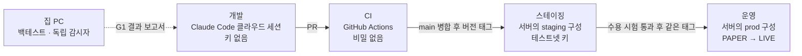
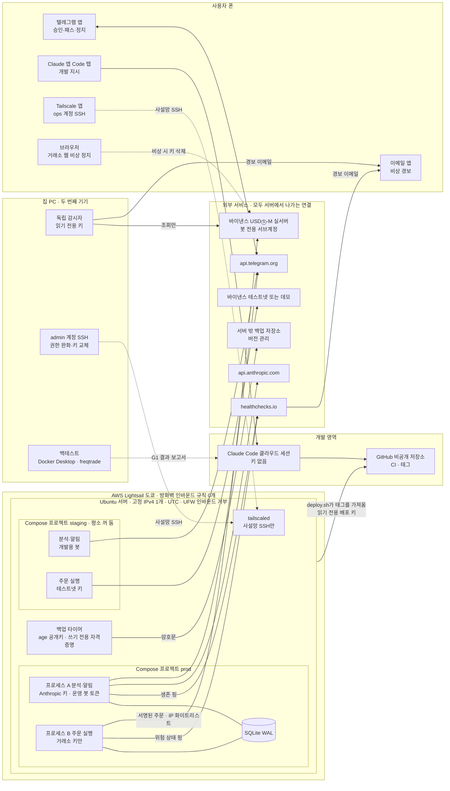
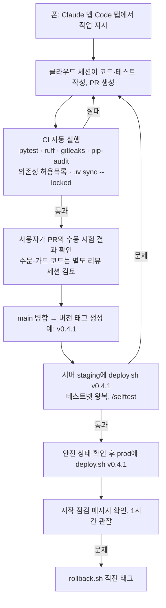

# 운영 환경 설계서 (INFRA) — BTC/USDT 무기한 선물 반자동 매매 시스템

> **작성일**: 2026-09-29 · **버전**: v1.0 (첫 판) · **상태**: 설계 문서. 코드와 설치는 아직 없다
> **이 문서의 역할**: 서버, 네트워크, 비밀, 배포, 감시, 백업, 시간, 운영 절차(런북), 비용을 정한다. 숫자 기준값의 원본은 [PLAN.md](./PLAN.md) **§4 결정표**다. 이 문서의 값이 결정표와 다르면 결정표를 따른다. 이 문서가 주로 풀어 쓰는 결정은 D11(호스팅), D12(배포), D13(DB), D14(모니터링), D15(비밀), D19(예산)이다.
> **관련 문서**: [PLAN.md](./PLAN.md) (마스터 기획, 결정표) · [ARCHITECTURE.md](./ARCHITECTURE.md) (구조·프로세스·설정 4층) · [SOFTWARE.md](./SOFTWARE.md) (필요 SW) · [DEV_GUIDE.md](./DEV_GUIDE.md) (개발 방법) · [SECURITY.md](./SECURITY.md) (위협·통제) · [PLAN_REVIEW.md](./PLAN_REVIEW.md) (기획 검토) · [STRATEGY.md](./STRATEGY.md) (차트 기법) · 조사 원자료: [05 인프라·운영](../research/planning/05_infra_ops.md) · [04 거래소·규제](../research/planning/04_exchanges_regulation.md) · [07 텔레그램 승인](../research/planning/07_telegram_hitl.md) · [08 리스크·검증](../research/planning/08_risk_backtest.md) · [03 LLM 트레이딩](../research/planning/03_llm_trading.md) · [06 소프트웨어](../research/planning/06_software_stack.md)
> **표기**: `[n]`은 §14 출처 번호다. **[직접]** = 원문을 직접 열어 확인 · **(검색 요약)** = 웹 검색 결과 요약으로만 확인 · **(추정)** = 가정을 두고 계산하거나 추론한 값 · **(제안)** = 이 문서가 정한 초기값. 운영하며 조정한다 · **확인 필요** = 확인하지 못함(추측하지 않음)
> **상태 표시**: **[확정 권고]** = 결정표 기본값 · **[결정 필요]** = 사용자가 정할 항목. 답이 오기 전까지 추천값을 적용한다

---

## 0. 3분 요약

**한 줄로**: AWS Lightsail **도쿄** 리눅스 서버 한 대(2GB, 월 $12)에 **무료 고정 IP**를 붙이고, **서버로 들어오는 문은 0개**로 닫는다. 봇은 Docker Compose로 돌리고, 사람은 Tailscale 사설망으로만 접속한다. 거래소에 걸어 둔 손절이 "서버가 죽어도 돈을 지키는 마지막 안전망"이다.

| 주제 | 핵심 결정 | 근거·결정표 |
|---|---|---|
| 환경 | 개발(Claude Code 클라우드 세션, **키 없음**) → CI(GitHub Actions) → 스테이징(서버 안 `staging` 구성, 테스트넷 키) → 운영(서버 `prod` 구성, PAPER → LIVE). 환경은 **"키가 어디에 있는가"**로 정한다 | §1, SEC-07 |
| 서버 | Lightsail 도쿄 2GB + 고정 IPv4. 서울은 동급 대안. 미국·캐나다·말레이시아·네덜란드, GCP 무료, Oracle 무료는 제외 | §2, D11 |
| 준비 시점 | 거래 키 없이 **1단계 후반**에 만든다(24시간 데이터 수집 때문. 결정표 "3단계 전"과 일치). 만든 직후 30분 연결 점검 | §2.4, D11 |
| 네트워크 | 인바운드 0개. 텔레그램은 롱 폴링, SSH는 Tailscale로만. Docker `ports:` 금지 | §3, D12 |
| 배포 | CI를 통과한 버전 태그만 `deploy.sh` 한 번으로 **사람이** 배포. 자동 배포 없음 | §5, D12 |
| 비밀 | Compose secrets(파일 마운트), 환경 변수 금지, Ed25519 개인키는 서버에서 생성·400 권한, 원본은 오프라인 비밀번호 관리자. 저장소는 즉시 비공개 권고 | §6, D15 |
| 감시 | 4겹: healthchecks.io 데드맨(평시 65~75분, 위험 상태엔 약 3분), 운영 채팅, 09:00 KST 생존 보고, 서버 밖 독립 감시자 | §7, D14 |
| 백업 | SQLite 매일 `.backup` → age 암호화(서버엔 공개키만) → 쓰기 전용 자격증명으로 서버 밖 버전 관리 저장소. 스냅샷 병행, 월 1회 복구 연습 | §8, D13 |
| 시간 | 서버 UTC, chrony, recvWindow 5000 유지, 봉 마감 30~60초 뒤 실행 | §9, D1·D12 |
| 비용 | 월 고정 약 **$23~31**(3.2만~4.3만 원). 서버 $12 + 백업 약 $1 + Claude API $10~18 | §11, D19 **[결정 필요]** |

**이 문서에서 새로 짚은 것 5가지**
1. **UFW의 "나가는 연결 제한"은 컨테이너에 걸리지 않는다.** ufw-docker 문서가 "컨테이너도 외부 네트워크에 접속할 수 있다"고 적는다 [6][직접]. 05 문서의 "443/53/123만 허용"은 서버 자체 프로그램에만 효과가 있다. 컨테이너의 나가는 연결을 좁히려면 Compose의 `internal` 네트워크 + 허용목록 프록시가 필요하다(§3.3, "나중").
2. **AWS 계정 탈취 = 서버 침해와 같다.** Lightsail 스냅샷에는 서버 디스크의 개인키 파일이 그대로 들어 있다. 계정을 가진 사람은 스냅샷으로 서버를 복제하고 고정 IP를 옮겨 붙일 수 있다(분석). 그래서 AWS 계정도 "신뢰 루트"로 다룬다(§6.6).
3. **healthchecks의 최소 주기는 60초다.** 오픈소스 코드의 API 문서에 timeout·grace 최솟값이 60초로 적혀 있다 [7][직접]. 호스팅 서비스 요금제에서도 같은지는 **확인 필요**다(PLAN C3 일부 해소).
4. **백업 암호화 키의 개인키는 서버에 두지 않는다.** age는 공개키만으로 암호화한다 [10][직접]. 서버가 뚫려도 지난 백업을 풀 수 없다.
5. **자동 재부팅은 "안전 상태"에서만.** 미체결 진입 주문이 있을 때 재부팅하면 손절 없는 구간이 생길 수 있다(SEC-05). 그래서 보안 업데이트는 자동 설치하되, 재부팅은 안전 상태 확인 뒤에만 한다(§4, §10.7).

### 0.1 용어 풀이 (처음 나오는 전문 용어)

| 용어 | 한 줄 설명 |
|---|---|
| VPS / 인스턴스 | 클라우드 회사가 빌려주는 가상 서버 한 대. 24시간 켜 둔다 |
| 리전 | 클라우드 데이터센터가 있는 지역. 예: 도쿄 `ap-northeast-1`, 서울 `ap-northeast-2` |
| 고정 IP | 서버를 껐다 켜도 바뀌지 않는 인터넷 주소. 거래소 IP 화이트리스트에 등록하려면 필요하다 |
| IP 화이트리스트 | 등록한 IP에서 온 요청만 API 키로 받아 주는 거래소 설정. 키가 새어도 다른 곳에서는 쓸 수 없다 |
| 인바운드 / 아웃바운드 | 밖에서 서버로 들어오는 연결 / 서버에서 밖으로 나가는 연결 |
| 방화벽 | 어떤 연결을 들이고 내보낼지 정하는 규칙. 여기서는 Lightsail 방화벽(클라우드 쪽)과 UFW(서버 안)를 쓴다 |
| UFW | 우분투 리눅스의 간단한 방화벽 도구 |
| SSH | 서버에 원격으로 접속해 명령을 치는 방법 |
| Tailscale | 내 기기들끼리만 통하는 사설망을 만들어 주는 서비스(WireGuard 기반). 서버의 공개 주소에 SSH 문을 열 필요가 없어진다 |
| 하드닝 | 서버에서 불필요한 문을 닫고 설정을 조여 공격받을 수 있는 면적을 줄이는 작업 |
| Docker / 컨테이너 / 이미지 | 프로그램과 필요한 부품을 한 상자(이미지)에 담아 어디서든 똑같이 실행하는 기술. 실행 중인 상자가 컨테이너다 |
| Docker Compose | 여러 컨테이너의 실행 설정을 파일 하나(`compose.yaml`)로 관리하는 도구. "프로젝트" 단위로 묶는다 |
| digest | 이미지 내용으로 계산한 고유 지문(`sha256:...`). 태그와 달리 바뀌지 않는다 |
| CI / 태그 | 코드를 올릴 때마다 자동으로 시험하는 흐름 / 특정 커밋에 붙이는 버전 이름(예: `v0.4.1`) |
| 스테이징 | 운영에 올리기 전에 운영과 비슷한 조건에서 시험하는 환경. 여기서는 테스트넷(가짜 돈) 환경이다 |
| 데드맨 스위치 | 봇이 주기적으로 "살아 있음" 신호(핑)를 보내고, 끊기면 외부 서비스가 경보를 보내는 장치 |
| NTP / chrony | 서버 시계를 표준 시간에 맞추는 규약 / 그 프로그램 |
| recvWindow | 거래소가 "이 요청은 몇 ms 안에 도착해야 유효하다"고 보는 허용 시간 |
| WAL | SQLite가 쓰기 기록을 따로 남겨 읽기와 쓰기를 동시에 할 수 있게 하는 방식 |
| age | 파일 암호화 도구. 공개키로 잠그고 개인키로만 연다 |
| RPO / RTO | 장애 때 잃어도 되는 데이터 기간 / 복구에 걸려도 되는 시간 |
| 스냅샷 | 서버 디스크 전체를 특정 시점 그대로 복사해 둔 것 |
| 런북 | 장애가 났을 때 순서대로 따라 할 수 있게 적어 둔 대응 절차서 |
| 안전 상태 | 이 문서의 정의: **열린 포지션 0, 미체결 주문 0, 승인 대기 신호 0**인 상태. 배포·재부팅·키 교체는 이 상태에서 한다 |
| 2FA / TOTP | 비밀번호 외에 한 단계 더 확인하는 로그인 / 앱이 30초마다 바꾸는 6자리 코드 방식 |
| ACL | 누가 무엇에 접근할 수 있는지 적은 접근 제어 목록 |

---

## 1. 환경 구성

### 1.1 한눈에 보기

환경은 설정 플래그 하나가 아니라 **"거래소 키가 어디에 있는가"**로 정한다 (SEC-07, [ARCHITECTURE.md](./ARCHITECTURE.md) §7.2).

| 환경 | 어디서 | 하는 일 | 거래소 키 | 텔레그램 봇 | Anthropic 키 | 알림 머리표 | 시작 단계 |
|---|---|---|---|---|---|---|---|
| **개발 (DEV)** | Claude Code **클라우드 세션**: 웹 claude.ai/code, 폰 Claude 앱의 Code 탭, 데스크톱 앱의 Cloud | 코드 작성, 저장한 캔들 데이터(픽스처)와 가짜 거래소 응답(모의 객체)으로 테스트, PR 생성 | **없음** (테스트넷 키 포함 금지) | 없음 | 없음 (녹화한 응답 픽스처) | — | 0 |
| 개발 보조 (PC) | 집 PC: Docker Desktop, 필요하면 Claude Code 데스크톱 앱의 Local 세션 | G1 백테스트(freqtrade), 데이터 분석 | 없음 | 없음 | 없음 | — | 2 |
| **CI** | GitHub Actions | pytest, ruff, gitleaks, pip-audit, 의존성 허용목록 검사, `uv sync --locked` | 없음 | 없음 | 없음 | — | 1 |
| **스테이징 (TESTNET)** | 운영 서버 안의 별도 Compose 프로젝트 `staging` | 테스트넷 주문 왕복, G2, 개발용 봇의 `/selftest`, ccxt 갱신 회귀 시험, 배포 리허설 | 테스트넷 또는 데모 키 (서버 비밀 파일에만) | **개발용 봇** | 개발용 키 (별도 Workspace, 작은 한도, 제안) | `[TESTNET]` | 4 |
| **운영 (prod)** | Lightsail 도쿄 서버의 Compose 프로젝트 `prod` | 1단계: 데이터 수집·코드 규칙 전향 기록(FWD_SHADOW) → 3단계: Claude 섀도·텔레그램·G3 (PAPER) → 6단계: 실거래 (LIVE) | 1~5단계 **없음**(개인키를 읽지 않음) / 6단계부터 실키 | **운영용 봇** | 운영용 키 (월 한도 $30) | `[PAPER]` → `[LIVE]` | 1단계 후반 |
| 감시 (WATCH) | 집 PC | 서버 밖 독립 감시자 | **읽기 전용 키** | 없음 (이메일 경보) | 없음 | — | 5 |

### 1.2 개발 환경: Claude Code

| 방식 | 어디서 실행 | 특징 [19][20][21][직접] | 이 프로젝트에서 |
|---|---|---|---|
| **클라우드 세션** | Anthropic이 관리하는 격리된 가상 머신 | 폰을 닫아도 계속 돈다. GitHub 저장소를 복제해 브랜치·PR을 만든다. GitHub 인증 정보는 가상 머신 밖(프록시)에 있다. 네트워크 수준은 None / Trusted(패키지 저장소·GitHub 등) / Custom(허용목록 직접 지정) / Full이다. **환경 변수는 그 환경을 쓰는 누구나 읽을 수 있다** | **주력.** 사용자가 주로 폰을 쓰므로 가장 잘 맞는다 |
| 로컬 세션 (데스크톱 앱 Local) | 내 PC | 내 PC의 네트워크를 쓴다. 데스크톱 앱은 유료 구독이 필요하다 [21] | 선택. PC에서 백테스트를 돌릴 때 |
| 운영 서버 | Lightsail | — | **서버에는 Claude Code를 두지 않는다.** 봇만 둔다 |

**규칙**
1. **클라우드 세션에는 어떤 거래소 키도 넣지 않는다.** 테스트넷 키도 넣지 않는다 (D15, SEC-07). 06 문서의 "클라우드 세션에 테스트넷 키만"은 이 규칙으로 대체됐다.
2. 지금 클라우드 환경은 조직 네트워크 정책으로 바이낸스·텔레그램이 막혀 있다(이번 조사에서 확인). 그래서 **실제 연동 시험은 서버의 `staging`에서** 하고, 폰에서는 개발용 봇의 `/selftest`(테스트넷 진입 → 손절 조회 → 청산 왕복)로 결과만 확인한다 (SEC-06).
3. **세션을 역할별로 나눈다** (SEC-06(5)).

| 세션 종류 | 네트워크 수준 | WebFetch(웹 가져오기) | 하는 일 |
|---|---|---|---|
| 조사 세션 | Trusted 또는 Custom | 허용 | 외부 문서 읽기. 결과는 `research/`에만 쓴다 |
| 코드 작성 세션 (주문·가드 포함) | Trusted (패키지 저장소만) | **주지 않는다** | 코드와 테스트 작성. 외부 글에 숨은 지시문(간접 프롬프트 인젝션)이 코드로 흘러드는 것을 막는다 |
| 리뷰 세션 | Trusted | 주지 않는다 | 주문·가드 코드를 작성 세션과 **다른** 세션이 검토한다 |

4. Anthropic 키가 클라우드 세션에 꼭 필요하면(프롬프트 실험 등) Pro·Max의 **API credentials** 기능을 쓴다. 키를 세션 밖에 두고 지정한 호스트로 가는 요청 헤더에만 붙여 준다 [19] (05 §2.5.3). 거래소 주문은 개인키로 서명해야 하고 텔레그램 토큰은 URL에 들어가서 이 기능을 쓸 수 없다(분석) — 그래서 두 비밀은 어떤 경우에도 클라우드 세션에 넣지 않는다.

### 1.3 스테이징 환경 (TESTNET)

- **위치**: 운영 서버 안의 **별도 Compose 프로젝트 `staging`**이다. DB 볼륨, 비밀 디렉터리, healthchecks 체크, 텔레그램 봇이 모두 `prod`와 따로다. 2GB 서버에서 함께 돌 수 있다(추정) ([ARCHITECTURE.md](./ARCHITECTURE.md) §7.2).
- **거래소 모의 환경**: 바이낸스는 모의 환경이 두 가지다. ① 선물 테스트넷(`testnet.binancefuture.com`, ccxt `set_sandbox_mode(True)`) ② 데모 트레이딩(`demo-fapi.binance.com`, ccxt `enable_demo_trading(True)`, ①과 동시 사용 불가) [17] (04 §2.5)[직접]. 4단계 PoC에서 두 환경의 호가·체결을 비교해 하나를 고른다.
- **테스트넷 키의 IP 제한**: 가능하면 서버 고정 IP로 제한한다. 테스트넷·데모 키에 IP 제한이 되는지는 **확인 필요**다.
- **LIVE 이후 (6단계~)**: `staging`은 **평소 꺼 둔다.** ccxt·패키지 갱신이나 주문 코드 변경이 있을 때만 켜서 회귀 시험을 하고 다시 끈다. 실키와 테스트넷 키는 서로 다른 디렉터리(`/etc/btcbot/prod/secrets`, `/etc/btcbot/staging/secrets`)에 있고, 각 프로젝트는 자기 디렉터리만 마운트한다. 시작 신원 확인(§7.5)이 접속 주소·계정 UID를 대조해 혼동을 막는다.
  - 대안: 큰 변경(거래소 어댑터 교체 등)은 스냅샷으로 **임시 인스턴스**를 만들어 시험하고 지운다. 시간 과금이라 비용은 몇 센트~1달러 수준이다(추정). 이때는 임시 인스턴스의 IP를 테스트넷 키에 새로 등록한다.
- 스테이징의 Claude 호출은 기본적으로 **녹화한 응답**으로 대신한다. 실제 호출이 필요하면 운영과 다른 Workspace의 개발용 키를 쓴다(작은 월 한도, 제안). 운영 비용·통계와 섞이지 않게 하기 위해서다.

### 1.4 운영 환경의 모드 전환

| 단계 (D16) | prod 모드 | prod에 있는 비밀 | staging |
|---|---|---|---|
| 1 데이터·지표 (후반) | FWD_SHADOW: 공개 데이터 수집, OI·롱숏비 매시간 수집, 코드 규칙 전향 기록(A6) | 없음 (healthchecks 핑 URL, 백업 자격증명만) | 없음 |
| 2 G1 백테스트 | 같음 (백테스트는 집 PC) | 같음 | 없음 |
| 3 섀도 + 텔레그램 | **PAPER**: Claude 섀도, 텔레그램 승인, G3 페이퍼 | + Anthropic 운영 키, 운영 봇 토큰 | 없음 |
| 4 주문·가드 | PAPER 유지. **프로세스 A·B 분리** | 같음 (거래소 키 없음) | **생성**: 테스트넷 키, 개발용 봇, G2 |
| 5 운영 강화 | PAPER 유지 | 같음 | 켜 둠 |
| 6 소액 실거래 | **LIVE** | + 실거래 Ed25519 키(프로세스 B에만) | 평소 꺼 둠 |

- 모드를 바꿀 때는 서버 전용 설정(`/etc/btcbot/prod/site.toml`)의 모드와 비밀 파일을 **함께** 바꾼다. 둘이 어긋나면 봇이 시작을 거부한다(예: PAPER인데 거래소 개인키 파일이 마운트돼 있으면 거부) ([ARCHITECTURE.md](./ARCHITECTURE.md) §7.3).
- 모든 알림 첫 줄에 `[PAPER]`/`[TESTNET]`/`[LIVE]`를 표시한다 (D5).

---

## 2. 호스팅 후보 비교와 권고

### 2.1 결정 기준 (순서대로)

1. **거래소가 막지 않는 나라의 고정 IP인가.** 바이낸스는 알려진 차단 국가(캐나다, 말레이시아, 네덜란드, 미국. 전체 목록 아님)의 서버 IP에 451 오류를 낸다 [12][직접]. 미국 IP 실패 사례가 많다(검색 요약) [32].
2. **돈이 걸린 시스템에 맞는 안정성.** 무료지만 회수될 수 있는 서버는 쓰지 않는다.
3. **비전문가가 운영할 수 있는가.** 웹 콘솔, 정액제, 네트워크 설정이 단순해야 한다.
4. 가격. 지연시간은 기준이 아니다. 서울에서 바이낸스(도쿄)까지 약 72ms, 도쿄 안에서는 한 자릿수 ms지만(검색 요약), 사람이 승인하는 데 수십 초~수 분이 걸리는 구조라 차이가 결과에 영향을 주지 않는다 (05 §2.2.2).

### 2.2 후보 비교표

| 후보 | 월 비용 (2GB급) | 고정 IP | 거래소 접근 | 안정성·운영 난이도 | 판정 |
|---|---|---|---|---|---|
| **AWS Lightsail 도쿄** | **$12** (2 vCPU, 2GB, 60GB SSD, 전송 3TB). 신규 가입 첫 3개월 무료. 1GB는 $7 (검색 요약) [30] | 인스턴스에 붙어 있으면 **무료**, 떼어 두면 시간당 $0.005 (검색 요약) [31] | 일본은 알려진 차단 국가 목록에 없다 [12] | 정액제, 웹 콘솔, 자동 스냅샷. **쉬움** | ✅ **1순위** [확정 권고] |
| AWS Lightsail 서울 | 같은 가격 (검색 요약) [30] | 같음 | 가능. 한국 차단 조치의 영향 여부는 **확인 필요** | 같음 | ✅ 동급 대안 |
| AWS EC2 (도쿄·서울) | 인스턴스 + 공인 IPv4 월 약 $3.6 + 디스크 별도. 도쿄 요금은 **확인 필요** (05 §2.3.2) | 탄력적 IP | 같음 | VPC·보안그룹·IAM을 알아야 한다. **어려움** | △ 나중에 옮길 곳 |
| Oracle 무료 티어 | $0. 2026-08-18부터 A1 한도가 절반(2 OCPU, 12GB) (검색 요약) [33] | 가능 (세부 확인 필요) | 한국·일본 리전 있음 | **7일간 CPU 95퍼센타일 등이 15% 미만이면 회수 가능** (검색 요약) [33]. 대부분 쉬는 우리 봇이 이 조건에 해당한다(추정) | ❌ 제외 |
| GCP 무료 (e2-micro) | $0 | 무료 | **미국 리전만** → 바이낸스 451 (검색 요약) [34] | — | ❌ 제외 |
| Vultr 도쿄 | 1GB $5~6. 2GB 요금 **확인 필요** (검색 요약) [35] | 인스턴스 IP 유지 | 가능(추정) | 쉬움 | ○ 대안 |
| Hetzner 싱가포르 | 2026년 두 차례 인상, CPX12 €15.49 + IPv4 별도 (검색 요약) [35] | 별도 요금 | 네덜란드 IP 차단, 미국 리전 차단 [12] | 중간 | △ 가성비 우위 사라짐 |
| 집 PC / 라즈베리파이 | 전기요금 (추정) | ❌ **유동 IP** → IP 화이트리스트와 충돌 | 한국 차단 조치의 영향을 받을 수 있다 | 정전·업데이트 재부팅, SD카드 손상 위험 (검색 요약) | ❌ 운영 제외. **개발·백테스트·독립 감시자 용도만** |

### 2.3 권고와 사양

- **[확정 권고] AWS Lightsail 도쿄 리전 리눅스 2GB(월 $12)에 무료 고정 IP를 붙인다** (D11). 서울 리전은 동급 대안이다.
- **2GB인가 1GB인가**: freqtrade는 운영망과 분리해 집 PC에서 돌리므로(D10) 서버에는 봇 컨테이너 2~4개만 있다. 1GB($7)도 가능하다(추정). 다만 `prod`와 `staging`을 함께 돌리고 차트 그림(matplotlib)과 pandas를 쓰므로 여유 있는 **2GB를 기본**으로 한다. 실제 메모리 사용량을 3단계에서 재고, 60% 미만이면 1GB로 내리는 것을 검토한다(제안).
- **운영체제**: Lightsail이 제공하는 최신 **Ubuntu LTS** 이미지. 버전은 생성할 때 확인한다.
- **IPv4 요금제**를 쓴다. 바이낸스 화이트리스트의 IPv6 지원 여부가 **확인 필요**라서다 (05 §2.3.3).
- **한국 차단 조치와 서버 위치**: 도쿄 서버는 한국이 접속을 차단해도 거래소에 계속 닿을 수 있다. 이는 "서버 위치로 차단을 우회하는 운영"과 기능상 같다. 그래서 차단 시 행동 정책을 0단계에서 정해 둔다. 기본안은 "신규 진입 중지 → 보유 포지션은 거래소 손절 또는 수동 정리 → 거래소 이전 또는 중단 결정"이다 (F05, PLAN §11 #9 **[결정 필요]**).

### 2.4 서버 만드는 시점과 30분 점검

- **시점**: 결정표는 "3단계 전에 거래 키 없이 먼저 구축"이다 (D11). 1단계의 OI·롱숏비 수집(API가 최근 30일만 제공)과 코드 규칙 전향 기록(A6)이 **24시간** 돌아야 하므로, **1단계 후반(수집 모듈이 완성될 때)**에 만드는 것을 권한다 (PLAN §5.2, [ARCHITECTURE.md](./ARCHITECTURE.md) §1.3).
- **만든 직후 30분 점검** (키 없이). 하나라도 실패하면 인스턴스를 지우고 다른 리전(서울)으로 다시 만든다. 시간 과금이라 비용은 몇 센트다(추정) (05 §2.13.2).

| # | 점검 | 합격 기준 |
|---|---|---|
| 1 | 고정 IP를 만들어 인스턴스에 붙였는가 | 인스턴스를 재시작해도 공인 IP가 같다 |
| 2 | 바이낸스 공개 API: 서버 시각 조회, 1H 캔들 조회 | **451 오류가 없다.** 캔들이 정상으로 온다 |
| 3 | 텔레그램 `getMe` (개발용 봇 토큰, 점검 후 서버에서 지움) | 봇 정보가 온다 |
| 4 | Anthropic API 짧은 호출 (개발용 키) | 정상 응답 |
| 5 | 시계 오차: `chronyc tracking`, 바이낸스 서버 시각과 비교 | 100ms 미만 (제안) |
| 6 | healthchecks.io 핑 | 대시보드에 핑이 찍힌다 |
| 7 | 외부 포트 스캔 (집 PC나 폰에서) | **열린 포트 0개** (하드닝 완료 후) |

---

## 3. 네트워크 구성도·고정 IP·방화벽

### 3.1 구성도 (6단계 LIVE 기준 완성형)

- **공인 인터넷에서 서버로 먼저 들어오는 연결은 하나도 없다.** 그림의 화살표는 연결을 먼저 여는 쪽에서 출발한다. 서버의 화살표는 모두 밖으로 나가고, 서버로 들어오는 화살표는 Tailscale 사설망(점선)뿐이다. 텔레그램은 롱 폴링(봇이 먼저 묻는 방식)이라 서버에 문을 열 필요가 없다 (D5).
- 텔레그램 서버와 봇 토큰이 의심스러우면 경보는 텔레그램이 아닌 **이메일**로 간다 (07 §2.4).

### 3.2 고정 IP 규칙

| 규칙 | 이유 |
|---|---|
| Lightsail에서 **고정 IP를 만들어 인스턴스에 붙인 뒤** 그 IP를 거래소에 등록한다 | 기본 공인 IP는 인스턴스를 껐다 켜면 바뀐다 (05 §2.3.3) |
| 거래소 키 하나에 **서버 고정 IP 1개만** 등록한다 | 바이낸스는 키당 최대 30개 개별 IP를 받지만(검색 요약) [40], 여러 개를 넣으면 유출 키를 쓸 수 있는 곳이 늘어난다 |
| 고정 IP를 떼어 둔 채로 두지 않는다 | 떼어 두면 시간당 $0.005가 붙는다(검색 요약) [31] |
| **같은 리전**에서 서버를 다시 만들면 고정 IP를 새 인스턴스에 옮겨 붙인다 → 거래소 등록 변경 없음 | 복구가 빨라진다 (§10.8) |
| **다른 리전**으로 옮기면 새 IP를 거래소 화이트리스트에 등록하고 옛 IP를 지운다 | 고정 IP는 리전을 넘어 옮길 수 없다(05 §2.12.2) |
| 집 PC의 유동 IP는 어떤 **거래 키**에도 등록하지 않는다 | IP가 바뀌면 주문이 막히고, 가족 기기와 같은 네트워크다 (05 §2.3.3) |
| 독립 감시자의 **읽기 전용 키**를 IP 없이 발급할 수 있는지는 **확인 필요** (PLAN C5) | 바이낸스는 IP 제한 없는 키를 읽기 전용으로만 허용한다는 요약이 있다(검색 요약) (04 §3.1) |

### 3.3 방화벽: 세 겹

**① Lightsail 방화벽 (클라우드 쪽, 서버 앞)**
- 인바운드 규칙을 **모두 지운다.** Tailscale은 나가는 연결로 사설망을 맺으므로 들어오는 규칙이 필요 없다(05 §2.4.1).
- 인스턴스 생성 직후 기본으로 열려 있는 규칙이 무엇인지는 콘솔에서 확인한다(**확인 필요**). Tailscale 접속이 되는 것을 확인한 **뒤에** SSH 규칙을 지운다. 순서를 거꾸로 하면 서버에 못 들어간다.
- Tailscale이 고장 났을 때의 비상 경로: 콘솔에서 SSH 규칙을 잠시 다시 열고 Lightsail 브라우저 SSH로 들어간다. 이 규칙을 "Lightsail 브라우저 SSH 전용"으로 좁힐 수 있는지는 **확인 필요**다. 쓴 뒤에는 바로 지운다.

**② UFW (서버 안, 서버 자체 프로그램용)**

| 방향 | 규칙 | 비고 |
|---|---|---|
| 들어옴 | 기본 거부. `tailscale0` 인터페이스의 SSH(22)만 허용 | 공인 IP의 22번 포트는 응답하지 않는다 |
| 나감 (1단계) | 기본 허용 → 안정화 뒤 443/tcp, 53(DNS), 123/udp(NTP)만 허용 (05 §2.4.1) | Tailscale이 직접 연결에 쓰는 UDP 포트가 필요한지, 443 중계만으로 충분한지는 **확인 필요** |

**③ 컨테이너의 나가는 연결 — UFW로는 막히지 않는다**
- Docker는 방화벽 규칙(iptables)을 직접 고쳐서 UFW를 우회한다. `ufw deny 8080`을 해도 Docker가 공개한 포트는 외부에서 접근된다 [6][직접]. 그래서 **`ports:`는 절대 쓰지 않는다** (D12). 꼭 필요하면 `127.0.0.1:포트`로만 연다.
- ufw-docker 문서는 "컨테이너도 외부 네트워크에 접속할 수 있다"고 적는다 [6][직접]. 즉 ②의 "나감 제한"은 **컨테이너에는 적용되지 않는다.** 05 문서의 아웃바운드 제한은 서버 자체 프로그램(백업 타이머 등)에만 효과가 있다.
- **"나중"(G4 이후, 선택)**: 봇 컨테이너를 Compose의 `internal: true` 네트워크(외부와 격리된 네트워크 [5][직접])에 두고, 허용목록 프록시 컨테이너 하나만 바깥과 통하게 한다. 허용 도메인은 §3.4 표뿐이다. 서버가 뚫렸을 때 Anthropic 키·텔레그램 토큰이 다른 곳으로 빠져나가는 경로를 줄인다. ccxt·anthropic·python-telegram-bot의 프록시 설정 호환성은 **확인 필요**다.

### 3.4 나가는 연결 목적지

| 목적지 | 누가 | 용도 | 단계 |
|---|---|---|---|
| `fapi.binance.com` (바이낸스 USDⓈ-M 실서버) | prod 프로세스 A (공개 시세), B (주문) | 캔들·펀딩·마크 가격 조회, 주문 | 1 / 6 |
| `testnet.binancefuture.com` 또는 `demo-fapi.binance.com` | staging | 테스트넷 주문 (§1.3) | 4 |
| `api.telegram.org` | 프로세스 A (prod: 운영 봇, staging: 개발용 봇) | 롱 폴링, 메시지 | 3 |
| `api.anthropic.com` | 프로세스 A | Claude 호출 | 3 |
| `hc-ping.com`, `healthchecks.io` | A, B, 백업 타이머 | 핑, 위험 상태 체크 일시정지(API) | 1 |
| 백업 저장소 주소 | 백업 타이머 (호스트) | 암호화 백업 업로드 | 1 |
| `github.com` | 배포 스크립트 (호스트) | 태그 가져오기 | 1 |
| 파이썬 패키지 저장소, Docker 이미지 저장소 | 이미지 빌드 시 | `uv sync --locked`, 베이스 이미지 | 1 |
| 우분투 패키지 저장소 | unattended-upgrades | 보안 업데이트 | 1 |
| Tailscale 조정 서버·중계 서버 | tailscaled | 사설망 유지 (정확한 도메인은 **확인 필요**) | 1 |

### 3.5 Tailscale 접속과 기기별 권한

| 기간 | 폰 | 두 번째 기기(집 PC) | 근거 |
|---|---|---|---|
| 1~5단계 (키 없음, PAPER·TESTNET) | `admin` 계정으로 SSH 허용 | `admin` 계정 | 폰 위주 사용자의 운영 마찰을 줄인다 (SEC-03 수정) |
| **6단계~ (LIVE)** | **`ops` 계정만.** `ops`는 root 소유 래퍼 스크립트(상태 보기, 정지, 배포, 로그 보기)만 sudo로 실행한다. `docker` 그룹에 넣지 않는다 | `admin` 계정: 한도 완화, 누적 낙폭 정지 해제, 키 교체, 설정 변경 | LIVE 단계 권한 완화는 두 번째 기기에서만 (SEC-03, D15) |

- **`docker` 그룹은 사실상 root 권한이다** (05 §2.4.1). 그래서 LIVE에서 폰 계정은 이 그룹에 넣지 않고 정해진 명령만 쓰게 한다.
- Tailscale ACL로 "폰 → `ops`", "PC → `admin`"을 강제하고, `admin` 접속에는 재인증(SSH check 모드)을 건다. ACL 문법과 check 모드의 기능명·요금제는 **확인 필요**다 (PLAN C10).
- Tailscale 무료 Personal 요금제로 충분하다(사용자 6명, 기기 제한 없음, 2026-08 기준, 검색 요약) [36].
- Tailscale 기기 키의 만료 설정을 확인하고, 서버는 만료로 갑자기 끊기지 않게 한다(**확인 필요**).

---

## 4. 서버 하드닝 체크리스트

우선순위 1은 **서버를 처음 만들 때(1단계 후반)** 모두 끝낸다. "확인 방법"은 사용자가 직접 해 보는 수용 시험이다.

| # | 우선 | 항목 | 설정 | 확인 방법 | 근거 |
|---|---|---|---|---|---|
| **서버 밖 계정 (가장 먼저, 0단계)** ||||||
| H1 | 1 | AWS 계정 | 루트 계정 MFA, 일상 작업은 별도 사용자, **예산 알림 $20** | 루트 로그인 시 2단계 인증을 요구한다 · 예산 알림 메일 수신 설정 확인 | 05 §2.4.2, D19 |
| H2 | 1 | 2단계 인증 방식 | 거래소, 이메일, GitHub, Tailscale 로그인 계정(IdP), AWS, Anthropic, 텔레그램 모두 **SMS가 아닌** 방식(보안키 또는 별도 기기 TOTP) | 계정별 2FA 표 완성 (신뢰 루트 계정 표, §6.6) | D15, SEC-03 |
| **운영체제** ||||||
| H3 | 1 | 시간대·시계 | 서버 시간대 **UTC**, chrony 사용 | `timedatectl`이 UTC, `chronyc tracking` 오차 100ms 미만 (제안) | D12, §9 |
| H4 | 1 | 보안 업데이트 | `unattended-upgrades` 켬. **자동 재부팅은 끔**, 대신 재부팅 필요 여부를 생존 보고에 표시하고 안전 상태에서 재부팅 (§10.7) | 생존 보고에 "재부팅 필요: 예/아니오" 줄이 있다 | D12, SEC-05 (분석) |
| H5 | 2 | 로그 용량 | journald `SystemMaxUse=500M` (제안) | 설정값 확인 | 05 §2.10 |
| H6 | 2 | 디스크 경보 | 사용률 80% 경고, 90% 치명 | 테스트 파일로 채워 경보가 오는지 확인 | 05 §2.9.2 |
| H7 | 2 | 듣고 있는 포트 점검 | 서버에서 듣는 포트가 Tailscale과 `tailscale0`의 sshd뿐이어야 한다 | `ss -tulpn` 결과 기록 | 분석 |
| **접속 (SSH·Tailscale)** ||||||
| H8 | 1 | SSH 키 전용 | 비밀번호 로그인 끔, root 로그인 끔, 허용 사용자 지정 | 비밀번호로 접속 시도 → 거부 | 05 §2.4.1 (검색 요약) [37] |
| H9 | 1 | Tailscale로만 SSH | Tailscale 설치 → 접속 확인 → Lightsail 방화벽의 SSH 규칙 삭제 | 공인 IP로 22번 접속 → 응답 없음 | 05 §2.4.1 |
| H10 | 2 | fail2ban | SSH를 공개하지 않으므로 **선택** | — | 05 §2.4.1 |
| H11 | 1 (LIVE 전) | 계정 분리 | `admin`(PC 전용) / `ops`(폰, 래퍼 스크립트만) / `bot`(컨테이너용, 로그인 불가) / `backup`(백업 타이머용) | 폰에서 `ops`로 `docker ps` 직접 실행 → 거부 | §3.5 |
| **방화벽** ||||||
| H12 | 1 | Lightsail 방화벽 | 인바운드 규칙 0개 | 외부 포트 스캔 결과 열린 포트 0개 | D12 |
| H13 | 1 | UFW | 들어옴 기본 거부, `tailscale0`의 SSH만 허용 | `ufw status verbose` 기록 | §3.3 |
| **Docker·컨테이너** ||||||
| H14 | 1 | Docker 설치 | 리눅스 Docker Engine + Compose. 윈도 Docker는 운영에 쓰지 않는다 | `docker version` 기록 | D12, [14] |
| H15 | 1 | 포트 공개 금지 | `compose.yaml`에 `ports:` 없음. CI에서 `ports:`가 있으면 실패시킨다(제안) | 외부 포트 스캔 0개 | D12, [6] |
| H16 | 1 | 컨테이너 권한 줄이기 | non-root 사용자, 읽기 전용 파일시스템(`read_only`), 권한 모두 제거(`cap_drop: ALL`), `no-new-privileges`, 메모리 상한 | 설정 확인 · 컨테이너 안에서 `/` 쓰기 시도 → 실패 | [4][직접] |
| H17 | 1 | 이미지 고정 | 베이스 이미지를 **digest로 고정** (`이름@sha256:...`) | `compose.yaml`·Dockerfile에 태그만 있는 이미지가 없다 | D12, [4] |
| H18 | 1 | 로그 제한 | json-file 드라이버 `max-size: 10m`, `max-file: 5`. 기본값은 **크기 무제한**이다 | 설정 확인 | D12, [3][직접] |
| H19 | 1 | 인스턴스 하나 | 프로젝트마다 프로세스 A 1개, B 1개. 복제(replicas) 금지 | 같은 토큰 409 충돌 없음 | D12, 05 §2.6 |
| H20 | 1 | 자동 재시작·헬스체크 | `restart: unless-stopped`, 컨테이너 헬스체크(§7.6) | 컨테이너를 강제로 죽이면 다시 뜨고 시작 점검 메시지가 온다 | [4] |
| **파일·비밀** ||||||
| H21 | 1 | 비밀 디렉터리 | `/etc/btcbot/<env>/secrets/` 700, 파일 400, 소유자는 컨테이너 사용자 번호 | `ls -l` 기록 | D15, §6 |
| H22 | 1 | 서버 설정 파일 | `/etc/btcbot/<env>/site.toml` 600 | `ls -l` 기록 | [ARCHITECTURE.md](./ARCHITECTURE.md) §7.1 |
| **나중 (G4 이후, 선택)** ||||||
| H23 | 3 | 컨테이너 나가는 연결 허용목록 | `internal` 네트워크 + 허용목록 프록시 (§3.3-③) | 허용목록 밖 주소로 요청 → 실패 | [5][6] |

---

## 5. 배포 방식

### 5.1 원칙

- **주문에 사람 승인이 있듯이, 돈을 다루는 코드의 교체에도 사람 승인을 둔다.** 배포는 하루 몇 번 일어나는 일이 아니다 (05 §2.7).
- **CI를 통과한 버전 태그만** 배포한다 (D12, SEC-06).
- PR 승인 기준은 diff가 아니라 **한국어 수용 시험 결과**다. 사용자는 코드를 읽지 않는다 (SEC-06+F09, [DEV_GUIDE.md](./DEV_GUIDE.md)).

### 5.2 흐름

- 1~3단계에는 `staging`이 없으므로 F를 건너뛴다. 대신 `prod`가 PAPER라 돈 위험이 없다.

### 5.3 `deploy.sh`가 할 일 (명세, 4~5단계에서 만든다)

| 순서 | 동작 | 실패하면 |
|---|---|---|
| 1 | 인자로 받은 태그가 `v숫자.숫자.숫자` 형식이고, 그 커밋이 `main` 이력에 있는지 확인 | 중단 |
| 2 | **안전 상태 확인**: 열린 포지션·미체결 주문·승인 대기 신호가 0인지 DB와 거래소에서 조회 | 경고하고 중단. 긴급 수정일 때만 `--force` (§10.7) |
| 3 | 읽기 전용 배포 키로 GitHub에서 해당 태그를 받는다 | 중단 |
| 4 | 이미지를 빌드한다. 베이스 이미지는 digest 고정, 패키지는 `uv sync --locked` | 중단, 기존 버전 계속 운영 |
| 5 | 설정 검증(dry-run): 설정값이 코드 상한보다 느슨하면 실패 | 중단 |
| 6 | 컨테이너 교체 (`up -d`) | 자동으로 직전 태그로 되돌림 |
| 7 | 시작 점검(§7.5) 통과와 헬스체크 정상 확인 (최대 3분, 제안) | 직전 태그로 되돌림 + 운영 채팅 경보 |
| 8 | 배포 기록(태그, 시각, 이미지 digest, 실행자)을 감사 로그에 남긴다 | — |

- **`rollback.sh`**: 직전 태그의 이미지로 되돌린다. 이미지를 지우지 않고 최근 3개 버전을 서버에 남겨 둔다(제안).
- 서버의 GitHub 접근은 **저장소 하나에 대한 읽기 전용 배포 키**로 한다. 이 키로는 코드를 바꿀 수 없다.
- 태그는 CI가 통과한 `main` 커밋에만 만든다. 브랜치 보호로 `main`에는 CI 통과 PR만 들어간다.
- 나중 선택지: CI가 이미지를 빌드해 비공개 레지스트리에 올리고, 서버는 digest로 받기만 한다. 시험한 이미지와 배포한 이미지가 완전히 같아지지만 레지스트리 읽기 자격증명이 하나 더 생긴다. 지금은 서버 빌드가 단순하다.

### 5.4 쓰지 않는 배포 방식

| 방식 | 쓰지 않는 이유 |
|---|---|
| GitHub Actions가 SSH로 밀어 넣기 | SSH 개인키를 GitHub에 둬야 하고, SSH 문을 열거나 중계를 붙여야 한다 (05 §2.7) |
| 자체 호스팅 러너 | GitHub가 공개 저장소에서 쓰지 말라고 권한다. 러너가 뚫리면 서버가 뚫린다(검색 요약) [42] |
| 자동 업데이트(서버가 새 버전을 스스로 받음) | 돈이 걸린 시스템이 사람 모르게 바뀐다 (05 §2.7) |

### 5.5 서버 디렉터리 배치 (제안)

| 경로 | 내용 | 권한 |
|---|---|---|
| `/opt/btcbot/<env>/` | 배포한 태그의 코드와 `compose.yaml` (`<env>` = `prod` 또는 `staging`) | root 소유, 읽기 전용 |
| `/etc/btcbot/<env>/site.toml` | 서버 전용 설정: 모드, R 자본, 응답 가능 시간표, 텔레그램 사용자·채팅 ID, 기대 계정 UID·서브계정 이름·접속 주소 | 600 |
| `/etc/btcbot/<env>/secrets/` | 비밀 파일 (§6.2) | 디렉터리 700, 파일 400 |
| `/etc/btcbot/<env>/control/` | 사람만 쓰는 정지 해제 파일. 프로세스 B에만 읽기 전용으로 마운트 | 600 |
| `/var/lib/btcbot/<env>/` | SQLite DB (로컬 디스크 볼륨) | `bot` 사용자 |
| `/usr/local/sbin/btcbot-*` | 래퍼 스크립트: 상태, 정지, 배포, 되돌리기, 로그 | root 소유, `ops`는 sudo로 이것만 |

설정 4층(코드 상한 → 저장소 기본값 → 서버 전용 설정 → 비밀 파일)의 뜻은 [ARCHITECTURE.md](./ARCHITECTURE.md) §7.1에 있다.

---

## 6. 비밀 관리

### 6.1 원칙

1. **비밀 관리 도구보다 키 권한과 IP 화이트리스트가 1차 방어선이다.** 출금·이체 권한 없는 키, 서버 고정 IP 1개, 봇 전용 서브계정, 거래소에 걸어 둔 손절이 핵심이다 (05 §2.5.1, D6).
2. **비밀은 환경 변수로 넘기지 않는다.** Docker 문서: "환경 변수는 모든 프로세스에 보이는 경우가 많아 접근을 추적하기 어렵고, 오류를 디버깅할 때 모르는 사이 로그에 찍힐 수 있다" [2][직접].
3. **Compose secrets(파일 마운트)**로 넘긴다. 컨테이너 안에서 `/run/secrets/<이름>`으로 보인다. Swarm 없이 일반 Compose에서도 `file:` 방식으로 쓸 수 있다 [2][직접].
4. **비밀은 그것이 필요한 프로세스에만 마운트한다** (SEC-08). 4단계부터 분석·알림(A)과 주문 실행(B)을 나눈다.
5. **서버 침해는 비밀 관리로 막지 못한다.** 그때 최대 손실은 **봇 서브계정 잔고 전액**이다 (SEC-02). 그래서 서브계정 잔고 상한을 숫자로 정하고 자동 충전하지 않는다 (D20 **[결정 필요]**).

### 6.2 비밀 목록

| 비밀 | 어디서 만드나 | 서버 위치 | 마운트 대상 | 원본 백업 | 교체 주기 |
|---|---|---|---|---|---|
| 바이낸스 Ed25519 **개인키** (실거래) | **서버에서 생성**. 거래소에는 공개키만 등록 [16] | `/etc/btcbot/prod/secrets/` (6단계부터) | 프로세스 B만 | 오프라인 비밀번호 관리자 | 분기 1회 + 의심 즉시 (05 §2.5.2) |
| 바이낸스 API 키 ID | 거래소 | 같은 곳 | B만 | 같음 | 키와 함께 |
| 테스트넷·데모 키 | 거래소 모의 환경 | `/etc/btcbot/staging/secrets/` | staging의 B만 | 선택 | 필요 시 |
| 텔레그램 운영 봇 토큰 | BotFather | `/etc/btcbot/prod/secrets/` | A만 | 비밀번호 관리자 | 의심 즉시 |
| 텔레그램 개발용 봇 토큰 | BotFather | `/etc/btcbot/staging/secrets/` | staging의 A만 | 같음 | 의심 즉시 |
| Anthropic 운영 키 (전용 Workspace, 월 한도 $30) | Anthropic Console | prod | A만 | 같음 | 분기 1회 (제안) |
| Anthropic 개발용 키 (별도 Workspace, 작은 한도) | Console | staging | staging의 A만 | 같음 | 필요 시 |
| healthchecks 핑 URL | healthchecks.io | 각 env | A, B, 백업 타이머 각각 자기 것 | 대시보드에서 재발급 | 유출 시 |
| healthchecks 읽기·쓰기 API 키 (위험 상태 체크 일시정지용, §7.2) | healthchecks.io | prod | A만 | 대시보드 | 유출 시 |
| 백업 저장소 **쓰기 전용** 자격증명 | 저장소 콘솔 | 호스트 `backup` 사용자 전용 파일 (컨테이너에 없음) | 백업 타이머 | 비밀번호 관리자 | 연 1회 (제안) |
| age **공개키** (비밀 아님) | 오프라인 PC에서 `age-keygen` | 호스트 | 백업 타이머 | — | — |
| age **개인키** | 오프라인 PC | **서버에 두지 않는다** | — | 비밀번호 관리자 + 오프라인 사본 1개 | 거의 안 함 |
| GitHub 읽기 전용 배포 키 | 서버에서 생성, 공개키를 저장소에 등록 | 호스트 `admin` | 배포 스크립트 | 필요 없음(재발급) | 연 1회 (제안) |
| 독립 감시자 읽기 전용 거래소 키 | 거래소 | **집 PC에만** | 감시자 | 비밀번호 관리자 | 분기 1회 |

- 파일 권한: 디렉터리 700, 파일 400, 소유자는 컨테이너 안 사용자와 같은 번호. Compose `file:` 비밀은 호스트 파일을 그대로 연결하므로 호스트 쪽 권한이 그대로 적용된다(구현 시 확인).
- 비밀 필드는 **비밀 파일에서만** 읽도록 설정 로더를 좁힌다. pydantic-settings의 기본 우선순위는 환경 변수가 비밀 파일보다 높아서, 떠돌던 환경 변수가 비밀을 덮을 수 있다 ([ARCHITECTURE.md](./ARCHITECTURE.md) C20).
- **키 원본을 Claude 대화창, 텔레그램, 스크린샷, Git에 넣지 않는다** (04 §3.2-5).

### 6.3 저장소(Git) 쪽

| 조치 | 시점 | 비고 |
|---|---|---|
| **저장소 비공개 전환** | **0단계, 지금** | 2026-09-29 현재 `"private": false, "visibility": "public"`이다 [1]. 비밀이 들어가기 전인 지금이 가장 싸다. 저장소 소유자만 바꿀 수 있어 **[결정 필요]** (PLAN §11 #8, 추천: 비공개) |
| Secret scanning, push protection, main 브랜치 보호 | 0단계 | 비공개 저장소의 무료 요금제 제공 범위는 **확인 필요** (06 §3.4). 그래서 gitleaks로 먼저 막는다 |
| `.gitignore` "기본 거부" 확장: `*.pem *.key *.age keys.txt *.db *.sqlite* backups/ logs/ user_data/ config*.json secrets/` | 0단계 | 지금은 `__pycache__/ *.pyc .env .env.*`만 막는다 (SEC-01) |
| gitleaks를 pre-commit과 CI 둘 다에서 실행 | 0~1단계 | 가짜 키 문자열을 push하면 거부되는지 시험한다 |
| 유튜브 댓글 원문(`research/chartpro/raw/details/`, 작성자 필드 포함)을 저장소 밖이나 비공개 보관소로 이동 | 0단계 | SEC-01 |
| CI(GitHub Actions)에는 **비밀을 하나도 두지 않는다.** 기본 토큰 권한은 읽기 전용 | 1단계 | CI는 서버 접근 권한이 없다 (05 §2.7) |
| CODEOWNERS와 브랜치 보호로 가드 모듈·불변조건 테스트·CI 설정 파일 보호 | 1단계 | SEC-06 |

### 6.4 Claude Code와 비밀

- 클라우드 세션의 환경 변수는 그 환경을 쓰는 누구나 읽을 수 있다 [19][직접]. **거래소 키(테스트넷 포함)와 텔레그램 토큰은 클라우드 세션에 넣지 않는다** (D15).
- 프롬프트에 거래소 키, 계좌 ID, 잔고, 개인정보를 넣지 않는다. 사이징은 코드가 하므로 Claude는 잔고를 알 필요가 없다 (03 §2.5.7).

### 6.5 로그 마스킹

- 텔레그램 봇 토큰은 요청 **URL 경로**에 들어간다 [27] (07 §4-15). HTTP 디버그 로그를 켜면 토큰이 그대로 찍히므로 **HTTP 디버그 로그는 끈다** (D15).
- 요청 헤더, 서명, API 키, 백업 자격증명은 로그에 남기지 않는다. 로그 한 줄에 키 모양 문자열이 있으면 가리는 필터를 둔다(제안).

### 6.6 신뢰 루트 계정 (THREAT_MODEL에 옮겨 적을 표)

"이 계정이 넘어가면 무엇을 잃나"를 적은 표다. 모두 SMS가 아닌 2단계 인증을 쓴다 (D15).

| 계정 | 넘어가면 | 추가 조치 |
|---|---|---|
| 바이낸스 메인 계정 | 전 재산 | 출금 주소 화이트리스트, 피싱 방지 코드, API 키 없음 (D6) |
| 바이낸스 봇 서브계정 | 서브계정 잔고 | 출금·이체 불가 키, IP 1개, 잔고 상한 (D20) |
| **AWS 계정** | **서버 침해와 같다.** 스냅샷에 개인키 파일이 들어 있고, 계정 소유자는 스냅샷으로 서버를 복제해 고정 IP를 옮겨 붙일 수 있다(분석) | 루트 MFA, 일상용 별도 사용자, 예산 알림, 로그인 알림 |
| 이메일 | 다른 계정의 비밀번호 재설정 | 가장 강하게 보호 (04 §3.2-4) |
| GitHub | 악성 코드가 태그로 배포될 수 있다 | 2FA, 브랜치 보호, 배포는 사람이 수용 시험 후 |
| Tailscale 로그인 계정 | 서버 SSH 경로 | 2FA, ACL, `admin` 재인증 (§3.5) |
| Anthropic | Claude 비용(월 한도까지), 알림 내용 조작은 불가 | 전용 Workspace, 월 한도 |
| 텔레그램 | 가드 안에서 대기 신호 승인, `/flat` | 2단계 인증 비밀번호, 정지 해제는 서버에서만 (07 §2.5) |
| 비밀번호 관리자 | 모든 비밀 원본 | 마스터 비밀번호 + 2FA, 오프라인 사본 |

### 6.7 대체된 권고

- 05 문서의 "`.env`(권한 600)로 시작해 실거래 전에 sops+age로 옮긴다"는 **Compose secrets + 오프라인 비밀번호 관리자**로 대체됐다 (SEC-08). sops+age는 복호화 키가 같은 서버에 있어 서버 침해에는 효과가 없다. 비밀을 Git에 넣어야 할 이유가 생길 때만 도입한다.
- 05 문서의 "서버의 클라우드 비밀 금고(Secrets Manager)"는 Lightsail에서 이점이 작다. Lightsail에는 IAM 역할을 붙일 수 없어 금고를 열 키를 서버에 또 둬야 한다(**확인 필요**) (05 §2.5.2).

---

## 7. 모니터링·알림·헬스체크

### 7.1 네 겹 감시 (D14)

| 겹 | 도구 | 잡는 것 | 서버가 죽어도 동작? | 단계 |
|---|---|---|---|---|
| ① 데드맨 스위치 | **healthchecks.io** (무료 요금제 체크 20개, 검색 요약 [9]. 오픈소스 BSD-3 [8]) | 서버·프로세스가 죽음 | ✅ | 1 |
| ② 운영 채팅 | 텔레그램 운영 채팅(무음) + 이메일 | 오류 코드, 손절 누락, 시계, 토큰 이상 | ❌ | 3 |
| ③ 매일 생존 보고 | 텔레그램, **09:00 KST**(UTC 00:00, 일일 한도 초기화 직후) | "조용한 고장"(돌긴 도는데 아무것도 안 함) | ❌ | 3 |
| ④ 서버 밖 독립 감시자 | 집 PC + 읽기 전용 키 | **우리가 만들지 않은 주문**, 손절 없는 포지션 → 서버 침해 탐지 | ✅ | 5 (실거래 전 필수) |

- Uptime Kuma 같은 감시 도구를 **봇 서버에 같이 두지 않는다.** 서버가 죽으면 함께 죽고, 공식 실행 예시가 포트를 공개한다 (05 §2.9.1).

### 7.2 healthchecks 체크 설계

healthchecks의 timeout·grace는 **최소 60초, 최대 365일**이다 [7][직접]. 일시정지된 체크는 기본 설정(`manual_resume` 꺼짐)이면 **핑을 받으면 자동으로 다시 켜진다** [7][직접]. 일시정지 API에는 **읽기·쓰기 API 키**가 필요하다 [7][직접]. 호스팅 서비스 요금제에서 같은 최솟값이 적용되는지는 **확인 필요**다 (PLAN C3).

| 체크 | 누가 핑 | 주기 / 허용 지연 (제안) | 경보 경로 | 단계 |
|---|---|---|---|---|
| `prod-analysis` | 프로세스 A, 매 분석 주기 끝 | 1H 설정: 60분 / 10~15분 → **65~75분 안 경보** (D14). 4H 설정: 240분 / 15분 | 이메일 + healthchecks 자체 텔레그램 연동 | 1 |
| `prod-risk` (위험 상태) | 프로세스 B, **미체결 주문이나 포지션이 있는 동안 1분마다** | 60초 / 120초 → **약 3분 안 경보** (SEC-05의 1~2분 주기) | 이메일 + 소리 알림 | 4 |
| `prod-backup` | 백업 타이머 | 1일 / 2시간 | 이메일 | 1 |
| `staging-analysis` | staging의 A | 60분 / 15분. staging을 끌 때 일시정지 | 이메일 | 4 |
| `watcher` | 집 PC 독립 감시자 | 감시 주기(예: 10분) / 10분 (제안) | 이메일 | 5 |

- **`prod-risk` 운용**: 위험 상태가 시작되면 B가 핑을 보내 체크가 자동으로 켜진다. 위험 상태가 끝나면 A가 API로 체크를 일시정지한다. 평시에는 경보가 울리지 않고, 위험 상태에서 B가 멈추면 약 3분 안에 경보가 온다.
- healthchecks의 텔레그램 연동은 **우리 봇이 아닌 healthchecks 쪽 봇**으로 온다. 우리 봇 토큰이 유출돼도 이 경로는 살아 있다(분석).
- 경보 이메일 주소는 강하게 보호된 계정으로 한다 (§6.6).

### 7.3 경보 항목과 기준

(값은 05 §2.9.2·07·08·판정 결과를 합친 것. "(제안)"은 운영하며 조정한다)

| 항목 | 경고 | 치명 (즉시 알림, 필요하면 신규 주문 차단) | 자동 행동 |
|---|---|---|---|
| 분석 주기 완료 | 1회 누락 | 2회 연속 누락 (healthchecks) | — |
| **열린 포지션에 거래소 손절 없음** | — | **즉시 치명 (P1)** | 즉시 reduceOnly 시장가 청산 + 기술 킬(T0) (D7) |
| 손절 없는 포지션이 있는 시간 | — | 수 초 초과 → T0 (D8) | 신규 차단 |
| 451 / 403 (지역 차단) | — | 즉시 치명 | 모든 거래 기능 정지 |
| -4120 (주문 유형 불가, Algo 주소 변경) [15] | — | 즉시 치명 | T0, 포지션 있으면 청산 시도 |
| -1021 (시계) | 1회 | 3회 연속 | 3회면 주문 차단 |
| 429 (과다 호출) | 1회 | 418 (IP 차단, 2분~최대 3일 [11]) | 호출 중지 |
| 시계 오차 | 500ms 초과 | 1000ms 초과 | 1000ms 초과면 주문 차단 |
| 텔레그램 `getWebhookInfo`에 URL이 생김 (5분마다 점검), 예상치 못한 409 충돌, `getMe` 불일치 | — | 즉시 치명, **이메일로** | 신규 주문 차단, 대기 신호 모두 만료 (07 §2.4) |
| Claude 거절·오류·스키마 실패·타임아웃 | 1회 (그 신호는 "분석 실패", 버튼 없음) | 3회 연속 | fail-closed (D2) |
| Claude 폴백 모델 응답 | 기록 | — | 버튼 없음 (SEC-11) |
| Anthropic 지출 한도 도달 (`enforced_spend_limit_reached`) [24] | — | 치명 | 분석 중지, 버튼 없음 |
| 텔레그램 API 오류 | 3회 연속 | 30분 지속 (이때는 이메일이 경보 경로) | 신호 발송 보류 |
| **거래소 체결 내역 ↔ DB 대조 불일치** (매일) | — | 치명 | 잠금, 조사 (SEC-10) |
| 우리 주문 ID 접두사(`sig-`)가 아닌 주문 | — | 즉시 치명 (독립 감시자 이메일 + 서버 대조기) | T0 |
| 디스크 사용률 | 80% | 90% | — |
| 컨테이너 재시작 | 1시간에 2회 | 1시간에 5회 | 재시작 반복 시 신규 주문 차단 |
| 백업 실패 | — | healthchecks `prod-backup` 경보 | — |
| 재부팅 필요 상태 | 7일 초과 (제안) | — | 생존 보고에 표시 |
| Claude 월 비용 | 예상치의 150% | Console 한도 도달 | — |

- 같은 오류는 **10분에 1회**로 묶어 알림 폭주를 막는다 (05 §2.9.1).

### 7.4 알림 등급과 경로 (07 §2.9.2)

| 등급 | 예 | 경로 | 방해 금지 시간(기본 00:30~07:30 KST)에는 |
|---|---|---|---|
| **P1 긴급** | 손절 없음 + 자동 복구 실패, 토큰 이상, 킬 스위치 자동 발동, 모르는 주문 | 승인 채팅(소리) + **이메일** | **보낸다** |
| P2 승인 요청 | 매매 신호 | 승인 채팅(소리) | 보내지 않고 기록만 (D5) |
| P3 결과·상태 | 체결, 손절·익절 체결, 만료, 가드 차단 | 승인 채팅(무음) | 무음 또는 아침 요약 |
| P4 정보 | 관망, 하트비트, 비용 | 운영 채팅(무음) 또는 요약 | 요약만 |

- **아침 08:00 KST 요약**(신호·포지션 중심, D5)과 **09:00 KST 생존 보고**(시스템 상태, D14)를 보낸다. 생존 보고 항목: 가동 시간, 지난 24시간 분석·신호·승인·체결 수, 잔고·포지션, **포지션별 손절 주문 존재 여부**, 시계 오차, 디스크, Claude 누적 비용, 마지막 백업 시각, 재부팅 필요 여부, 배포된 태그 (05 §2.9.1 + 제안).
- **주간 리포트**: 승인율, 결정 시간, 만료율, 미체결률, 패스한 신호의 사후 R, 롱·숏 격차, 시간대별 성과 (D14).

### 7.5 시작 점검 (봇이 켜질 때마다)

재시작, 배포, 재부팅 뒤에 모두 실행한다. 하나라도 실패하면 **주문 기능을 잠그고** 운영 채팅에 알린다 (05 §2.12.1, 04 §3.3-3, [ARCHITECTURE.md](./ARCHITECTURE.md) §7.3).

1. **시계**: 거래소 서버 시각과 비교 (§9).
2. **모드 ↔ 비밀 파일**: PAPER인데 거래소 개인키 파일이 있거나, LIVE인데 없으면 시작 거부.
3. **거래소 신원**: 접속 주소(실서버/테스트넷/데모), 계정 UID, 서브계정 이름이 서버 설정과 같은지.
4. **계정 모드**: One-way, 격리, 레버리지 3배, USDT 단일 자산 모드. 키 권한(출금 꺼짐).
5. **설정값 ≤ 코드 상한**: 느슨하면 시작 거부 (SEC-09).
6. **열린 포지션·주문 조회 → 포지션마다 손절이 있는지** 확인. 없으면 즉시 등록 시도, 실패하면 청산 + P1.
7. **승인 대기 신호** 중 만료가 지난 것은 무효 처리. 재시작 중 밀린 텔레그램 업데이트는 버리지 않는다(`drop_pending_updates=False`): `/stop`은 오래됐어도 실행하고, 승인 클릭은 만료 규칙으로 거절한다 [26] (07 §2.1).
8. **텔레그램 신원**: `getMe`의 봇 ID가 설정과 같은지, `getWebhookInfo`의 URL이 비어 있는지.
9. **킬 스위치·정지 상태 복원**.
10. 텔레그램에 "재시작됨 + 점검 결과 + 배포 태그"를 보낸다.

### 7.6 컨테이너 헬스체크

- Compose `healthcheck`로 각 프로세스의 "마지막 작업 루프 시각"이 일정 시간(예: 5분, 제안) 안에 갱신됐는지 본다 [4].
- 헬스체크 실패가 반복되면 Compose가 재시작하고, 재시작 횟수가 §7.3 기준을 넘으면 신규 주문을 막는다.

### 7.7 서버 밖 독립 감시자 (5단계, 실거래 전 필수)

| 항목 | 내용 |
|---|---|
| 위치 | 집 PC (서버와 **다른 기기, 다른 키, 다른 경보 경로**) |
| 키 | 바이낸스 **읽기 전용** 키. IP 제한 정책은 **확인 필요** (PLAN C5) |
| 시험 모드 | 5단계 시험은 **테스트넷(데모) 읽기 전용 키**로 돌린다. 6단계 직전에 실계정(봇 서브계정) 읽기 전용 키로 바꾸고 같은 시험(수동 주문 → 이메일)을 다시 한다 |
| 하는 일 | 포지션·미체결 주문을 주기적으로 조회. 주문 ID가 우리 접두사(`sig-`)가 아니면 이메일 경보. 포지션이 있는데 손절이 없어도 이메일 경보 |
| 자기 생존 | healthchecks `watcher` 체크에 핑 (집 PC가 꺼지면 알 수 있게) |
| 주의 | 이 PC의 Claude Code 로컬 세션이 감시자 키 파일을 읽지 못하게 폴더를 분리한다(제안) |
| 이유 | 서버가 침해되면 서버 위의 탐지 수단도 함께 무력화된다. 공격자는 화이트리스트에 등록된 그 서버에서 서명하므로 가드를 거치지 않는다 (SEC-02) |

---

## 8. 로그·백업·복구

### 8.1 로그 종류와 보존

| 종류 | 저장 위치 | 보존 | 설정 |
|---|---|---|---|
| 앱 로그 (진행 상황·오류) | 컨테이너 표준 출력 → Docker json-file | 용량 기준 약 50MB(10m × 5)/컨테이너 | **기본값은 무제한**이라 반드시 제한한다 [3][직접]. 한 줄에 JSON 하나(구조화 로그). 키·서명·토큰 마스킹 |
| 시스템 로그 | journald | `SystemMaxUse=500M` (제안) | — |
| **감사 로그** (분석 결과, 버튼 클릭자·시각, 주문 요청·응답, 가드 판정, 배포·정지·해제 기록) | SQLite 추가 전용 테이블 | **영구** | UPDATE·DELETE를 막는 트리거 (SEC-10) |
| Claude 원본 입출력 (입력 스냅샷, 원본 응답, 실제 응답 모델 ID, 프롬프트·스키마 버전) | SQLite 또는 압축 파일 | 90일 이상 (G3 평가 기간 동안은 전부) | D2 |
| 세무 기록 (체결, 수수료, 펀딩, 입출금, 기록 시점 USDT/KRW 환율) | SQLite + 월별 CSV | 영구 (법정 보존 기간은 **확인 필요**) | D13, 04 §3.4-2 |

### 8.2 감사 로그 무결성 (SEC-10 수정 채택)

1. `audit_log` 등 추가 전용 테이블에 **UPDATE·DELETE 차단 트리거**를 둔다.
2. **매일 거래소 체결 내역을 진실의 원천으로 삼아 DB와 대조**하고, 다르면 경보를 보낸다. 보정은 기존 행을 고치지 않고 "보정" 행을 추가한다.
3. 백업은 **쓰기 전용 자격증명**으로 올리고, 저장소 쪽 **버전 관리**를 켠다. 서버 침입자가 백업을 지우지 못하게 하기 위해서다.
4. 해시 체인과 서버 밖 해시 공증은 초보자 부담 때문에 **"나중"**이다.

### 8.3 백업 설계

| 대상 | 방법 | 주기 | 보관 |
|---|---|---|---|
| **SQLite DB** (prod) | `sqlite3 .backup`으로 실행 중에도 안전하게 복사(검색 요약) [39] → **age로 공개키 암호화** → 쓰기 전용 자격증명으로 서버 밖 저장소 업로드 → 임시 파일 삭제 → healthchecks 핑 | 매일 UTC 18:10 (KST 03:10, 봉 마감 시각을 피함, 제안). LIVE 이후 매시 백업 또는 Litestream 검토("나중") | 30일 이상 (D13, 05 §2.11) |
| 서버 디스크 전체 | **Lightsail 자동 스냅샷** | 매일 | 보존 개수·요금은 **확인 필요** (약 $1/월 추정) |
| 코드·`compose.yaml` | Git (비공개 저장소) | 항상 | — |
| 서버 전용 설정 (`site.toml`) | 비밀번호 관리자에 사본 (계정 ID 등이 들어 있어 Git에 넣지 않음) | 바꿀 때마다 | — |
| 비밀 원본 | **오프라인 비밀번호 관리자** | 만들 때·교체할 때 | 서버 백업과 섞지 않는다 (D15) |
| 월별 세무 CSV | 백업 저장소 + 개인 보관 | 매월 | 영구 |

**백업 저장소 선택** — 결정표 값은 "쓰기 전용 자격증명 + 서버 밖 버전 관리 저장소"다 (D13). 후보:

| 후보 | 장점 | 확인할 것 |
|---|---|---|
| Lightsail 객체 저장소(버킷) | 같은 콘솔, 단순 | 버전 관리 지원 여부, **액세스 키를 쓰기 전용으로 좁힐 수 있는지** — 둘 다 **확인 필요** (PLAN C4) |
| AWS S3 버킷 | 버전 관리, 업로드만 허용하는 권한 정책 | 이번 조사에서 AWS 문서를 열지 못해 설정 방법은 **확인 필요** |
| 다른 회사의 S3 호환 저장소 | AWS 계정이 탈취돼도 백업이 살아 있다 | 쓰기 전용 키·버전 관리 지원 **확인 필요** |

- 권고: 3단계 전에 위 세 가지를 확인하고, **"쓰기 전용 + 버전 관리"를 둘 다 만족하는 곳**을 고른다. 둘 다 되면 AWS 계정 탈취 대비로 다른 회사 저장소를 우선한다(분석, §6.6).
- **age 개인키는 서버에 없다.** age는 받는 사람의 공개키만으로 암호화하고, 복호화에만 개인키가 필요하다 [10][직접]. 서버가 뚫려도 지난 백업을 풀 수 없다.
- 백업 작업은 봇 컨테이너가 아니라 **호스트의 `backup` 사용자**가 systemd 타이머로 돌린다. 봇 컨테이너에는 백업 자격증명이 없다 ([ARCHITECTURE.md](./ARCHITECTURE.md) §7.1).
- **Lightsail 스냅샷은 민감 자료다.** 비밀 파일이 들어 있다. 스냅샷 공유·복사 권한이 있는 AWS 사용자를 최소로 둔다 (§6.6).

### 8.4 복구 목표 (제안)

| 목표 | 값 | 근거 |
|---|---|---|
| RTO (복구 시간) | **2시간 이내** | 거래소 손절이 포지션을 지키므로 급하지 않다 (05 §2.12.3) |
| RPO (잃어도 되는 데이터) | **24시간 이내** (LIVE 이후 1시간 검토) | 포지션·주문의 진짜 기준은 거래소다. DB를 잃어도 돈은 사라지지 않는다. 다만 Claude 기록·승인 기록은 잃는다 |

### 8.5 월 1회 복구 연습

1. 최신 백업을 내려받아 **오프라인 PC에서 age 개인키로** 복호화한다.
2. 무결성 검사(`PRAGMA integrity_check`)를 하고, 신호·주문·감사 로그 행 수를 운영 DB와 비교한다.
3. 분기 1회는 **스냅샷으로 임시 인스턴스를 만들어** 봇을 PAPER로 띄워 본다. 이때 임시 인스턴스의 비밀 파일(거래소 키)은 **먼저 지운다**(같은 키가 두 곳에서 돌지 않게, 제안). 끝나면 인스턴스를 지운다.
4. 결과와 걸린 시간을 기록한다. **"복원해 본 적 없는 백업은 백업이 아니다"** (05 §2.11).

---

## 9. 시간 동기화

### 9.1 규칙과 사실

| 항목 | 내용 |
|---|---|
| 바이낸스 시간 규칙 | 요청 시각이 거래소 서버 시각보다 **1초 이상 앞서거나**, recvWindow(기본 5000ms, 최대 60000ms)보다 늦게 도착하면 거부한다. 권장은 5000 이하다 [11][직접]. 이때 오류가 **-1021**이다(검색 요약) (05 §2.8) |
| 공식 요구 | freqtrade 문서: "봇이 도는 시스템의 시계는 정확해야 하며, NTP 서버와 충분히 자주 동기화해야 한다" [13][직접] |
| 윈도 Docker | 컨테이너 시계가 점점 밀려 recvWindow 오류가 난다 → 운영에 쓰지 않는다 [14][직접] |
| AWS 시간 동기화 | Amazon Time Sync Service(`169.254.169.123`)를 AWS 이미지가 기본으로 쓴다(검색 요약) [38]. **Lightsail 이미지의 기본 설정 여부는 확인 필요** → 설치 후 `chronyc sources`로 확인 |

### 9.2 설정 [확정 권고]

- 서버 시간대 **UTC**, 컨테이너 시간대도 UTC. 내부 시각은 모두 UTC로 저장하고, **텔레그램 표시만 KST**로 한다 (D1, D12).
- **chrony**로 시계를 맞춘다. **recvWindow는 5000으로 두고 늘리지 않는다.** 창을 넓히면 늦게 도착한 주문(오래된 가격 기준)이 체결될 수 있다 (05 §2.8).
- ccxt의 시각 차이 자동 보정 옵션은 보조로만 쓴다(문서 **확인 필요**). 원인(서버 시계)을 고치는 것이 먼저다.

### 9.3 감시 기준 (05 §2.8 제안값)

| 시점 | 방법 | 경고 | 차단 |
|---|---|---|---|
| 봇 시작, 매 분석 주기 | 거래소 서버 시각 조회와 비교 | 500ms 초과 | 1000ms 초과 → 주문 차단 + 알림 |
| 생존 보고 | `chronyc tracking` 결과 요약 | — | — |

### 9.4 일정표 (UTC 기준, KST 병기)

| 작업 | 시각 (UTC) | KST | 비고 |
|---|---|---|---|
| 1H 분석 | 매시 정각 + 30~60초 | 같음 | 마감이 확정된 봉만 쓴다 (D1). 시계가 틀리면 "아직 안 끝난 봉"을 쓸 수 있다(추정) |
| 4H 분석 | 00·04·08·12·16·20시 + 30~60초 | 09·13·17·21·01·05시 | D1 설정 2 |
| 하루 경계 (일일 한도 초기화) | 00:00 | 09:00 | D8. 서버 시간대가 다르면 한도가 어긋난다 |
| 시간 기반 정지 자동 해제 | 00:00 | 09:00 | F15 |
| 아침 요약 / 생존 보고 | 23:00 / 00:00 | 08:00 / 09:00 | D5, D14 |
| 방해 금지 | 15:30~22:30 | 00:30~07:30 | D5 **[결정 필요]** (PLAN §11 #7) |
| DB 백업 | 18:10 (제안) | 03:10 | 봉 마감을 피함 |
| 안전 상태 재부팅 창 | 19:30 (제안) | 04:30 | 방해 금지 중, 1H·4H 마감과 30분 떨어짐 (05 §2.4.1) |

- **방해 금지와 봉 마감이 겹치는 비율** [계산]: 1H 설정은 하루 24개 마감 중 KST 01:00~07:00의 **7개(29%)**, 4H 설정은 6개 중 KST 01:00·05:00의 **2개(33%)**가 방해 금지 시간에 마감한다. 이 시간의 신호는 기록만 한다. 그래서 백테스트와 페이퍼 채점에 가용성 마스크를 넣는다 (Q5, PLAN §3.5).

---

## 10. 운영 런북

이 절은 `RUNBOOK.md`(5단계 산출물)의 뼈대다. **폰으로 읽고 따라 할 수 있게** 짧게 쓴다. 명령 이름(`btcbot-status` 등)은 예시이며 4~5단계에서 래퍼 스크립트로 만든다.

### 10.0 공통 규칙

- **"안전 상태"**(포지션 0, 미체결 주문 0, 승인 대기 0)를 먼저 확인한다. 배포·재부팅·키 교체는 안전 상태에서 한다.
- **멈출 때 거래소의 손절·익절을 지우지 않는다.** 킬 스위치는 "신규 차단"이고, 포지션 정리(`/flat`)와 따로다 (08 §2.6).
- **모르면 주문하지 않는다.** 주문 요청은 재시도하지 않고 조회부터 한다 ([ARCHITECTURE.md](./ARCHITECTURE.md) §6.1).
- **거래소가 진실이다.** 복구 뒤에는 거래소 상태에 DB를 맞춘다.
- **LIVE 단계**: 한도 완화, 누적 낙폭 정지 해제, 키 교체, 설정 변경은 **두 번째 기기(PC)의 `admin`**으로만 한다 (SEC-03).
- 모든 조치는 감사 로그에 남는다. 사람이 서버에서 한 조치는 사건 ID·시각·사유를 적는다.

### 10.1 시작

| 순서 | 할 일 | 확인 |
|---|---|---|
| 1 | Tailscale로 서버 접속 (`admin`, LIVE에서는 폰은 `ops`) | 접속됨 |
| 2 | `btcbot-status <env>`: 컨테이너 상태, 배포 태그, 모드 | 원하는 태그·모드 |
| 3 | `btcbot-start <env>` | — |
| 4 | 텔레그램 운영 채팅의 **시작 점검 메시지**(§7.5 10개 항목) 확인 | 모두 통과, 머리표가 맞다 |
| 5 | healthchecks 대시보드에서 해당 체크가 초록색 | — |
| 6 | 1시간 뒤 첫 분석 핑과 생존 상태 확인 | — |

### 10.2 정상 중지 (점검·이사 등)

1. 텔레그램 `/pause` → 새 승인 요청 중지.
2. 승인 대기 신호가 만료되거나 처리될 때까지 기다린다.
3. 포지션이 있으면: 그대로 두면 **거래소 손절·익절이 지킨다.** 오래 멈출 거라면 `/flat`으로 정리할지 판단한다.
4. `btcbot-stop <env>`. 거래소 주문은 지우지 않는다.
5. LIVE에서 하루 넘게 멈추면 healthchecks `prod-analysis` 체크를 일시정지한다(불필요한 경보 방지).

### 10.3 긴급 정지 (위에서부터 빠른 순서)

| 단계 | 수단 | 효과 | 손절·익절 | 필요한 것 |
|---|---|---|---|---|
| E1 | 텔레그램 `/pause` | 새 승인 요청 중지 | 유지 | 서버·텔레그램 정상 |
| E2 | 텔레그램 `/stop` | **신규 진입 차단 + 미체결 진입 주문 취소** | 유지 | 같음 |
| E3 | 텔레그램 `/flat` (2단계 확인) | 시장가 전량 청산 + 모든 주문 취소 | 청산됨 | 같음 |
| E4 | 서버: `btcbot-halt prod` (프로세스 B 정지) | 봇이 더 이상 서명 못 함 | 거래소에 남음 | Tailscale |
| E5 | **거래소 웹: API 키 삭제 → 포지션 수동 청산** | 서버가 뚫려도 서명 불가 | 수동 | 거래소 웹 로그인 (한국 차단 시 사라질 수 있음) |
| E6 | Lightsail 콘솔: 인스턴스 중지 | 서버 전체 정지 | 거래소에 남음 | AWS 콘솔 |

- **E5는 서버 밖 비상 정지 경로**다. 실거래 진입 조건은 "합법적으로 동작하는 서버 밖 비상 정지 경로가 최소 1개 있다" + "**월 1회 연습했다**"이다. 경로가 없어지면 신규 진입을 멈춘다 (SEC-13, D17-(5)).
- 한국에서 거래소 앱을 받기 어려워졌으므로 **웹 브라우저 로그인 경로**를 연습한다 (05 §2.2.3).
- 텔레그램 업데이트가 서버에 최대 24시간 보관된다는 문구는 **확인 필요**다. 하루 넘게 봇이 꺼져 있으면 `/stop`도 사라질 수 있으므로 비상 정지는 텔레그램에만 의존하지 않는다 (07 §2.1).

### 10.4 정지 해제

| 정지 종류 | 해제 방법 (PLAN §5.4) |
|---|---|
| 일일 −3%/−3R, 24시간 3손절 | 다음 날 09:00 KST **자동 해제** (F15) |
| 누적 −15%(전면 정지, 페이퍼 복귀), 보안 이벤트, 기술 킬(T0) | **서버에서만**: 프로세스 B 전용 제어 파일(`/etc/btcbot/prod/control/`)에 사건 ID·시각·사유를 적는다. LIVE에서는 두 번째 기기에서만 |
| 텔레그램 `/stop`, `/pause` | 해제(`/resume`)는 서버에서만. **텔레그램으로는 조이는 방향만** (07 §3.4) |

### 10.5 키 교체

**언제**: 정기(아래 주기) · 유출 의심 즉시 · 사람이 바뀌거나 기기를 잃었을 때.

**바이낸스 Ed25519 키 (실거래)** — 안전 상태에서, LIVE에서는 두 번째 기기로.
1. `/pause`, 안전 상태 확인.
2. 서버에서 새 Ed25519 키 쌍을 만든다. 개인키는 `/etc/btcbot/prod/secrets/`에 400 권한으로 둔다 (D15). 공개키만 복사한다.
3. 거래소 웹에서 **봇 서브계정**에 새 키를 등록한다: 권한은 **선물 거래 + 읽기만**, 출금·이체 끔, IP는 서버 고정 IP 1개 (D6). 화면 메뉴 이름은 **확인 필요**.
4. 새 키 ID를 비밀 파일에 넣고 프로세스 B만 재시작한다.
5. 시작 점검(§7.5)에서 **계정 UID·키 권한(출금 꺼짐)** 확인이 통과하는지 본다.
6. 거래소 웹에서 **옛 키를 삭제**한다. API 키 목록에 모르는 키가 없는지 본다 (04 §3.2-9).
7. 비밀번호 관리자에 새 원본을 저장하고, 키 대장에 발급일·다음 교체일을 적는다.
8. `/resume`은 서버에서.

**텔레그램 봇 토큰**
1. BotFather에서 토큰을 재발급한다(메뉴 이름과 옛 토큰이 즉시 무효가 되는지는 **확인 필요**).
2. 비밀 파일 교체 → 프로세스 A 재시작.
3. `getWebhookInfo`의 URL이 비어 있는지 확인한다. 공격자가 걸어 둔 웹훅은 빈 URL로 `setWebhook`해 지운다 [28] (07 §2.4).
4. 유출 경로(로그, Git 기록, 백업, 개발 PC)를 조사하고, 그 기간의 감사 로그 콜백을 검토한다.

**Anthropic 키**: 전용 Workspace에서 새 키 발급 → 비밀 파일 교체 → A 재시작 → 옛 키 삭제 → 월 한도가 그대로인지 확인.

**기타**

| 비밀 | 주기 | 요점 |
|---|---|---|
| 테스트넷·데모 키 | 필요 시 | 바이비트 데모 키는 실계정에서 만든다 [47]. 거래소를 바꾸면 모의 환경 호출 방식도 바뀐다 (04 §2.5) |
| 백업 쓰기 자격증명 | 연 1회 (제안) | 교체 후 백업 한 번 수동 실행해 healthchecks 확인 |
| healthchecks 핑 URL·API 키 | 유출 시 | 대시보드에서 재발급 |
| GitHub 배포 키 | 연 1회 (제안) | 저장소 설정에서 교체 |
| 독립 감시자 읽기 전용 키 | 분기 1회 | 집 PC에서 |
| age 키 쌍 | 거의 안 함 | 바꾸면 이전 백업을 풀 옛 개인키도 보관한다 |

### 10.6 장애 대응

(감지 → 자동 대응 → 사람 대응. 전체 목록은 [ARCHITECTURE.md](./ARCHITECTURE.md) §6.2)

| 장애 | 감지 | 자동 대응 | 사람 대응 |
|---|---|---|---|
| 서버 다운·리전 장애 | healthchecks (평시 65~75분, 위험 상태 약 3분) | 없음. **거래소 손절이 보호** | 콘솔에서 재시작 → 안 되면 스냅샷으로 새 인스턴스 → 같은 리전이면 **고정 IP를 옮겨 붙임** → 시작 점검 확인 (§10.8) |
| **대기 지정가가 봇이 꺼진 동안 체결** | `prod-risk` 경보 (약 3분) | 재시작 점검에서 손절 확인·등록, 없으면 청산 | 경보가 오면 거래소 웹에서 포지션·손절을 먼저 확인. 손절 선배치가 불가능하면(PoC) 대기형 진입 자체를 쓰지 않는다 (SEC-05, D7) |
| 봇 재시작 반복 | 재시작 횟수 | 신규 주문 차단 | 로그 확인 → `rollback.sh` |
| 손절 등록·존재 확인 실패 | 대조 | 3회 시도 → 즉시 청산 + T0 + P1 | 원인 조사 전 재개 금지 |
| -4120 | 오류 코드 | T0, 포지션 있으면 청산 시도 | 거래소 API 변경 공지·ccxt 변경 확인 → staging에서 검증 후 갱신 [15] |
| 451 / 403 (지역 차단) | 오류 코드 | 모든 거래 기능 정지 | 법률·거래소 정책 재검토. **IP 우회 안 함.** 0단계에서 정한 차단 시 정책을 따른다 (F05) |
| 429 → 418 (IP 차단) | 오류 코드 | 호출 중지 | 과다 호출 원인 수정. 차단은 최대 3일 [11], 그동안 거래소 웹으로 수동 관리 |
| 시계 오차 / -1021 | 점검 | 1000ms 초과 시 주문 차단 | `chronyc sources`, `chronyc tracking` 점검 |
| 텔레그램 토큰 이상 (웹훅 생김, 409, `getMe` 불일치) | 5분 점검 | 신규 주문 차단, 대기 신호 만료, **이메일** | §10.5 텔레그램 토큰 교체 |
| **우리가 만들지 않은 주문** | 독립 감시자 이메일, 대조기 | T0 | **서버 침해로 간주**: E5(거래소 웹에서 키 삭제) → 포지션 정리 → 서버 폐기(조사용 스냅샷만 남김) → 새 서버 구축 → 새 키 발급 |
| Claude 장애·거절·지출 한도 | 호출 결과 | 해당 신호 "분석 실패", 버튼 없음 | 3회 연속이면 상태 확인, 한도 조정 |
| 텔레그램 장애 | 오류 | 신호 보류, 유효시간 지나면 폐기 | 기다림. 긴급 정지는 서버·거래소 웹 |
| 거래소 점검 (5xx) | 오류 | 조회는 재시도, 주문은 재전송 전 조회 | 공지 확인 |
| DB ↔ 거래소 대조 불일치 | 매일 대조 | 잠금 | 입출금·수동 조치 반영 확인, 보정 행 추가, R 자본 갱신 |
| 디스크 가득 참 | 디스크 경보 | — | 로그 설정 점검, 오래된 이미지 정리 |
| 백업 실패 | healthchecks | — | 자격증명·저장소 상태 확인, 수동 백업 |
| AWS 결제 실패·계정 잠김 | AWS 메일 | — | 결제 수단 이중화, 예산 알림 확인 |
| 한국 접속 차단 시행 | 뉴스·공지 | — | 0단계 정책 실행: 신규 진입 중지 → 보유 포지션은 손절 또는 수동 정리 → 거래소 이전 또는 중단 결정 (F05, **[결정 필요]** PLAN §11 #9) |

### 10.7 업데이트

| 종류 | 절차 | 주기 (제안) |
|---|---|---|
| **코드 배포** | §5.2 흐름: PR → CI → 수용 시험 → 태그 → staging → 안전 상태에서 prod `deploy.sh` → 시작 점검 → 1시간 관찰 | 필요할 때 |
| 긴급 수정 (포지션 보유 중) | `/pause` → 미체결 진입 주문 취소 → `deploy.sh --force`. 손절·익절은 거래소에 남아 있다. 배포 후 손절 존재 확인 | 드묾 |
| 되돌리기 | `rollback.sh` → 시작 점검 → 원인 기록 | 문제 시 |
| **ccxt 갱신** | staging(테스트넷·데모)에서 **진입 → 손절 → 청산 한 바퀴**를 돌린 뒤 prod에 반영 (04 §3.3-5) | 거래소 변경 공지 시 |
| 파이썬 패키지 전반 | `uv.lock` 갱신 PR(exclude-newer 7일: 7일 안에 올라온 버전은 받지 않음) → CI pip-audit → staging → 배포 (D9) | 월 1회 |
| 베이스 이미지 digest | 새 digest로 PR → CI → staging → 배포 | 월 1회 + 보안 공지 시 |
| OS 보안 업데이트 | 자동 설치. 재부팅 필요하면 **안전 상태에서** 재부팅: `/pause` → 안전 상태 확인 → 재부팅 → 시작 점검 | 7일 안 (제안) |
| Claude 모델·프롬프트·스키마 | 새 모델을 같은 후보에 **섀도로 병행 호출해 쌍 비교**. 코드 규칙 트랙은 리셋하지 않는다 (D21). Opus 5.5는 2027-09-22 이후 퇴역할 수 있다 [23] | 모델 공지 시 |
| 설정·한도 변경 | 조이는 변경: 서버 설정 수정 후 재시작. 완화: PR + CI + 태그. LIVE에서는 두 번째 기기에서만. 설정값이 코드 상한보다 느슨하면 시작 거부 ([ARCHITECTURE.md](./ARCHITECTURE.md) §7.5) | 필요할 때 |
| 거래소 API 변경 공지 확인 | 바이낸스 변경 이력 확인. 2025-12-09 Algo 이전 같은 변경이 거래소 손절을 조용히 깨뜨릴 수 있다 [15] | 월 1회 |

**안전 상태 재부팅 자동화 (선택, 제안)**: 매일 UTC 19:30에 "재부팅 필요 + 안전 상태"일 때만 재부팅하는 호스트 스크립트를 둔다. 조건이 안 맞으면 미루고 생존 보고에 적는다.

### 10.8 서버 재구축·IP 변경

1. 가능하면 조사용으로 기존 서버 스냅샷을 남긴다(침해가 의심되면 **절대 다시 켜지 않는다**).
2. 새 인스턴스: 같은 리전의 최신 스냅샷에서 만들거나(단순 장애), **새 이미지로 처음부터**(침해 의심) 만든다.
3. 하드닝 체크리스트(§4)를 다시 확인한다.
4. **같은 리전**: 고정 IP를 새 인스턴스로 옮겨 붙인다 → 거래소 변경 없음. **다른 리전**: 새 고정 IP를 거래소 키에 등록하고 옛 IP를 지운다.
5. 침해 의심이면 **모든 비밀을 새로 발급**한다(§10.5 전체).
6. DB를 최신 백업에서 복원한다(§10.9).
7. 봇 시작 → 시작 점검 → **거래소 상태와 DB 대조**.

### 10.9 백업 복원

1. 봇 정지 (`btcbot-stop prod`).
2. 오프라인 PC에서 최신 백업을 내려받아 age 개인키로 복호화하고 무결성을 검사한다.
3. 복호화한 DB를 서버로 옮긴다(Tailscale 사설망 경로). 옮긴 뒤 PC의 평문 사본은 지운다.
4. 봇 시작 → 시작 점검 → 거래소의 열린 포지션·주문·최근 체결과 DB를 대조하고, 빠진 기간은 거래소 내역으로 **보정 행**을 추가한다.

### 10.10 탁상훈련 4종과 월간 점검

**탁상훈련** (5단계, 실거래 전 필수. 소요 시간을 기록한다) (SEC-13)

| 시나리오 | 확인할 것 |
|---|---|
| 거래소 키 유출 | 거래소 웹에서 키 삭제까지 몇 분? 새 키 발급·등록·시작 점검까지 몇 분? |
| 서버 침해 | 서브계정 잔고 = 최대 손실임을 확인. E5 → 서버 폐기 → 재구축 순서를 끝까지 말로 따라 해 본다 |
| 폰 분실 | 두 번째 기기로 텔레그램 세션 종료, Tailscale에서 폰 기기 제거, 거래소·이메일 세션 종료가 되는가 |
| 텔레그램 계정 탈취 | 공격자가 할 수 있는 것(가드 안 승인, `/flat`)과 없는 것(해제·완화)을 확인. 서버에서 `/pause` 상태로 만드는 경로 |

**월간 점검** (제안)
- [ ] 서버 밖 비상 정지 경로(E5) 연습 (SEC-13)
- [ ] 백업 복원 연습 (§8.5)
- [ ] 거래소 API 키 목록에 모르는 키 없음, 로그인 기록 확인 (04 §3.2-9)
- [ ] 바이낸스 API 변경 이력 확인
- [ ] 키 대장의 교체 예정일 확인
- [ ] AWS·Anthropic 비용이 예산 안인지
- [ ] 외부 포트 스캔 0개
- [ ] 재부팅 필요 상태가 7일 넘게 남아 있지 않은지

---

## 11. 월 비용 추정표

### 11.1 총비용 **[결정 필요]** (D19, 추천값 적용 중)

1달러 = 1,400원 가정(환율 **확인 필요**).

| 구분 | 항목 | 월 USD | 근거 |
|---|---|---|---|
| 월 고정 | AWS Lightsail 도쿄 2GB | **$12** (1GB면 $7. 신규 가입 첫 3개월 무료) | 검색 요약 [30] |
| 월 고정 | 고정 IP (인스턴스에 붙어 있을 때) | $0 | 검색 요약 [31] |
| 월 고정 | Lightsail 스냅샷 + 서버 밖 백업 저장소 | 약 $1 (추정, **확인 필요**) | 05 §2.14 |
| 월 고정 | **Claude API** (Opus 5.5, 코드 후보가 있을 때만 호출. 기본값 effort medium이면 약 $16~18, low면 약 $10~13) | **$10~18** (추정) | §11.2, 03 §2.5.3 |
| 월 고정 | healthchecks.io, Tailscale | $0 (무료 요금제, 검색 요약) | [9][36] |
| 월 고정 | 도메인·인증서 | $0 (롱 폴링이라 필요 없음) | 05 §2.14 |
| **월 고정 합계** | | **약 $23~31 (약 3.2만~4.3만 원)** | D19 |
| 가끔 | 스테이징 임시 인스턴스 (큰 변경 시험, §1.3) | 몇 센트~$1 (추정) | 시간 과금 |
| 별도 | Claude Code 구독 (개발 도구) | **확인 필요** | [21] (06 §2.7) |
| 일회성 | 세무·법률 상담비 | **확인 필요** | 04 §3.4 |
| 거래 연동 | 수수료(테이커 0.05%, 메이커 0.02% 가정), 펀딩비 | 거래 수·보유 시간에 따라 | 08 §3.1-9 |

- **지출 한도 권고값**: Anthropic Console 월 **$30**, AWS 예산 알림 **$20** (D19).
- **손익분기 계좌** = 월 고정비 ÷ (월 거래 수 × 기대 R × r). 가정에 따라 **약 $1,000~6,000 이상**이다. 계좌가 작으면 전략에 우위가 있어도 고정비 때문에 순손실이다. 그래서 소액 실거래(G4) 단계는 **"수업료"**로 본다 (PLAN §9.2, D20 **[결정 필요]**).

### 11.2 Claude API 모델별 월 비용 (참고)

가격은 100만 토큰당 입력/출력 달러다 [22][직접]. 월 비용은 03 문서의 호출당 토큰 가정(입력 7,000~10,225, 출력 1,500~3,000)으로 계산한 **추정**이다. 실제 값은 `usage` 로그로 재서 고친다 (03 §2.5.2~2.5.3).

| 모델 (ID) | 입력 / 출력 | 코드 사전 필터 (월 180회) | 매시 호출 (월 720회) | 이 시스템에서 |
|---|---|---|---|---|
| **Claude Opus 5.5** (`claude-opus-5-5`) · effort **medium** | $4 / $20 | **$15.8~18.2** | $63.4~72.7 | ✅ **채택** (D2) |
| Claude Opus 5.5 · effort low | $4 / $20 | $10.4~12.8 | $41.8~51.1 | "나중" 섀도 비교 |
| Claude Sonnet 5.5 (`claude-sonnet-5-5`) · medium | $2 / $10 | $7.9~9.1 | $31.7~36.3 | "나중" 섀도 비교 |
| Claude Haiku 4.5 (`claude-haiku-4-5`) | $1 / $5 | $2.0~2.6 | $7.9~10.2 | ❌ 2026-10-15 이후 퇴역 가능 [23] |
| Claude Fable 5.1 | $10 / $50 | — | 약 $180 이상 (추정) | ❌ 이 용도에 과한 비용 |

- 결정표의 $10~18은 Opus 5.5를 코드 후보가 있을 때만(1H 기준 월 약 180회) 부르는 경우의 effort low~medium 범위다. 기본값(medium)은 이 범위의 위쪽이다. 06 문서의 $6 추정은 하한 참고다 (D19).
- 4H 설정(D1 설정 2)을 고르면 봉 수가 1/4이라 호출도 줄어 비용이 더 낮아질 것이다(추정). 실제 호출 수는 3단계부터 `usage` 로그로 잰다.
- **비용의 대부분은 출력**(생각 토큰 포함)이다. Opus 5.5는 thinking을 끌 수 없고 effort로 조절한다. 그래서 이미지 장수보다 **effort와 호출 횟수**가 비용을 좌우한다 (03 §2.5.3).
- **프롬프트 캐싱**: 캐시 읽기는 Opus 5.5 기준 $0.20/100만 토큰이다 [22]. 하지만 호출 간격이 60분이라 대부분 적중하지 않고, 매번 적중해도 절감은 월 최대 약 $11이다(추정) (03 §2.5.4). 같은 시간 안에 여러 번 부를 때(재시도, 쌍 비교)만 이득이다.
- **Batch API**(50% 할인)는 비실시간 전용이라 신호에 쓰지 않는다 (D2).
- claude.ai 구독과 API는 **별도 과금**이다. API 키는 Anthropic Console에서 발급한다.
- "나중" 실험인 이미지 입력 쌍 비교는 사전 필터 기준 Opus low로 월 약 $22가 더 든다(추정) (03 §2.5.3).

---

## 12. 단계별 인프라 체크리스트

단계는 결정표 D16을 따른다. 기간은 추정이다.

| 단계 | 인프라 작업 | 완료 기준 (수용 시험) |
|---|---|---|
| **0 준비·게이트** | 저장소 비공개 전환(**[결정 필요]** PLAN §11 #8), Secret scanning·push protection·브랜치 보호, `.gitignore` 확장, 댓글 원문 이동, 신뢰 루트 계정 2FA(SMS 아님), AWS 루트 MFA·예산 알림 $20, Anthropic 전용 Workspace·월 한도 $30, 텔레그램 봇 2개(개발용·운영용), 비밀번호 관리자, 한국 차단 시 행동 정책 | 로그아웃한 브라우저로 저장소 주소를 열면 보이지 않는다 · 가짜 키 문자열 push가 거부된다 · 신뢰 루트 계정 표 완성 |
| **1 데이터·지표** | CI 구축. **후반에 서버 구축**(키 없음): 30분 점검(§2.4), 하드닝 우선순위 1, Tailscale, chrony, Docker, 로그 제한, healthchecks `prod-analysis`·`prod-backup`, 매일 백업 시작. FWD_SHADOW로 24시간 수집·전향 기록 | 451 없음 · 시계 오차 < 100ms · 외부 포트 스캔 0개 · 공인 IP로 SSH 응답 없음 · 백업 파일이 서버 밖에 쌓인다 |
| 2 G1 백테스트 | 집 PC에 Docker Desktop + freqtrade(운영망과 분리, 거래 키 없음). 서버는 수집 계속 | 백테스트 환경에 어떤 키도 없다 |
| **3 섀도 + 텔레그램** | prod를 PAPER로: Anthropic 운영 키, 운영 봇 토큰(Compose secrets), 운영 채팅, 생존 보고, 웹훅 점검. 복구 연습 1회 | 모든 알림 첫 줄 `[PAPER]` · 다른 텔레그램 계정의 버튼 클릭 무시 · 컨테이너 강제 종료 시 재시작·점검 메시지 · 복구 연습 성공 |
| **4 주문·가드** (G3와 병행) | 프로세스 A·B 분리, `staging` 프로젝트 생성(테스트넷 키, 개발용 봇, `/selftest`), healthchecks `prod-risk`·`staging-analysis`, `deploy.sh`·`rollback.sh`. **PoC 최우선: 체결 전 손절 선배치 가능 여부** (PLAN C1) | G2 기준 통과 (D17-(2)) · 주문 직후 서버를 강제로 끄고 켜도 거래소에 손절이 남아 있고 점검 메시지가 온다 · 위험 상태에서 B를 멈추면 약 3분 안에 이메일 경보 · **0단계 법·규정 게이트 통과 전에는 시작하지 않음** |
| **5 운영 강화** | 독립 감시자(집 PC, 읽기 전용 키, `watcher` 체크), 서버 밖 비상 정지(E5) 연습, 탁상훈련 4종, `RUNBOOK.md` 완성, LIVE용 계정 분리(`admin`/`ops`)·Tailscale ACL, 백업 저장소 쓰기 전용·버전 관리 검증 | 독립 감시자가 "우리 주문 ID가 아닌 주문"을 탐지해 이메일을 보낸다 · 탁상훈련 소요 시간 기록 · 폰 `ops` 계정으로 권한 완화 작업이 거부된다 · 서버에서 백업 삭제 시도가 실패한다 |
| **6 소액 실거래 G4** | 서버에서 실거래 Ed25519 키 생성, 봇 서브계정에 정한 금액만 입금(자동 충전 없음, D20 **[결정 필요]**), 키: 선물 거래+읽기, 출금·이체 끔, IP = 고정 IP 1개. staging 평소 꺼 둠. 폰은 `ops`만 | 전환 조건 D17 (1)~(5) 충족 · 시작 점검 `[LIVE]` 통과 · 키 권한 조회에서 출금 꺼짐 확인 |
| 7 확대 G5 | Litestream 또는 매시 백업 검토, 컨테이너 나가는 연결 허용목록(선택) | 같은 중단 조건 |

---

## 13. 결정 필요·확인 필요

### 13.1 사용자 결정 (PLAN §11에서 답을 받는 항목 중 인프라와 관련된 것)

| 항목 | 추천값 (적용 중) | PLAN |
|---|---|---|
| 저장소 비공개 전환 | **비공개로 전환**하고 Secret scanning·push protection 켜기 | §11 #8 |
| 한국 차단 시 행동 정책 | 신규 진입 중지 → 보유 포지션은 손절 또는 수동 정리 → 거래소 이전 또는 중단 결정. 서버 위치로 우회하는 운영은 권하지 않음 | §11 #9 |
| 월 운영 예산 | 고정비 약 $23~31. Console 한도 $30, AWS 예산 알림 $20 | §11 #10 |
| 봇 서브계정 잔고 상한 | 잃어도 생활에 지장 없는 금액, 자동 충전 없음 (= 서버 침해 시 최대 손실) | §11 #3 |
| 방해 금지·응답 가능 시간 | 00:30~07:30 KST (§9.4의 일정표가 이 값으로 정해진다) | §11 #7 |
| 분석 주기 1H/4H | G1에서 결정, 비슷하면 4H (§7.2 데드맨 주기가 이 값을 따른다) | §11 #6 |

### 13.2 확인 필요 (조사·PoC로 해결)

| # | 확인할 것 | 언제·어떻게 | 영향 |
|---|---|---|---|
| I-1 | healthchecks.io **호스팅 서비스** 요금제에서 최소 60초 주기가 그대로인지 (오픈소스 코드 기준은 60초 [7][직접]) | 3단계, 대시보드 | `prod-risk` 주기 (PLAN C3 일부) |
| I-2 | 백업 저장소의 버전 관리·쓰기 전용 키 지원 (Lightsail 버킷, S3, 다른 회사) | 3단계 전 | 백업 삭제 방어 (PLAN C4) |
| I-3 | 바이낸스 읽기 전용 키의 IP 제한 정책 | 5단계 | 독립 감시자 (PLAN C5) |
| I-4 | Tailscale ACL로 기기별 로컬 계정 제한, SSH check 모드 기능명·요금제, 서버 기기 키 만료 설정 | 5단계 | LIVE 권한 분리 (PLAN C10) |
| I-5 | Lightsail 인스턴스 기본 방화벽 규칙, 브라우저 SSH 전용 규칙 가능 여부 | 1단계 서버 구축 | 비상 접속 경로 |
| I-6 | Lightsail 이미지의 시간 동기화 기본 설정 | 1단계 | chrony 설정 |
| I-7 | Lightsail 스냅샷 보존 개수·요금, IAM 역할 부착 불가 여부 | 1단계 | 비용, 비밀 금고 |
| I-8 | 테스트넷·데모 키의 IP 제한 가능 여부, 테스트넷 vs 데모 선택 | 4단계 PoC | staging 구성 |
| I-9 | 바이낸스 IP 화이트리스트의 IPv6 지원 | 필요 시 | IPv6 전용 요금제 사용 여부 |
| I-10 | Tailscale이 필요한 나가는 포트(443 중계만으로 충분한지) | 1단계 | UFW 나감 규칙 |
| I-11 | BotFather 토큰 재발급 메뉴와 옛 토큰 즉시 무효 여부, 텔레그램 업데이트 24시간 보관 | 3단계 | 토큰 교체, 비상 정지 |
| I-12 | 컨테이너 나가는 연결 허용목록 프록시와 ccxt·anthropic·python-telegram-bot의 프록시 호환 | "나중" | H23 |
| I-13 | Claude Code 구독 비용, 세무·법률 상담비 | 0단계 | 총비용 (PLAN C7) |
| I-14 | SQLite WAL을 두 컨테이너가 같은 로컬 볼륨에서 공유하는 조건(공식 문서 원문) | 4단계 | 프로세스 분리 ([ARCHITECTURE.md](./ARCHITECTURE.md) C16) |

---

## 14. 출처

**직접 확인 [직접]** (2026-09-29, 이번 작성 때 다시 열람한 것은 "재확인" 표시)
1. GitHub API — 저장소 공개 여부(`"private": false`) — https://api.github.com/repos/anthonynoh5202/1111 [직접, 판정 단계 확인]
2. Docker Compose secrets (환경 변수 노출 경고, `/run/secrets/<이름>`, `file:` 방식) — https://raw.githubusercontent.com/docker/docs/main/content/manuals/compose/how-tos/use-secrets.md [직접, 재확인]
3. Docker json-file 로그 드라이버 (`max-size` 기본 -1 무제한, `max-file` 기본 1) — https://raw.githubusercontent.com/docker/docs/main/content/manuals/engine/logging/drivers/json-file.md [직접, 재확인]
4. Compose services 참조 (`read_only`, `cap_drop`, `security_opt: no-new-privileges`, `user`, `healthcheck`, `restart`, `logging`, digest 이미지, 메모리 상한) — https://raw.githubusercontent.com/docker/docs/main/content/reference/compose-file/services.md [직접, 재확인]
5. Compose networks 참조 (`internal: true` = 외부와 격리된 네트워크) — https://raw.githubusercontent.com/docker/docs/main/content/reference/compose-file/networks.md [직접, 재확인]
6. ufw-docker (Docker가 UFW를 우회, DOCKER-USER 체인, 컨테이너의 나가는 연결 허용) — https://raw.githubusercontent.com/chaifeng/ufw-docker/master/README.md , https://github.com/chaifeng/ufw-docker [직접, 재확인]
7. healthchecks API 문서 (timeout·grace 최소 60초·최대 31536000초, `manual_resume`, 일시정지 API는 읽기·쓰기 키) — https://raw.githubusercontent.com/healthchecks/healthchecks/master/templates/docs/api.md [직접, 재확인]
8. healthchecks 저장소 (BSD-3, 자체 설치, 텔레그램 연동) — https://github.com/healthchecks/healthchecks [직접, 05 문서]
10. age README (`age-keygen`, `age -r 공개키`로 암호화, 복호화에만 개인키) — https://raw.githubusercontent.com/FiloSottile/age/main/README.md [직접, 재확인]
11. 바이낸스 REST API 문서 (시간 규칙, recvWindow 기본 5000·최대 60000, 429/418, 차단 2분~3일) — https://raw.githubusercontent.com/binance/binance-spot-api-docs/master/rest-api.md [직접, 05 문서]
12. freqtrade 거래소 문서 (바이낸스 서버 국가 차단: 캐나다·말레이시아·네덜란드·미국, One-way·Single-Asset) — https://raw.githubusercontent.com/freqtrade/freqtrade/develop/docs/exchanges.md [직접, 05 문서]
13. freqtrade 설치 문서 (NTP 동기화 요구) — https://raw.githubusercontent.com/freqtrade/freqtrade/develop/docs/installation.md [직접, 05 문서]
14. freqtrade Docker 빠른 시작 (윈도 Docker 시계 문제, 리눅스 VPS 권장) — https://raw.githubusercontent.com/freqtrade/freqtrade/develop/docs/docker_quickstart.md [직접, 06 문서]
15. freqtrade 이슈 #12610 (바이낸스 -4120, 2025-12-09 Algo 주소 이전) — https://github.com/freqtrade/freqtrade/issues/12610 [직접, 05 문서]
16. 바이낸스 API 키 종류 (Ed25519, HMAC 폐기 예정) — https://raw.githubusercontent.com/binance/binance-spot-api-docs/master/faqs/api_key_types.md [직접, 04 문서]
17. ccxt 바이낸스 소스 (`set_sandbox_mode` 테스트넷, `enable_demo_trading` 데모) — https://raw.githubusercontent.com/ccxt/ccxt/master/python/ccxt/binance.py [직접, 04 문서]
18. 바이낸스 공식 SDK USDⓈ-M `trade_api.py` (algo 주문, GTD 600초) — https://github.com/binance/binance-connector-python/blob/master/clients/derivatives_trading_usds_futures/src/binance_sdk_derivatives_trading_usds_futures/rest_api/api/trade_api.py [직접, 08 문서]
19. Claude Code 클라우드 환경 (네트워크 수준, 환경 변수 공개 경고, API credentials) — https://code.claude.com/docs/en/cloud-environments [직접, 05 문서]
20. Claude Code on the web (모바일, GitHub 프록시, 격리) — https://code.claude.com/docs/en/claude-code-on-the-web [직접, 05 문서]
21. Claude Code 개요 (지원 화면, 구독·Console 필요, 데스크톱 유료 구독) — https://code.claude.com/docs/en/overview [직접, 06 문서]
22. Anthropic 가격 (모델별 가격, 캐시, Batch 50%) — https://platform.claude.com/docs/en/about-claude/pricing [직접, 03 문서]
23. Anthropic 모델 개요 (학습 데이터 마감, 퇴역 일정) — https://platform.claude.com/docs/en/models/overview [직접, 03 문서]
24. Anthropic 속도 제한 (월 지출 한도, `enforced_spend_limit_reached`) — https://platform.claude.com/docs/en/api/rate-limits [직접, 03 문서]
25. Anthropic 거절과 폴백 — https://platform.claude.com/docs/en/build-with-claude/refusals-and-fallback [직접, 03 문서]
26. python-telegram-bot `Application.run_polling` (`drop_pending_updates` 기본 False) — https://raw.githubusercontent.com/python-telegram-bot/python-telegram-bot/master/src/telegram/ext/_application.py [직접, 07 문서]
27. python-telegram-bot `Bot` (토큰을 URL 뒤에 붙임) — https://raw.githubusercontent.com/python-telegram-bot/python-telegram-bot/master/src/telegram/_bot.py [직접, 07 문서]
28. aiogram `GetUpdates`·`SetWebhook` (웹훅이 있으면 getUpdates 동작 안 함, 빈 URL로 제거) — https://raw.githubusercontent.com/aiogram/aiogram/dev-3.x/aiogram/methods/get_updates.py , https://raw.githubusercontent.com/aiogram/aiogram/dev-3.x/aiogram/methods/set_webhook.py [직접, 07 문서]
29. PagerDuty "Alerting Principles" — https://raw.githubusercontent.com/PagerDuty/incident-response-docs/master/docs/oncall/alerting_principles.md [직접, 07 문서]
47. 바이비트 데모 트레이딩 문서 (데모 키는 실계정에서 생성) — https://raw.githubusercontent.com/bybit-exchange/docs/main/docs/v5/demo.mdx [직접, 04 문서]

**검색 요약 (원문 미열람)**

9. healthchecks.io 요금 (무료 20개) — https://healthchecks.io/pricing/
30. Lightsail 요금·첫 3개월 무료·사양 — https://aws.amazon.com/lightsail/pricing/ , https://cloudburn.io/blog/amazon-lightsail-pricing , https://docs.aws.amazon.com/lightsail/latest/userguide/amazon-lightsail-bundles.html
31. Lightsail 고정 IP·IPv4 요금 — https://repost.aws/questions/QUbzlZML1ST-iAyxpFIw9mSg/lightsail-and-ipv4-address-costs
32. 바이낸스 451과 서버 위치 — https://dev.binance.vision/t/http-451-error-and-vps-location/14685 , https://dev.binance.vision/t/google-cloud-and-ip-restriction-451-on-fapi-binance/13820
33. Oracle 무료 티어 축소·유휴 회수 — https://www.infoq.com/news/2026/07/oracle-cloud-free-tier-limits/ , https://docs.oracle.com/en-us/iaas/Content/FreeTier/freetier_topic-Always_Free_Resources.htm
34. GCP 무료 티어 리전 — https://cloud.google.com/free/docs/compute-getting-started
35. Vultr·Hetzner 요금 — https://www.vultr.com/products/regular-performance-compute/ , https://docs.hetzner.com/general/infrastructure-and-availability/price-adjustment/ , https://www.hetzner.com/pressroom/new-location-singapore/
36. Tailscale 무료 요금제·SSH 잠그기 — https://costbench.com/software/business-vpn/tailscale/free-plan/ , https://til.simonwillison.net/tailscale/lock-down-sshd
37. 우분투 24.04 하드닝 — https://privatedevops.com/articles/server-hardening-checklist-ubuntu-2404 , https://qubitlogic.dev/infrastructure/secure-ubuntu-24-04-vps-hardening/
38. Amazon Time Sync — https://docs.aws.amazon.com/AWSEC2/latest/UserGuide/configure-ec2-ntp.html , https://aws.amazon.com/blogs/aws/keeping-time-with-amazon-time-sync-service/
39. SQLite 백업(`.backup`, Litestream) — https://litestream.io/alternatives/cron/ , https://litestream.io/how-it-works/
40. 바이낸스 IP 화이트리스트 30개·보안 권장 — https://voiceofchain.com/academy/binance-api-ip-whitelist , https://www.binance.com/en/blog/security/how-to-use-an-api-key-securely-5-tips-from-binance-8638066848800196896
41. 한국 해외 거래소 접속 차단 동향 — https://view.asiae.co.kr/article/2026073018314271848 , https://view.asiae.co.kr/article/2026092214243195647 , https://www.fsc.go.kr/no010101/84237
42. GitHub Actions 자체 호스팅 러너 보안 — https://docs.github.com/en/actions/reference/security/secure-use , https://docs.github.com/en/actions/concepts/security/compromised-runners
43. AWS Secrets Manager 요금·sops — https://www.akeyless.io/blog/aws-secrets-manager-cost/ , https://www.deployhq.com/guides/sops

**내부 문서**
- [PLAN.md](./PLAN.md) §4 결정표(D1~D22), §5, §9, §11 · [ARCHITECTURE.md](./ARCHITECTURE.md) §1.2, §1.3, §6, §7
- 조사: [05_infra_ops.md](../research/planning/05_infra_ops.md) (호스팅·하드닝·감시·비용의 주 근거) · [04_exchanges_regulation.md](../research/planning/04_exchanges_regulation.md) §2.4~2.5, §3.2~3.4 · [07_telegram_hitl.md](../research/planning/07_telegram_hitl.md) §2.1, §2.4, §2.9, §3.4~3.5 · [08_risk_backtest.md](../research/planning/08_risk_backtest.md) §2.6, §3.1, §3.4 · [03_llm_trading.md](../research/planning/03_llm_trading.md) §2.5 · [06_software_stack.md](../research/planning/06_software_stack.md) §2.6~2.7
- 판정 결과에서 반영한 지적: SEC-01, SEC-02, SEC-03(수정), SEC-05, SEC-06+F09, SEC-07, SEC-08, SEC-09, SEC-10(수정), SEC-11, SEC-13, F05, F15, Q5, Q9+F06+F14 (상세는 [PLAN_REVIEW.md](./PLAN_REVIEW.md))

---

## 부록. 변경 이력

| 버전 | 날짜 | 내용 |
|---|---|---|
| v1.0 | 2026-09-29 | 첫 판. 05 조사와 판정 결과(결정표 D11~D15, D19)를 운영 설계로 정리. 05 문서 대비 바뀐 점: `.env`·sops+age → Compose secrets, 서버 준비 3.5단계 → 1단계 후반(키 없음), 데드맨 스위치에 위험 상태 짧은 주기 추가, 독립 감시자 추가, LIVE 단계 기기별 권한 분리, 백업 쓰기 전용·버전 관리, 자동 재부팅을 안전 상태로 제한, 컨테이너 나가는 연결은 UFW로 막히지 않음을 명시 |
