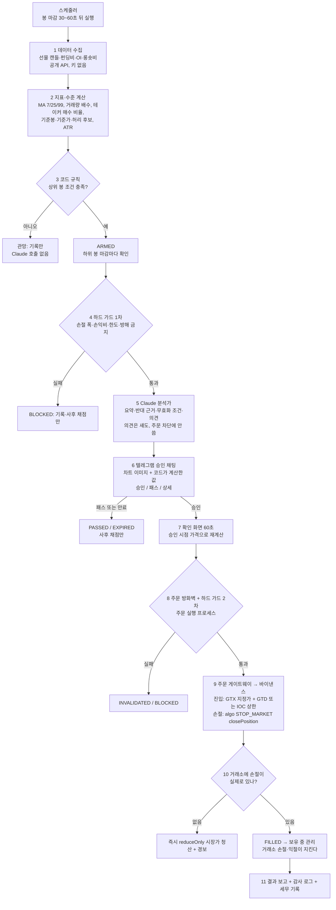
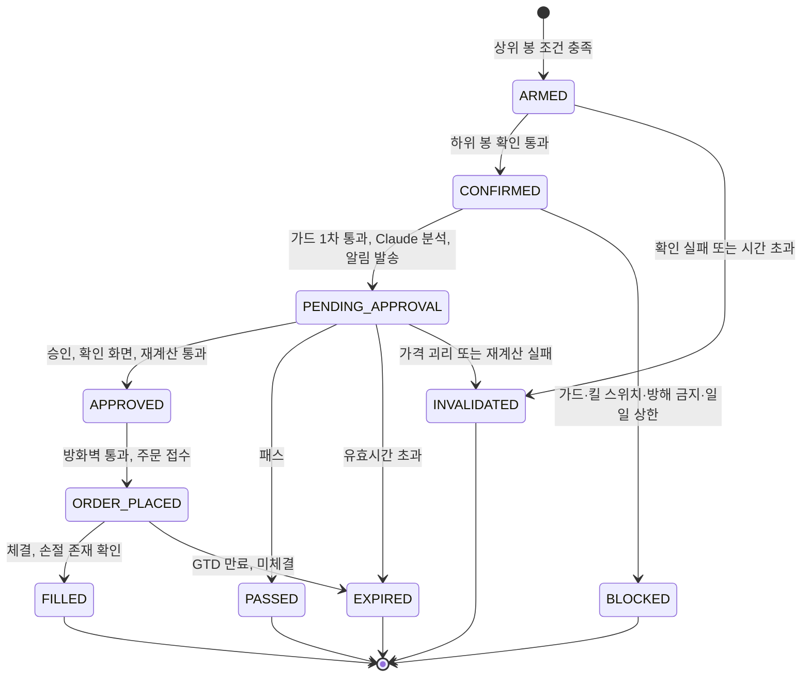
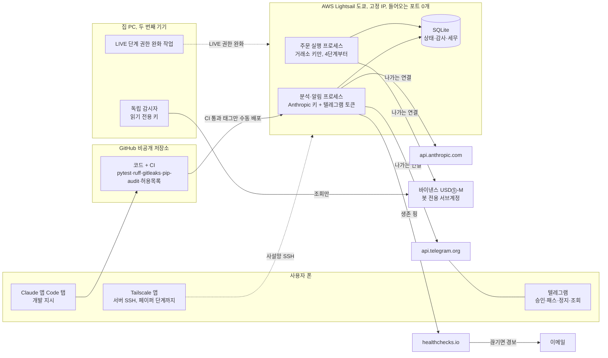

# BTC/USDT 무기한 선물 시그널 & 반자동 매매 시스템 — 마스터 기획서 v1.1

> **작성일**: 2026-09-29 · **버전**: v1.1 (v1.0에 문서 간 검증 지적을 반영. v1.0은 기획 v0.1을 대체하고 확장함) · **상태**: 설계 단계. 코드와 설치는 아직 없음
> **이 문서의 역할**: 전체 기획의 기준 문서다. 다른 문서와 값이 다르면 **§4 결정표가 우선**한다. 다른 문서는 값을 복사하지 말고 §4를 참조한다.
> **관련 문서**: [ARCHITECTURE.md](./ARCHITECTURE.md) (구조) · [INFRA.md](./INFRA.md) (운영 환경) · [SOFTWARE.md](./SOFTWARE.md) (필요 SW) · [DEV_GUIDE.md](./DEV_GUIDE.md) (개발 방법) · [SECURITY.md](./SECURITY.md) (보안) · [PLAN_REVIEW.md](./PLAN_REVIEW.md) (기획 검토) · [STRATEGY.md](./STRATEGY.md) (차트 기법 v0.2) · [research/market/CHART_METHODS.md](../research/market/CHART_METHODS.md) · [research/market/LANDSCAPE.md](../research/market/LANDSCAPE.md) · [research/planning/](../research/planning/) (조사 01~08)
> **표기**: `[n]`은 부록 A의 출처 번호다. **(검색 요약)** = 웹 검색 결과 요약으로만 확인했고 원문은 열지 못함 · **[직접]** = 원문을 직접 열어 확인 · **[계산]** = 공개 데이터로 직접 계산 · **(추정)** = 가정을 두고 낸 값 · **확인 필요** = 확인하지 못함(추측하지 않음)
> **상태 표시**: **[확정 권고]** = 조사·검토로 정한 기본값 · **[결정 필요]** = 사용자가 정할 항목. 답이 오기 전까지 추천값을 임시로 적용한다
> **ID 체계 (이 문서)**: `D1~D22` = 결정표 항목 · `REQ-1~REQ-21` = 사용자 요구사항(§2) · `K1~K15` = 조사·PoC로 확인할 항목(§11.1. v1.0의 C1~C13) · `G1~G5` = 관문 · `T0~T5` = 한도·킬 스위치 단계 · `Q/SEC/F/A-번호` = 검토 지적(§10) · `#번호` = §11 사용자 결정. **ARCHITECTURE의 `C1~C20`은 컴포넌트(부품) 번호**이고, "R배수"의 R은 손익 단위라서 이 문서의 ID와 다르다

---

## 0. 3분 요약 (먼저 읽기)

**무엇을 만드나**
워뇨띠·차트프로에서 착안한 **코드 규칙**이 BTC/USDT 무기한 선물 차트(캔들·거래량·이동평균선)에서 매매 후보를 찾는다. **Claude**는 그 후보를 요약하고 반대 근거를 써서 **텔레그램**으로 보고한다. 사람이 **[승인]/[패스]** 버튼으로 결정한다. 승인된 건만 보수적 리스크 가드를 거쳐 **바이낸스 선물**에 주문한다.

**v0.1에서 가장 크게 바뀐 점 5가지**
1. **백테스트가 맨 앞으로 왔다.** 규칙이 무작위 진입보다 나은지 먼저 확인한다(G1 관문). 통과하는 규칙이 없으면 텔레그램·주문 개발에 들어가지 않는다 (§7).
2. **Claude는 매매 관문이 아니라 분석가·설명자다.** 연구 결과 LLM의 차트 방향 적중률은 우연 수준이었다. Claude가 스스로 말하는 확신도도 정답과 거의 상관이 없었다 [8][10]. Claude의 의견은 기록만 하고, 주문 여부는 코드 가드와 사람이 정한다 (§4 D3, **결정 필요**).
3. **1회 위험을 계좌의 약 1.2% → 0.5%로 낮춘다.** 우위가 약한 전략이면 1.2%로 200번 거래할 때 누적 −15%를 넘을 확률이 67%다. 0.5%면 4%로 줄어든다 [21][계산] (§4 D8, **결정 필요**).
4. **주문은 우리 코드의 주문 게이트웨이 하나로 한다.** 조사 단계에서 권했던 freqtrade 연동 실행(B2)은 쓰지 않는다. freqtrade는 백테스트 전용이다 (§4 D10).
5. **GitHub 저장소가 지금 공개 상태다** [1]. 비밀이 들어가기 전인 지금 비공개로 바꾸는 것이 가장 싸다. 다만 개인 계정의 비공개 저장소에서는 GitHub 내장 비밀 유출 검사(Secret scanning)와 푸시 차단(push protection)을 쓸 수 없다. 그래서 gitleaks가 주 통제가 된다 [60][61] (§8.1, §11 #8·#11).

**지금 해 줄 일**
- §11의 결정 **16개**에 답하기. 기본 10개(#1~#10)와 다른 문서에서 새로 생긴 6개(#11~#16)다. 특히 **#8 저장소 비공개 전환(#11 GitHub Pro와 함께)**과 **#9 회사 규정 확인**이 먼저다.
- 나머지 항목은 추천값이 이미 적용돼 있다. 바꾸고 싶은 것만 말하면 된다.

**언제쯤 실제 돈으로 거래하나 (추정, v1.1 재추정)**
- 모의 운영(G3)은 **실행 가능 신호 150건**이 쌓여야 판정한다. 실행 가능 신호는 방해 금지 시간 등을 뺀, 사람이 실제로 응답할 수 있었던 신호다. 우리 데이터로 잰 신호 후보 빈도를 넣으면 이 기간이 v1.0 추정(15~50주)보다 길다 (§7.2).
- **설정 1(1H 신호)**: G3에 약 34~68주가 걸린다. 그래서 소액 실거래(G4)는 **빨라야 2027년 8~10월 무렵**이다. 규칙이 후보의 절반만 통과시키면 **2028년 봄**이다.
- **설정 2(4H 신호)**: 후보가 1H의 약 1/5이라 G3에만 **약 3.5년 이상**이 걸린다. 지금 기준대로면 실거래 전환이 수년 늦어진다 (§4 D1, §11 #6).
- 150건은 최소치다. 진짜 우위가 G1 합격선(+0.15R) 수준이면, 150건에서 G3를 통과하지 못할 확률이 약 2/3다 [계산]. 그러면 사전에 정한 규칙으로 G3를 연장하고, 위 시점도 늦어진다 (§7.2).
- 규모 확대(G5)는 **빨라야 2028년**이다 (§7.2).

---

### 0.1 용어 풀이 (처음 나오는 전문 용어)

| 용어 | 한 줄 설명 |
|---|---|
| 무기한 선물 (perpetual) | 만기가 없는 선물. 가격이 오를지(롱)·내릴지(숏)에 걸 수 있고, 8시간마다 펀딩비를 주고받는다 |
| 롱 / 숏 | 가격 상승에 거는 포지션 / 가격 하락에 거는 포지션 |
| 레버리지 / 격리 마진 | 맡긴 돈(증거금)보다 큰 금액을 거래하는 배율 / 손실이 그 포지션에 맡긴 증거금 안에서만 나도록 분리하는 방식 |
| 명목 금액 | 포지션의 실제 크기(증거금 × 레버리지). 손익은 이 금액에 비례한다 |
| 손절 / 익절 | 정해 둔 손실 가격에서 자동으로 정리 / 정해 둔 이익 가격에서 자동으로 정리 |
| 손익비 | (목표가까지 거리) ÷ (손절가까지 거리). 1.5면 1만큼 잃을 위험에 1.5만큼 번다 |
| R (R배수) | 거래 1건에서 손절에 걸렸을 때 잃는 금액을 1R로 둔 단위. 결과를 "+0.5R"처럼 적으면 거래 크기와 무관하게 비교할 수 있다 |
| r (1회 위험) | 거래 1건에서 손절 시 잃는 금액이 기준 자본의 몇 %인지 |
| ATR | 최근 N개 봉에서 가격이 한 봉 동안 평균 얼마나 움직였는지(평균 진폭) |
| 마크 가격 | 여러 거래소 지수로 계산한 기준 가격. 청산과 손절 판단에 쓴다 |
| 백테스트 | 과거 데이터로 규칙을 모의 실행해 성과를 보는 것 |
| 페이퍼 트레이딩 (모의매매) | 실시간 시세로 신호를 내되 실제 주문 없이 기록하고 채점하는 것 |
| 테스트넷 | 거래소가 제공하는 가짜 돈 환경. 주문 기능을 시험한다 |
| 워크포워드 / 홀드아웃 | 기간을 밀어 가며 "앞에서 고르고 뒤에서 확인"을 반복하는 검증 / 끝까지 보지 않고 남겨 뒀다가 한 번만 여는 기간 |
| 관문 (게이트, G1~G5) | 다음 단계로 가기 전에 숫자로 통과해야 하는 조건 |
| 섀도 (shadow) | 결과를 계산·기록만 하고 실제 결정에는 쓰지 않는 방식 |
| fail-closed | 오류가 나면 "주문하지 않는 쪽"으로 멈추는 원칙 |
| 멱등성 | 같은 요청이 두 번 와도 한 번만 처리되는 성질 (중복 주문 방지) |
| 상태 머신 | 신호가 "대기 → 승인 → 주문 → 체결"처럼 정해진 단계만 거치게 하는 설계 |
| API 키 / IP 화이트리스트 | 프로그램이 거래소 계정을 쓰게 하는 열쇠 / 그 키를 정해진 서버 IP에서만 쓰게 하는 제한 |
| 서브계정 | 메인 계정 아래에 따로 만든 계정. 봇이 쓸 돈만 넣어 피해 범위를 나눈다 |
| 롱 폴링 | 봇이 텔레그램 서버에 먼저 "새 메시지 있어?"라고 묻는 방식. 서버에 들어오는 문을 열 필요가 없다 |
| 데드맨 스위치 | 봇이 주기적으로 "살아 있음" 신호를 보내고, 끊기면 외부 서비스가 경보를 보내는 장치 |
| 구조화 출력 | Claude의 답을 정해진 JSON 형식으로 강제하는 API 기능 |
| effort | Claude가 얼마나 깊이 생각할지 정하는 설정(low~max) |
| GTX / GTD / IOC | 호가에 걸릴 때만 접수되는 지정가(post-only) / 정해진 시각에 거래소가 자동 취소하는 주문 / 즉시 체결되지 않은 부분은 바로 취소되는 주문 |
| reduceOnly / closePosition | 포지션을 줄이기만 하는 주문 / 발동하면 해당 포지션 전량을 정리하는 주문 |
| PR / CI | 코드 변경 제안(Pull Request) / 변경마다 자동으로 테스트를 돌리는 장치 |
| 수용 시험 | "이렇게 하면 이렇게 돼야 한다"를 한국어 문장으로 적고 실제로 해 보는 확인 |
| 공급망 공격 / slopsquatting | 라이브러리를 통해 악성 코드가 들어오는 공격 / AI가 지어낸 패키지 이름을 공격자가 먼저 등록해 두는 수법 |
| 프롬프트 인젝션 | 외부 글에 숨긴 지시문으로 AI를 조종하려는 공격 |

**주문·거래소 세부 용어** (D6·D7·D14에 나온다. 파라미터 세부는 [ARCHITECTURE.md](./ARCHITECTURE.md) §3.4·§5.1.3)

| 용어 | 한 줄 설명 |
|---|---|
| 테이커 / 메이커 | 호가를 바로 가져가 체결되는 주문(수수료 높음) / 호가창에 걸려 있다가 체결되는 주문(수수료 낮음) |
| 슬리피지 | 주문하려던 가격과 실제 체결 가격의 차이 |
| OI (미결제약정) / 롱숏비 | 아직 청산되지 않은 선물 계약의 총량 / 롱 계정과 숏 계정의 비율 |
| 테이커 매수 비율 | 체결된 거래 중 "바로 사는 쪽(시장가 매수)"이 차지하는 비율 |
| 기준봉 / 기준가 / 허리 | STRATEGY의 가격 수준 개념. 기준봉 = 거래량이 직전 20봉 평균의 3배 이상인 봉 / 기준가 = 기준봉 구간을 15분봉으로 쪼개 구한 거래량 가중 평균가 / 허리 = 기준 구간의 (고가 + 저가) ÷ 2 ([STRATEGY.md](./STRATEGY.md) §4) |
| MA 7/25/99 | 최근 7·25·99개 봉 종가의 이동평균선 |
| One-way 모드 / Hedge 모드 | 한 종목에 포지션을 한 방향(롱 또는 숏)으로 하나만 두는 모드 / 롱과 숏을 동시에 따로 들 수 있는 모드 |
| Single-Asset(USDT) 모드 | 증거금을 USDT 하나로만 계산하는 모드. 여러 코인을 담보로 묶는 방식의 연쇄 청산 위험을 피한다 |
| algo 주문 (조건부 주문) | 가격 조건이 되면 거래소가 발동하는 손절·익절 주문. 바이낸스는 2025-12-09부터 별도 Algo 창구로 받는다 [14][19] |
| workingType=MARK_PRICE | 손절 발동 기준을 마지막 체결가가 아닌 마크 가격으로 두는 설정 |
| priceProtect | 마크 가격과 체결가가 크게 벌어지면 조건부 주문 발동을 막는 옵션. 급변 때 손절이 안 나가는 쪽이 더 위험해서 끈다(false). 테스트넷 확인 필요 (08 §2.5) |
| clientOrderId / clientAlgoId | 우리가 일반 주문 / algo 주문에 붙이는 고유 이름표. 중복 주문 확인과 대조에 쓴다 |
| openAlgoOrders | 거래소에 지금 걸려 있는 algo 주문 목록을 조회하는 기능. 손절이 실제로 있는지 확인할 때 쓴다 |
| countdownCancelAll | 봇이 정해진 시간 안에 신호를 다시 보내지 않으면 거래소가 미체결 주문을 모두 취소하는 기능 |
| MMR (유지증거금률) | 포지션을 유지하는 데 필요한 최소 증거금 비율. 이 아래로 떨어지면 강제 청산된다 |
| Ed25519 키 | 공개키 서명 방식의 API 키. 거래소에는 공개키만 등록하고, 서명용 개인키는 우리 서버에만 둔다 [20] |

**검증·통계 용어** (D3·D17·D18·§7에 나온다)

| 용어 | 한 줄 설명 |
|---|---|
| PoC | 본 개발 전에 "되는지만" 확인하는 작은 시험 |
| 엣지 (우위) | 무작위로 들어가는 것보다 나은 기대값 |
| 실행 가능 신호 | 코드 규칙과 하드 가드 1차를 통과하고, 가용성 마스크(방해 금지·응답 가능 시간·하루 6건·동시 1포지션)에도 걸리지 않은 신호. 사람이 승인·패스·만료 중 무엇을 했든 센다 (§3.5, D17) |
| 전향 기록 | 규칙을 고정한 뒤 실시간으로 쌓는 기록. 과거 데이터를 다시 쓰지 않아서 진짜 "표본 밖"이다 |
| PF (Profit Factor) | 이긴 거래의 이익 합 ÷ 진 거래의 손실 합. 1보다 커야 이익이다 |
| 부트스트랩 | 가진 거래 결과를 여러 번 다시 뽑아서, 결과가 얼마나 흔들리는지(신뢰구간)를 추정하는 방법 |
| 95% 신뢰구간 하한 | "진짜 평균이 이보다 낮을 가능성은 작다"는 아래쪽 경계. 0보다 크면 우연일 가능성이 낮다 |
| 검정력 | 진짜 우위가 있을 때 시험이 그것을 "있다"고 잡아낼 확률 |
| SPRT (순차 확률비 검정) | 표본이 쌓일 때마다 판정해서, 필요한 거래 수를 평균적으로 줄이는 검정 |
| 윌슨 하한 | 적중률(비율)의 신뢰구간 아래쪽 경계를 구하는 방법 |
| DSR / PBO | 여러 변형을 시험해서 생긴 "우연히 좋아 보임"을 보정한 샤프 비율 / 백테스트 최고 규칙이 표본 밖에서 중간 이하로 떨어질 확률 [48] |
| 샤프 비율 / MDD | 변동성 대비 수익 / 고점 대비 최대 낙폭 |
| 몬테카를로 | 무작위 시뮬레이션을 수천 번 돌려 결과의 분포(예: 최악 연패 수)를 보는 방법 |
| ECE | 확신도와 실제 적중률의 평균 차이. 0이면 완벽하게 맞는다 |
| kNN (닮은꼴) | 과거에서 지금과 가장 비슷한 차트 구간 k개를 찾아, 그 뒤의 움직임을 참고하는 방법 |
| 룩어헤드 편향 | 판단 시점에는 알 수 없던 미래 정보가 계산에 섞여 성과가 부풀려지는 오류 |
| 돈치안 채널 / 앙상블 | 최근 N일 최고가를 넘으면 사고 최저가 아래로 가면 파는 추세추종 규칙 / 여러 N을 섞어 쓴 것 |

**운영·인프라·보안 용어** (D11~D15·§5·§8에 나온다)

| 용어 | 한 줄 설명 |
|---|---|
| WAL | SQLite가 쓰기 기록을 따로 남겨 읽기와 쓰기가 서로 덜 막히게 하는 방식 |
| digest | Docker 이미지 내용으로 계산한 고유 지문(`sha256:...`). 이름표(태그)와 달리 내용이 바뀌면 값도 바뀐다 |
| chrony | 서버 시계를 표준 시간에 맞추는 프로그램 |
| recvWindow | 거래소가 "서명 시각에서 몇 밀리초 안에 도착한 요청만 받는다"고 정한 허용 시간. 5000 = 5초 |
| UFW / non-root | 우분투의 간단한 방화벽 도구 / 컨테이너 안 프로그램을 관리자(root) 권한 없이 돌리는 것 |
| Compose secrets | Docker Compose가 비밀을 컨테이너 안의 파일로만 넘기는 기능. 환경 변수보다 새기 어렵다 [28] |
| Tailscale / IdP / ACL | 내 기기끼리만 통하는 사설망 서비스. 서버 SSH 문을 인터넷에 열지 않아도 된다 / Tailscale 로그인에 쓰는 외부 계정(구글·GitHub 등) / 기기별 접근 권한 규칙 |
| age / sops | 공개키로 잠그고 개인키로만 여는 파일 암호화 도구 / 설정 파일의 비밀 값만 암호화해 두는 도구 |
| RUNBOOK / rollback | 장애·비상 때 순서대로 따라 하는 대응 절차서 / 이전 버전으로 되돌리기 |
| Workspace (Anthropic Console) | API 키와 월 지출 한도를 묶어 관리하는 단위 |
| TOTP / HMAC | 인증 앱이 30초마다 바꾸는 6자리 코드 / 비밀 키로 만든 서명. 데이터 위조 여부를 확인한다 |
| getWebhookInfo | 텔레그램 봇이 웹훅(다른 서버로 메시지 전달)으로 바뀌었는지 조회하는 기능. 롱 폴링만 쓰는 우리 봇에 웹훅이 생기면 토큰 탈취 신호다 |
| gitleaks / pre-commit | 코드와 커밋 이력에서 비밀(키·토큰) 유출을 찾는 도구 / 커밋 직전에 자동으로 검사를 돌리는 장치 |
| Secret scanning / push protection | GitHub가 저장소의 비밀 유출을 찾아 주는 기능 / 비밀이 든 push를 막는 기능. **개인 계정의 비공개 저장소에서는 둘 다 쓸 수 없다** [60][61] |
| 브랜치 보호 / 룰셋 / CODEOWNERS | main에 병합하기 전에 CI 통과 등을 강제하는 설정 / 그런 규칙을 묶어 거는 방식 / 파일별 필수 검토자 지정. 개인 계정 비공개 저장소에서는 **GitHub Pro**(개인 유료 요금제)가 있어야 쓸 수 있다 [58][59] |

**오류 코드** (D14 감시 대상)

| 코드 | 뜻 |
|---|---|
| 451 | 거래소가 서버 국가를 이유로 요청을 막을 때 돌려주는 번호 (예: 미국 IP) [37] |
| 403 | 접근 거부. 거래소 쪽 차단 규칙에 걸렸을 때 나온다 (세부 조건은 확인 필요) |
| 418 | 요청 한도를 계속 어겨 거래소가 IP를 자동 차단했을 때 돌려주는 번호. 반복하면 차단이 2분에서 최대 3일까지 늘어난다 (05 §2.2.1) |
| -1021 | 요청 시각이 거래소 시계보다 앞서거나 recvWindow보다 늦게 도착했을 때 나는 바이낸스 오류 (05 §2.8) |
| -4120 | 조건부 주문을 옛 창구로 보냈을 때 바이낸스가 거부하는 오류 (2025-12-09 Algo 창구 이전 이후) [14] |
| 409 | 같은 텔레그램 봇 토큰으로 두 곳이 동시에 폴링할 때 나는 충돌 오류 |

---

## 1. 한 줄 요약과 목표·범위·비범위

### 1.1 한 줄 요약

> **코드 규칙이 후보를 찾고, Claude가 설명하고, 사람이 승인하고, 코드가 리스크를 강제한 뒤에만 주문하는 BTC/USDT 무기한 선물 반자동 매매 시스템.** 제품 설명은 "워뇨띠·차트프로에서 착안한 규칙 + 보수적 리스크"다 (§4 D22).

### 1.2 목표

| # | 목표 | 어떻게 확인하나 |
|---|---|---|
| O1 | **검증된 규칙만 돈에 닿게 한다** | G1(백테스트)·G2(테스트넷)·G3(페이퍼)를 숫자로 통과하기 전에는 실제 돈 주문이 없다 (§4 D17) |
| O2 | **손실 상한을 코드로 강제한다** | 1회 위험, 일일·주간·누적 한도, 손절 없는 포지션 0건을 코드가 막는다 (§4 D8) |
| O3 | **폰으로 운영한다** | 승인·패스·정지·상태 조회를 텔레그램에서 한다. 권한을 푸는 조작만 서버나 두 번째 기기에서 한다 (§4 D5, D15) |
| O4 | **비전문가가 Claude와 만들고 유지할 수 있는 규모** | 외부 패키지 6개 안팎, 프로세스 2개, 거래소·종목·포지션 각 1개 (§4 D9, D10) |
| O5 | **보안 피해에 상한을 둔다** | 서버로 들어오는 포트 0개, 출금 불가 키, 서버가 침해돼도 최대 손실 = 봇 서브계정 잔고 (§8) |
| O6 | **사용자가 단계마다 배운다** | 단계마다 한국어 수용 시험을 직접 해 본다 (§7.4) |

### 1.3 범위 (만드는 것)

- 종목: 바이낸스 USDⓈ-M **BTCUSDT 무기한 선물 1종목**, One-way 모드, **포지션 최대 1개**
- 신호: 1H 또는 4H 봉 기준 코드 규칙 (G1에서 선택, §4 D1)
- 분석: 코드가 수치 계산 → 규칙으로 후보 → Claude가 요약·반대 근거·무효화 조건·의견
- 승인: 텔레그램 봇(롱 폴링) 버튼
- 실행: 우리 코드의 주문 게이트웨이, 거래소에 손절·익절을 걸어 둠
- 검증: 백테스트(G1), 테스트넷(G2), 페이퍼(G3), 소액 실거래(G4), 확대(G5)
- 기록: 감사 로그, 세무 기록, 주간 리포트

### 1.4 비범위 (만들지 않는 것)

- 완전 자동매매 (사람 승인 없는 주문)
- 여러 종목·여러 거래소 동시 운영 (예비 거래소 어댑터는 "나중")
- Slack·Discord 채널, TradingView 웹훅, 상용 시그널 서비스(3Commas·Cornix 등). 제3자에게 키를 맡기거나 공개 수신 서버가 필요하기 때문이다. 3Commas에서는 키 유출로 약 2천만 달러 피해가 났다(검색 요약) [43]
- freqtrade를 실행 엔진으로 쓰기 (백테스트 전용)
- Claude에게 주문 도구(MCP·툴)를 주기. Claude는 JSON만 출력한다 (01 §3.2-4)
- 뉴스·SNS 텍스트를 Claude에 넣기 (프롬프트 인젝션 위험. "나중" 검토 대상)
- 5분봉 이하 신호, 초단타
- 신호 판매, 타인 계좌 운용, 카피트레이딩 (04 §3.4)
- VPN이나 서버 위치로 한국의 접속 차단을 우회하는 운영 (05 §3.2)

---

## 2. 사용자 요구사항 → 설계 반영 위치

"반영 방식"의 뜻: **그대로** = 요구대로 반영 · **조정** = 취지는 유지하되 방식을 바꿈(근거 있음) · **동의 필요** = 원래 요구를 바꾸므로 §11에서 답을 받는다.

요구 ID는 `REQ-n`이다. v1.0은 `R1~R21`로 적었는데, ARCHITECTURE의 재검증 규칙 번호, 차트프로 보고서의 규칙 번호(R1~R18), 손익 단위 "R배수"와 겹쳐서 바꿨다.

### 2.1 시스템 기능 요구

| # | 요구 (원문 요약) | 설계에 반영한 내용 | 반영 방식 | 다루는 곳 |
|---|---|---|---|---|
| REQ-1 | Claude가 BTC/USDT 무기한 선물 차트(캔들·거래량·이동평균선)를 분석 | 코드가 캔들·거래량·MA 7/25/99·기준봉·허리 등을 계산하고 규칙으로 후보를 고른다. Claude는 후보를 요약하고 반대 근거·무효화 조건·"승인 권고/패스 권고" 의견을 낸다. 의견은 섀도로 기록만 한다 | **동의 필요** (§11 #1) | 이 문서 §3, §4 D2~D4 · [ARCHITECTURE.md](./ARCHITECTURE.md) (Claude 연동) · [STRATEGY.md](./STRATEGY.md) §2·§4 · [03_llm_trading.md](../research/planning/03_llm_trading.md) §2.4 |
| REQ-2 | 결과를 Slack 또는 Telegram으로 전송 | 텔레그램 롱 폴링 하나만 쓴다. Slack도 Socket Mode면 공개 서버가 필요 없지만 [26], 개인·모바일·단순함 때문에 텔레그램 하나로 충분하다 | 조정 | §4 D5 · [07_telegram_hitl.md](../research/planning/07_telegram_hitl.md) §2.8, §3.1 |
| REQ-3 | 사용자가 검토 후 텔레그램에서 롱/숏 버튼 | [승인]/[패스]/[상세] 버튼과 패스 사유 코드. 근거 없는 역방향 주문 경로를 없앤다 | **동의 필요** (§11 #2) | §4 D5 · [07_telegram_hitl.md](../research/planning/07_telegram_hitl.md) §3.2~3.4 |
| REQ-4 | 거래소 API와 연동해 주문 | 자체 주문 게이트웨이(ccxt 직접). 주문 방화벽과 손절 존재 확인을 거친다. G2 통과 전에는 테스트넷에서만 주문한다 | 조정 | §3, §4 D7·D10 · [ARCHITECTURE.md](./ARCHITECTURE.md) (주문 게이트웨이) · [SECURITY.md](./SECURITY.md) · [08_risk_backtest.md](../research/planning/08_risk_backtest.md) §2.5·§3.1 |
| REQ-5 | 바이낸스를 써 왔고, 보안성과 인기에 따라 바꿀 수 있음 | 바이낸스 USDⓈ-M 유지. 거래소 어댑터 층과 설정표로 교체에 대비한다. 예비 거래소는 OKX, 그다음 Bybit이고 어댑터는 "나중"에 만든다 | 그대로 + 보완 | §4 D6 · [04_exchanges_regulation.md](../research/planning/04_exchanges_regulation.md) §3.1~3.3 |
| REQ-6 | 워뇨띠 매매방식과 차트프로 유튜브 채널을 벤치마킹 | 두 사람은 **가설 출처**로 쓴다. 규칙은 두 사람에게서 착안하되, 성과 기준(벤치마크)은 "무작위 진입 + 같은 리스크 규칙"과 "일봉 돈치안 앙상블"로 둔다. 워뇨띠에게서는 격리 마진, 명목 상한, 지정가 실행, 이익 출금 알림 같은 리스크·실행 규칙을 가져온다 | 조정 | §4 D22 · [STRATEGY.md](./STRATEGY.md) §1·§5 · [wonyotti/REPORT.md](../research/wonyotti/REPORT.md) · [chartpro/REPORT.md](../research/chartpro/REPORT.md) · [PLAN_REVIEW.md](./PLAN_REVIEW.md) |

### 2.2 이번 요청 (조사·기획 요구)

| # | 요구 (원문 요약) | 이번에 만든 것 | 다루는 곳 |
|---|---|---|---|
| REQ-7 | 바로 개발하지 말 것 | 이번 문서 세트에는 코드·패키지 설치가 없다. 개발은 §7의 0단계부터 시작한다 | §7 |
| REQ-8 | 시스템을 어떻게 만들지 | 흐름도, 신호 상태 머신, 프로세스 분리, 체결·채점 모델 | §3 · [ARCHITECTURE.md](./ARCHITECTURE.md) |
| REQ-9 | 운영 환경은 어떻게 구성해야 하는지 | 서버, 네트워크, 비밀 관리, 배포, 감시, 백업 | §5 · [INFRA.md](./INFRA.md) · [05_infra_ops.md](../research/planning/05_infra_ops.md) |
| REQ-10 | 필요한 SW는 무엇인지 | 언어·패키지·도구·외부 서비스·계정, 쓰지 말 것 | §6 · [SOFTWARE.md](./SOFTWARE.md) · [06_software_stack.md](../research/planning/06_software_stack.md) |
| REQ-11 | 개발에 필요한 내용 | 단계별 로드맵·관문·수용 시험, 바이브코딩 안전 규칙 | §7 · [DEV_GUIDE.md](./DEV_GUIDE.md) |
| REQ-12 | 기획에 틀린 건 없는지, 더 좋은 방법은 없는지 | 검토 지적 목록과 채택·기각 판정, v0.1 대비 변경점 | §10 · [PLAN_REVIEW.md](./PLAN_REVIEW.md) |
| REQ-13 | 다른 사람들은 어떤 차트 분석 방법을 쓰는지 | 34개 방법의 근거 등급·인기·우리 시스템 권고, 기존 봇·서비스 지형 | [research/market/CHART_METHODS.md](../research/market/CHART_METHODS.md) · [research/market/LANDSCAPE.md](../research/market/LANDSCAPE.md) · [02_chart_methods.md](../research/planning/02_chart_methods.md) · [01_existing_systems.md](../research/planning/01_existing_systems.md) |
| REQ-14 | 에이전트 팀을 구성해서 만들 것 | 리서처 8명 → 관점별 검토 → 판정 → 문서 작성 순으로 만들었다 | §12.2 |

### 2.3 사용자가 이미 정한 값 (존중하되 점검함)

| # | 기존 결정 | v1.0 처리 | 근거 | 다루는 곳 |
|---|---|---|---|---|
| REQ-15 | 반자동, 사람 승인 후 주문 | **유지**. 사람은 최종 승인권자다. 다만 사람의 기여도는 관문이 아니라 참고 지표로만 잰다 | LLM 자율 매매의 대량 손실(검색 요약) [9], 자동화 편향 (01 §3.2) | §4 D3·D5 |
| REQ-16 | 손절 폭 최대 2% | **유지(상한)**. 여기에 ATR 밴드 하한을 더한다 | 2%는 2025~26년 1시간 ATR 중앙값 0.57%의 약 3.4배다 [21][계산] | §4 D8 |
| REQ-17 | 레버리지 3배, 격리 마진 | **유지**. 3배 격리의 청산가는 진입가에서 약 ±33%로, 손절보다 16배 멀다 | [21][계산] (08 §2.2) | §4 D8 |
| REQ-18 | 손익비 1.5 | **유지**. 단 "비용 차감 후, 계획 평균 진입가와 단일 목표가 기준"으로 정의하고 승인 시점에 다시 계산한다 | 08 §2.12-⑦, Q6 | §4 D8 |
| REQ-19 | 확신도 0.6 미만이면 관망 | **관문에서 빼고 기록만** 한다. 관문은 코드 체크리스트가 맡는다 | LLM 확신도는 보정되지 않았다. ECE(확신도와 실제 적중률의 평균 차이, 0이면 완벽)가 0.25~0.58이었다(검색 요약) [10] | §4 D8 · **결정 필요** (§11 #5) |
| REQ-20 | 포지션 증거금 ≤ 계좌 20% | **유지**. 명목 0.6배 이하라는 안전핀 역할이다 | 08 §2.12-④ | §4 D8 |
| REQ-21 | (배경) 폰 위주 사용, 코딩 비전문가, 보안 종사자 | 텔레그램 중심 운영, PR 승인을 diff 대신 수용 시험 결과로, LIVE 단계 권한 완화는 두 번째 기기에서 | SEC-06, SEC-03 (§10) | §5, §7.5, §8 |

---

## 3. 시스템 개요

### 3.1 한 장 흐름도



같은 흐름을 글로 적으면 이렇다.

1. 봉이 마감되고 30~60초 뒤, 마감이 확정된 봉만으로 계산을 시작한다 (§4 D1).
2. 코드가 지표와 가격 수준(기준봉·기준가·허리 등)을 계산하고, 규칙 조건이 맞으면 신호를 **ARMED**로 만든다.
3. 하위 봉 확인이 끝나면 **CONFIRMED**가 된다. 하드 가드 1차를 통과해야 Claude를 호출한다. 후보가 없으면 Claude를 부르지 않아서 비용이 줄어든다.
4. Claude는 요약·반대 근거·무효화 조건·의견을 JSON으로 낸다. 가격·손익비·수량은 코드가 계산한 값만 보여 준다.
5. 텔레그램에 [승인]/[패스]/[상세] 버튼이 뜬다(**PENDING_APPROVAL**). 방해 금지 시간이거나 하루 6건을 넘으면 보내지 않고 기록만 한다.
6. 승인하면 60초짜리 확인 화면이 뜨고, 그 시점 가격으로 가드를 다시 계산한다. 가격이 많이 움직였으면 취소한다.
7. 주문 실행 프로세스가 방화벽 검사를 한 뒤 주문한다(**ORDER_PLACED**). 체결되면 거래소에 손절이 실제로 있는지 조회하고, 없으면 즉시 청산하고 경보를 보낸다.
8. 모든 단계는 감사 로그로 남는다. 패스·만료·차단된 신호도 같은 규칙으로 사후 채점한다.

### 3.2 신호 상태 머신

모든 신호는 하나의 공용 상태 머신을 거친다. **백테스트, 페이퍼, 실거래가 같은 모듈을 쓴다** (§4 D1, Q8).



- 결정표의 상태는 ARMED → CONFIRMED → PENDING_APPROVAL → APPROVED → ORDER_PLACED → FILLED 또는 EXPIRED/INVALIDATED/BLOCKED다 (§4 D1). **PASSED**는 [패스] 버튼의 종료 상태를 그림에 표시한 것이다. 세부 상태 이름과 전이 규칙은 [ARCHITECTURE.md](./ARCHITECTURE.md)에서 확정한다.
- 종료 상태에서는 어떤 전이도 허용하지 않는다. 모든 전이는 "현재 상태가 X일 때만 Y로"라는 원자적 DB 갱신으로 처리한다 (07 §2.7.1).
- 4H 신호 + 1H 확인 구성을 택하면 확인 봉이 1H가 되어 구조가 단순해진다 (§4 D1).

### 3.3 누가 무엇을 하나

| 주체 | 하는 일 | 하지 않는 일 |
|---|---|---|
| **코드** | 지표·수준 계산, 규칙 판정, 가격·손익비·수량 계산, 하드 가드, 주문 방화벽, 손절 존재 확인, 채점 | 재량 판단 |
| **Claude** | 코드가 만든 수준 ID 중에서 선택(enum), 한 줄 요약, 반대 근거, 무효화 조건, "승인 권고/패스 권고" 의견 | 가격 숫자 생성, 주문, 주문 차단 결정(섀도 단계). Claude가 관문이 되려면 코드 메타 필터를 약 600건 비교에서 이겨야 한다 (§4 D3) |
| **사람** | 최종 [승인]/[패스], 패스 사유 선택, 비상 정지 | 한도 완화·정지 해제를 텔레그램으로 하기 (서버·두 번째 기기에서만) |
| **거래소** | 걸어 둔 손절·익절 집행, GTD 만료 시 자동 취소 | — |

### 3.4 프로세스 분리 (4단계부터)

| 프로세스 | 가진 비밀 | 하는 일 |
|---|---|---|
| **분석·알림 프로세스** | Anthropic 키, 텔레그램 토큰 | 데이터·지표·규칙·Claude·텔레그램·상태 머신(주문 전까지) |
| **주문 실행 프로세스** | 거래소 키만 | DB에서 **승인된 신호 ID만** 받아 가드를 다시 계산하고, 방화벽 검사 후 주문 |

외부 입력(텔레그램, Claude 응답)을 다루는 프로세스와 거래소 키를 가진 프로세스를 나눠서, 한쪽이 뚫려도 다른 쪽 비밀까지 새지 않게 한다 (SEC-08). 1~3단계에는 거래 키가 없으므로 한 프로세스로 충분하다.

### 3.5 하나의 체결·채점 모델 (백테스트·페이퍼·실거래 공용)

백테스트는 "다음 봉 시가 진입"을 기본으로 가정한다 [17]. 반면 실제로는 사람이 누르기까지 지연이 있다. 15분 동안 가격 표준편차는 약 0.24%다(추정) [21]. 손절 거리가 1H ATR 중앙값 0.57%일 때 괴리 한도 min(0.25×손절 거리, 0.3%)를 넘을 확률은 약 55%다 (Q6, 정규 근사). 그래서 아래 모델 하나를 G1 백테스트, G3 페이퍼, 패스·만료·차단 신호의 사후 채점에 똑같이 쓴다.

- **진입**: 신호 시각 + 지연 L(페이퍼에서 측정한 클릭 시간 분포) + 계획가 지정가. 가격이 계획가를 **관통해야 체결**로 친다. GTD 만료 시 미체결로 따로 집계한다.
- **비용**: 테이커 0.05%, 메이커 0.02%, 슬리피지 가정, 실제 펀딩비 (08 §3.1-9).
- **손익비 정의**: 계획 평균 진입가와 단일 목표가 기준, 비용 차감 후. 목표가 선택 규칙도 미리 고정한다(먼 목표를 골라 가드를 통과하는 "목표가 쇼핑" 방지).
- **가용성 마스크**: 방해 금지, 사용자 응답 가능 시간표, 하루 6건 상한, 동시 1포지션을 적용한다. 결과는 "전체 신호"와 "실행 가능 신호"로 나누고, 시간대별(낮·저녁·심야)로도 보고한다 (Q5). **실행 가능 신호** = 코드 규칙과 하드 가드 1차를 통과하고 가용성 마스크에도 걸리지 않은 신호다. 사람이 승인했든 패스했든 만료됐든 모두 센다. G1 판정과 G3의 150건은 이 신호를 기준으로 한다 (D17). 2025-01 이후 거래량이 직전 20봉 평균의 3배 이상인 1시간봉 592개 중 **34.0%가 한국 새벽(00:30~07:30 KST)에 마감**했다 [21][계산, 검토 단계 재현].

### 3.6 보유 중 관리

| 상황 | 기본 동작 |
|---|---|
| 체결 후 | 단일 목표가에 **전량 익절** 주문 + 거래소 손절. 둘 다 closePosition (§4 D7) |
| 부분 체결 | 체결된 수량 기준으로 손절·익절을 다시 건다 |
| 조기 청산 | 텔레그램 `/flat` (2단계 확인) |
| 분할 익절, 시간 손절(48시간 후보) | G1에서 비교한 뒤 "나중"에 켠다 (08 §3.1-10) |
| 봇이 재시작할 때 | 시계·포지션·손절 존재를 점검하고, 만료가 지난 대기 신호를 무효로 돌린다 (05 §3.1) |

---

## 4. 핵심 결정값 표 (결정표)

**이 표가 유일한 기준이다.** 다른 문서(STRATEGY 포함)와 값이 다르면 이 표를 따른다. 다른 문서는 이 표를 참조만 한다 (Q4+F10).

### 4.1 한눈에 보기

| ID | 주제 | 상태 | 핵심 |
|---|---|---|---|
| D1 | 분석 주기·타임프레임 | **[결정 필요]** | 1H·4H 두 설정 모두 지원, G1 성과와 G3 소요 기간으로 확정. 성과가 비슷하면 4H(단, 4H는 G3가 약 5배 느림) |
| D2 | Claude 모델·effort·호출 방식 | [확정 권고] | Opus 5.5, effort medium, 구조화 출력, 후보 있을 때만 호출, fail-closed |
| D3 | Claude의 역할 | **[결정 필요]** | 관문이 아닌 분석가·설명자. 의견은 섀도 |
| D4 | Claude 입력 형태 | [확정 권고] | 수치 JSON이 주입력, 이미지는 사람용 |
| D5 | 알림·승인 채널과 버튼 | **[결정 필요]** | 텔레그램만, [승인]/[패스]/[상세] |
| D6 | 기본 거래소와 교체 방식 | [확정 권고] | 바이낸스 USDⓈ-M, 봇 전용 서브계정, 어댑터 층 |
| D7 | 주문 방식 | [확정 권고] | GTX+GTD 지정가(PoC 조건부), algo 손절, 존재 확인 |
| D8 | 리스크 기본값 전체 | **[결정 필요]** | r 0.5%, ATR 밴드, 3배 격리, 일일 −3%, 누적 −10/−15% |
| D9 | 개발 언어·핵심 라이브러리 | [확정 권고] | Python 3.14 + uv, 외부 패키지 6개 안팎 |
| D10 | 실행 엔진 | [확정 권고] | 자체 주문 게이트웨이, freqtrade는 백테스트 전용 |
| D11 | 호스팅 후보와 지역 | [확정 권고] | AWS Lightsail 도쿄 2GB + 고정 IP |
| D12 | 배포 방식 | [확정 권고] | Docker Compose, 포트 공개 없음, 태그 수동 배포 |
| D13 | DB | [확정 권고] | SQLite WAL, 추가 전용 감사 로그, 암호화 백업 |
| D14 | 모니터링 | [확정 권고] | 4겹 감시 |
| D15 | 비밀 관리·저장소 | [확정 권고] | 저장소 비공개, gitleaks가 주 통제(비공개에선 GitHub 비밀 검사 불가), Compose secrets, 클라우드 세션에 키 금지 |
| D16 | 개발 단계 구성 | [확정 권고] | 0 게이트 → 1 데이터 → 2 G1 → 3 섀도·신호 → 4 주문·가드 → 5 운영 → 6 G4 → 7 G5. G3 기간은 v1.1에서 재추정 |
| D17 | 실거래 전환 기준 | [확정 권고] | R배수 기준, G3는 실행 가능 신호 150건 이상(최소치), 평균 R 95% 하한 > 0, 적중률 기준 없음 |
| D18 | 백테스트 설계 규칙 | [확정 권고] | 선물 캔들, 2026-09 이전 = 표본 안, 변형 제한 |
| D19 | 월 예산 추정 | **[결정 필요]** | 기본 설정(Opus 5.5 medium) 기준 약 $29~31/월 + 별도 비용 |
| D20 | 봇 계좌 규모와 서브계정 잔고 상한 | **[결정 필요]** | 잃어도 생활에 지장 없는 금액, 자동 충전 없음 |
| D21 | 모델 교체 절차 | [확정 권고] | 섀도 병행 쌍 비교, 코드 트랙은 리셋 안 함 |
| D22 | 벤치마킹의 위상 | [확정 권고] | 워뇨띠·차트프로 = 가설 출처 |

### 4.2 결정 상세

아래 "값"은 판정 결과(canonical decisions)를 그대로 옮긴 것이다. "근거"에는 판단 근거와 출처를 적었다.

#### D1. 분석 주기·타임프레임 — **[결정 필요]** (추천값 적용 중)
- **값**: 개발은 두 설정을 모두 파라미터로 지원한다. 설정 1(현행): 1H 신호 + 4H 방향 + 15m 확인. 설정 2: 4H 신호 + 일봉 방향 + 1H 확인. 두 설정을 G1에서 지연·가용성을 반영한 성과로 비교해 확정하고, 성과가 비슷하면 설정 2(4H)를 기본으로 한다. **비교 기준에는 성과와 함께 "G3 소요 기간"(실행 가능 신호 150건까지 걸리는 추정 기간, §7.2)을 넣는다.** 성과가 비슷해도 G3 소요 기간 차이가 크면 사용자에게 다시 묻는다(§11 #6). 모든 판정은 마감이 확정된 봉만 쓴다(마감 후 약 30~60초 뒤 실행). 시각은 내부적으로 UTC, 표시는 KST로 한다. 신호 흐름은 공용 상태 머신으로 관리한다: ARMED → CONFIRMED → PENDING_APPROVAL → APPROVED → ORDER_PLACED → FILLED 또는 EXPIRED/INVALIDATED/BLOCKED.
- **근거**: 사용자의 기존 선택(1H)을 존중하되 데이터로 확정한다. BTC 1~4시간 수익률에는 되돌림 경향이 있어 잡음이 크다(검색 요약) [23]. 4H는 승인 지연 피해가 1H의 절반 이하이고 알림 피로가 적다 (Q6·Q8·A2, 02 §3.2-⑥). **반면 4H는 G3 표본이 약 5배 느리게 쌓인다.** 기준봉 후보가 1H는 주 약 6.7개, 4H는 주 약 1.2개다 [21][계산] ([CHART_METHODS.md](../research/market/CHART_METHODS.md) §4.2(3)). 그래서 4H를 고르면 G3가 약 3.5년 이상 걸려 실거래 전환이 수년 늦어질 수 있다 (§7.2).

#### D2. Claude 모델·effort·호출 방식 — [확정 권고]
- **값**: claude-opus-5-5를 effort medium으로 쓴다. 구조화 출력(output_config.format JSON 스키마), max_tokens 약 16,000, 타임아웃 120초로 한다. 코드 규칙이 후보를 낼 때만 호출한다. stop_reason이 end_turn이 아니거나 스키마·범위 검증에 실패하면 주문 없이 기록한다(fail-closed). 서버측 fallbacks는 켜되, 폴백 모델이 답한 신호는 기록만 하고 승인 버튼을 만들지 않는다. 실제 응답 모델 ID, 프롬프트·스키마 버전, 입력 스냅샷, 원본 응답을 저장한다. Batch API는 쓰지 않는다. Haiku 4.5(퇴역 가능성)와 Fable 5.1(과한 비용)은 쓰지 않는다. effort low와 Sonnet 5.5 비교는 '나중'으로 미룬다. Anthropic Console에 전용 Workspace, 전용 키, 월 지출 한도를 둔다.
- **근거**: Opus 5.5 가격은 입력 $4 / 출력 $20 (100만 토큰당)이고 캐시 읽기는 $0.20이다 [2]. Opus 5.5는 thinking을 끌 수 없고 effort(low~max, 기본 medium)로 조절한다 [6]. 안전 분류기에 의한 거절이 가능해 stop_reason을 확인하고 서버측 fallbacks를 쓰는 것이 권장된다 [5]. assistant prefill은 쓸 수 없어 형식은 구조화 출력으로 강제한다 [4]. Haiku 4.5는 2026-10-15 이후 퇴역할 수 있다 [3]. Batch API는 50% 할인이지만 비실시간 전용이다 [2]. 폴백 모델의 답을 주문 경로에서 빼는 것은 검증되지 않은 모델이 버튼까지 가는 것을 막기 위해서다 (SEC-11). claude.ai 구독과 API는 별도 과금이다(Anthropic Console에서 키 발급, 03 §2.5.1).

#### D3. Claude의 역할 — **[결정 필요]** (추천값 적용 중)
- **값**: Claude는 관문이 아니라 분석가·설명자로 쓴다. 하는 일은 네 가지다. 코드가 만든 수준 ID를 enum으로 선택, 한 줄 요약, 반대 근거(counter_evidence), 무효화 조건 작성이다. 여기에 '승인 권고/패스 권고' 의견을 사람에게 보여 준다. 의견은 섀도로 기록만 하고 주문 차단에는 쓰지 않는다. 가격, 손익비, 수량은 코드가 계산한다. Claude를 관문으로 승격하는 조건은 같은 특징 JSON을 쓰는 코드 메타 필터를 약 600건 비교에서 이기는 것이다.
- **근거**: Claude는 코드가 계산한 수치만 받으므로 코드보다 정보 우위가 없다. 비전 LLM의 차트 방향 적중률은 우연 수준이었다(Opus 4.7 57%, 신뢰구간이 50%를 포함). 롱 82% 대 숏 33%로 롱 쪽으로 치우쳤고, 확신도와 정답의 상관은 약 0이었다 [8]. 실제 돈을 건 대회 Alpha Arena 시즌1에서는 6개 모델 중 4개가 손실을 냈다(검색 요약) [9]. 0.25R 차이를 가려내려면 집단당 약 304건이 필요하다(2×(1.645+0.842)²×1.24²÷0.25², R 표준편차 1.24는 08 §2.9) [계산]. 두 집단을 합쳐 약 600건이 된다. 사용자 원래 구상("Claude가 분석해 롱/숏 제안")을 줄이는 결정이라 동의가 필요하다 (Q3+F02, A4).

#### D4. Claude 입력 형태 — [확정 권고]
- **값**: 주입력은 코드가 계산한 수치 JSON이다(캔들 요약, MA 7/25/99, 거래량 배수, 테이커 매수 비율, 기준봉·기준가·허리 후보 수준 ID, 펀딩비, 상위 봉 방향). 차트 이미지(matplotlib, mplfinance가 pandas 3에서 동작하면 사용)는 텔레그램에서 사람이 보는 용도다. Claude에게 이미지를 넣을지는 G3 중 '수치만' vs '수치+이미지'를 쌍으로 비교하는 선택 실험으로 정한다('나중'). 외부 뉴스·SNS 텍스트는 넣지 않는다.
- **근거**: 01·02·03 조사가 모두 "수치 우선, 이미지 보조"를 권했다 [8]. Anthropic Vision 문서도 공간 추론을 근사치로 보고, 고위험 용도에는 사람 감독을 요구한다 [7]. 외부 텍스트는 프롬프트 인젝션 경로가 된다 (SEC-11).

#### D5. 알림·승인 채널과 버튼 — **[결정 필요]** (추천값 적용 중)
- **값**: 텔레그램 롱 폴링만 쓴다(서버로 들어오는 포트 0개). 개발용과 운영용 봇 토큰을 분리한다. 승인 채팅은 소리, 운영 채팅은 무음으로 둔다. 버튼은 [승인]/[패스]/[상세]이고, 패스할 때 사유 코드를 받는다. 확인 화면은 60초 뒤 만료된다. callback_data에는 'v1:동작:랜덤신호ID'만 넣고, 숫자 사용자 ID와 private 채팅 ID를 모두 확인한다. 방해 금지는 기본 00:30~07:30 KST이며 이 시간 신호는 기록만 한다. 하루 승인 요청은 최대 6건이다. 아침 08:00 요약과 주간 요약을 보낸다. /stop, /pause는 즉시 실행하고, /flat은 2단계 확인 후 실행한다. /away(부재) 모드를 둔다. 알림 첫 줄에 [PAPER]/[TESTNET]/[LIVE]를 표시한다. Slack·Discord는 쓰지 않는다. PLAN의 'Slack은 공개 서버 필요'는 틀렸으므로(Socket Mode) 고친다.
- **근거**: 버튼의 callback_data(최대 64바이트)는 텔레그램이 아니라 사용자 앱이 보내는 값이라 조작될 수 있다 [24][25]. 그래서 가격·수량은 서버 DB에서 다시 꺼낸다. 같은 토큰으로 두 프로세스가 폴링하면 409 충돌이 나서 개발·운영 봇을 나눈다 (01 §3.2-1). "사람이 행동해야 할 때만 깨운다"는 알림 원칙을 따랐다 [27]. Slack은 Socket Mode를 쓰면 공개 주소가 필요 없다 [26]. 패스 사유 코드는 시스템 이상, 뉴스·이벤트, 데이터 이상, 기타·직감이다 (Q17).
- **구현 주의 (v1.1)**: 봇 하나와 사용자 한 명 사이의 1:1 채팅은 하나뿐이다. 그래서 운영 봇 하나로 "승인 채팅(소리)"과 "운영 채팅(무음)"을 따로 둘 수 없다 ([ARCHITECTURE.md](./ARCHITECTURE.md) §5.3.1). 채팅 구성 방식은 §11 #14에서 정한다. 추천값은 "운영 봇 채팅 하나에서 메시지마다 소리·무음을 나눈다"이다.

#### D6. 기본 거래소와 교체 방식 — [확정 권고]
- **값**: 바이낸스 USDⓈ-M BTCUSDT 무기한 선물을 쓴다. 봇 전용 서브계정, One-way 모드, Single-Asset(USDT) 모드, 격리 마진으로 하고, 거래소 쪽 레버리지도 3배로 설정한다. 키는 서버에서 만든 Ed25519로, 권한은 선물 거래와 읽기만 켜고 출금·이체는 끈다. 고정 IP 하나만 허용한다. 메인 계정에는 출금 주소 화이트리스트와 피싱 방지 코드를 켠다. 교체는 '설정만 바꾸기'가 아니라 거래소 어댑터 층과 설정표로 한다. 설정표 항목은 심볼, 정산 통화, 모의 환경 호출, 손절 파라미터, 키 수명, 서버 국가 제한이다. 예비 거래소는 OKX, 그다음 Bybit이며 어댑터는 '나중'에 만든다. Bitget은 제외하고, Hyperliquid는 2단계 연구 대상으로 둔다.
- **근거**: 바이낸스는 2026년 상반기 CEX 무기한 선물 점유율 약 33~35%로 1위다(검색 요약) [41]. Ed25519 키를 지원한다 [20]. One-way 모드면 BTCUSDT 포지션이 항상 하나라 관리가 단순하다 (08 §2.12-⑩). USDT 단일 자산 증거금은 멀티에셋 담보의 연쇄 위험을 피한다 (04 §3.2-7, 2025-10-10 급락 교훈). freqtrade 문서도 바이낸스 선물에 One-way·Single-Asset 모드를 요구하고, 레버리지를 쓰면 계정 하나에 봇 하나를 권한다 [16]. 거래소마다 정산 통화, 손절 방식, 모의 환경 호출이 다르다. 실제로 바이낸스가 2025-12-09 조건부 주문을 Algo 주소로 옮겼을 때 freqtrade 손절이 -4120 오류로 실패했다 [14]. Bitget은 2026-09-24 약 3.9억 달러 해킹 직후다(검색 요약) [42]. 후보 5곳 모두 사고 이력이 있어서, 보안의 핵심은 거래소 선택보다 노출 최소화다 (04 §1).

#### D7. 주문 방식(진입·손절·익절) — [확정 권고]
- **한 줄 요약**: 진입은 거래소에 걸어 두는 지정가로 하고, 손절·익절은 거래소가 들고 있는 조건부(algo) 주문으로 건다. 손절이 실제로 걸렸는지 조회해서 없으면 바로 청산한다. 아래 파라미터의 세부 뜻은 §0.1 "주문·거래소 세부 용어"와 [ARCHITECTURE.md](./ARCHITECTURE.md) §3.4·§5.1.3에 있다.
- **값**: 진입은 계획가에 post-only(GTX) 지정가를 걸고 GTD 만료를 붙인다. 만료 시각은 max(현재+11분, 다음 확인 봉 마감)으로 하고, 봇 쪽 취소도 이중으로 둔다. 순수 시장가 진입은 쓰지 않는다. 이 방식은 PoC에서 '체결 전 closePosition 손절 선배치'가 될 때만 기본값이다. 안 되면 기본 진입을 IOC 상한 지정가로 바꾼다. 손절은 algo STOP_MARKET(closePosition=true, workingType=MARK_PRICE, priceProtect=false, clientAlgoId=신호ID)으로 건다. 손절이 거래소에 실제로 있는지 openAlgoOrders로 대조하고, 없으면 즉시 reduceOnly 시장가로 청산하고 경보를 보낸다. 익절은 단일 목표에 전량으로, algo TAKE_PROFIT_MARKET(closePosition=true)으로 건다. 부분 체결 시에는 체결 수량 기준으로 재등록한다. 모든 청산 주문은 reduceOnly 또는 closePosition이다. 분할 진입, 분할 익절, 시간 손절은 G1 비교 후 '나중'에 켠다. 모든 주문은 주문 방화벽(SEC-09)을 거친다.
- **근거**: 바이낸스 GTD는 "현재 + 600초보다 커야" 한다 [18]. 그래서 최소 11분이다. 진입과 손절을 한 번에 원자적으로 등록할 수 없어 "진입 → 손절 → 존재 조회 → 실패 시 청산" 순서를 코드로 강제한다 [18][19]. 거래소에 걸어 둔 지정가가 봇이 꺼져 있는 동안 체결되면 재시작 전까지 손절이 없는 구간이 생긴다. 그래서 손절 선배치 가능 여부를 PoC에서 가장 먼저 확인한다 (SEC-05). 3배 격리에서 손절이 실패하면 최악 손실은 증거금 전액, 즉 기준 자본의 20%다 [21][계산].

#### D8. 리스크 기본값 전체 — **[결정 필요]** (추천값 적용 중)
- **값**: 기준은 'R 자본'(설정 상수, 서버에서 사람이 갱신)이다.
  - 1회 계좌 위험 r: R 자본의 0.5%(비용 포함). 상한 1.0%, 실거래 1단계(G4)에서는 0.25%.
  - 손절 폭: ATR 밴드. 최소 max(0.4%, 1×ATR), 최대 min(2%, 3×ATR). ATR은 신호 봉 기준이고, 4H 설정이면 다시 계산한다. 범위 밖이면 신호를 폐기하고, 손절을 좁혀 맞추지 않는다. 2% 상한은 사용자 결정대로 유지한다.
  - 레버리지: 최대 3배, 격리.
  - 포지션 증거금: R 자본의 20% 이하(명목 0.6배 이하). 최대 1포지션.
  - 일일 손실: −3% 또는 −3R(UTC 00:00 = KST 09:00 기준). 다음 날 자동 해제.
  - 연속 손절: 24시간 안에 3회면 다음 날 09:00 KST까지 정지(자동 해제).
  - 주간: −6%.
  - 누적 낙폭: −10%면 r을 절반으로, −15%면 전면 정지하고 페이퍼로 복귀(서버에서만 해제).
  - 손익비: 1.5 이상(비용 차감 후, 계획 평균 진입가와 단일 목표가 기준). 알림 전과 승인 시점에 다시 계산한다.
  - 확신도: 관문에서 빼고 기록만 한다.
  - 신호 유효시간: 승인 버튼은 15분(페이퍼에서 클릭 시간 분포로 조정). 주문 만료는 위 GTD 규칙을 따른다.
  - 진입가 괴리 한도: 승인 시점 마크 가격과 계획가의 차이가 min(0.25×손절 거리, 0.3%)를 넘으면 취소한다.
  - 기술 킬(T0): 손절 조회 실패, -4120 오류, 모드 불일치, 손절 없는 포지션 수 초 초과.
- **근거**:
  - 손절 폭을 1시간 ATR 1배로 잡으면 4시간 안에 소음만으로 닿을 확률이 38%다 [21][계산]. 그래서 하한을 둔다.
  - 현행 규칙(증거금 20% × 3배 × 손절 폭)은 손절 폭에 따라 1회 손실이 0.39~1.29%로 흔들린다(비용 포함) [21][계산].
  - 일일 −5%는 1H·1포지션·사람 승인 구조에서 거의 작동하지 않는다 (08 §2.12-⑥).
  - 기준 자본을 "R 자본" 상수로 두는 이유: 서브계정에는 필요한 증거금만 넣기 때문에 잔고를 기준으로 하면 입출금 때마다 R 크기가 바뀐다 (Q10). 서브계정 잔고에는 "R 자본 × 20% + 여유분 이상"이라는 조건만 검사한다.
  - 시간 기반 한도는 자동 해제하고, 서버에서만 풀 수 있는 정지는 누적 낙폭·보안 이벤트·기술 킬로 한정한다. 폰 사용자가 불편 때문에 통제를 스스로 완화하는 일을 막기 위해서다 (F15).
  - 사용자가 정한 손절 2%, 3배, 격리, 손익비 1.5, 증거금 20%는 상한으로 모두 유지했다. 1회 위험 0.5%와 확신도 관문 폐기는 §11 #4·#5에서 답을 받는다.

#### D9. 개발 언어·핵심 라이브러리 — [확정 권고]
- **값**: Python 3.14에 uv와 uv.lock(해시 고정, exclude-newer 7일, uv sync --locked)을 쓴다. 핵심 패키지는 ccxt 4.5.x(버전 고정), pandas 3.0.x, anthropic 1.x, python-telegram-bot 22.8[job-queue](스케줄러 대용), pydantic-settings, matplotlib다. mplfinance는 pandas 3 호환을 확인한 뒤에만 쓴다. 여기에 내장 sqlite3와 logging을 더한다. 개발 도구는 pytest, ruff, gitleaks, pip-audit다. 백테스트는 freqtrade를 별도 환경에서 쓰고 backtesting.py는 학습용 보조다. 금지 패키지는 pandas-ta, backtrader, python-binance, binance-futures-connector, ta다. 의존성 허용목록을 벗어나는 패키지는 CI에서 실패시킨다.
- **근거**: Python 3.14는 버그 수정이 2027-10까지, 보안 수정이 2030-10까지 나온다 [32]. 조사 시점 최신 버전은 ccxt 4.5.84(2026-09-24), pandas 3.0.6, anthropic 1.9.0, python-telegram-bot 22.8이다 [31]. pandas-ta는 GitHub 원 저장소가 404이고 관리 주체가 바뀌어 공급망 위험 신호가 있다 [44]. binance-futures-connector는 바이낸스가 폐기를 선언했다 [46]. mplfinance는 2024-04 이후 커밋이 없다 [45]. exclude-newer는 "며칠 전보다 새로 올라온 버전은 받지 않는다"는 설정으로, 막 올라온 악성 버전을 피한다 [30].

#### D10. 실행 엔진 — [확정 권고]
- **값**: 자체 주문 게이트웨이(ccxt 직접, 방식 A)를 쓴다. 범위는 BTCUSDT, One-way, 1포지션이다. 4단계부터 분석·알림 프로세스와 주문 실행 프로세스를 분리한다. freqtrade는 백테스트·드라이런 전용으로 운영망과 분리하고, freqtrade 텔레그램은 쓰지 않는다. B2(freqtrade REST /forceenter)는 채택하지 않는다. 07·08 사양과 보안 조건을 PoC에서 모두 만족할 때만 재검토한다.
- **근거**: freqtrade는 가장 성숙한 오픈소스 봇이다(GitHub 스타 54,910, GPL-3.0) [12]. 하지만 REST `/forceenter`로는 GTD 만료·신호별 clientAlgoId를 지정할 수 없다 [13]. forceenter가 max_open_trades를 무시한 버그 보고도 있다 [15]. 보안 면에서도 주문 권한을 가진 API 자격증명이 하나 더 생기고, 거래소 키를 가진 프로세스가 둘이 된다. 보안 검토자와 제품 검토자가 독립적으로 같은 결론에 도달했다 (SEC-04+F04). 01 문서의 B2 권고를 대체한다.

#### D11. 호스팅 후보와 지역 — [확정 권고]
- **값**: AWS Lightsail 도쿄 리전의 리눅스 2GB(월 $12, 신규 가입 시 3개월 무료는 검색 요약)에 무료 고정 IP를 붙인다. freqtrade를 서버에서 돌리지 않으면 1GB($7)도 가능하다(추정). 서울 리전은 동급 대안이다. 미국·캐나다·말레이시아·네덜란드 리전, GCP 무료 티어, Oracle 무료 티어는 제외한다. 집 PC와 라즈베리파이는 개발과 독립 감시자 용도로만 쓴다. 서버는 3단계(24시간 페이퍼) 전에 거래 키 없이 먼저 구축하고, 만든 직후 30분 동안 연결 점검을 한다. 한국의 차단 조치에 대응하는 정책은 별도 결정이다.
- **근거**: 결정 기준은 가격이 아니라 "거래소가 막지 않는 나라의 고정 IP"다. freqtrade 문서에 따르면 바이낸스가 막는 서버 국가는 캐나다·말레이시아·네덜란드·미국이다 [16]. 미국 IP는 바이낸스에서 451 오류가 난다(검색 요약) [37]. Oracle 무료 티어는 2026-08부터 한도가 절반이 됐고, 7일간 CPU 사용률이 낮으면 회수할 수 있다(검색 요약) [36]. 대부분 쉬고 있는 우리 봇이 이 조건에 해당한다. Lightsail 요금은 검색 요약이다 [34]. 집 인터넷은 유동 IP라 IP 화이트리스트와 충돌한다 (05 §1).

#### D12. 배포 방식 — [확정 권고]
- **값**: 리눅스 Docker Engine과 Docker Compose를 쓴다. 포트 공개는 없다(ports: 사용 금지). 로그는 10m×5로 로테이션하고, 봇 인스턴스는 하나만 띄운다. 베이스 이미지는 digest로 고정한다. 서버 시간대는 UTC이고, chrony로 시계를 맞추며 recvWindow는 5000이다. 자동 보안 업데이트를 켠다. SSH는 Tailscale로만 연다. 배포는 CI를 통과한 버전 태그만 deploy.sh 명령 하나로 수동 실행하고, rollback 스크립트와 RUNBOOK을 둔다. 윈도 Docker는 운영에 쓰지 않는다.
- **근거**: Docker가 공개한 포트는 UFW 방화벽을 우회해 외부에서 접근된다 [29]. freqtrade 문서는 윈도 Docker의 시계 문제를 경고하고 리눅스 VPS를 권한다 [53]. 봇 인스턴스를 하나만 띄워야 텔레그램 409 충돌이 없다 (05 §2.6). 개인 계정의 무료 비공개 저장소에서는 "CI가 통과해야 병합"을 GitHub가 강제하지 못한다 [58]. 그래서 `deploy.sh`가 배포 시점에 태그 커밋으로 전체 테스트와 gitleaks를 다시 돌리고, 실패하면 배포하지 않는다 ([DEV_GUIDE.md](./DEV_GUIDE.md) §3.4 (b)-1). GitHub Pro를 써도 이 재검사는 이중 방어로 둔다 (D15, §11 #11).

#### D13. DB — [확정 권고]
- **값**: SQLite(WAL 모드) 파일 하나를 쓴다. 테이블은 신호 상태 머신, 주문·체결, 감사 로그(추가 전용 + UPDATE·DELETE 차단 트리거), 세무 기록으로 구성한다. 세무 기록에는 체결, 수수료, 펀딩, 입출금, 기록 시점 USDT/KRW 환율을 남긴다. 매일 거래소 체결 내역과 대조하고, 불일치하면 경보를 보낸다. 매일 .backup을 받아 age로 암호화한 뒤, 쓰기 전용 자격증명으로 서버 밖의 버전 관리되는 저장소에 올린다(위치는 §11 #15, 지원 여부는 K4). Lightsail 스냅샷을 병행하고, 월 1회 복구를 연습한다. 월별 CSV 내보내기를 둔다.
- **근거**: 가상자산 소득 과세는 2027-01-01 시행이 정부 방침이다(250만 원 공제 후 22%, 국회 12월 의결 전, 검색 요약) [39]. 해외 거래소 잔액이 월말 중 하루라도 5억 원을 넘으면 해외금융계좌 신고 대상이다(검색 요약) [40]. 백업 업로드 자격증명이 서버에 있으면 침입자가 백업까지 지울 수 있어 쓰기 전용 + 버전 관리로 둔다 (SEC-10). 해시 체인·서버 밖 해시 공증은 초보자 부담 때문에 "나중"으로 미룬다.

#### D14. 모니터링 — [확정 권고]
- **값**: 감시는 네 겹이다. ① healthchecks.io 데드맨 스위치: 평시 65~75분, 미체결 주문이나 포지션이 있을 때는 짧은 주기(최소 주기는 확인 필요, K3). ② 텔레그램 운영 채팅(무음): 451/403/-1021/418/-4120, 손절 누락, 시계 오차, getWebhookInfo 이상·409 충돌 시 신규 주문을 차단하고 이메일로 경보. ③ 매일 09:00 KST 생존 보고. ④ 실거래 전에 서버 밖 독립 감시자(집 PC, 읽기 전용 키, 우리 주문 ID가 아닌 주문 탐지). 주간 리포트에는 승인율, 결정 시간, 만료율, 미체결률, 패스한 신호의 사후 R, 롱·숏 격차, 시간대별 성과를 넣는다.
- **근거**: healthchecks.io 무료 요금제로 충분하다(검색 요약) [35]. 서버가 침해되면 서버 위의 탐지 수단도 함께 무력화되므로 서버 밖 감시자가 필요하다 (SEC-02). 승인율이 100%에 가까우면 사람 승인이 형식적 도장 찍기가 됐다는 신호다 (01 §3.2-8).

#### D15. 비밀 관리·저장소 — [확정 권고]
- **값**: 저장소는 즉시 비공개로 전환한다(권고). 개인 계정의 비공개 저장소에서는 무료·Pro 모두 GitHub Secret scanning과 저장소 단위 push protection을 쓸 수 없다. 그래서 **gitleaks(pre-commit + CI 전체 이력 검사)를 주 통제**로 둔다. 브랜치 보호(main에 CI 통과 필수)·룰셋·CODEOWNERS는 **GitHub Pro가 있을 때만** 쓴다(§11 #11). 무료이면 [DEV_GUIDE.md](./DEV_GUIDE.md) §3.4 (b)의 보완 통제를 둔다: 배포 시점 재검사(`deploy.sh`가 테스트·gitleaks를 다시 돌림), 보호 경로 CI 검사(가드·불변조건 테스트·허용목록 파일이 바뀐 PR에 빨간 표시). .gitignore를 '기본 거부'로 확장한다. 비밀은 Compose secrets(파일 마운트)로 넘기며 환경 변수는 쓰지 않는다. Ed25519 키는 서버에서 생성해 400 권한으로 둔다. 원본은 오프라인 비밀번호 관리자에 백업하고, sops+age는 필요할 때만 도입한다. Claude Code 클라우드 세션에는 테스트넷을 포함해 어떤 거래소 키도 넣지 않는다. 개발용과 운영용 텔레그램 토큰을 분리하고, HTTP 디버그 로그는 끈다. 주요 계정(거래소, 이메일, GitHub, Tailscale IdP, AWS, Anthropic, 텔레그램)의 2단계 인증은 SMS가 아닌 방식으로 한다. LIVE 단계에서 권한을 완화하는 조작은 두 번째 기기에서만 한다.
- **근거**: 저장소 anthonynoh5202/1111은 2026-09-29 현재 `"private": false, "visibility": "public"`이다 [1][직접]. 비공개 전환은 저장소 소유자만 할 수 있어서 §11 #8에서 확인을 받는다. GitHub 공식 문서 기준으로, Secret scanning은 공개 저장소에서만 무료로 돌고 사용자 소유 비공개 저장소는 Enterprise 일부 형태에서만 제공된다 [60][직접]. 저장소 단위 push protection은 GitHub Secret Protection이 필요하고, 사용자 단위 push protection은 공개 저장소로의 push만 막는다 [61][직접]. 브랜치 보호·룰셋·CODEOWNERS는 무료 개인 계정이면 공개 저장소에서만 되고, 비공개 저장소는 GitHub Pro 이상이어야 한다 [58][59][직접, 2026-09-29 재확인]. v1.0은 "비공개 + Secret scanning + push protection + main 브랜치 보호"를 함께 적었지만 무료 개인 계정에서는 이 조합이 성립하지 않아 고쳤다 ([SOFTWARE.md](./SOFTWARE.md) §7.2, [SECURITY.md](./SECURITY.md) PV-23). 환경 변수로 넘긴 비밀은 `docker inspect`나 로그로 새기 쉬워서 파일 마운트를 쓴다 [28]. Claude Code 클라우드 환경의 환경 변수는 그 환경을 쓰는 누구나 읽을 수 있다 [33]. 텔레그램 봇 토큰은 URL 경로에 들어가서 HTTP 디버그 로그에 그대로 찍힌다 (05 §2.5.2). sops+age는 복호화 키가 같은 서버에 있어 서버 침해에는 효과가 없다 (SEC-08). 05 문서의 `.env`·sops+age 권고를 대체한다.

#### D16. 개발 단계 구성 — [확정 권고]
- **값**: 기간은 모두 추정이다.
  - 0 준비·게이트(1~2주): 저장소 비공개, 계정 2단계 인증, 회사 규정·웹 차단 기준 확인, 차단 시 정책, THREAT_MODEL.md, 결정표
  - 1 데이터·지표(2~4주): 선물 캔들, 펀딩, OI·롱숏비 수집 시작, 규칙 명세와 변형 목록 고정, 코드 규칙 전향 모의 기록(A6) 시작
  - 2 G1 백테스트(3~6주): freqtrade, 지연·가용성 마스크, 무작위·돈치안 기준선, 1H vs 4H. 통과 규칙이 0개면 여기서 멈추고 재설계
  - 3 Claude 섀도 분석 + 텔레그램 신호·버튼(주문 없음): **개발 3~6주(추정)**, 서버 구축(키 없음), G3 페이퍼 시작(실행 가능 신호 150건 이상, 8주 이상). **실제 기간은 v1.1 재추정(§7.2)**: 설정 1(1H) 약 34~68주, 설정 2(4H) 약 3.5년 이상. v1.0의 "실제로는 15~50주"는 신호 빈도를 반영하지 않은 가정이라 폐기한다
  - 4 주문 게이트웨이와 리스크 가드 통합 개발(G3와 병행): 방화벽, 멱등성, 감사 로그, 킬 스위치, 프로세스 분리, **개발 4~8주(추정, G3와 병행이라 전체 일정에는 영향이 작다)**, 테스트넷 G2(1~2주)
  - 5 운영 강화: 독립 감시자, 백업·복구 연습, 비상 정지 연습, 탁상훈련 4종
  - 6 소액 실거래 G4(r 0.25%, 30건 이상 또는 8주 이상)
  - 7 확대 G5: 빨라야 2027년 → **v1.1 재추정: 빨라야 2028년** (§7.2)
  - 단계마다 한국어 수용 시험 시나리오와 보안 합격 기준을 둔다.
- **근거**: v0.1은 백테스트를 7단계에 두어, 규칙에 엣지(무작위보다 나은 기대값)가 있는지 모른 채 Claude·텔레그램·주문·배포를 먼저 만드는 구조였다. 규칙이 무작위를 못 이기면 앞 작업이 모두 버려진다 (Q1+F01). G1은 코드만으로 과거 데이터에서 판단할 수 있어 가장 먼저 할 수 있다 (08 §2.11). G3가 가장 오래 걸리므로 그동안 주문 개발을 병행하는 것이 일정상 유리하다. 법·규제 확인은 결과에 따라 프로젝트를 멈출 수 있어 0단계로 당겼다 (F05). 가드 없는 주문 코드를 먼저 만들지 않도록 주문·가드를 한 단계로 합쳤다 (SEC-12). v1.0은 3·4단계의 개발 기간을 적지 않았다(F07 부분 충족). v1.1에서 추정값을 넣었고, G3 기간은 우리 데이터의 기준봉 후보 빈도로 다시 계산했다 [21][계산]. 세부는 §7.

#### D17. 실거래 전환 기준 — [확정 권고]
- **값**: 사전 등록한 단일 기준을 쓴다. 단위는 R배수(비용 포함)이고, 체결 모델은 G1·G3가 같다.
  - (1) G1: 가용성 마스크를 적용한 표본 밖 기대값 ≥ +0.15R, 부트스트랩 95% 하한 > 0, PF ≥ 1.2, 비용 2배에서도 양수, 무작위 기준선 초과. 추세추종 기준선과의 비교는 보고한다.
  - (2) G2: 손절 존재 조회 100%, 손절 없는 포지션 0건, 중복 주문 0건, '대기 중 체결 + 봇 종료' 시나리오 통과.
  - (3) G3: 채점 신호 150건 이상, 8주 이상. 실행 가능 신호의 평균 R 95% 신뢰구간 하한 > 0(또는 사전 등록한 SPRT). Claude·사람 기여도는 참고 지표. **여기서 "채점 신호 150건"은 실행 가능 신호(§3.5 정의: 규칙·가드 1차·가용성 마스크 통과) 150건을 뜻한다(v1.1 명확화).** 방해 금지 시간 신호, 하루 상한 초과 신호, 가드 차단 신호도 모두 채점해 참고로 보고하지만 150건에는 세지 않는다. **150건은 최소치다.** 150건에서 판정이 나지 않으면 사전 등록한 연장 규칙(SPRT 등)을 따른다(아래 근거).
  - (4) 월 고정비 차감 후 기대 손익을 제시하거나, '수업료'로 받아들인다는 사용자 확인.
  - (5) 보안·법 게이트: 저장소 비공개, THREAT_MODEL, 서버 밖 비상 정지 경로 월 1회 연습, 회사 규정 확인, 탁상훈련 완료.
  - 적중률 기준은 쓰지 않는다. G4는 운영 점검이다(슬리피지 ≤ 가정치, 손절 누락 0건).
- **근거**: 조사 문서마다 기준이 달랐다(01: 50건·적중률 윌슨 하한 > 50%, 03: 150건·평균 R 95% 하한 > 0, 08: 평균 R > 0 점추정) (Q4+F10). 손익비 1.5 시스템의 손익분기 승률은 약 40%라서, 적중률 50% 기준은 수익 나는 전략도 탈락시킨다. 우위가 없어도 150건에서 평균 R > 0이 나올 확률이 23%다 [21][계산]. PF(Profit Factor)는 "이긴 거래 이익 합 ÷ 진 거래 손실 합"이다. SPRT는 표본이 쌓일 때마다 판정해 필요한 거래 수를 줄이는 순차 검정이다.
  - **검정력 (v1.1 추가)**: 참 기대값이 G1 합격선인 +0.15R이어도, 150건에서 "평균 R 95% 신뢰구간 하한 > 0"을 통과할 확률은 **약 32%(약 1/3)**다. +0.25R이면 약 70%다. R 표준편차 1.24(08 §2.9), 양측 95% 신뢰구간 기준으로 계산했다 [계산]. +0.15R을 80% 확률로 통과하려면 약 540건이 필요하다(단측 기준이면 약 420건, 08 §2.9). 그래서 G3는 150건에서 끝나지 않을 가능성이 크다. G3 사전 등록 때 SPRT를 쓸지, 또는 여러 번 들여다보는 효과를 보정한 연장 규칙을 쓸지 함께 정한다 ([DEV_GUIDE.md](./DEV_GUIDE.md) §2.4).
  - **표본 정의 (v1.1 추가)**: v1.0 §7.2는 "패스·차단까지 모두 채점하면 주 10건"이라며 차단·방해 금지 신호까지 150건에 셌다. 판정 대상(실행 가능 신호)과 셈 대상이 달라서 통일했다. 1H 기준봉 후보의 34.0%가 방해 금지 시간에 나오므로 [21][계산], 실행 가능 신호만 세면 기간이 더 길어진다 (§7.2).

#### D18. 백테스트 설계 규칙 — [확정 권고]
- **값**: 데이터는 USDⓈ-M 무기한 선물 캔들이다. 2026-09 이전은 모두 표본 안으로 보고, 진짜 홀드아웃은 규칙 고정일 이후 전향 데이터다. 진입 모델은 '신호 시각 + 지연 L + 계획가 지정가 관통 체결 + GTD 만료'다. 비용은 테이커 0.05%, 메이커 0.02%, 슬리피지, 실제 펀딩비를 넣는다. 1차 변형은 L1a/L1b, S2, S3와 방향 필터 1~2종, 1H/4H로 제한한다. 모든 시도 수를 기록해 DSR·PBO에 반영한다. 창당 거래가 30건 미만이면 합산 순열 검정을 쓴다. 닮은꼴(kNN)은 누수 방지 조건을 지키는 별도 가설로 다룬다. OI와 롱숏비는 6개월 이상 쌓이기 전에는 관문으로 쓰지 않는다. Claude 층은 과거 백테스트를 하지 않는다. 공통 필터(이벤트·저거래량·저변동성, 상위 봉 반대 방향 차단)는 변형이 아니라 **고정 규칙**으로 RULES_SPEC v1에 한 번 정의한다.
- **근거**:
  - 08 문서가 홀드아웃으로 잡은 2026-04~09는 ATR 밴드 표를 만드는 데 이미 쓰였다(계산 기간 2024-01~2026-09). 그래서 진짜 홀드아웃은 규칙을 고정한 뒤의 데이터뿐이다 (Q2).
  - 08 문서의 계산은 현물 캔들로 보인다 [21]. G1은 선물 캔들로 다시 계산한다 (Q16).
  - 변형 16개만으로도 우연히 "유의"가 나올 확률이 56%다 [계산] (08 §2.8). DSR·PBO는 여러 변형을 시험한 효과를 보정하는 통계다 [48].
  - L1은 원래 "⑤ 확인 후 기준가 근처 지정가"였다. 확인으로 가격이 멀어진 뒤라 되돌림 때만 체결되는 모순이 있어 L1a(⑤ 없이 기준가 대기)와 L1b(⑤ 확인 즉시 IOC)로 나눴다 (Q7).
  - Opus 5.5의 학습 데이터는 2026-06까지라서, 과거 구간을 Claude에게 판단시키면 결과를 "기억"하는 룩어헤드 편향이 생긴다 [3][11].

#### D19. 월 예산 추정 — **[결정 필요]** (추천값 적용 중)
- **값**: 월 고정비는 **기본 설정(Opus 5.5 effort medium) 기준 약 $29~31(약 4.1만~4.3만 원)**이다. effort를 low로 내리면 약 $23~26이다. 내역은 서버 $12(1GB면 $7), 백업·스냅샷 약 $1, Claude API는 medium이면 약 $16~18, low면 약 $10~13이다(추정. Opus 5.5, 1H 설정에서 후보가 있을 때만 호출. 06 문서의 $6 추정은 하한 참고). healthchecks·Tailscale은 무료다. 별도로 Claude Code 구독(확인 필요), GitHub Pro(선택, §11 #11, 확인 필요), 일회성 보안키(선택, §11 #12, 확인 필요)와 세무·법률 상담비(확인 필요), 거래 수수료·펀딩비(거래 수에 따라)가 든다. 지출 한도 권고값은 Anthropic Console 월 $30, AWS 예산 알림 $20이다. 손익분기 계좌는 월 고정비 ÷ (월 거래 수 × 기대 R × r)로, 고정비 $30 기준 약 $1,200~6,700 이상이다(가정에 따라 다름. 4H처럼 신호가 적으면 더 커진다, §9.2).
- **근거**: [INFRA.md](./INFRA.md) §11.2의 모델별 계산(코드 후보가 있을 때만 월 180회 호출 가정)에서 Opus 5.5 medium은 월 $15.8~18.2, low는 $10.4~12.8이다(추정) [2]. v1.0은 low~medium 범위($10~18)를 합계에 넣어 $23~31로 적었는데, 채택한 기본값은 medium이라 기준을 medium으로 고쳤다. Claude를 매시간 무조건 부르면 월 $42~73(low~medium)이다(추정) [2] (03 §2.5.3). 비용의 대부분은 출력(생각 토큰 포함)이라, 이미지 장수보다 effort와 호출 횟수가 비용을 좌우한다. 4H 설정이면 호출 수가 줄어 Claude 비용도 줄어든다(추정). 1달러 = 1,400원 가정(환율 확인 필요). 세부는 §9.

#### D20. 봇 계좌 규모와 서브계정 잔고 상한 — **[결정 필요]**
- **값**: 권고는 '잃어도 생활에 지장 없는 금액'을 서브계정 잔고 상한으로 정하는 것이다. 자동 충전은 하지 않는다. R 자본은 이 금액 이하로 설정한다. G4 단계는 r 0.25%로 운영하고, 수익이 아니라 수업료로 본다.
- **근거**: 서버가 침해되면 공격자는 화이트리스트에 등록된 바로 그 서버에서 서명하므로 하드 가드를 거치지 않는다. 이때 최대 손실은 봇 서브계정 잔고 전액이다 (SEC-02). 계좌가 작으면 전략에 엣지가 있어도 고정비 때문에 순손실이 된다 (Q9, §9.2). 서버 침해 피해는 "잔고 상한"이 아니라 그 순간의 실제 잔고다. 그래서 실제 잔고를 필요한 증거금 근처로만 두는 운영을 §11 #16에서 함께 정한다 ([SECURITY.md](./SECURITY.md) §2.3).

#### D21. 모델 교체 절차 — [확정 권고]
- **값**: 새 모델을 같은 후보에 섀도로 병행 호출해 쌍 비교로 판정한다. Claude가 관문이 아니므로 코드 규칙 트랙(G1, G4 성과)은 리셋하지 않는다. 프롬프트와 스키마 변경도 같은 절차를 따른다.
- **근거**: Opus 5.5는 2027-09-22 이후 퇴역할 수 있다 [3]. G4·G5 기간과 겹칠 수 있다. "모델을 바꾸면 G3로 되돌아간다"는 규칙이면 검증이 리셋될 위험이 있었다 (F07).

#### D22. 벤치마킹의 위상 — [확정 권고]
- **값**: 워뇨띠와 차트프로는 '가설 출처'로 표기한다. 성과 기준(벤치마크)은 '무작위 진입 + 같은 리스크 규칙'과 '일봉 돈치안 앙상블'이다. 제품 설명은 '워뇨띠·차트프로에서 착안한 규칙 + 보수적 리스크'로 한다.
- **근거**: 워뇨띠는 생존자 편향이 있는 단일 사례다. 그의 엣지로 보이는 요소(역추세, 손실 포지션 장기 보유, 승률 중시)는 우리 규칙이 금지하거나 반대로 정했다. 원장상 손실 포지션 보유 중앙값(약 21.9시간)이 이익 포지션(약 15.5시간)보다 길었다(원장 분석, 신뢰도 C) [49]. 차트프로는 강의 자막을 138개 중 한 건도 받지 못했고 성과 기록도 없다 (chartpro REPORT §1). BTC에서 근거가 가장 강한 방법은 느린 추세추종이다(돈치안 앙상블 연 30%, 샤프 1.56, MDD 19%, 검색 요약) [22]. 다만 이 근거는 일봉·주봉 단독 전략의 성과라서, 1H 셋업의 방향 필터로 쓴다고 따라오지는 않는다. 그래서 단독 기준선으로 G1에서 비교한다 (Q15+A3).

### 4.3 STRATEGY v0.2 중 이 결정표로 대체되는 값

[STRATEGY.md](./STRATEGY.md) v0.2는 아직 갱신 전이다. 아래 항목은 이 결정표가 우선한다. STRATEGY는 다음 개정(v0.3)에서 이 표에 맞춘다.

| STRATEGY v0.2 위치 | v0.2 값 | v1.0 결정 | 결정표 |
|---|---|---|---|
| §8 확신도 | < 0.6이면 관망 | 관문에서 빼고 기록만. 관문은 코드 체크리스트 | D8 |
| §8 1회 손실 | 계좌의 1.2% 이하(계산값) | 위험 고정형 r 0.5%(G4 0.25%), R 자본 기준 | D8 |
| §8 일일 손실 | −5% | −3% 또는 −3R, 24시간 3손절 정지, 주 −6%, 누적 −10%/−15% | D8 |
| §8 전체 명목 | 계좌 × 1.0배 | BTCUSDT 1포지션(명목 0.6배 이하)으로 명시 | D8 |
| §8 손절 폭 | 최대 2% | ATR 밴드 + 2% 상한 유지 | D8 |
| §8 손익비 | ≥ 1.5 | 비용 차감 후, 계획 평균 진입가·단일 목표가 기준, 승인 시점 재계산 | D8 |
| §5.1 L1 | ⑤ 확인 후 기준가 근처 지정가 | L1a / L1b 두 변형으로 분리 | D18 |
| §5.4 확신도 가감 | 이평 전환 +0.05, 닮은꼴 ±0.1 등 | 가감 산식 폐기. 닮은꼴(kNN)은 누수 방지 조건을 지키는 별도 가설로 백테스트 | D18 (Q11) |
| §6 Claude JSON | entry·stop_loss·take_profit 가격, confidence | 가격은 코드 계산, Claude는 수준 ID enum·요약·counter_evidence·무효화·의견 | D3 |
| §6 `is_known_pattern` | false이면 확신도 상한 0.6 | 확신도 관문이 없으므로 기록만 | D3, D8 |
| §6 take_profit | 목표 2개 | 단일 목표 전량 익절. 분할 익절은 "나중" | D7 |
| §7 분할 진입 | 제안 | G1 비교 후 "나중" | D7 |
| §9 검증 계획 | 백테스트 + Claude 페이퍼 | G1~G5 관문, 변형 제한·시도 수 기록 | D17, D18 |

---

## 5. 운영 환경 요약

자세한 구성과 절차는 [INFRA.md](./INFRA.md)에 있다. 근거 조사는 [05_infra_ops.md](../research/planning/05_infra_ops.md)다.

### 5.1 구성도



### 5.2 요약 표

| 항목 | 선택 | 이유·출처 |
|---|---|---|
| 서버 | AWS Lightsail **도쿄** 리눅스 2GB, 무료 고정 IP (서울은 동급 대안) | 거래소가 막지 않는 나라의 고정 IP (D11) [16][34][37] |
| 서버 준비 시점 | **거래 키 없이** 3단계 전에 구축. 전향 모의 기록(A6)을 24시간 돌리려면 1단계 끝에 앞당겨도 된다(권고). 만든 직후 30분 연결 점검(바이낸스 공개 API 451 여부, 텔레그램, Anthropic, 시계 오차) | D11, 05 §2.13.2 |
| 네트워크 | 들어오는 포트 0개. 텔레그램은 롱 폴링, SSH는 Tailscale로만. 나가는 연결은 443/53/123 | 05 §2.4 [29] |
| 실행 | Docker Compose, 봇 인스턴스 1개, 로그 10m×5, 이미지 digest 고정, non-root | D12 |
| 시계 | 서버 UTC, chrony, recvWindow 5000 유지 | D12. 하루 경계(일일 한도)가 UTC 00:00이라 시간대가 다르면 한도가 어긋난다 |
| 비밀 | Compose secrets(파일 마운트), 환경 변수 금지, Ed25519 개인키는 서버에서 생성·400 권한, 원본은 오프라인 비밀번호 관리자 | D15 [28] |
| 프로세스 | 4단계부터 분석·알림 / 주문 실행 2개로 분리 | §3.4 |
| DB·백업 | SQLite WAL, 매일 .backup → age 암호화 → 쓰기 전용 자격증명으로 서버 밖 버전 관리 저장소(위치는 §11 #15), 월 1회 복구 연습 | D13 |
| 감시 | 데드맨 스위치, 운영 알림(무음. 채팅 구성은 §11 #14), 매일 09:00 KST 생존 보고, 실거래 전 서버 밖 독립 감시자 | D14 |
| 배포 | CI 통과 버전 태그만 `deploy.sh` 한 번으로 수동 실행. `deploy.sh`가 배포 시점에 테스트·gitleaks를 다시 돌린다(무료 비공개 저장소는 병합 전 CI 강제가 없어서). rollback 스크립트, RUNBOOK | D12, D15 |
| 개발 환경 | 폰의 Claude 앱 Code 탭(클라우드 세션) → GitHub PR → CI. 클라우드 세션에서는 저장해 둔 캔들 데이터와 가짜 거래소 응답으로 테스트한다 | 05 §2.13 [33] |

### 5.3 환경 구분: PAPER / TESTNET / LIVE

환경은 설정 플래그가 아니라 **"키가 어디에 있는가"**로 정한다 (SEC-07).

| 환경 | 거래소 키 | 확인 방법 |
|---|---|---|
| PAPER (페이퍼) | **개인키를 로드하지 않는다** | 알림 첫 줄 [PAPER] |
| TESTNET | 테스트넷 키, 운영 서버 비밀 파일에만 | 시작할 때 접속 주소·계정 UID·서브계정 이름을 조회해 기대값과 다르면 잠근다. 알림 첫 줄 [TESTNET] |
| LIVE | 실키, 운영 서버 비밀 파일에만 | 같은 시작 점검. 알림 첫 줄 [LIVE] |

- Claude Code 클라우드 세션에는 테스트넷을 포함해 **어떤 거래소 키도 넣지 않는다** (D15). 06 문서의 "클라우드 세션에 테스트넷 키만"은 05 기준으로 통일해 폐기한다.
- 거래소마다 모의 환경이 다르다. 예를 들어 바이비트 데모 키는 실계정에서 만든다 [51]. 그래서 시작 점검이 필요하다.
- 실제 거래소·텔레그램 연동 시험은 운영 서버(테스트넷 모드)에서 하고, 폰에서는 **개발용 봇의 `/selftest`**(테스트넷 진입 → 손절 조회 → 청산 왕복)로 확인한다. 운영 봇에는 `/selftest`를 두지 않는다.

### 5.4 정지와 해제 경로

| 정지 종류 | 해제 방법 | 이유 |
|---|---|---|
| 일일 −3%/−3R, 24시간 3손절 | 다음 날 09:00 KST **자동 해제** | 폰 사용자가 불편 때문에 통제를 스스로 완화하는 일을 막는다 (F15) |
| 누적 −15%, 보안 이벤트, 기술 킬(T0) | **서버에서만** 해제. LIVE 단계에서는 두 번째 기기에서만 | 텔레그램 계정이 탈취돼도 공격자가 풀 수 없게 한다 (07 §3.4) |
| 텔레그램 `/stop`, `/pause` | 즉시 정지. 해제(`/resume`)는 서버에서만 | "텔레그램은 조이는 방향만" |
| 서버·텔레그램이 모두 안 될 때 | 거래소 웹에서 API 키 삭제 → 포지션 수동 청산 | 서버 밖 비상 정지 경로 (§8.5) |

---

## 6. 필요 SW 요약

자세한 선택 이유와 대안 비교는 [SOFTWARE.md](./SOFTWARE.md)에 있다. 근거 조사는 [06_software_stack.md](../research/planning/06_software_stack.md)다. 버전은 2026-09-29 PyPI 조회 기준이다 [31].

### 6.1 봇 런타임 (서버에 들어가는 것)

| 구분 | 이름 · 버전 | 용도 | 처음 쓰는 단계 |
|---|---|---|---|
| 언어 | **Python 3.14** | 전체 | 1 |
| 패키지 관리 | **uv** + uv.lock (해시 고정, exclude-newer 7일, `uv sync --locked`) | 버전 고정, 공급망 방어 | 1 |
| 거래소 | **ccxt 4.5.x** (버전 고정, 조사 시점 4.5.84) | 시세 조회, 주문 | 1 (조회) / 4 (주문) |
| 데이터 | **pandas 3.0.x** | 캔들 표 처리, 지표 계산(지표 라이브러리 없이 직접) | 1 |
| 차트 이미지 | **matplotlib** (mplfinance는 pandas 3 호환 확인 후에만) | 텔레그램용 차트 | 3 |
| AI | **anthropic 1.x** (조사 시점 1.9.0) | Claude API | 3 |
| 텔레그램 | **python-telegram-bot 22.8[job-queue]** | 봇·버튼, JobQueue로 스케줄러 대신 | 3 |
| 설정 | **pydantic-settings** | 설정값 형식 검증 | 1 |
| DB·로그 | 내장 **sqlite3**, **logging** | 상태·감사·세무 기록 | 1 |

### 6.2 개발·검증 도구

| 이름 | 용도 | 비고 |
|---|---|---|
| pytest | 자동 테스트 (불변조건 테스트 포함) | 개발 전용 |
| ruff | 코드 스타일·오류 검사 | 개발 전용 |
| gitleaks (+ pre-commit) | 비밀 유출 검사. 커밋 전(pre-commit)과 CI(전체 이력) 둘 다. 비공개 저장소에서는 GitHub 비밀 검사를 쓸 수 없어 **주 통제**다 | D15 [60] |
| pip-audit | 알려진 취약점이 있는 패키지 검사 | CI |
| 의존성 허용목록 검사 | 목록 밖 패키지가 들어오면 CI 실패 | SEC-06 |
| **freqtrade** (별도 Docker, 운영망과 분리) | G1 백테스트·드라이런 | GPL-3.0. 실행 엔진으로 쓰지 않음 (D10) [12] |
| backtesting.py | 학습용 보조 백테스트 | 선택 |

### 6.3 서버·운영

| 이름 | 용도 | 비용 |
|---|---|---|
| Ubuntu LTS + Docker Engine + Docker Compose | 실행 환경 | 무료 |
| Tailscale | SSH 사설망 | 무료 Personal(검색 요약) [55] |
| chrony, unattended-upgrades | 시계 동기화, 자동 보안 업데이트 | 무료 |
| age | 백업 암호화 | 무료 |
| healthchecks.io | 데드맨 스위치 | 무료 요금제(검색 요약) [35] |

### 6.4 계정·외부 서비스 (0단계에 준비)

| 계정 | 준비할 것 |
|---|---|
| GitHub | 저장소 비공개, 2단계 인증, gitleaks(pre-commit + CI 전체 이력)를 주 통제로. 개인 계정 비공개 저장소에서는 Secret scanning·push protection을 쓸 수 없다 [60][61]. main 브랜치 보호(CI 통과 필수)·CODEOWNERS는 **GitHub Pro일 때만**(§11 #11) [58][59]. 무료이면 보완 통제(배포 시점 재검사, 보호 경로 CI 검사) ([SOFTWARE.md](./SOFTWARE.md) §7.2, [DEV_GUIDE.md](./DEV_GUIDE.md) §3.4) |
| Anthropic Console | 이 봇 전용 Workspace·키, 월 지출 한도 $30 (claude.ai 구독과 별도 과금) [2] |
| 텔레그램 | 개발용·운영용 봇 2개(추천값. 보내기 전용 운영 알림 봇을 더하면 3개, §11 #14), 허용 채팅 ID, 계정 2단계 인증 비밀번호 |
| 보안키 (선택) | 2개(주·예비) 구매 권고. 이메일·GitHub·AWS·Tailscale 로그인 계정·거래소에 등록 (서비스별 지원 여부 확인 필요, §11 #12) |
| 바이낸스 | 메인 계정(키 없음, 출금 주소 화이트리스트, 피싱 방지 코드) + 봇 전용 서브계정. 실키는 6단계 직전에만 만든다 |
| AWS | 루트 MFA, 일상용 별도 사용자, 예산 알림 $20 |
| 오프라인 비밀번호 관리자 | 키·토큰 원본 백업 |
| 이메일 | 경보 수신. 별도로 강하게 보호 |

### 6.5 쓰지 않을 것

| 이름 | 이유 |
|---|---|
| pandas-ta | 원 저장소 404, 관리 주체 변경 → 공급망 위험 [44] |
| backtrader | 2023-04 이후 릴리스 없음 (06 §1) |
| python-binance | 비공식 (06 §1) |
| binance-futures-connector | 바이낸스가 폐기 선언 [46] |
| ta | 2023년 이후 멈춤 (06 §1) |
| APScheduler 별도 설치 | python-telegram-bot의 JobQueue로 대신 [52] |
| kaleido | Chrome 설치가 필요해 서버 공격 표면이 커짐 (06 §3.3) |
| vectorbt 무료판 | 레버리지·지정가가 유료 기능 (06 §2.5) |
| 윈도 Docker (운영) | 시계 밀림 문제 [53] |

---

## 7. 개발 로드맵 요약

단계별 작업 방법, 프롬프트 예시, 수용 시험 전체 목록은 [DEV_GUIDE.md](./DEV_GUIDE.md)에 있다.

### 7.1 단계표

| 단계 | 내용 | 기간 (추정) | 완료 기준 (수용 시험 · 보안 합격 기준) | 돈 위험 |
|---|---|---|---|---|
| **0 준비·게이트** | 저장소 비공개, GitHub 요금제 결정(§11 #11), gitleaks pre-commit·CI 연결, 계정 2단계 인증(SMS 아님), 회사 규정 확인, 한국 웹 차단 기준 발표 확인, 차단 시 행동 정책, `docs/THREAT_MODEL.md`, 결정표 확정(§11 답변 16개), Anthropic Console·텔레그램 봇 준비, `.gitignore` 확장, 댓글 원문 raw 데이터 이동 | 1~2주 | 로그아웃한 브라우저로 저장소 주소를 열면 보이지 않는다 · 가짜 키 모양의 시험 문자열을 커밋하려 하면 pre-commit이 거부한다 · 같은 문자열을 넣은 시험 PR에서 CI gitleaks가 실패한다(비공개 무료 저장소는 GitHub가 서버 쪽에서 push를 막지 못하므로 이것이 확인 방법이다) · 회사 규정 확인 결과가 기록돼 있다 · 신뢰 루트 계정 표 완성 · **회사 규정이 금지하면 여기서 중단** | 없음 |
| **1 데이터·지표** | uv 프로젝트 뼈대와 CI, USDⓈ-M 선물 캔들·펀딩 수집, OI·롱숏비 매시간 수집 시작, 지표·수준 계산, **규칙 명세와 변형 목록을 문서로 고정**, 신호 상태 머신 모듈, **코드 규칙 전향 모의 기록(A6) 시작** | 2~4주 | 어제 1H 캔들 24개가 빠짐없이 DB에 있고 거래소 차트의 MA 값과 일치한다 · 마감 안 된 봉을 쓰면 테스트가 실패한다 · 규칙 명세 고정일이 기록돼 있다 · 전향 모의 기록이 24시간 돈다 · 코드에 어떤 키도 없다 · 허용목록 밖 패키지가 들어오면 CI가 실패한다 | 없음 |
| **2 G1 백테스트** | freqtrade(별도 환경), 공용 체결 모델, 지연·가용성 마스크, 무작위·일봉 돈치안 기준선, 1H vs 4H, 시도 수 기록 | 3~6주 | G1 판정 보고서 첫 장에 "전체 신호 / 실행 가능 신호" 결과, 무작위·돈치안 기준선 비교, 비용 2배 결과가 있다 · **통과 규칙이 0개면 3단계 이후 개발을 멈추고 규칙부터 다시 설계** | 없음 |
| **3 Claude 섀도 + 텔레그램 신호** | Claude 호출(구조화 출력, fail-closed, 폴백 격리), 텔레그램 롱 폴링·화이트리스트·[승인]/[패스]/[상세]·확인 화면·방해 금지·`/away`·요약, **주문 없음**, 서버 운영(키 없음), 감시 3겹, **G3 페이퍼 시작** | 개발 3~6주(추정) + G3: 실행 가능 신호 150건 이상 & 8주 이상. 실제로는 설정 1(1H) 약 34~68주, 설정 2(4H) 약 3.5년 이상 (§7.2) | 다른 텔레그램 계정으로 버튼을 눌러도 아무 일이 없고 운영 채팅에 경고가 남는다 · 버튼을 1초에 두 번 눌러도 기록은 1건 · 16분 뒤 승인하면 "만료" · Claude 응답을 일부러 망가뜨리면 알림 없이 "분석 실패"만 기록 · 모든 알림 첫 줄이 [PAPER] · 외부 포트 스캔 결과 열린 포트 0개 | 없음 |
| **4 주문 게이트웨이 + 리스크 가드** (G3와 병행) | 프로세스 분리, 주문 방화벽, 멱등 ID, 감사 로그 트리거, 킬 스위치 T0~T5·`/stop`·`/pause`·`/flat`, **PoC 최우선: 체결 전 closePosition 손절 선배치 가능 여부(K1)**(결과로 GTD 지정가 vs IOC 결정), 테스트넷 **G2** | 개발 4~8주(추정, G3와 병행) + G2 1~2주 | G2 기준(D17-2) 통과 · 주문 직후 서버를 강제로 끄고 켜도 거래소에 손절이 남아 있고 시작 점검 메시지가 온다 · 설정에서 레버리지를 5로 바꾸면 봇이 시작을 거부한다 · 심볼을 다른 종목으로 바꾸면 주문이 거부된다 · 주문·가드 코드는 별도 Claude 리뷰 세션이 검토했다 · **0단계 법·규정 게이트 통과 전에는 이 단계에 들어가지 않는다** | 없음 (가짜 돈) |
| **5 운영 강화** | 서버 밖 독립 감시자(집 PC, 읽기 전용 키), 백업·복구 연습, 서버 밖 비상 정지 연습, 탁상훈련 4종(키 유출·서버 침해·폰 분실·텔레그램 탈취), RUNBOOK·rollback | G3와 병행 | 복구 연습 1회 성공 · 탁상훈련 4종 소요 시간 기록 · 독립 감시자가 "우리 주문 ID가 아닌 주문"을 탐지해 이메일을 보낸다 | 없음 |
| **6 소액 실거래 G4** | 실키 발급(출금 금지·IP 제한·Ed25519), 서브계정에 정한 금액만 입금, **r 0.25%** | 30건 이상 또는 8주 이상 | 전환 조건 D17 (1)~(5) 모두 충족 후 시작 · 운영 점검: 슬리피지 ≤ 가정치, 손절 누락 0건 · 중단 조건: 누적 −15%, 손절 누락 1건, 연패가 몬테카를로 p95(약 12연패) 초과 → 페이퍼 복귀 (08 §2.11) | **있음** (소액, 수업료) |
| **7 확대 G5** | 누적 실거래 100건 이상, 평균 R 신뢰구간 하한 > 0이면 r 0.5%, 올려도 상한 1.0% (08 §2.11) | 빨라야 2028년 (v1.1 재추정, §7.2) | 같은 중단 조건 | 있음 |

- **"신호만 받고 사람이 거래소에서 직접 주문"하는 방식**: 3단계가 사실상 이 형태다. 하지만 G1·G3를 통과하기 전에 이 신호로 실제 돈을 수동 매매하는 것은 권하지 않는다. 사람이 손절을 잊을 위험도 있다. 사용자가 원한 "버튼 → 주문"은 G2 이후에 추가한다.
- **모든 단계 공통**: 한국어 수용 시험 시나리오와 보안 합격 기준을 둔다 (D16).

### 7.2 일정 감 (추정, v1.1 재추정)

```
2026-10 ~ 2026-12       3단계 개발    G3 페이퍼: 실행 가능 신호 150건 이상 & 8주 이상         설정 1: 빨라야 2027-08~10   빨라야 2028
(6~12주)                (3~6주)       설정 1(1H) 약 34~68주 / 설정 2(4H) 약 3.5년 이상
[0 게이트]─[1 데이터]─[2 G1]──┬─[3 섀도+텔레그램 개발]─[G3 페이퍼 ······················]─┬─[6 소액 실거래 G4]─[7 확대 G5]
                              ├─[4 주문·가드 개발 4~8주 + G2 테스트넷 1~2주]──────────────┤
                              └─[5 운영 강화]───────────────────────────────────────────┘
```

**(1) 3단계 시작까지**
- 0~2단계: 6~12주(추정) → 3단계 개발 시작은 2026년 11월 중순~12월 하순 무렵(2026-09-29 기준 계산).
- 3단계 개발: 3~6주(추정) → **G3 시작은 약 2026년 12월 초~2027년 2월 초**.

**(2) G3에 걸리는 기간: 실행 가능 신호 150건까지**

G3의 150건은 **실행 가능 신호** 수다(D17-(3)). 규칙 신호는 기준봉 후보에서 나온다고 보고, 후보 1개당 신호가 최대 1건이라고 가정했다.

| 항목 | 설정 1 (1H 신호) | 설정 2 (4H 신호) | 근거 |
|---|---|---|---|
| 기준봉 후보 발생률 | 하루 약 0.96개 = **주 약 6.7개** | **주 약 1.2개** | 2025-01~2026-09, 거래량 20봉 평균의 3배 이상 [21][계산] ([CHART_METHODS.md](../research/market/CHART_METHODS.md) §4.2(3)) |
| 방해 금지(00:30~07:30 KST) 제외 | 34.0% 제외 → 주 약 4.4개 | 약 1/3 제외 가정 → 주 약 0.8개 | 1H는 [계산]. 4H는 봉 마감 6번 중 2번(KST 01:00·05:00)이 방해 금지 시간이라는 단순 계산(추정) |
| 규칙 통과 비율 (가정) | 100%(상한) / 50% | 100%(상한) / 50% | **확인 필요**. G1 백테스트에서 규칙이 실제로 낸 신호 수로 잰다 (K14) |
| 실행 가능 신호 | 주 약 4.4건 / 약 2.2건 | 주 약 0.8건 / 약 0.4건 | (추정) |
| **150건까지** | **약 34주 / 약 68주** | **약 180~190주(약 3.5년) / 약 360주(약 7년)** | (추정) |

- 사용자 응답 가능 시간표(예: 근무 시간 응답 불가, §11 #7)와 동시 1포지션 제약을 넣으면 실행 가능 신호는 더 줄고 기간은 더 길어진다.
- v1.0은 "패스·차단까지 모두 채점하면 주 10건 기준 약 15주"라고 가정했다(08 §2.9). 이 가정은 1H 기준봉 후보 발생률(주 약 6.7개)보다도 높고, 판정 대상이 아닌 방해 금지·차단 신호까지 셌다. 그래서 폐기한다.
- 4H는 후보가 1H의 약 1/5이라 G3가 약 5배 느리다. 지금 기준대로 4H를 고르면 실거래 전환이 수년 늦어진다. 그래서 D1의 비교 기준에 "G3 소요 기간"을 넣었다 (D1, §11 #6).

**(3) 150건은 최소치다**
- 참 기대값이 G1 합격선인 +0.15R이면, 150건에서 G3를 통과할 확률은 **약 32%(약 1/3)**다. +0.25R이면 약 70%다 [계산] (D17 근거).
- 따라서 G3는 150건에서 끝나지 않을 가능성이 크다. G3 사전 등록 때 SPRT 또는 보정된 연장 규칙을 함께 정한다. 연장하면 위 기간은 더 늘어난다.

**(4) 실거래·확대 시점**
- **설정 1(1H)**: G3 시작(2026-12 초~2027-02 초) + 약 34주 → 소액 실거래(G4)는 **빨라야 2027년 8~10월 무렵**(G3 종료 뒤 전환 게이트 확인 포함). 규칙 통과 비율이 50%면 약 68주 → **2028년 3~5월**. G3를 연장하면 더 늦다.
- **설정 2(4H)**: G3만 약 3.5년 이상 → G4는 **2030년 무렵 이후**(추정). 이 경우 G3 기준 자체를 사용자와 다시 정해야 한다(§11 #6).
- 확대(G5)는 누적 실거래 100건이 필요하다(08 §2.11). 설정 1에서 주 2~4건이면 G4 시작 뒤 약 25~50주가 더 걸려 **빨라야 2028년**이다(추정).
- 4단계(주문·가드) 개발 4~8주와 G2 1~2주는 G3와 병행하므로 전체 일정에는 영향이 작다.
- Opus 5.5는 2027-09-22 이후 퇴역할 수 있다 [3]. G3 기간과 겹칠 가능성이 크다. 모델 교체는 D21 절차를 따르고, 코드 규칙 트랙은 리셋하지 않는다.

### 7.3 범위: 실거래 전 필수 / 나중 / 안 함

| 실거래 전 필수 | 나중 (G4 이후) | 안 함 |
|---|---|---|
| 손절 존재 조회와 실패 시 청산 | 예비 거래소 어댑터 (OKX → Bybit) | freqtrade를 실행 엔진으로 쓰기 |
| 출금 금지·IP 제한 키 | sops+age | Slack·Discord |
| 봇 전용 서브계정 | 텔레그램 버튼 HMAC | TradingView 웹훅 |
| 사용자 ID·채팅 ID 검사 | 패스키 대시보드 | |
| 원자적 상태 전이 | 분할 진입·분할 익절 | |
| 승인 시점 재계산 | 닮은꼴(kNN) | |
| fail-closed | Claude 입력 이미지 A/B | |
| 일일·연속 손절 한도 | effort 섀도 비교 (low, Sonnet 5.5) | |
| 감사 로그 | 감사 로그 해시 체인 | |
| 데드맨 스위치 | 뉴스 거부권 (A5: Claude가 경제 일정·거래소 공지를 요약해 신규 진입만 막는 기능, "조이는 방향만" 검토) | |
| 주문 방화벽 | | |

(F03. 조사 문서 8건의 권고를 모두 합치면 비전문가가 혼자 만들고 유지하기 어려운 규모가 되어 우선순위를 나눴다.)

### 7.4 관문 한눈에 보기

| 관문 | 무엇을 보나 | 통과 조건 요약 | 결정표 |
|---|---|---|---|
| G1 | 코드 규칙 백테스트 (과거) | 실행 가능 신호 기준 표본 밖 기대값 ≥ +0.15R, 부트스트랩 95% 하한 > 0, PF ≥ 1.2, 비용 2배에서도 양수, 무작위 기준선 초과 | D17-(1) |
| G2 | 테스트넷 동작 점검 | 손절 존재 조회 100%, 손절 없는 포지션 0, 중복 주문 0, "대기 중 체결 + 봇 종료" 통과 | D17-(2) |
| G3 | 전향 페이퍼 | 실행 가능 신호 150건 이상(최소치) & 8주 이상, 실행 가능 신호 평균 R 95% 하한 > 0. 판정이 안 나면 사전 등록한 연장 규칙 | D17-(3) |
| 전환 게이트 | 비용·보안·법 | 고정비 차감 후 기대 손익 또는 수업료 확인, 보안·법 게이트 | D17-(4)(5) |
| G4 | 소액 실거래 운영 점검 | 슬리피지 ≤ 가정치, 손절 누락 0 | D17 |
| G5 | 확대 | 누적 100건 이상, 평균 R 하한 > 0 | 08 §2.11 |

왜 이렇게 많은 건수가 필요한가: 무작위로 들어가도 손익비 1.5면 승률이 39~40%다. 우위가 없는 전략도 20건에서는 40% 확률로 이익처럼 보인다. 기대값 +0.25R을 확인하려면 약 150건, +0.15R이면 약 420건이 필요하다(단측 5%, 검정력 80%) [21][계산] (08 §1, §2.9). D17-(3)처럼 양측 95% 신뢰구간 하한으로 판정하면 +0.15R에 약 540건이 필요하고, 150건에서 통과할 확률은 약 32%다 [계산]. 그래서 G3의 150건은 최소치이고, 연장될 수 있다 (§7.2).

### 7.5 바이브코딩 안전 규칙 (코드를 읽지 못해도 안전하게 만드는 법)

사용자는 코드를 읽을 수 없으므로 "PR diff를 검토한 뒤 병합"은 형식적 승인이 된다 (SEC-06+F09). 그래서 아래 규칙을 둔다.

1. **PR 승인 기준은 diff가 아니라 한국어 수용 시험 결과다.** 각 PR에 "이렇게 하면 이렇게 돼야 한다" 시나리오와 실제 결과를 적는다.
2. **주문·가드 코드는 작성 세션과 다른 Claude 리뷰 세션이 검토한다.**
3. **가드 모듈과 불변조건 테스트를 먼저 만든다.** 예: 손절 없으면 주문 불가, 수량 상한, 심볼 허용목록. **GitHub Pro가 있으면** CODEOWNERS와 브랜치 보호로 이 파일들을 보호한다. **무료이면** 개인 계정 비공개 저장소에서 두 기능을 쓸 수 없으므로 [58][59], [DEV_GUIDE.md](./DEV_GUIDE.md) §3.4 (b)의 보완 통제를 둔다: 배포 시점 재검사(`deploy.sh`가 테스트·gitleaks를 다시 돌림), 보호 경로 CI 검사(보호 파일이 바뀐 PR에 빨간 표시), "빨간 표시가 있는 PR은 병합하지 않는다"는 사용자 규칙 (§11 #11).
4. **의존성 허용목록**을 두고, 목록 밖 패키지가 들어오면 CI를 실패시킨다. `uv sync --locked`, exclude-newer 7일, pip-audit, Docker 이미지 digest 고정을 쓴다. AI가 존재하지 않는 패키지 이름을 지어내는 경우(slopsquatting)를 막기 위해서다.
5. **외부 원문을 수집하는 세션과 주문 코드를 쓰는 세션을 나눈다.** 주문 코드 세션에는 웹 가져오기(WebFetch)를 주지 않는다. 외부 글에 숨은 지시문(간접 프롬프트 인젝션)이 코드로 흘러드는 것을 막는다.
6. 폰에서 연동을 확인할 때는 **개발용 봇의 `/selftest`**를 쓴다.
7. **배포는 CI를 통과한 태그만** 명령 하나로 끝낸다. `deploy.sh`가 배포 시점에 테스트와 gitleaks를 다시 돌려, 병합을 막지 못한 경우에도 실행은 막는다 (D12).

---

## 8. 리스크·보안 요약

자세한 위협 모델, 통제 목록, 통제↔테스트 대응표는 [SECURITY.md](./SECURITY.md)와 0단계에서 만들 `docs/THREAT_MODEL.md`에 둔다.

### 8.1 지금 바로 조치할 것 (critical)

- **저장소가 공개 상태다.** GitHub API로 2026-09-29에 확인한 값은 `"private": false`, `"visibility": "public"`이다 [1]. 조사 문서 05·06은 비공개 저장소를 전제로 설계됐다. 현재 git 이력에 비밀은 없다(검토 결과). 하지만 유튜브 댓글 원문(작성자 필드 포함)이 `research/chartpro/raw/details/`에 138개 파일로 올라가 있다.
- **조치**: 저장소 비공개 전환 → `.gitignore`에 `*.pem *.key *.age keys.txt *.db *.sqlite* backups/ logs/ user_data/ config*.json secrets/` 추가 → **gitleaks를 pre-commit과 CI(전체 이력)에서 실행**(주 통제) → 댓글 원문 raw 데이터를 저장소 밖이나 비공개 보관소로 이동 → GitHub Pro면 main 브랜치 보호(CI 통과 필수)와 CODEOWNERS, 무료면 보완 통제(배포 시점 재검사, 보호 경로 CI 검사) (§11 #11).
- **주의**: 개인 계정의 비공개 저장소에서는 GitHub Secret scanning과 저장소 단위 push protection을 **쓸 수 없다**(무료·Pro 모두) [60][61]. 그래서 비공개로 바꾸면 비밀 유출 방어는 gitleaks가 맡는다 ([SOFTWARE.md](./SOFTWARE.md) §7.2).
- 공개를 유지하고 싶다면 설정·ID·RUNBOOK을 별도 비공개 저장소나 서버에만 두는 "공개 전제 설계"로 바꿔야 한다. 이 경우 Secret scanning, 사용자 단위 push protection, 브랜치 보호, CODEOWNERS를 무료로 쓸 수 있다 [58]~[61] (§11 #8).

### 8.2 위협별 피해 상한과 주 통제

| 위협 | 공격자가 할 수 있는 것 | 피해 상한 | 주 통제 |
|---|---|---|---|
| 거래소 키 유출 (서버 밖에서 사용) | 없음 | 0 | IP 화이트리스트(서버 고정 IP 1개), 출금·이체 권한 없음 (D6) |
| **서버 침해** | 서버에서 키로 서명 → 하드 가드를 거치지 않음 | **봇 서브계정 잔고 전액** | 잔고 상한을 숫자로 정함·자동 충전 없음(D20), 출금 불가 키, 서버 밖 독립 감시자(D14-④), 탐지 후 거래소 웹에서 키 삭제 (SEC-02) |
| 텔레그램 봇 토큰 유출 | 방해·피싱·정보 열람. 임의 주문은 못 함 | 작음 | 버튼에 신호 ID만, 가격은 DB에서, getWebhookInfo 감시·409 탐지 시 신규 주문 차단 + 이메일 (07 §2.4) |
| 텔레그램 계정 탈취 | 대기 신호 승인(가드 안에서만), `/flat` | 가드 범위 안 | 비대칭 권한(해제·완화는 서버에서만), 2단계 인증 비밀번호 |
| 폰 분실 | 텔레그램 + SSH + 거래소 로그인이 한 기기에 모임 | — | LIVE 단계부터 권한 완화는 두 번째 기기(PC)에서만, Tailscale ACL, 2FA는 보안키나 별도 기기 TOTP (SEC-03 수정) |
| 봇 버그 | 잘못된 수량·방향·종목 주문 | 방화벽 상한 | 주문 방화벽(§8.4), 불변조건 테스트, 멱등 ID |
| 손절 누락 (API 변경 등) | — | 증거금 전액 = R 자본의 20% | 손절 존재 조회·실패 시 청산, 기술 킬 T0, -4120 감시 [14] |
| 공급망 (악성 패키지) | 서버에서 임의 코드 실행 | 서버 침해와 같음 | 허용목록, 락파일 해시, exclude-newer, pip-audit (§7.5) |
| Claude 거절·환각·폴백 | 잘못된 설명 | 섀도라 주문 영향 없음 | fail-closed, 폴백 모델 답은 버튼 없음, 가격은 코드 값만 (§8.5) |
| 한국 접속 차단 | 서버 밖 비상 정지 경로 상실 | — | 차단 시 행동 정책(0단계), 비상 경로 월 1회 연습 (§8.6) |

### 8.3 매매 리스크 통제 요약

- **사이징**: 위험 고정형. 수량 = R 자본 × r ÷ 손절 거리. 명목 0.6배, 레버리지 3배, 1포지션이 상한이다 (D8).
- **한도 체계**: 기술 킬(T0) → 24시간 3손절 정지 → 일일 −3%/−3R → 주 −6% → 누적 −10%(r 절반) → 누적 −15%(전면 정지, 페이퍼 복귀) (D8).
- **승인 지연 대응**: 승인 시점 마크 가격으로 재계산, 괴리 한도 min(0.25×손절 거리, 0.3%), GTD 만료 (D7, D8).
- **가용성 편향 대응**: 백테스트와 페이퍼 채점에 방해 금지·응답 가능 시간·일일 상한·1포지션을 반영한다. 실행 가능 신호만으로도 기대값이 양수여야 G1을 통과한다 (§3.5).
- **"레버리지 = 위험"이 아니다**: 실제 위험은 "명목 × 손절 폭"이다. 3배 격리의 청산가는 ±33%로 손절보다 훨씬 멀다 [21][계산].

### 8.4 주문 방화벽 (주문 게이트웨이의 마지막 관문)

하드 가드는 모두 "잔고 × 비율" 형태라서 잔고 조회가 틀리면 상한도 틀어진다 (SEC-09). 그래서 비율과 무관한 검사를 따로 둔다.

- 심볼은 BTCUSDT로 고정한다.
- 절대 수량·명목 상한은 **코드 상수**로 둔다. 설정으로는 낮출 수만 있다. 설정값이 코드 상한보다 느슨하면 시작을 거부한다.
- 주문가는 마크 가격 ±x% 안이어야 한다.
- 방향은 DB의 승인된 신호와 일치해야 한다.
- 청산 주문은 reduceOnly 또는 closePosition이어야 한다.
- 레버리지는 3배 이하, 마진은 격리여야 한다.
- 거래소 조회 잔고와 DB 추정값의 차이가 크면 잠근다.

### 8.5 LLM 출력 처리

- stop_reason이 end_turn이 아니면(거절, 잘림) 또는 스키마·범위 검증에 실패하면 알림·주문 없이 "분석 실패"로 기록한다 [5] (D2).
- 폴백 모델이 답한 신호는 기록만 하고 승인 버튼을 만들지 않는다. 실제 응답 모델 ID를 매번 저장한다 (SEC-11).
- Claude 텍스트는 서식 해석 없이(parse_mode 없음) 보내고, URL을 지우고, 링크 미리보기를 끄고, 길이를 제한한다. 가격·수량·손실액은 **DB에서 코드가 만든 값만** 표시한다.
- 프롬프트에 거래소 키, 계좌 ID, 잔고, 개인정보를 넣지 않는다 (03 §2.5.7).

### 8.6 서버 밖 비상 정지와 연습

- 최종 비상 수단은 거래소 웹에서 API 키 삭제 → 포지션 수동 청산이다 (05 §2.12).
- 한국의 해외 거래소 웹 차단 기준이 2026-09 말 확정 예정이라 이 경로가 사라질 수 있다(검색 요약) [38].
- 실거래 진입 조건: "합법적으로 동작하는 서버 밖 비상 정지 경로가 최소 1개 있다" + "월 1회 연습했다". 경로가 없어지면 신규 진입을 중지한다 (SEC-13).
- 탁상훈련 4종(키 유출, 서버 침해, 폰 분실, 텔레그램 탈취)을 하고 소요 시간을 기록한다.

### 8.7 법·규제 (법률·세무 자문 아님)

- FIU에 신고한 사업자는 28곳뿐이고 해외 선물 거래소는 모두 미신고다. 이용자 개인을 처벌하는 규정은 현재 없다(검색 요약). 대신 접근 차단이 넓어지고 있다(2025-03 앱 17곳 차단, 2026-01-28 구글 정책, 웹 차단 기준 논의) [38].
- 0단계에서 확인할 것: ① 회사의 임직원 가상자산·파생상품 거래 규정 ② 웹 차단 기준 발표 내용 ③ 차단 시 행동 정책. 정책 기본안은 "신규 진입 중지 → 보유 포지션은 거래소 손절 또는 수동 정리 → 거래소 이전 또는 중단 결정"이다 (F05).
- 도쿄 서버는 한국이 접속을 차단해도 거래소에 계속 접속할 수 있다. 이는 "서버 위치로 차단을 우회하는 운영"과 기능상 같아서, 차단 시 정책을 미리 정해 둔다 (§11 #9).
- 세무 상담은 2026-12 국회 의결 뒤로 미뤄도 된다. 과세 시행은 2027-01-01이 정부 방침이지만 국회 최종 의결 전이다(검색 요약) [39].

---

## 9. 비용 요약

### 9.1 총비용 표

| 구분 | 항목 | 금액 | 근거 |
|---|---|---|---|
| 월 고정 | AWS Lightsail 도쿄 2GB | $12 (1GB면 $7. 신규 가입 3개월 무료는 검색 요약) | [34] |
| 월 고정 | 백업·스냅샷 | 약 $1 (추정) | 05 §2.14 |
| 월 고정 | Claude API (Opus 5.5, 1H 설정에서 후보 있을 때만 호출, 월 약 180회 가정) | **medium ≈ $16~18** (low면 ≈ $10~13), 추정. 06 문서의 $6은 하한 참고 | [2], [INFRA.md](./INFRA.md) §11.2, 03 §2.5.3 |
| 월 고정 | healthchecks.io, Tailscale | $0 | [35][55] |
| **월 고정 합계** | | **기본 설정(medium) 기준 약 $29~31 (약 4.1만~4.3만 원)**. effort low면 약 $23~26 | 1달러 = 1,400원 가정 |
| 월 고정 (별도) | Claude Code 구독 | 확인 필요 | 06 §2.7 [54] |
| 월 고정 (선택) | GitHub Pro (비공개 저장소에서 브랜치 보호·CODEOWNERS를 쓰려면) | 확인 필요 | [57], §11 #11 |
| 일회성 (선택) | 보안키 2개 (주·예비) | 확인 필요 | §11 #12 |
| 일회성 | 세무·법률 상담비 | 확인 필요 | 04 §3.4 |
| 거래 연동 | 수수료: 테이커 0.05%, 메이커 0.02% (가정) | 거래 수에 따라 | 08 §3.1-9 |
| 거래 연동 | 펀딩비 (8시간마다) | 보유 시간에 따라 | 08 §2.4 |
| 세금 | 2027년 거래분부터 과세 가능 | 확인 필요 | [39] |

- v1.0은 Claude 행을 "$10~18"(effort low~medium 범위)로 적어 합계가 $23~31이었다. 채택한 기본값은 medium이므로 v1.1은 medium 기준 합계를 앞에 둔다 (D19).
- 참고: Claude를 1시간봉마다 무조건 호출하면 월 $42~73(low~medium)으로 늘어난다(추정) (03 §2.5.3, [INFRA.md](./INFRA.md) §11.2).
- 4H 설정(D1 설정 2)이면 후보가 적어 Claude 호출과 비용이 줄어든다(추정).
- 지출 한도 권고값: Anthropic Console 월 $30, AWS 예산 알림 $20 (D19).

### 9.2 손익분기 계좌 (고정비를 벌려면 계좌가 얼마나 커야 하나)

공식: **손익분기 계좌 = 월 고정비 ÷ (월 거래 수 × 기대 R × r)**. **기준 고정비는 $30**(기본 설정 medium 기준 $29~31의 중간값)이다. 기대 R은 비용 차감 후 값이다 (Q9+F06+F14). v1.0은 $27(당시 범위 $23~31의 중간값)로 계산했다.

| 월 거래 수 | 기대 R (거래당) | r = 0.5% | r = 0.25% (G4) |
|---|---|---|---|
| 3 (설정 2·4H 수준) | +0.15R | 약 $13,300 | 약 $26,700 |
| 3 (설정 2·4H 수준) | +0.25R | 약 $8,000 | 약 $16,000 |
| 12 | +0.15R | 약 $3,300 | 약 $6,700 |
| 12 | +0.25R | 약 $2,000 | 약 $4,000 |
| 20 | +0.15R | 약 $2,000 | 약 $4,000 |
| 20 | +0.25R | 약 $1,200 | 약 $2,400 |

- 월 거래 수의 기준: 설정 1(1H)의 실행 가능 신호는 주 약 2.2~4.4건(월 약 10~19건)으로 추정된다. 설정 2(4H)는 주 약 0.8건 이하(월 약 3.5건 이하)다 (§7.2). 실제 거래 수는 승인율만큼 더 적다.

예: R 자본 $2,000, r 0.25%, 월 12건, +0.15R이면 기대 이익은 월 약 $9다. 고정비 $30을 빼면 **월 약 −$21**이다. 그래서 소액 실거래(G4)는 수익이 아니라 **수업료**로 본다 (D20). Claude는 코드 후보가 있을 때만 불러 고정비를 줄이고, Go/No-Go 판단에는 "월 고정비 차감 후 기대 손익"을 넣는다 (D17-4).

---

## 10. 기획 검토에서 바뀐 점 (v0.1 대비)

검토 지적 전체와 채택·기각 판정은 [PLAN_REVIEW.md](./PLAN_REVIEW.md)에 있다. 지적 ID 접두어: **Q** = 품질·검증 방법, **SEC** = 보안, **F** = 제품·실행 가능성, **A** = 대안 제안.

### 10.1 그대로 유지한 것

반자동(사람 승인) · 텔레그램 폴링(들어오는 포트 0개) · 바이낸스 선물 · 손절 필수 · 손절 폭 최대 2% · 레버리지 3배 · 격리 마진 · 손익비 1.5 · 포지션 증거금 ≤ 20% · 출금 금지 키 · IP 화이트리스트 · 감사 로그 · `/stop` · SQLite · Python · Docker + 클라우드 서버 1대 · 역추세 금지 · 돌파 봉 추격 금지. 조사 결과가 이 결정들을 뒷받침했다. 예: 시간봉 되돌림 경향(검색 요약) [23], 캔들 패턴 이름은 무작위와 차이가 없음(검색 요약) [56], LLM 자율 매매의 대량 손실(검색 요약) [9].

### 10.2 바뀐 것

| # | 항목 | v0.1 | v1.0 | 이유 (지적 ID · 출처) |
|---|---|---|---|---|
| 1 | 제품 설명 | Claude가 분석해 롱/숏과 진입·손절·익절 제안 | 코드 규칙이 후보, Claude는 설명·반박·의견(섀도), 사람이 승인 | Q3+F02, A4, Q13 · [8][9] |
| 2 | Claude 입력 | 숫자 + 차트 이미지 | 수치 JSON이 주입력, 이미지는 사람용. Claude 이미지 입력은 "나중" 실험 | D4 · [7][8] |
| 3 | Claude 출력 | 방향·진입가·손절가·익절가·확신도 | 수준 ID enum·요약·반대 근거·무효화·의견. 가격·손익비·수량은 코드 | 03 §3.2-2 |
| 4 | 확신도 | < 0.6이면 관망 | 기록만. 관문은 코드 체크리스트 | Q11 · [10] |
| 5 | 버튼 | [롱][숏][패스] | [승인][패스][상세] + 패스 사유 | 07 §3.2, Q17 · **결정 필요** |
| 6 | Slack 설명 | "Slack은 외부 공개 서버 필요" | 틀림. Socket Mode면 불필요. 텔레그램을 고른 이유는 개인·모바일·단순함 | 06·07 · [26] |
| 7 | 거래소 교체 | "ccxt 설정만 교체" | 거래소 어댑터 층 + 설정표 | 04 §3.3 · [14] |
| 8 | 분석 주기 | 1시간봉 추천 | 1H·4H 모두 지원, G1에서 결정. 비슷하면 4H | D1, A2 · **결정 필요** |
| 9 | 파이프라인 | 봉 마감마다 한 번 분석 → 알림 | 신호 상태 머신 (15분봉·1H 확인 대기 처리) | Q8 |
| 10 | 주문 | "진입 + 손절·익절 함께 등록" | GTX 지정가 + GTD(또는 IOC 상한), algo 손절, 존재 조회, 실패 시 청산 | D7, SEC-05 · [18][19] |
| 11 | 1회 손실 | 계좌 1.2% (암묵적 계산값) | 위험 고정형 r 0.5%, G4 0.25% | 08 §2.3 · [21] · **결정 필요** |
| 12 | 손절 폭 | 최대 2% | ATR 밴드 + 2% 상한 | 08 §2.1 · [21] |
| 13 | 일일 손실 | −5% (미정 표시) | −3%/−3R, 24시간 3손절, 주 −6%, 누적 −10%/−15% | 08 §2.6 |
| 14 | 기준 자본 | 계좌 | R 자본(설정 상수) | Q10 |
| 15 | 로드맵 순서 | 백테스트가 7단계 | G1 백테스트가 2단계 관문 | Q1+F01 |
| 16 | 검증 | 백테스트 + 테스트넷 1~2주 | G1~G5 숫자 관문, 적중률 기준 없음 | Q4+F10 |
| 17 | 실행 엔진 | ccxt로 직접 주문(구체 설계 없음). 조사 단계(01 문서)는 freqtrade 연동 B2를 권고 | 자체 주문 게이트웨이(주문 방화벽·손절 존재 확인·멱등 ID). freqtrade는 백테스트 전용 | SEC-04+F04 · [13][15] |
| 18 | 리스크 단계 | 4단계 주문 → 5단계 리스크 | 주문·가드·멱등·감사·킬 스위치를 한 단계로 | SEC-12 |
| 19 | 서버 시점 | 6단계 배포 | 거래 키 없이 3단계 전 구축 | 05 §3.2, D11 |
| 20 | 비밀 전달 | `.env` 또는 서버 Secret 관리 | Compose secrets 파일 마운트, sops+age는 필요할 때만 | SEC-08 · [28] |
| 21 | 저장소 | (비공개 가정) | 공개 상태 확인 → 즉시 비공개 권고. 비공개에서는 GitHub 비밀 검사를 쓸 수 없어 gitleaks가 주 통제, 브랜치 보호·CODEOWNERS는 GitHub Pro일 때만 (v1.1) | SEC-01 · [1][58]~[61] |
| 22 | 스케줄러 | APScheduler | python-telegram-bot JobQueue | 06 §3.2 · [52] |
| 23 | 차트 이미지 도구 | mplfinance | matplotlib. mplfinance는 pandas 3 호환 확인 후 | 06 · [45] |
| 24 | 개발 검토 | "PR 검토 후 main 병합" | 한국어 수용 시험 + 별도 리뷰 세션 + 허용목록 CI | SEC-06+F09 |
| 25 | 규제 확인 | 실거래 직전 "직접 확인" | 0단계 게이트(회사 규정·웹 차단·차단 시 정책) | F05 · [38] |
| 26 | 보유 중 관리 | 없음 (체결 보고에서 끝) | 단일 익절 전량, 부분 체결 재등록, `/flat` | F12 |
| 27 | 가용성 | 없음 | 방해 금지·응답 가능 시간·`/away`, 가용성 마스크 | Q5+F08 |
| 28 | 벤치마킹 | 워뇨띠·차트프로 벤치마킹 | 가설 출처. 벤치마크는 무작위 진입·일봉 돈치안 | Q13, Q15+A3 · [22][49] |
| 29 | 위협 모델 | 없음 | THREAT_MODEL.md, 서버 침해 피해 상한 = 서브계정 잔고 | SEC-02, SEC-12 |
| 30 | 계좌 구조 | 없음 | 봇 전용 서브계정, One-way, Single-Asset(USDT) | 04 §3.2 · [16] |
| 31 | 감시 | 없음 | 4겹 감시 (데드맨·운영 채팅·생존 보고·독립 감시자) | D14 |
| 32 | 비용 | Claude API 별도 과금만 언급 | 총비용 표 + 손익분기 계좌 | Q9+F06+F14 |
| 33 | 홀드아웃 | (08 조사: 2026-04~09) | 2026-09 이전 전부 표본 안. 진짜 홀드아웃은 규칙 고정 후 전향 데이터 | Q2, A6 |

### 10.3 STRATEGY v0.2와의 관계

STRATEGY v0.2의 차트 기법 자체(기준봉·허리·기준가, 캔들·거래량·이평선, 다중 타임프레임, 역추세 금지)는 G1에서 검증할 **가설**로 유지한다. 리스크·Claude 관련 값은 §4.3 표대로 이 결정표가 대체한다.

---

## 11. 사용자 결정 필요 목록

### 11.0 사용자 답변 기록 (2026-09-29)

| 질문 | 답 | 설계에 미치는 영향 |
|---|---|---|
| 목적 | 학습과 수익 둘 다 | 단계마다 배울 개념을 유지하되, 성과 검증 절차도 유지 |
| 실거래까지 기다릴 수 있는 기간 | 3~6개월 안에 소액이라도 | 현행 G3(실행 가능 신호 150건) 기준으로는 불가능 → "빠른 경로" 재설계 필요 (결정 대기) |
| 봇에 넣을 금액 | 일단 5만 원 | 바이낸스 BTCUSDT 선물 최소 주문 금액(약 100 USDT, **확인 필요**)과 1회 위험 0.5% 규칙을 동시에 지킬 수 없음. 월 고정비(약 $29~31)가 잔고보다 큼 → 5만 원 단계는 "수익 검증"이 아니라 "주문 흐름 확인·학습 비용"으로 정의 |
| 저장소 비공개 (#8) | 공개 유지 | 비밀 값은 저장소에 두지 않고, 커밋 전 비밀 검사 도구(gitleaks)를 1단계 첫 작업으로 넣음 |
| 회사 규정 (#9) | 해당 규정 없음. 차단 시 정책은 추천안 | 바이낸스 한국 차단 시: 신규 진입 중지 → 정리 → 이전·중단 검토 |
| Claude 역할 (#1) | 분석가로 변경에 동의 | D3 확정: Claude는 요약·반대 근거·의견 기록, 주문 여부는 코드 가드와 사람 |
| 1회 위험 (#4) | 추후 결정 | 결정 전까지 추천값 0.5% 임시 적용 |
| GitHub Pro (#11) | 나중에 | 공개 저장소라 브랜치 보호 등은 무료로 사용 가능 |
| 거래 대상 | BTC 고정, **BTC/USDT(USDⓈ-M 무기한)** 확정 | 거래량 기반 규칙의 신뢰도 때문. USDC 주문·코인 마진은 실거래 이후 검토. 심볼은 설정값으로 두어 나중에 바꿀 수 있게 함 |
| 전략 방향 (G1 이후) | **추세추종(일봉 돈치안) 기본 + 차트프로 눌림 진입은 보조 가설** | 차트프로 규칙 G1: 16개 조합 모두 보류(6.7년 29건). 추세추종 명세 [TREND_SPEC.md](./TREND_SPEC.md) v1.0 고정 후 G1-T 판정 |


사용자 결정은 **모두 16개**다. 아래 기본 10개(#1~#10)와, 다른 문서를 쓰면서 새로 생긴 6개(#11~#16, 아래 "추가 결정" 표)다. 이 목록이 사용자 결정의 **유일한 목록**이다. 다른 문서의 결정 항목은 이 번호를 참조한다. **나머지 모든 항목은 권고 기본값을 이미 적용했다. 바꾸고 싶은 것만 말하면 된다** (F13). 1·2번은 원래 요구를 바꾸는 항목이라 먼저 동의가 필요하다. 8번과 11번은 함께 답한다.

| # | 질문 | 선택지 | 추천 |
|---|---|---|---|
| 1 | Claude의 역할을 '방향 판단·매매 관문'에서 '분석 요약·반대 근거·의견 제시(기록만 하는 섀도)'로 바꾸는 데 동의하나요? | (a) 권고안: Claude는 코드가 올린 후보를 설명하고 의견을 내며, 주문 차단 여부는 코드 가드와 사람이 정한다. 코드 메타 필터를 약 600건 비교에서 이기면 관문으로 승격한다. (b) 원안: Claude의 확신도와 판단으로 신호를 걸러 낸다. | **(a)**. 연구 결과 LLM의 차트 방향 적중률은 우연 수준이고, 스스로 말하는 확신도는 정답과 거의 관계가 없었습니다(02·03 문서) [8][10]. (a)를 택하면 과거 데이터로 전체 시스템을 검증할 수 있습니다. |
| 2 | 텔레그램 버튼을 [롱][숏][패스]에서 [승인][패스][상세](+패스 사유)로 바꾸고, 봇 계좌에서는 수동 매매를 하지 않는 데 동의하나요? | (a) 승인/패스 방식, 봇 전용 서브계정 분리 (b) 롱/숏 선택 유지 | **(a)**. 근거 없는 역방향 주문 경로가 사라지고, One-way 모드와 봇 전용 계정 구조가 가능해집니다. |
| 3 | 봇 서브계정에 넣을 최대 금액(잃어도 되는 금액)은 얼마인가요? | 직접 금액을 정한다. 참고로 손익분기 계좌는 고정비 $30 기준, 가정에 따라 약 $1,200~6,700 이상입니다. 4H처럼 거래가 적으면 더 큽니다 (§9.2). 실제 잔고를 얼마나 둘지는 #16에서 함께 정합니다. | 잃어도 생활에 지장 없는 금액으로 정하고, 소액 실거래 단계의 비용은 '수업료'로 받아들이세요. 자동 충전은 하지 않습니다. |
| 4 | 1회 거래 위험을 계좌(R 자본)의 몇 %로 할까요? | (a) 0.5%, 실거래 1단계는 0.25% (b) 기존 계산값 약 1.2% (c) 기타 | **(a)**. 08 문서 계산에 따르면 우위가 약한 전략을 200번 거래할 때 누적 −15%를 넘을 확률이 1.2%에서는 67%, 0.5%에서는 4%입니다 [21]. |
| 5 | '확신도 0.6 미만이면 관망' 규칙을 폐기하고, 코드 체크리스트 점수를 관문으로, 확신도는 기록만 하는 방식으로 바꿀까요? | (a) 폐기하고 체크리스트로 대체 (b) 유지 | **(a)**. LLM 확신도는 보정되지 않았습니다(ECE 0.25~0.58) [10]. 150건 이상 쌓이면 보정 여부를 다시 판단합니다. |
| 6 | 분석 주기를 1시간봉(현행)과 4시간봉 중 무엇으로 할까요? | (a) G1 백테스트 뒤 지연·가용성을 반영한 성과와 **G3 소요 기간**으로 결정하고, 성과가 비슷하면 4H (b) 지금 1H로 고정 (c) 지금 4H로 고정 | **(a)**. 4H는 승인 지연 피해가 절반 이하이고, 알림 피로와 구조의 복잡도도 낮습니다. 다만 4H는 신호 후보가 1H의 약 1/5이라 G3(실행 가능 신호 150건)에 약 3.5년 이상이 걸릴 수 있습니다(1H는 약 34~68주, §7.2). G1 뒤에 두 설정의 G3 예상 기간을 함께 보여 드리고, 차이가 크면 다시 여쭙겠습니다. |
| 7 | 알림을 받을 수 없는 시간(방해 금지)과 응답 가능한 시간대는 언제인가요? | 기본값은 00:30~07:30 KST 방해 금지이고, 근무 시간 응답 가능 여부는 직접 입력합니다. 출장 등 부재 시에는 `/away` 모드를 씁니다. | 실제 생활 패턴대로 입력하세요. 거래량 급증 봉의 약 34%가 한국 새벽에 나오므로 [21], 이 값이 백테스트의 '실행 가능 신호' 계산에 그대로 들어갑니다. |
| 8 | GitHub 저장소(anthonynoh5202/1111)를 비공개로 전환할까요? (#11과 함께 답하기) | (a) 비공개로 전환하고 gitleaks(pre-commit + CI 전체 이력)를 주 통제로 둔다. 개인 계정 비공개 저장소에서는 GitHub Secret scanning·push protection을 쓸 수 없다 [60][61]. 브랜치 보호·CODEOWNERS는 GitHub Pro가 있을 때만 쓰고(#11), 무료이면 보완 통제(배포 시점 재검사, 보호 경로 CI 검사)를 둔다. (b) 공개를 유지하고 설정·ID·운영 문서를 별도 비공개 저장소에 둔다. 이 경우 Secret scanning·사용자 단위 push protection·브랜치 보호·CODEOWNERS를 무료로 쓸 수 있다 [58]~[61] | **(a)**. 지금은 공개 상태이고 [1], 유튜브 댓글 원문도 올라가 있습니다. 비밀이 들어가기 전인 지금이 전환 비용이 가장 낮습니다. GitHub 내장 비밀 검사는 못 쓰지만, gitleaks를 커밋 전과 CI 두 곳에서 돌리면 같은 역할을 합니다. |
| 9 | 회사 규정과 한국의 해외 거래소 차단 조치에 대한 정책을 정해 주세요. | ① 회사의 임직원 가상자산·파생상품 거래 규정을 확인한다. ② 바이낸스가 한국 공식 차단 대상이 되면 어떻게 할지 정한다: (a) 신규 진입 중지 → 보유 포지션은 손절에 맡기거나 수동 정리 → 거래소 이전 또는 중단 검토 (b) 계속 운영 | ①을 0단계에서 먼저 확인하고, ②는 **(a)**를 권합니다. 도쿄 서버로 차단을 우회하는 형태의 운영은 권하지 않습니다. |
| 10 | 월 운영 예산 상한은 얼마로 할까요? | 예상 고정비는 기본 설정(Opus 5.5 effort medium) 기준 약 $29~31/월입니다(서버 $12, Claude 약 $16~18, 백업 약 $1). effort를 low로 내리면 약 $23~26입니다. Claude Code 구독, GitHub Pro(#11), 보안키(#12), 상담비는 별도입니다 (§9.1). | Anthropic Console 월 한도 $30과 AWS 예산 알림 $20으로 시작하고, 실제 토큰 사용량을 본 뒤 조정하세요. |

### 추가 결정 #11~#16 (다른 문서에서 생긴 것)

아래 6개도 **추천값을 이미 적용했다.** 바꾸고 싶은 것만 말하면 된다. "처음 나온 곳"은 그 문서의 결정 번호다. 해당 문서들은 이 번호(#11~#16)를 참조한다.

| # | 질문 | 선택지 | 추천 (적용 중) | 처음 나온 곳 |
|---|---|---|---|---|
| 11 | 저장소를 비공개로 바꾼다면 **GitHub Pro**(개인 유료 요금제)를 구독할까요? (#8과 함께) | (a) Pro 구독: 비공개 저장소에서 main 브랜치 보호(CI 통과 필수)·룰셋·CODEOWNERS를 쓴다 [57][58][59] (b) 무료 유지 + 보완 통제: 배포 시점 재검사(`deploy.sh`가 테스트·gitleaks를 다시 돌림), 보호 경로 CI 검사, "빨간 표시 PR은 병합하지 않는다"는 사용자 규칙 | **(a)**, 월 요금을 확인한 뒤 부담이 없으면. 코드를 읽지 못하는 사용자에게는 "사람의 주의"보다 "기계의 차단"이 낫습니다. 어느 쪽이든 배포 시점 재검사는 이중 방어로 둡니다. Pro를 써도 Secret scanning은 없어서 gitleaks는 그대로 필요합니다 [60]. 요금·본인 PR 승인 가능 여부는 K15 | [SOFTWARE.md](./SOFTWARE.md) §12 #2, [DEV_GUIDE.md](./DEV_GUIDE.md) §10.1 X1 |
| 12 | 로그인용 **보안키**(USB·NFC로 꽂거나 대는 인증 장치)를 살까요? | (a) 2개(주·예비) 구매해 이메일·GitHub·AWS·Tailscale 로그인 계정·거래소에 등록 (b) 사지 않고 별도 기기의 인증 앱(TOTP)만 쓴다 | **(a)**. 피싱에 가장 강한 2단계 인증입니다. 거래소 메인 계정 피싱 위험을 낮춥니다. 서비스별 지원 여부와 가격은 확인 필요 | [SOFTWARE.md](./SOFTWARE.md) §12 #5, [SECURITY.md](./SECURITY.md) §2.4 |
| 13 | **집 PC(두 번째 기기)**가 있나요? 서버 밖 독립 감시자와 LIVE 단계 권한 완화 작업에 씁니다 | (a) 집 PC를 쓴다 (b) 없으면 5단계 전에 준비한다 (c) 운영 서버와 다른 회사·다른 계정의 소형 서버를 감시자로 쓴다 | **(a)**. 없으면 (b) 또는 (c)를 5단계 전에 정합니다. 실거래(6단계) 전에는 반드시 서버 밖 감시자가 있어야 합니다 (D14-④) | [SOFTWARE.md](./SOFTWARE.md) §12 #6 |
| 14 | **운영 알림을 받는 채팅 구성**을 어떻게 할까요? 봇 하나와 사용자 사이의 1:1 채팅은 하나뿐이라, 운영 봇 하나로 승인 채팅과 운영 채팅을 따로 둘 수 없습니다 | (a) 운영 봇 채팅 하나에 모두 보내고, 메시지마다 소리(승인 요청·긴급)와 무음(결과·운영 알림·요약)을 나눈다. 봇 토큰 2개(개발·운영) 유지 (b) 보내기 전용 운영 알림 봇을 하나 더 만들어 운영 채팅을 따로 둔다. 봇 토큰 3개 | **(a)**. 비밀(토큰)이 늘지 않고, 명령을 보낼 곳이 하나라 헷갈리지 않습니다. 단점은 승인 요청과 운영 메시지가 한 화면에 섞인다는 것입니다 ([ARCHITECTURE.md](./ARCHITECTURE.md) §5.3.1). SOFTWARE는 (b)를 권했으나 ARCHITECTURE v0.1.1 기준으로 (a)를 적용합니다 | [SOFTWARE.md](./SOFTWARE.md) §12 #7, [ARCHITECTURE.md](./ARCHITECTURE.md) §5.3.1 |
| 15 | **백업 저장소**를 어디에 둘까요? | (a) 같은 AWS 계정의 별도 버킷 (b) 다른 회사의 S3 호환 저장소 (c) 처음엔 (a), 실거래 전에 (b) 사본 추가 | **(c)**. 어느 곳이든 "쓰기 전용 자격증명 + 버전 관리"를 둘 다 지원해야 합니다(지원 여부는 K4). 다른 회사 사본은 AWS 계정이 탈취돼도 백업을 지킵니다 | [SOFTWARE.md](./SOFTWARE.md) §12 #8, [INFRA.md](./INFRA.md) §8.3, [SECURITY.md](./SECURITY.md) PV-32 |
| 16 | 봇 서브계정의 **실제 잔고를 최소로 유지**할까요? 서버가 침해되면 피해는 "잔고 상한"이 아니라 그 순간의 실제 잔고입니다 | (a) 실제 잔고를 "R 자본 × 20%(한 포지션 증거금) + 여유분(R 자본의 15~20%, 제안)" 근처로 둔다. 하한 아래면 봇이 신규 진입을 잠그고, 충전은 사람이 메인 계정에서 수동으로 한다. 이익은 주기적으로 메인 계정으로 옮긴다 (b) R 자본 전체를 서브계정에 둔다 | **(a)**. 서버 침해 피해가 약 R 자본의 35~40%로 줄어듭니다(계산 예시). #3 답변과 함께 정합니다 | [SECURITY.md](./SECURITY.md) §2.3 |

### 11.1 결정이 아니라 "확인"이 필요한 것 (조사·PoC로 해결)

**ID 안내**: v1.0은 이 표를 `C1~C13`으로 적었다. ARCHITECTURE의 컴포넌트 번호 `C1~C20`(예: C1 스케줄러, C11 주문 게이트웨이)과 겹쳐서 v1.1부터 `K1~K13`으로 바꿨다. 번호는 그대로다. 다른 문서가 아직 "PLAN C3", "§11.1 C1"처럼 적었다면 같은 번호의 **K3, K1**을 뜻한다(해당 문서 갱신 전까지).

| # | 확인할 것 | 언제·어떻게 | 영향 |
|---|---|---|---|
| K1 | 진입 지정가와 동시에 closePosition STOP_MARKET을 **미리** 걸 수 있는지 | 4단계 테스트넷 PoC 최우선 | GTD 대기형 vs IOC 상한 진입 결정 (D7) |
| K2 | countdownCancelAll이 algo 손절까지 지우는지 | 4단계 PoC | 확인 전에는 쓰지 않음 (08 §3.4) |
| K3 | healthchecks.io 최소 핑 주기 | 3단계 | 포지션 보유 중 데드맨 주기 (D14) |
| K4 | 백업 저장소의 버전 관리·객체 잠금 지원과 쓰기 전용 자격증명 가능 여부(Lightsail 버킷, S3, 다른 회사 저장소) | 3단계 | 백업 삭제 방어 (D13), #15 |
| K5 | 바이낸스 읽기 전용 키의 IP 제한 정책 | 5단계 | 집 PC 독립 감시자 구성 (D14) |
| K6 | mplfinance가 pandas 3.0에서 정상 동작하는지 | 1~3단계 | 차트 도구 (D9) |
| K7 | Claude Code 구독 비용, 세무·법률 상담비 | 0단계 | 총비용 (§9) |
| K8 | 바이낸스 서브계정 생성 조건과 개수 한도 | 0단계 | 계좌 구조 (D6) |
| K9 | 2026-09 말 웹 차단 기준이 바이낸스에 적용되는지 | 0단계 | 법·규제 게이트 (F05) |
| K10 | Tailscale SSH check 모드 기능명·요금제 | 5단계 | LIVE 권한 완화 통제 (D15) |
| K11 | BTCUSDT 최소 주문 명목, 소액 구간 MMR | 4단계 | 수량 계산 (08 §3.4) |
| K12 | 무기한 선물 캔들로 ATR·소음 확률 재계산 (기존 계산은 현물로 보임) | 2단계 | ATR 밴드 값 (D18) |
| K13 | 바이낸스 선물에서 체결된 주문과 같은 clientOrderId 재사용 규칙 | 4단계 | 멱등성 설계 (07 §3.8) |
| K14 | **(v1.1 추가)** 설정 1·2별 규칙 신호 빈도: 기준봉 후보 중 규칙·가드 1차를 통과하는 비율과 주당 실행 가능 신호 수 | 2단계 G1 백테스트에서 측정 | G3 소요 기간 재추정(§7.2), D1 선택, §9.2 손익분기 |
| K15 | **(v1.1 추가)** GitHub Pro 월 요금, 혼자 쓰는 저장소에서 본인 PR 승인 가능 여부, Claude Code 세션이 만든 PR의 작성자 표시 | 0단계, GitHub 요금 페이지와 시험 PR 1개 | #11, 브랜치 보호 설정 ([DEV_GUIDE.md](./DEV_GUIDE.md) §3.4) |

---

## 12. 문서 지도

### 12.1 어떤 문서에 무엇이 있나

| 문서 | 담는 내용 | 이럴 때 읽는다 | 상태 |
|---|---|---|---|
| **docs/PLAN.md** (이 문서) | 목표·범위, 요구 매핑, 결정표, 사용자 결정 16개, 요약 | 전체 그림과 기준값 | v1.1 (v0.1 대체, v1.0 검증 지적 반영) |
| [docs/ARCHITECTURE.md](./ARCHITECTURE.md) | 모듈 구조, 신호 상태 머신 세부, 데이터 흐름, Claude 연동, 주문 게이트웨이, 체결·채점 모델 | "어떻게 만드나" | 이번 작업에서 함께 작성 |
| [docs/INFRA.md](./INFRA.md) | 서버·네트워크·비밀·배포·감시·백업 절차 | "운영 환경은 어떻게" | 이번 작업에서 함께 작성 |
| [docs/SOFTWARE.md](./SOFTWARE.md) | 패키지·도구·서비스 선택 이유, 버전, 금지 목록 | "무엇을 설치하나" | 이번 작업에서 함께 작성 |
| [docs/DEV_GUIDE.md](./DEV_GUIDE.md) | 단계별 작업 방법, Claude에게 요청하는 법, 수용 시험 목록, 바이브코딩 안전 규칙 | "개발은 어떻게" | 이번 작업에서 함께 작성 |
| [docs/SECURITY.md](./SECURITY.md) | 위협 모델, 통제 목록, 통제↔테스트 대응표, 신뢰 루트 계정 | "무엇이 위험하고 어떻게 막나" | 이번 작업에서 함께 작성 |
| [docs/PLAN_REVIEW.md](./PLAN_REVIEW.md) | 기획 검토 지적 전체, 채택·기각 판정, 대안 | "기획에 틀린 건 없나" | 이번 작업에서 함께 작성 |
| [docs/STRATEGY.md](./STRATEGY.md) | 차트 기법 규칙(기준봉·허리·기준가, 시나리오 L1~S4) | "어떤 차트 규칙인가" | v0.2 (리스크·Claude 값은 §4.3대로 대체, v0.3 갱신 필요) |
| `docs/THREAT_MODEL.md` | 자산, 신뢰 경계, 공격자별 피해 상한, 신뢰 루트 계정, 통제↔테스트 | 0단계 산출물 | **아직 없음** (0단계에서 작성) |
| `RUNBOOK.md` | 장애·비상 대응 절차 | 5단계 산출물 | **아직 없음** |
| [research/market/CHART_METHODS.md](../research/market/CHART_METHODS.md) | 다른 트레이더들이 쓰는 차트 분석 방법과 근거 | "남들은 어떻게 분석하나" | 이번 작업에서 함께 작성 |
| [research/market/LANDSCAPE.md](../research/market/LANDSCAPE.md) | 기존 봇·시그널 서비스·LLM 트레이딩 지형 | "남들은 어떻게 만들었나" | 이번 작업에서 함께 작성 |
| [research/planning/01_existing_systems.md](../research/planning/01_existing_systems.md) | 기존 시스템(freqtrade 등), 사람 승인 패턴 | 조사 원자료 | 완료 |
| [research/planning/02_chart_methods.md](../research/planning/02_chart_methods.md) | 차트 분석 방법 34가지 지형도 | 조사 원자료 | 완료 |
| [research/planning/03_llm_trading.md](../research/planning/03_llm_trading.md) | LLM 트레이딩 근거, Claude 설계·비용 | 조사 원자료 | 완료 |
| [research/planning/04_exchanges_regulation.md](../research/planning/04_exchanges_regulation.md) | 거래소 비교, 한국 규제·세금 | 조사 원자료 | 완료 |
| [research/planning/05_infra_ops.md](../research/planning/05_infra_ops.md) | 호스팅·하드닝·감시·비용 | 조사 원자료 | 완료 |
| [research/planning/06_software_stack.md](../research/planning/06_software_stack.md) | 소프트웨어 스택 | 조사 원자료 | 완료 |
| [research/planning/07_telegram_hitl.md](../research/planning/07_telegram_hitl.md) | 텔레그램 승인 설계 | 조사 원자료 | 완료 |
| [research/planning/08_risk_backtest.md](../research/planning/08_risk_backtest.md) | 리스크·백테스트 방법론, 데이터 계산 | 조사 원자료 | 완료 |
| [research/wonyotti/REPORT.md](../research/wonyotti/REPORT.md) · [research/chartpro/REPORT.md](../research/chartpro/REPORT.md) · [research/VERIFICATION.md](../research/VERIFICATION.md) | 워뇨띠·차트프로 조사와 독립 검증 | 기법의 출처 | 완료 |

**읽는 순서 추천**: 이 문서 §0 → §11 결정 목록 → PLAN_REVIEW.md → 궁금한 주제의 문서(ARCHITECTURE / INFRA / SOFTWARE / DEV_GUIDE / SECURITY).

### 12.2 이 문서 세트를 만든 에이전트 팀

요청대로 에이전트 팀을 나눠 만들었다.

```
[리서처 8명, 병렬]  01 기존 시스템 · 02 차트 분석 방법 · 03 LLM 트레이딩 · 04 거래소·규제
                    05 인프라·운영 · 06 소프트웨어 · 07 텔레그램 승인 · 08 리스크·백테스트
        │  (research/planning/01~08)
        ▼
[검토자, 관점별]    Q 품질·검증 방법 · SEC 보안 · F 제품·실행 가능성 · A 대안 제안
        ▼
[판정]              지적마다 채택·기각, 결정값(결정표)과 사용자 결정 목록 확정
        ▼
[문서 작성자]       PLAN(이 문서) · ARCHITECTURE · INFRA · SOFTWARE · DEV_GUIDE · SECURITY
                    PLAN_REVIEW · research/market/CHART_METHODS · research/market/LANDSCAPE
```

- 조사 제약: 조직 네트워크 정책으로 거래소·텔레그램·논문·커뮤니티 사이트 대부분을 직접 열 수 없었다. 차단은 우회하지 않았다. 그런 사실은 **(검색 요약)**으로 표시했고, GitHub·PyPI·Anthropic 공식 문서는 직접 열어 확인했다.
- 앞선 조사(워뇨띠·차트프로 리서처, 전략 종합, 검증자)는 [research/README.md](../research/README.md)에 정리돼 있다.

---

## 13. 면책

- 이 시스템은 **개인 학습과 보조 도구** 용도다. 투자 권유가 아니며 수익을 보장하지 않는다.
- 레버리지 선물 거래는 **원금 손실 위험**이 크다. 격리 마진과 손절이 있어도 급변·거래소 장애·API 변경·봇 버그로 계획보다 큰 손실이 날 수 있다.
- AI(Claude) 분석은 틀릴 수 있다. 이 설계는 그래서 Claude를 매매 관문으로 쓰지 않는다.
- 워뇨띠·차트프로는 규칙 착안의 **가설 출처**일 뿐이다. 두 사람의 방식을 재현하거나 성과를 보장한다는 뜻이 아니다. 워뇨띠 원장 공개자는 원장으로 만든 봇이나 2차 제작물의 유료 판매를 삼가 달라고 요청했다 [49]. 이 시스템은 개인용으로만 운영한다.
- 규제·세금 내용은 **법률·세무 자문이 아니다.** 실거래 전에 회사 규정을 확인하고, 필요하면 세무사·변호사에게 확인한다.
- "(검색 요약)"과 "(추정)"으로 표시한 수치는 원문으로 확인하지 못했거나 가정에 따른 값이다. 결정에 쓰기 전에 다시 확인한다.

---

## 부록 A. 출처

표기: **[직접]** 원문 직접 열람 · **(검색 요약)** 검색 결과 요약만 확인 · **[계산]** 데이터로 직접 계산. 내부 조사 문서(research/planning/01~08)에 더 많은 출처가 있다.

**저장소·Anthropic**
1. GitHub API — 저장소 공개 여부 — https://api.github.com/repos/anthonynoh5202/1111 [직접, 2026-09-29 재확인]
2. Anthropic Pricing (모델별 가격, 캐시, Batch 50%) — https://platform.claude.com/docs/en/about-claude/pricing [직접, 03 문서]
3. Anthropic Models overview (학습 데이터 마감, 퇴역 일정) — https://platform.claude.com/docs/en/models/overview [직접, 03 문서]
4. Structured outputs — https://platform.claude.com/docs/en/build-with-claude/structured-outputs [직접, 03 문서]
5. Refusals and fallback — https://platform.claude.com/docs/en/build-with-claude/refusals-and-fallback [직접, 03 문서]
6. Effort — https://platform.claude.com/docs/en/build-with-claude/effort [직접, 03 문서]
7. Vision (한계, 사람 감독) — https://platform.claude.com/docs/en/build-with-claude/vision [직접, 01·03 문서]

**LLM 트레이딩 근거**
8. Roman Antonov, "Stop Using Vision LLMs to Read Trading Charts" (2026-04) — https://gist.github.com/roman-rr/c1cd675f7c35b68ae5ac281c30080166 [직접]
9. Alpha Arena 시즌1 결과 — https://www.iweaver.ai/blog/alpha-arena-ai-trading-season-1-results/ , https://forklog.com/en/four-out-of-six-ai-models-suffer-losses-in-trading-tournament/ (검색 요약)
10. 금융 VLM 확신도 추정 (ICAIF 2026, ECE 0.25~0.58) — https://arxiv.org/abs/2608.06532 ; Xiong et al., "Can LLMs Express Their Uncertainty?" — https://arxiv.org/abs/2306.13063 (검색 요약)
11. "Detecting Lookahead Bias in LLM Forecasts" — https://arxiv.org/abs/2512.23847 (검색 요약)

**freqtrade·바이낸스**
12. freqtrade 저장소 — https://github.com/freqtrade/freqtrade [GitHub API]
13. freqtrade REST API 문서 — https://raw.githubusercontent.com/freqtrade/freqtrade/develop/docs/rest-api.md [직접]
14. freqtrade 이슈 #12610 (바이낸스 -4120, Algo 이전) — https://github.com/freqtrade/freqtrade/issues/12610 [직접]
15. freqtrade 이슈 #7489 (forceenter와 max_open_trades) — https://github.com/freqtrade/freqtrade/issues/7489 [직접]
16. freqtrade 거래소 문서 (One-way·Single-Asset 필수, 서버 국가 차단) — https://raw.githubusercontent.com/freqtrade/freqtrade/develop/docs/exchanges.md [직접]
17. freqtrade 백테스트 문서 (다음 봉 시가 진입 가정) — https://raw.githubusercontent.com/freqtrade/freqtrade/develop/docs/backtesting.md [직접]
18. 바이낸스 공식 Python SDK USDⓈ-M `trade_api.py` (algo 주문, GTD 600초) — https://github.com/binance/binance-connector-python/blob/master/clients/derivatives_trading_usds_futures/src/binance_sdk_derivatives_trading_usds_futures/rest_api/api/trade_api.py [직접]
19. 바이낸스 선물 Algo 주소 이전 안내 (제3자) — https://github.com/MankhongGarden/binance-futures-algo-endpoint-migration [직접]
20. 바이낸스 API 키 종류 (Ed25519) — https://raw.githubusercontent.com/binance/binance-spot-api-docs/master/faqs/api_key_types.md [직접]

**데이터·차트 방법**
21. 바이낸스 BTCUSDT 1시간봉 2018-01~2026-09 (76,052개), 펀딩비 2022~2026 — https://raw.githubusercontent.com/alessiostomeo/btc-cycle-data/main/binance/1h/BTCUSDT_binance_hourly_2018-2026.csv.gz , https://raw.githubusercontent.com/alessiostomeo/btc-cycle-data/main/binance/derivate/BTCUSDT_funding_rate_2022-2026.csv.gz [직접, 계산. 소스 표기상 현물 캔들로 보임]
22. Zarattini·Pagani·Barbon, "Catching Crypto Trends" (SSRN 5209907) — https://papers.ssrn.com/sol3/Delivery.cfm/5209907.pdf?abstractid=5209907&mirid=1 ; "Time-series momentum and market timing in Bitcoin" (2026) — https://link.springer.com/article/10.1057/s41283-026-00234-7 (검색 요약)
23. "Intraday return predictability in the cryptocurrency markets: momentum, reversal, or both" — https://www.sciencedirect.com/science/article/abs/pii/S1062940822000833 (검색 요약)

**텔레그램·Slack·알림**
24. 텔레그램 Bot API 명세 사본 (Bot API 10.3, callback_data 1~64바이트) — https://raw.githubusercontent.com/PaulSonOfLars/telegram-bot-api-spec/main/api.json [직접]
25. python-telegram-bot 위키 "Arbitrary callback_data" (클라이언트가 보내 조작 가능) — https://raw.githubusercontent.com/wiki/python-telegram-bot/python-telegram-bot/Arbitrary-callback_data.md [직접]
26. Slack bolt-python Socket Mode — https://raw.githubusercontent.com/slackapi/bolt-python/main/docs/english/concepts/socket-mode.md [직접]
27. PagerDuty "Alerting Principles" — https://raw.githubusercontent.com/PagerDuty/incident-response-docs/master/docs/oncall/alerting_principles.md [직접]

**인프라·소프트웨어**
28. Docker Compose secrets (환경 변수 노출 경고) — https://raw.githubusercontent.com/docker/docs/main/content/manuals/compose/how-tos/use-secrets.md [직접, 검토 단계 인용]
29. ufw-docker (Docker가 UFW 우회) — https://github.com/chaifeng/ufw-docker [직접]
30. uv resolution 문서 (exclude-newer) — https://raw.githubusercontent.com/astral-sh/uv/main/docs/concepts/resolution.md [직접, 검토 단계 인용]
31. PyPI JSON (ccxt, pandas, anthropic, python-telegram-bot, uv 등) — https://pypi.org/pypi/ccxt/json , https://pypi.org/pypi/pandas/json , https://pypi.org/pypi/anthropic/json , https://pypi.org/pypi/python-telegram-bot/json [직접, 06 문서]
32. PEP 745 (Python 3.14 지원 일정) — https://raw.githubusercontent.com/python/peps/main/peps/pep-0745.rst [직접]
33. Claude Code 클라우드 환경 (환경 변수 공개 경고, 네트워크 수준) — https://code.claude.com/docs/en/cloud-environments [직접, 05 문서]
34. AWS Lightsail 요금 — https://aws.amazon.com/lightsail/pricing/ (검색 요약)
35. healthchecks.io 요금 — https://healthchecks.io/pricing/ (검색 요약)
36. Oracle 무료 티어 축소 — https://www.infoq.com/news/2026/07/oracle-cloud-free-tier-limits/ (검색 요약)
37. 바이낸스 451 오류와 서버 위치 — https://dev.binance.vision/t/http-451-error-and-vps-location/14685 (검색 요약)

**규제·세금·거래소 동향**
38. 한국 해외 거래소 접속 차단 — 금융위원회 https://www.fsc.go.kr/no010101/84237 ; 아시아경제 https://view.asiae.co.kr/article/2026073018314271848 , https://view.asiae.co.kr/article/2026092214243195647 (검색 요약)
39. 가상자산 과세 2027 — 한국일보 https://www.hankookilbo.com/news/article/A2026091910080001575 ; 블로터 https://www.bloter.net/news/articleView.html?idxno=669414 (검색 요약)
40. 국세청 해외금융계좌 신고 — https://www.nts.go.kr/nts/cm/cntnts/cntntsView.do?cntntsId=7819&mi=2513 (검색 요약)
41. CoinGecko 파생상품 거래소 점유율 — https://www.coingecko.com/research/publications/crypto-derivatives-exchanges-market-share (검색 요약)
42. Bitget 해킹 후 출금 재개 (2026-09-28) — https://www.theblock.co/news/business/2026-09-28-bitget-starts-phased-withdrawal-resumption-416965 (검색 요약)
43. 3Commas API 키 유출 (2022-12) — https://www.coindesk.com/tech/2022/12/28/anonymous-twitter-user-leaks-alleged-3commas-api-database (검색 요약)

**패키지 위험·기타**
44. pandas-ta 원 저장소 (HTTP 404) — https://github.com/twopirllc/pandas-ta [직접]
45. mplfinance 커밋 이력 — https://github.com/matplotlib/mplfinance/commits/master [직접]
46. binance-futures-connector ("This repository is deprecated") — https://pypi.org/project/binance-futures-connector/ [직접]
47. Hummingbot Condor, HKUDS Vibe-Trading (사람 승인 개념이 가까운 신생 프로젝트) — https://github.com/hummingbot/condor , https://github.com/HKUDS/Vibe-Trading [직접]
48. pypbo (PBO·DSR 참고문헌) — https://github.com/esvhd/pypbo [직접]
49. 워뇨띠 원장 분석 — https://github.com/twoimo/aoa-bitmex-analysis ; 원장 공개자의 유료 판매 자제 요청 — https://github.com/kwondoyun07/wonyotti-lab [직접]
50. 워뇨띠 BitMEX 인터뷰 — https://blog.bitmex.com/whale-trader-talks-aoa/ (검색 요약 경유)
51. 바이비트 데모 트레이딩 문서 — https://raw.githubusercontent.com/bybit-exchange/docs/main/docs/v5/demo.mdx [직접]
52. python-telegram-bot README (job-queue 선택 의존성) — https://raw.githubusercontent.com/python-telegram-bot/python-telegram-bot/master/README.rst [직접]
53. freqtrade Docker 빠른 시작 (윈도 Docker 시계 문제) — https://raw.githubusercontent.com/freqtrade/freqtrade/develop/docs/docker_quickstart.md [직접]
54. Claude Code 개요 (요금제·지원 화면) — https://code.claude.com/docs/en/overview [직접, 06 문서]
55. Tailscale 무료 요금제 — https://costbench.com/software/business-vpn/tailscale/free-plan/ (검색 요약)
56. 캔들 패턴 전략 성과 (Marshall·Young·Rose) — https://www.researchgate.net/publication/223853109_Candlestick_technical_trading_strategies_Can_they_create_value_for_investors (검색 요약)

**GitHub 요금제·보안 기능 (v1.1 추가)**
57. GitHub 요금제 (개인 Free·Pro 기능 비교) — https://raw.githubusercontent.com/github/docs/main/content/get-started/learning-about-github/githubs-plans.md [직접, SOFTWARE 문서 인용]
58. GitHub 브랜치 보호 제공 범위 ("public repositories with GitHub Free … public and private repositories with GitHub Pro …") — https://raw.githubusercontent.com/github/docs/main/data/reusables/gated-features/protected-branches.md [직접, 2026-09-29 재확인]
59. GitHub CODEOWNERS·룰셋 제공 범위 (브랜치 보호와 같은 조건) — https://raw.githubusercontent.com/github/docs/main/data/reusables/gated-features/code-owners.md , https://raw.githubusercontent.com/github/docs/main/data/reusables/gated-features/repo-rules.md [직접, 2026-09-29 재확인]
60. GitHub Secret scanning 제공 범위 (공개 저장소 무료, 조직 비공개는 Secret Protection, 사용자 소유 저장소는 Enterprise Managed Users·Enterprise Server만) — https://raw.githubusercontent.com/github/docs/main/data/reusables/gated-features/secret-scanning.md [직접, 2026-09-29 재확인]
61. GitHub push protection (저장소 단위는 Secret Protection 필요, 사용자 단위는 공개 저장소로의 push만 차단) — https://raw.githubusercontent.com/github/docs/main/content/code-security/concepts/secret-security/push-protection.md [직접, 2026-09-29 재확인]

## 부록 B. 변경 이력

| 버전 | 날짜 | 내용 |
|---|---|---|
| v1.1 | 2026-09-29 | 문서 간 검증 지적 반영. ① GitHub: 개인 계정 비공개 저장소에서는 Secret scanning·push protection을 쓸 수 없고 브랜치 보호·CODEOWNERS는 Pro가 필요하다는 사실을 반영(D15, §6.4, §7.1 0단계 완료 기준, §7.5-3, §8.1, §11 #8). gitleaks를 주 통제로, GitHub Pro를 #11로 추가 ② G3 기간 재추정: 기준봉 후보 빈도(1H 주 약 6.7개, 4H 주 약 1.2개)와 방해 금지 제외를 넣어 설정 1 약 34~68주, 설정 2 약 3.5년 이상. 150건은 최소치이고 +0.15R에서 통과 확률 약 32%. 3단계 개발 3~6주·4단계 4~8주(추정). 실거래 시점을 "빨라야 2027년 8~10월", G5를 "빨라야 2028년"으로 수정(§0, D1, D16, §7.1, §7.2, §7.4) ③ G3 150건 = 실행 가능 신호 수로 정의 통일(§3.5, D17-(3)) ④ 사용자 결정 16개로 확장: GitHub Pro, 보안키, 집 PC, 운영 알림 채팅 구성, 백업 저장소 위치, 서브계정 잔고 최소 유지(§11 #11~#16) ⑤ 비용 표시 수정: Claude medium ≈ $16~18, 기본 설정 합계 약 $29~31, 손익분기 기준 고정비 $30(D19, §9.1, §9.2, §11 #10) ⑥ ID 체계 정리: 확인 항목 C1~C13 → K1~K13(+K14·K15), 요구사항 R1~R21 → REQ-1~REQ-21 ⑦ §0.1 용어표에 주문·검증·운영·오류 코드 용어 추가, D7에 한 줄 요약 추가 |
| v1.0 | 2026-09-29 | 마스터 기획서로 전면 개정. 조사 01~08, 관점별 검토(Q·SEC·F·A), 판정 결과를 반영. 결정표(§4)를 유일한 기준으로 지정. 로드맵을 G1 백테스트 우선으로 재구성. Claude를 분석가·설명자(섀도)로 재정의. 자체 주문 게이트웨이 채택. 리스크를 위험 고정형(r 0.5%)과 한도 체계로 변경. 저장소 공개 상태 발견과 비공개 권고. 사용자 결정 10개 정리 |
| v0.1 | 2026-09-29 | 초안: Claude 분석 → 텔레그램 [롱][숏][패스] → 바이낸스 주문, 보안 설계, 기술 스택, 8단계 로드맵 |
