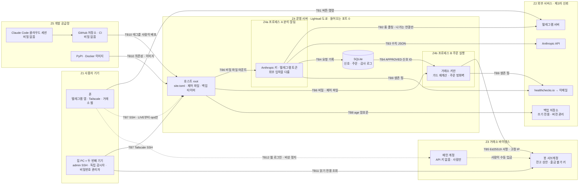

# 보안 설계서 (SECURITY) — BTC/USDT 무기한 선물 반자동 매매 시스템

> **작성일**: 2026-09-29 · **버전**: v1.0 (첫 판) · **상태**: 설계 단계. 코드와 설치는 아직 없음
> **읽는 사람**: 사용자(정보보호 종사자, 코딩 비전문가), 그리고 이 설계로 코드를 쓰고 검토할 Claude 개발·리뷰 세션
> **이 문서의 역할**: 보호 자산, 신뢰 경계, 위협 모델, 통제 목록, 통제↔테스트 대응표, 키·비밀 수명주기, 감사 로그, 사고 대응, 배포 전 점검의 기준 문서다.
> - 숫자 기준값(한도·주기·금액)의 원본은 [PLAN.md](./PLAN.md) §4 결정표다. 이 문서의 숫자는 설명용 사본이다. 서로 다르면 결정표를 따른다 [판정 Q4+F10].
> - **THREAT_MODEL.md와의 관계**: PLAN 0단계 산출물 `docs/THREAT_MODEL.md`는 이 문서의 §1~§4를 초안으로 쓴다. 사용자가 결정 필요 항목(서브계정 잔고 상한 등)과 신뢰 루트 계정 표의 실제 값을 채워 확정한다 [판정 SEC-12].
>
> **관련 문서**: [PLAN.md](./PLAN.md) (기획·결정표, §8 리스크·보안 요약) · [ARCHITECTURE.md](./ARCHITECTURE.md) (부품 C1~C20, 불변조건 I1~I16, G2 시험) · [INFRA.md](./INFRA.md) (하드닝 H1~H23, 비밀 배치, 런북) · [SOFTWARE.md](./SOFTWARE.md) (계정·보안 도구, GitHub 요금제 제약) · [DEV_GUIDE.md](./DEV_GUIDE.md) (바이브코딩 안전 규칙) · [PLAN_REVIEW.md](./PLAN_REVIEW.md) (검토 판정) · [STRATEGY.md](./STRATEGY.md) (차트 기법) · 조사 원자료 [01](../research/planning/01_existing_systems.md) · [03](../research/planning/03_llm_trading.md) · [04](../research/planning/04_exchanges_regulation.md) · [05](../research/planning/05_infra_ops.md) · [06](../research/planning/06_software_stack.md) · [07](../research/planning/07_telegram_hitl.md) · [08](../research/planning/08_risk_backtest.md)
>
> **표기**
> - `[n]`: §10의 출처 번호 · **[직접]** 원문을 직접 열어 확인 · **(검색 요약)** 웹 검색 요약으로만 확인 · **[계산]** 데이터로 직접 계산 · **(추정)** 가정을 둔 값 · **(제안값)** 근거 없는 출발값, 운영하며 조정 · **(분석)** 이 문서의 판단 · **확인 필요** 확인하지 못함(추측하지 않음)
> - **[결정 필요]**: 사용자가 정할 항목. 답이 오기 전까지 추천값을 임시로 적용한다
> - **[판정 SEC-02]** 등: 2026-09-29 기획 검토에서 채택된 지적 번호 · **D8** 등: PLAN 결정표 항목 · **I3**, **C11** 등: ARCHITECTURE의 불변조건·부품 번호 · **H9** 등: INFRA 하드닝 항목 번호

---

## 0. 3분 요약

**설계의 중심 생각**: 채널(텔레그램)이나 서버를 완벽하게 지키려 하지 않는다. **어느 한 곳이 뚫려도 잃는 돈의 상한이 구조로 정해지게** 만든다. 그래서 진짜 방어선은 서버 안이 아니라 거래소 쪽 설정(출금·이체 불가 키, IP 1개 제한, 봇 전용 서브계정, 거래소에 걸어 둔 손절)과 코드 가드(주문 방화벽, 한도)에 둔다 [07 §2.5], [05 §2.5.1].

**공격자별 피해 상한 (요약, 상세는 §2.3)**

| 뚫린 곳 | 공격자가 할 수 있는 것 | 피해 상한 |
|---|---|---|
| 거래소 키만 유출 (서버 밖에서 사용) | 없음 | **0** (IP 제한이 켜져 있다는 전제. 시작할 때마다 자동으로 확인한다) |
| 텔레그램 봇 토큰 | 방해, 피싱 메시지, 매매 정보 열람 | **주문 0**. 피싱에 속으면 메인 계정 위협으로 번진다 |
| 텔레그램 계정 | 대기 중인 신호를 가드 안에서 승인, `/flat` | 내가 모든 신호를 승인한 것과 같다. 1회 ≤ r, 하루 ≤ 한도 |
| 분석·알림 프로세스(A) | 승인 위조 | 하루 약 3r, 누적 약 R 자본의 15%에서 전면 정지 (분석) |
| **서버 root, AWS 계정, 배포된 악성 코드** | 서버에서 직접 서명 | **봇 서브계정 잔고 전액** [판정 SEC-02] |
| 손절 실패 (안전 사고) | — | 포지션 증거금 = R 자본의 20% [08 §2.2] |

**가장 큰 위험 세 가지** (통제 적용 후 잔여 위험 기준, §3.5)
1. **서버 침해 → 서브계정 잔고 전액.** 비밀 관리로는 막지 못한다. 잔고를 작게 유지하는 것(D20 **[결정 필요]**)과 서버 밖 독립 감시자가 핵심이다.
2. **코드 오염.** 사용자가 코드를 읽지 못한다. 그래서 공급망 공격, AI가 지어낸 패키지 이름, 개발 세션의 간접 프롬프트 인젝션, 형식적 리뷰가 모두 가드를 약화시키는 경로가 된다 [판정 SEC-06+F09].
3. **안전 실패.** 손절 누락, 환경 혼동(테스트넷 ↔ 실거래), 설정 실수. 공격자 없이도 돈을 잃는다.

**지금 바로 할 일 (critical)**: GitHub 저장소가 **공개 상태**다(`"private": false`, 2026-09-29 확인) [1]. 유튜브 댓글 원문 138개 파일(작성자 필드 포함)도 올라가 있다. 비밀이 들어가기 전인 지금 비공개로 바꾸는 것이 가장 싸다 (PLAN §11 #8 **[결정 필요]**, 추천: 비공개) [판정 SEC-01].

**이 문서에서 새로 더한 것**
- **거래소 키 권한 자동 검증**: 바이낸스에는 API 키 권한 조회 주소(`GET /sapi/v1/account/apiRestrictions`)가 있다. 응답에 `ipRestrict`, `enableWithdrawals`, `enableInternalTransfer`, `permitsUniversalTransfer`, `enableFutures` 등이 들어 있다 [18][직접]. ccxt에도 이 주소가 있다 [19]. 봇이 켜질 때마다 "IP 제한 켜짐, 출금·이체 꺼짐"을 거래소에서 직접 확인하고, 다르면 잠근다(DT-01). 서브계정 키로 호출할 수 있는지는 **확인 필요**다.
- **프로세스 A 침해의 피해 상한 계산** (§2.3): 주문 실행 프로세스(B)가 한도를 거래소 데이터로 독립 계산하므로, A가 뚫려도 손실은 한도 체계(T1~T5) 안에 묶인다.
- **서브계정 잔고 최소 유지 제안** (§2.3): 서버 침해 피해는 "실제 잔고"다. 잔고를 R 자본 전체가 아니라 필요한 증거금 + 여유분 근처로 두면 침해 피해가 줄어든다 (제안).
- **같은 서버의 staging 위험** (T-B09): LIVE 이후에는 덜 검증된 테스트넷 코드가 실거래 키와 같은 호스트에서 돈다. 필요할 때만 켜거나 인스턴스를 나눈다 (제안).

---

### 0.1 용어 (보안 용어는 생략하고, 매매·개발 용어만 한 줄로 푼다)

| 용어 | 한 줄 설명 |
|---|---|
| 서브계정 | 거래소 메인 계정 아래 따로 만든 계정. 봇이 쓸 돈만 넣어 피해 범위를 나눈다 |
| R 자본 / r | 모든 % 한도의 기준이 되는 금액(서버 설정 상수) / 거래 1건에서 손절 시 잃는 금액의 R 자본 대비 비율 (D8) |
| 1R | 거래 1건에서 손절에 걸렸을 때 잃는 금액 |
| 격리 마진 | 손실이 그 포지션에 맡긴 증거금 안에서만 나도록 분리하는 방식 |
| reduceOnly / closePosition | 포지션을 줄이기만 하는 주문 / 발동하면 포지션 전량을 정리하는 주문 |
| GTD / IOC | 정해진 시각에 거래소가 자동 취소하는 주문 / 즉시 체결 안 된 부분을 바로 취소하는 주문 |
| 롱 폴링 | 봇이 텔레그램 서버에 먼저 "새 메시지 있어?"라고 묻는 방식. 서버에 들어오는 문이 필요 없다 |
| 콜백 데이터 (callback_data) | 텔레그램 버튼을 누르면 봇에게 돌아오는 짧은 문자열(최대 64바이트) [25] |
| 웹훅 | 텔레그램이 봇 서버로 직접 보내는 방식. 공개 수신 주소가 필요해서 쓰지 않는다 |
| Compose secrets | Docker Compose가 비밀을 환경 변수가 아닌 파일(`/run/secrets/…`)로 컨테이너에 넣는 기능 [2] |
| 불변조건 (I1~I16) | "항상 참이어야 하는 규칙". 코드보다 테스트를 먼저 쓴다 (ARCHITECTURE §2.4) |
| 수용 시험 | "이렇게 하면 이렇게 돼야 한다"를 한국어 문장으로 적고 실제로 해 보는 확인 |
| 한도 체계 T0~T5 | 기술 킬(T0) → 24시간 3손절(T1) → 일일(T2) → 주간(T3) → 누적 −10%(T4) → 누적 −15%(T5) (D8) |
| G1~G5 | 다음 단계로 가기 전에 숫자로 통과해야 하는 관문 (D17) |
| slopsquatting | AI가 지어낸 존재하지 않는 패키지 이름을 공격자가 먼저 등록해 두는 수법 |
| fail-closed | 오류가 나면 "주문하지 않는 쪽"으로 멈추는 원칙 |

### 0.2 보안 설계 원칙

| # | 원칙 | 뜻 | 근거 |
|---|---|---|---|
| P1 | **피해 상한 우선** | 각 구역이 뚫렸을 때 잃는 최대치를 먼저 정하고, 그 상한을 거래소 설정과 코드 가드로 만든다 | [07 §2.5], [판정 SEC-02] |
| P2 | **fail-closed** | 확인할 수 없으면 주문하지 않는다. 멈출 때도 거래소의 손절·익절은 지우지 않는다 | [08 §2.6], [05 §2.12] |
| P3 | **들어오는 문 0개** | 텔레그램은 롱 폴링, SSH는 Tailscale, Docker 포트 공개 금지 | [05 §2.4], [3] |
| P4 | **비밀은 필요한 곳에만** | 외부 입력을 다루는 프로세스(A)와 거래소 키를 가진 프로세스(B)를 나눈다 | [판정 SEC-08] |
| P5 | **거래소가 진실의 원천** | 포지션·주문·체결은 거래소 기록을 기준으로 DB를 맞춘다 | [05 §2.11], ARCHITECTURE C13 |
| P6 | **원격으로는 조이는 방향만** | 텔레그램으로는 정지·청산만. 정지 해제와 한도 완화는 서버(LIVE에서는 두 번째 기기)에서만 | [07 §3.4], [판정 SEC-03 수정] |
| P7 | **코드를 읽지 못한다는 전제** | 품질은 diff가 아니라 불변조건 테스트와 수용 시험 결과로 판단한다 | [판정 SEC-06+F09] |
| P8 | **Claude는 권한 없는 조언자** | 도구·주문 권한이 없다. JSON만 출력하고, 가격은 코드가 계산하며, 의견은 섀도로 기록만 한다 | D2·D3, [01 §3.2-4] |

### 0.3 범위

- **포함**: 봇 서브계정과 키, 운영 서버, 텔레그램 승인 채널, Claude 연동, 개발 공급망(Claude Code·GitHub·패키지), 백업·감시, 운영자(사람)의 계정과 기기, 규제 대응.
- **통제 밖 (위험 수용 또는 이전)**: 거래소 자체의 해킹·출금 동결·거래 롤백, 텔레그램·Anthropic·AWS 인프라 자체의 침해. 후보 거래소 5곳 모두 사고 이력이 있다 [04 §2.2]. 이 위험은 "필요한 만큼만 예치"로 줄인다 [04 §3.2-2].

---

## 1. 보호 자산

"지킬 속성"은 기밀성(C)·무결성(I)·가용성(A) 중 이 자산에서 중요한 것이다. "등급"은 잃었을 때의 영향이다(§3.1 척도).

| ID | 자산 | 위치 | 지킬 속성 | 잃으면 | 등급 |
|---|---|---|---|---|---|
| AS-01 | **봇 서브계정 자금** | 바이낸스 USDⓈ-M 서브계정 | I (무단 거래 방지), A | 최대 잔고 전액. 잔고 상한은 D20 **[결정 필요]** | 상 |
| AS-02 | **메인 계정 자금** | 바이낸스 메인 계정 (사람만 사용, API 키 없음) | C·I·A | 거래소에 보관한 전 재산 | 치명 |
| AS-03 | 실거래 API 키 (Ed25519 개인키 + 키 ID) | 서버 `/etc/btcbot/prod/secrets/` (B에만 마운트) | C | 단독 유출은 IP 제한 때문에 쓸 수 없다. 서버와 함께 넘어가면 AS-01 | 상 |
| AS-04 | 테스트넷·데모 키 | 서버 staging 비밀 폴더 | C (낮음) | 가짜 돈. 단 바이비트 데모 키는 실계정에서 만든다 [37]. 거래소를 바꾸면 재평가 | 하 |
| AS-05 | 독립 감시자용 읽기 전용 키 | 집 PC | C | 포지션·잔고 열람 | 하 |
| AS-06 | 텔레그램 봇 토큰 (운영·개발) | 서버 비밀 폴더 (A에만) | C·I | 방해, 피싱, 열람 (§2.3) | 중 |
| AS-07 | 텔레그램 계정 (승인 권한) | 폰 | I | 가드 안 승인, `/flat` | 중 |
| AS-08 | Anthropic 키와 예산 | 서버 비밀 폴더 (A에만), Console | C | 월 지출 한도까지 비용 | 하 |
| AS-09 | **코드 무결성**: 코드 상한, 가드, 주문 방화벽, 불변조건 테스트 | GitHub, 서버 이미지 | I | 가드가 무력화되면 AS-01 | 상 |
| AS-10 | 서버 설정 (`site.toml`: 모드, R 자본, 텔레그램 사용자·채팅 ID, 기대 계정 UID)과 정지 해제 제어 파일 | 서버 `/etc/btcbot/<env>/` | I | 한도 왜곡, 정지 해제 위조 | 상 (root 필요) |
| AS-11 | 신호·승인·주문 상태 (SQLite) | 서버 로컬 볼륨 | I·A | 중복·잘못된 주문(방화벽이 상한) | 중 |
| AS-12 | 감사 로그·세무 기록 | SQLite 추가 전용 테이블 + 백업 | I·A (영구 보존) | 사후 증명 불가, 세무 대응 곤란 | 중 |
| AS-13 | Claude 입출력 기록 | SQLite | I | 성과 평가 오염 | 하 |
| AS-14 | 백업 암호문 / age 개인키 | 서버 밖 저장소 / 비밀번호 관리자 | C·A | 복구 불가, 거래 이력 노출 | 중 |
| AS-15 | **비밀번호 관리자 파일** | 집 PC + 오프라인 사본 | C·A | 모든 비밀 원본과 복구 코드 | 치명 |
| AS-16 | **신뢰 루트 계정** (이메일, GitHub, AWS, Tailscale 로그인 계정, Anthropic, 텔레그램, 통신사, healthchecks) | 외부 서비스 | 인증 무결성 | §2.4 표 | 상~치명 |
| AS-17 | 서버 호스트 (root, docker 그룹) | Lightsail 도쿄 | I | AS-01, AS-03, AS-06~AS-12 전부 | 상 |
| AS-18 | **거래소에 걸린 손절 주문** (안전 기능) | 거래소 | A·I | 최악 손실이 증거금 전액(R 자본의 20%) [08 §2.2] | 상 |
| AS-19 | 경보 경로 (healthchecks 핑 URL, 이메일) | 비밀 폴더, 외부 | I·A | 고장·침해를 늦게 안다 | 중 |
| AS-20 | **사람의 승인 결정 무결성** (본 값 = 주문 값, 주의력) | 사람, 텔레그램 화면 | I | 고무도장 승인, 조작된 화면으로 승인 | 중 |
| AS-21 | 개인·거래 정보 (잔고, 포지션, 계정 UID, 전화번호) | 텔레그램, DB, 로그 | C | 표적 공격 정찰 | 중 |
| AS-22 | 제3자 개인정보 (유튜브 댓글 원문, 작성자 필드) | 저장소 `research/chartpro/raw/details/` (138개 파일) | C | 공개 저장소 게시 | 중 |
| AS-23 | 법적 지위 (회사 규정 준수, 한국 규제 대응) | — | — | 징계, 법적 분쟁 | 상 |

---

## 2. 신뢰 경계

### 2.1 신뢰 경계 다이어그램

아래 그림은 **4단계 이후 완성형**이다. 1~3단계에는 프로세스 B가 없고 서버에 거래소 키도 없다 (ARCHITECTURE §1.3). 점선은 사람이 직접 하는 조작이다.

### 2.2 경계별 상세

| 경계 | 넘어가는 것 | 방향 | 인증·무결성 | 이 경계의 주요 위협 | 주 통제 |
|---|---|---|---|---|---|
| **TB1** 폰 ↔ 텔레그램 | 버튼 클릭, 명령 | 사람 → 텔레그램 | 텔레그램 계정 로그인. **콜백은 텔레그램이 아니라 사용자 앱이 보내므로 값이 조작될 수 있다** [26][직접] | T-C02, T-C06, T-C07 | PV-11, PV-12, PV-28 |
| **TB2** 텔레그램 ↔ A | 업데이트(메시지·콜백), 봇 메시지 | A가 먼저 나감(롱 폴링) | 봇 토큰. 토큰이 요청 URL 경로에 들어간다 [27][직접]. 토큰을 가진 자가 곧 봇이다 | T-C01~C05 | PV-05, PV-10, PV-11, DT-05 |
| **TB3** A ↔ Anthropic | 수치 JSON / 구조화 응답 | A가 나감 | API 키. **응답은 신뢰하지 않는 데이터**로만 다룬다 | T-E01~E06 | PV-21, PV-22, PV-29 |
| **TB4** A ↔ DB ↔ B | 신호, 승인, 명령 대기열, 아웃박스 | 양방향 | **SQLite에는 테이블별 권한이 없다.** A가 `APPROVED`를 직접 쓸 수 있다. 그래서 B는 A가 쓴 값을 "요청"으로만 취급한다 (ARCHITECTURE §1.2) | T-B02 | PV-08, PV-16, PV-20 |
| **TB5** B ↔ 거래소 | 서명된 주문, 조회 | B가 나감 | Ed25519 서명 [17], 고정 IP 1개 | T-A01~A03, T-F03 | PV-02, PV-19, DT-01, DT-02 |
| **TB6** 호스트 → 컨테이너 | 비밀 파일, 설정, 제어 파일 | 호스트 → 컨테이너 | 파일 권한 700/400, 필요한 비밀만 마운트. 제어 파일은 B에만 읽기 전용 | T-B03 | PV-07, PV-08, PV-09 |
| **TB7** 사람 기기 → 호스트 | SSH 세션 | 사람 → 서버 | Tailscale(WireGuard) + SSH 키. LIVE부터 폰은 `ops`(래퍼 스크립트만), PC는 `admin` | T-B04, T-C07 | PV-06, PV-28 |
| **TB8** 호스트 → 백업 저장소 | age 암호문 | 서버 → 밖 | **쓰기 전용** 자격증명, 저장소 버전 관리 | T-H04, T-H05 | PV-32 |
| **TB9** 서버·PC → healthchecks → 이메일 | 생존 핑, `/fail` | 나감 | 핑 URL 자체가 비밀 [15] | T-H06 | DT-04 |
| **TB10** 개발 공급망 → 서버 | 코드 태그, 패키지, 베이스 이미지 | 밖 → 서버 (사람이 당김) | 읽기 전용 배포 키 [13], `uv sync --locked` [7], 이미지 digest | T-D01~D07 | PV-23~PV-27 |
| **TB11** 집 PC ↔ 거래소 | 포지션·주문 조회 | PC가 나감 | 서버와 **다른** 읽기 전용 키 | T-B02, T-A03의 탐지 | DT-03 |
| **TB12** 사람 ↔ 거래소 웹 | 메인 계정 로그인, 키 삭제, 수동 청산, 서브계정 입금 | 사람 → 거래소 | 비밀번호 + 2단계 인증, 피싱 방지 코드 | T-A04, T-G01 | PV-03, PV-28, RS-05 |

### 2.3 공격자·사건별 피해 상한 [판정 SEC-02, SEC-12]

| 공격자·사건 | 얻는 능력 | 피해를 묶는 구조 | 피해 상한 | 이 상한이 성립하는 조건 |
|---|---|---|---|---|
| 거래소 키 단독 유출 (로그·Git·스크린샷 등) | 서버 밖에서 키 사용 시도 | IP 1개 제한, 출금·이체 권한 없음 [04 §3.2-3] | **0** | IP 제한이 실제로 켜져 있다. 시작 점검(DT-01)이 `ipRestrict`를 확인한다 [18] |
| 텔레그램 봇 토큰 유출 | 업데이트 가로채기, 웹훅 전환, 가짜 메시지·버튼, 봇이 보낸 기존 메시지 수정 [07 §2.4] | 버튼에는 랜덤 신호 ID만, 확인 화면은 서버가 새로 계산, 결과 보고는 거래소 응답값 | **주문 0.** 방해·피싱·열람 | 사람이 봇 메시지 속 링크로 거래소에 로그인하지 않는다. 우리 봇은 링크를 보내지 않는다(PV-22) |
| 텔레그램 계정 탈취 | 대기 신호 승인, `/flat`, 메시지 열람 | 하드 가드·방화벽·한도, 해제·완화 불가(I14) | "내가 모든 신호를 승인한 것"과 같다. 1회 ≤ r, 하루 ≤ T1·T2 | 한도를 B가 거래소 데이터로 계산한다 |
| **프로세스 A 침해** (텔레그램·Claude 응답 파서 취약점, A 이미지의 악성 패키지 등) | DB에 `APPROVED` 신호 기록, `commands` 대기열에 `/flat` 기록, 알림 위조, Anthropic 비용 | B의 독립 재계산(G-d)과 방화벽 9항목, B가 거래소 체결·손익 내역으로 계산하는 T1~T5, 제어 파일은 A에 없음 | 거래 1건 ≤ r(+슬리피지). 하루 약 3r(T1: 24시간 3손절 → 다음 날 09:00 KST까지 정지), 최대 −3%/−3R(T2). 누적 −10%에서 r 절반(T4), **−15%에서 전면 정지(T5)**. 해제는 서버에서만. 따라서 **약 R 자본의 15% + 슬리피지** (분석) | ① B가 한도를 A 값이 아닌 거래소 내역으로 계산한다(ccxt 손익 내역 조회 매핑은 **확인 필요**, ARCHITECTURE §2.3) ② A에 `site.toml` 쓰기 권한과 제어 파일이 없다(읽기 전용 마운트, 제안) ③ 주간 리뷰에서 이상 신호를 사람이 본다 |
| **서버 root 침해** (B 포함), **AWS 계정 탈취**, 배포된 악성 코드 | 화이트리스트에 등록된 그 서버에서 직접 서명. 가드를 거치지 않는다. 레버리지·종목도 바꿀 수 있다 | 출금·내부 이체·범용 이체 불가 키, 자동 충전 없음 | **봇 서브계정의 실제 잔고 전액.** 3Commas 사고처럼 출금 없이 거래 권한만으로 자금을 빼낼 수 있다(검색 요약) [39], [01 §2.2] | 키 권한이 올바르다(DT-01). 메인 계정에서 자동으로 채워지지 않는다 |
| GitHub 계정·개발 세션 오염 | 다음 배포에 들어갈 코드 | 사람이 태그를 골라 배포, 수용 시험, 별도 리뷰 세션 | 배포되면 서버 root 침해와 같다 | 배포 전 수용 시험과 리뷰가 실제로 이루어진다 |
| Anthropic 키 유출 | API 사용 | Console 월 지출 한도 | 월 $30 (D19 **[결정 필요]**) | 한도가 설정돼 있다 [35] |
| 백업 쓰기 자격증명 유출 | 업로드 | 쓰기 전용, age 암호문, 버전 관리 | 정보 노출 0, 가용성 영향 작음 | 저장소의 버전 관리·쓰기 전용 권한 지원 (**확인 필요**, PLAN C4) |
| 메인 계정·이메일 탈취 | 계정 전체 | 출금 주소 화이트리스트 + 새 주소 잠금 [04 §2.4] | 거래소 보관 전 재산 | 봇 설계 밖. 신뢰 루트로 관리한다(§2.4) |
| 손절 실패 (API 변경, 버그) | — | 손절 존재 확인·실패 시 청산(I2), 격리 마진 | 포지션 증거금 = R 자본의 20% | 격리 마진, 레버리지 3배 |

**서브계정 잔고 최소 유지 (제안, 분석)**
- 서버 침해의 피해는 "잔고 상한"이 아니라 **그 순간의 실제 잔고**다.
- 결정표 D20은 "R 자본 ≤ 잔고 상한"이고, 판정 Q10은 서브계정 잔고에 "R 자본 × 20% + 여유분 이상"이라는 **하한** 불변조건을 둔다. 사이징은 R 자본 기준이고, 한 포지션에 필요한 증거금은 최대 R 자본의 20%(명목 0.6배 ÷ 3배)다.
- 따라서 실제 잔고를 R 자본 전체가 아니라 **하한 근처**로 두어도 매매는 된다. 여유분은 누적 정지선(−15%)을 버틸 만큼(예: R 자본의 15~20%, 제안값)으로 둔다. 그러면 서버 침해 피해는 약 **R 자본의 35~40%**로 줄어든다(계산 예시).
- 잔고가 하한 아래로 내려가면 B가 신규 진입을 잠근다(fail-closed). 충전은 사람이 메인 계정에서 수동으로 한다. 이익이 쌓이면 사람이 주기적으로 메인 계정으로 옮긴다 [04 §3.2-2]. 워뇨띠에게서 가져오는 "이익 출금 알림"과 같은 방향이다 [판정 Q13].
- 이 운영 방식은 D20 답변과 함께 정한다 **[결정 필요]**.

### 2.4 신뢰 루트 계정·기기 (THREAT_MODEL로 옮길 표)

"신뢰 루트"는 뚫리면 다른 통제를 한꺼번에 무너뜨리는 계정이나 기기다. 모든 계정의 2단계 인증은 **SMS가 아닌 방식**이다 (D15) [판정 SEC-03 수정]. 초안은 [INFRA.md](./INFRA.md) §6.6과 [SOFTWARE.md](./SOFTWARE.md) §2.3에 있고, 여기서 합친다.

| 계정·기기 | 넘어가면 | 2단계 인증 (권고) | 추가 통제 |
|---|---|---|---|
| **이메일** | 다른 계정 비밀번호 재설정, 경보 경로 상실 | 보안키 → 없으면 **폰이 아닌 기기**의 인증 앱 | 복구 코드는 비밀번호 관리자 + 종이. 경보 수신 전용 주소 (제안) |
| 바이낸스 메인 계정 | 전 재산 | 보안키(지원 여부 **확인 필요**) → 인증 앱 | API 키 없음, 출금 주소 화이트리스트 + 새 주소 잠금, 피싱 방지 코드, 월 1회 로그인 기록 확인 [04 §3.2-4, 3.2-9] |
| 바이낸스 봇 서브계정 | 서브계정 잔고 | (메인 계정에서 관리) | 출금·이체 불가 키, IP 1개, 잔고 상한 D20, 수동 매매 금지 |
| **AWS 계정** | 서버 침해와 같다. 스냅샷에 비밀 파일이 들어 있고, 소유자는 스냅샷으로 서버를 복제해 고정 IP를 옮겨 붙일 수 있다 (분석) [INFRA §6.6] | 루트: 보안키 또는 인증 앱 | 루트는 결제에만, 일상용 별도 사용자, 예산 알림, 로그인 알림, 스냅샷 공유 권한 최소 |
| GitHub | 악성 코드가 태그로 배포될 수 있다 | 인증 앱 + 보안키, SMS 미등록. GitHub 문서도 SMS보다 인증 앱을 권한다 [12][직접] | 배포는 사람이 수용 시험 후. Pro면 브랜치 보호 [8][11] |
| Tailscale 로그인 계정 (외부 IdP) | 서버 SSH 경로 | 그 IdP 계정의 2단계 인증 | ACL, LIVE에서 `admin` 재인증(check 모드, 기능명·요금제 **확인 필요**) |
| Anthropic Console | 비용(월 한도까지), 키 발급 | 지원 방식 **확인 필요** | 전용 Workspace 2개(운영·개발), 월 한도 |
| 텔레그램 | 가드 안 승인, `/flat`, 열람 | **2단계 인증 비밀번호** [31][직접] + 유심 보호 | 해제·완화는 텔레그램으로 불가(I14), 전화번호 공개 최소 |
| 통신사 (전화번호) | 문자 인증 가로채기, 텔레그램 로그인 코드 | — | 유심 변경·번호이동 제한 서비스(한국 통신사별 이름은 **확인 필요**) |
| healthchecks.io | 경보 끄기, 가짜 생존 신호 | 지원 방식 **확인 필요** | 핑 URL을 비밀로 다룬다 |
| **비밀번호 관리자** | 모든 비밀 원본 | 강한 마스터 비밀번호 (+ 지원 시 키 파일) | 오프라인 파일, 사본 2곳, 폰에 두지 않음 (제안) [SOFTWARE §2.2] |
| **폰** (기기) | 텔레그램 + (PAPER까지) admin SSH + 이메일 앱 | OS 화면 잠금, 생체 인증 | LIVE부터 폰 SSH는 `ops` 계정만. 잠금 화면 알림 미리보기 끔 [07 §2.5] |
| **집 PC = 두 번째 기기** | LIVE의 `admin` SSH, 비밀번호 관리자, 감시자 키 | OS 로그인, 디스크 암호화(제안) | 감시자 폴더를 로컬 Claude Code 세션이 읽지 못하게 분리 (INFRA §7.7) |

- **보안키 구매**는 **[결정 필요]**다(SOFTWARE §12). 주 키와 예비 키 2개를 권한다. 피싱에 강한 인증(FIDO2)은 T-A04(거래소 피싱)의 가장 강한 통제다(분석).
- 보안키가 없으면 인증 앱을 **폰이 아닌 기기**에 둔다. 폰 하나를 잃었을 때 텔레그램·SSH·거래소가 한꺼번에 넘어가는 것을 막는다 [판정 SEC-03 수정].

---

## 3. 위협 모델

### 3.1 평가 척도 (분석)

| 가능성 | 뜻 |
|---|---|
| **상** | 통제가 없으면 1년 안에 일어난다고 보는 편이 합리적이다. 흔한 실수이거나, 자연히 생기는 사건(중복 클릭, 재시작)이거나, 자동화된 공격이다 |
| **중** | 드물지만 알려진 사례가 있다. 표적이 아니어도 당할 수 있다 |
| **하** | 표적 공격이거나, 여러 통제가 동시에 실패해야 한다 |

| 영향 | 뜻 |
|---|---|
| **치명** | 메인 계정 자금, 또는 신뢰 루트가 연쇄로 무너짐 |
| **상** | 봇 서브계정 잔고 대부분, 또는 법적 지위 |
| **중** | R 자본의 수 %~20% 손실, 며칠 이상 운영 중단, 민감 정보 노출 |
| **하** | 1R 이하 손실, 소액 비용, 일시 중단 |

- 표의 **가능성·영향은 설계 통제를 적용하기 전**(고유 위험)이다. **잔여**는 이 문서의 통제를 모두 적용한 뒤의 판단이다.
- 통제 ID(PV·DT·RS)는 §4에 있다. 사고 대응 플레이북(PB)은 §7에 있다.

### 3.2 공격자·실패 원인 프로필

| 프로필 | 동기·능력 | 주로 노리는 곳 |
|---|---|---|
| 기회주의 외부 공격자 | 자동 스캔, 유출 키 수집, 대량 피싱 | 열린 포트, 공개 저장소의 비밀, 약한 계정 |
| 표적 피싱 공격자 | 암호화폐 보유자를 노린 피싱·SIM 스와프 | 거래소 메인 계정, 이메일, 텔레그램 |
| 공급망 공격자 | 패키지·이미지·액션 오염, AI가 지어낸 이름 선점 | 개발 파이프라인 |
| 간접 프롬프트 인젝션 | 외부 원문에 지시문을 숨김 | Claude Code 개발 세션, (나중에 뉴스를 넣으면) 분석 Claude |
| **나 자신의 실수** | 설정 오류, 환경 혼동, 통제 완화, 비밀 복사 | 설정, 키, 저장소 |
| **기계·외부 변화** | 거래소 API 변경, 장애, 규제 | 손절, 가용성, 접근성 |

### 3.3 STRIDE 요약 매트릭스

칸의 번호는 §3.4의 시나리오 ID다(접두어 `T-` 생략).

| 요소 | S 위장 | T 변조 | R 부인 | I 정보 노출 | D 서비스 거부 | E 권한 상승 |
|---|---|---|---|---|---|---|
| 사람·폰 (텔레그램 계정) | C06, C07 | F10 | C03 | C07, C09 | C08 | — |
| 텔레그램 봇 채널 (토큰) | C05 | C02, C05 | C03 | C05, C09 | C05, C08 | C01 |
| 프로세스 A (분석·알림) | C01 | E01, E03, E04 | H04 | E06, B06 | E02 | B02, E05 |
| 프로세스 B (주문 게이트웨이) | B02 | F02, F09, D09 | C03 | A01 | B07, G03 | A03 |
| SQLite·감사 로그 | — | H04 | H04 | H05 | F07 | — |
| 서버 호스트 | B04 | D07, F06 | — | B06 | B07, B08 | B01, B03, B09 |
| 거래소 계정·키 | A04 | F03 | (거래소 기록 = 외부 증거) | A01 | A06, G01, G03 | A02, A03, A05 |
| 개발 공급망 | D05 | D01~D04, D06, D07 | — | D08, H01, H02 | — | D01 |
| 외부 계정 (AWS·GitHub·이메일·Tailscale) | B04, B05, D05 | — | — | H03 | — | B05 |
| 백업·감시 | H06 | H06 | — | H05 | H06 | — |

### 3.4 시나리오별 위협 표

#### 3.4.1 거래소 키·계정

| ID | STRIDE | 시나리오 | 가능성 | 영향 | 주 통제 | 잔여 |
|---|---|---|---|---|---|---|
| **T-A01** | I→E | **API 키 유출**: 실거래 키가 로그·Git·스크린샷·채팅·Claude 대화·백업으로 서버 밖에 나가 외부에서 사용 시도 | 중 | 하 (IP 제한이 있으면) | PV-02, PV-09, PV-10, PV-23, DT-01, DT-11, RS-06, PB-01 | 하 |
| T-A02 | E | IP 제한·권한 설정 누락(사람 실수). 그러면 T-A01이 곧 거래 권한이 된다. 3Commas 사고는 출금이 아니라 **거래 권한**으로 피해가 났다(검색 요약) [39] | 중 | 상 | PV-02, **DT-01 키 권한 자동 검증** [18], §8.5 체크리스트 | 하 |
| T-A03 | E | 서버에서 키를 써 자금 추출: 유동성이 낮은 종목에서 공격자 계정 주문과 체결시켜 돈을 옮긴다(3Commas식, 분석) | 하 (서버 침해 필요) | 상 (잔고 전액) | PV-01(잔고 최소), PV-02, DT-02, DT-03, RS-04 E5. 거래소 쪽에서 키의 거래 종목을 제한하는 기능이 USDⓈ-M에 있는지는 **확인 필요** | 중 (잔고 상한으로 수용) |
| **T-A04** | S | **거래소 계정 피싱**: 가짜 로그인 페이지, 가짜 지원팀, 가짜 텔레그램 봇 메시지 속 링크로 메인 계정 탈취. 2019년 바이낸스 사고도 사용자 API 키와 2FA 코드가 털린 사례다(검색 요약) [40] | 중 | 치명 | PV-03, PV-28(보안키), PV-22(우리 봇은 링크를 보내지 않음 → 링크가 오면 피싱 신호), DT-14, PB-09 | 중 |
| T-A05 | E | 서브계정에서 메인 계정으로 이동·출금 | 하 | 상 | PV-02(출금·내부 이체·범용 이체 끔), DT-01 | 하 |
| T-A06 | D | 키 만료 규칙으로 인증이 갑자기 끊김(거래소 교체 시: 바이비트 IP 미지정 키 90일, OKX 미사용 14일) [04 §2.4] | 중 (교체 시) | 하 | 키 대장(§5.4), 거래소 설정표 | 하 |

#### 3.4.2 서버·호스팅

| ID | STRIDE | 시나리오 | 가능성 | 영향 | 주 통제 | 잔여 |
|---|---|---|---|---|---|---|
| T-B01 | E | 인터넷에서 서버 서비스를 공격 | 하 (들어오는 포트 0) | 상 | PV-05, PV-06, PV-31, DT-11(외부 포트 스캔) | 하 |
| **T-B02** | E·S | **프로세스 A 침해**(텔레그램·Claude·시세 JSON 파서나 라이브러리 취약점, A 이미지의 악성 패키지) → DB에 `APPROVED` 위조, `/flat` 명령 | 하 | 중 (§2.3: 약 R 자본의 15%) | PV-07, PV-08, PV-16, PV-20, PV-24, DT-10 | 하~중 |
| T-B03 | E | 컨테이너 탈출 → 호스트 root | 하 | 상 | PV-07(non-root, `cap_drop: ALL`, `no-new-privileges`, 읽기 전용 파일시스템), PV-31 | 하 |
| **T-B04** | S·E | **서버 침해 경로 ①**: Tailscale 로그인 계정(IdP) 또는 SSH 키 탈취 → 서버 로그인 | 하~중 | 상 | PV-06, PV-28, DT-14, RS-07, PB-02 | 중 |
| **T-B05** | S·E | **서버 침해 경로 ②**: AWS 계정 탈취 → 스냅샷 복제, 고정 IP 이동, 백업 삭제 | 하~중 (피싱) | 상 | PV-28, PV-32(백업은 다른 회사 저장소 선호), 스냅샷 권한 최소, DT-14, PB-11 | 중 |
| T-B06 | I | 서버 침해 뒤 Anthropic 키·텔레그램 토큰을 밖으로 빼냄. 컨테이너의 나가는 연결은 UFW로 막히지 않는다 [3], (INFRA §3.3) | 하 | 중 | PV-29(월 한도), DT-05. "나중": 나가는 연결 허용목록 프록시(INFRA H23) | 중 |
| T-B07 | D | 서버·리전 장애. 특히 **대기 지정가가 봇이 꺼진 동안 체결** → 손절 없는 포지션 [판정 SEC-05] | 중 | 중 (최악 증거금 = R 자본의 20%) | PV-19(손절 선배치 PoC, 불가하면 IOC), DT-04(위험 상태 약 3분 경보), RS-02 | 하 |
| T-B08 | T | 시계 드리프트 → -1021 오류, 일일 경계 오류 | 중 | 하 | PV-30, DT-07 | 하 |
| T-B09 | E | **LIVE 이후 staging(테스트넷) 코드가 실거래 키와 같은 호스트에서 돈다.** 덜 검증된 코드가 컨테이너 탈출이나 공유 자원으로 호스트에 닿는 경로 (분석) | 하 | 상 | PV-27(staging에도 CI 통과 태그만). **제안**: LIVE 이후 staging은 필요할 때만 켜고 끝나면 내린다. 여유가 되면 staging을 별도 인스턴스로 옮긴다(1GB 월 $7, 추정 [05 §2.14]) | 중 (제안 채택 시 하) |

#### 3.4.3 텔레그램 (계정 탈취·봇 토큰 유출·콜백 위조·재전송)

| ID | STRIDE | 시나리오 | 가능성 | 영향 | 주 통제 | 잔여 |
|---|---|---|---|---|---|---|
| T-C01 | S·E | 다른 사람이 버튼·명령을 씀(봇이 그룹에 초대됨, 메시지 전달). freqtrade 문서도 그룹에서는 모든 구성원이 봇 권한을 갖는다고 경고한다 [24][직접] | 중 | 하 | PV-11, DT-06 | 하 |
| **T-C02** | T | **콜백 위조**: 콜백 데이터에 가격·수량을 넣거나 신호 ID를 추측 | 중 | 하 | PV-12(랜덤 ID만, 파라미터는 DB), PV-14 | 하 |
| **T-C03** | T·R | **재전송·중복**: 빠른 두 번 클릭, 처리 중 재시작으로 같은 `update_id`가 다시 옴 [29], 네트워크 재시도. 바이낸스 `clientOrderId`의 중복 방지는 미체결 주문 사이에서만 보장된다(현물 문서) [21][직접] | 상 (자연 발생) | 중 (위험 2배) | PV-13, G2 시험 #1·#2·#9 | 하 |
| T-C04 | T | 오래된 신호를 늦게 승인 / 승인 지연 동안 가격 변동 | 상 | 하~중 | PV-14(만료 15분, 재검증 R1~R5, GTD) | 하 |
| **T-C05** | S·I·D | **봇 토큰 유출**: `getUpdates` 가로채기(409 충돌), `setWebhook`으로 업데이트 전환, 봇 이름으로 가짜 메시지·버튼·피싱 링크, 봇이 보낸 기존 메시지 수정으로 숫자 위조 [07 §2.4] | 중 | 중 (임의 주문 불가. 피싱 성공 시 T-A04로 번짐) | PV-09, PV-10, PV-12, PV-14, DT-05, RS-03, PB-03 | 하 |
| **T-C06** | S | **텔레그램 계정 탈취**: SIM 스와프, 로그인 코드 피싱, 세션 탈취 | 중 | 중 (가드 안 승인, `/flat`) | PV-15, PV-28, DT-10, PB-04 | 하~중 |
| T-C07 | S·I | 폰 분실·도난: 텔레그램 + SSH + 이메일 앱이 한 기기에 있다 | 중 | 중 (PAPER) / 상 (LIVE에서 폰이 `admin`이면) | PV-06(LIVE부터 폰은 `ops`만), PV-28, 잠금 화면 미리보기 끔, PB-04 | 하~중 |
| T-C08 | D | 텔레그램 장애·지역 제한·전송 한도 초과로 봇 일시 차단 → 승인·`/stop` 불가 | 중 | 하 (거래소 손절이 보호) | RS-04(E4~E6), DT-04 | 하 |
| T-C09 | I | 봇 대화가 텔레그램 서버에 저장됨(봇 대화의 종단간 암호화 여부는 **확인 필요**) → 거래 정보 노출 | 중 | 하 | 메시지에 비밀 없음, 금액 최소 표시, 조회 메시지에 전달 방지(`protect_content`) | 하 (수용) |

#### 3.4.4 공급망·개발 파이프라인

| ID | STRIDE | 시나리오 | 가능성 | 영향 | 주 통제 | 잔여 |
|---|---|---|---|---|---|---|
| **T-D01** | T·E | **악성·탈취 패키지**: 관리자 변경, 이름 비슷한 패키지, 새 버전에 악성 코드. pandas-ta는 원 저장소 404·이력 삭제·관리 주체 변경으로 금지했다 [43], [06 §2.4.1] | 중 | 상 (B 이미지면) / 중 (A) | PV-24, PV-07, DT-13, PB-06 | 중 |
| T-D02 | T | **slopsquatting**: Claude가 지어낸 패키지 이름을 설치 | 중 | 상 | PV-24(허용목록 CI, 새 패키지 체크리스트) | 하 |
| **T-D03** | T | **간접 프롬프트 인젝션**: 개발 세션이 읽은 외부 원문(웹 문서, 유튜브 댓글, 이슈 글)에 숨은 지시문 → 가드를 약화하거나 비밀을 빼내는 코드 | 중 | 상 | PV-26(외부 원문 수집 세션과 주문 코드 세션 분리, 주문 코드 세션에 WebFetch 없음, 별도 리뷰 세션), 불변조건 테스트 | 중 |
| **T-D04** | T | **형식적 리뷰**: 사용자가 diff를 읽지 못해 가드를 약화하는 코드가 병합됨 | 상 | 상 | PV-26(수용 시험 기반 승인, 불변조건 테스트 선작성), PV-17(코드 상한은 설정으로 못 풂) | 중 |
| T-D05 | S·T | GitHub 계정 탈취·저장소 변조 → 다음 배포에서 서버 장악 | 하~중 | 상 | PV-28, PV-27, (Pro) 브랜치 보호 [11], DT-14 | 중 |
| T-D06 | T | CI 공급망: 외부 액션의 태그가 다른 커밋으로 바뀜 → CI 결과 위조 | 하 | 중 (CI에 비밀 없음. 나쁜 코드가 녹색으로 보일 뿐) | PV-25(전체 커밋 SHA 고정) [14] | 하 |
| T-D07 | T | 베이스 이미지 태그가 다른 이미지로 바뀜 | 하 | 상 | PV-25(digest 고정) | 하 |
| T-D08 | I | Claude Code 클라우드 세션에 비밀 입력. 클라우드 환경의 **환경 변수는 그 환경을 쓰는 누구나 읽을 수 있다** [16][직접] | 중 | 중~상 | PV-18(어떤 거래소 키도 넣지 않음, 테스트넷 포함), 픽스처 테스트 | 하 |
| T-D09 | T | ccxt·거래소 API 변경으로 손절 동작이 바뀜. 2025-12-09 Algo 이전 때 freqtrade 손절이 -4120으로 모두 거부됐다 [22][직접] | 중 | 상 | ccxt 버전 고정, staging 회귀 시험 [04 §3.3-5], DT-07 | 하 |

#### 3.4.5 LLM (Claude)

| ID | STRIDE | 시나리오 | 가능성 | 영향 | 주 통제 | 잔여 |
|---|---|---|---|---|---|---|
| T-E01 | T | 숫자 환각, 잘못된 수준 선택 [03 §2.3-①] | 중 | 하 (의견은 섀도) | PV-21(가격은 코드 계산, Claude는 수준 ID를 enum으로만 고름) | 하 |
| T-E02 | D | 거절(`stop_reason: "refusal"`), 잘림, 타임아웃, 지출 한도 도달 [32][35] | 중 | 하 | PV-21(fail-closed: 버튼 없음, "분석 실패" 기록) | 하 |
| T-E03 | T | 서버측 폴백 모델의 답이 승인 버튼까지 감 / 평가 표본이 섞임 [판정 SEC-11] | 중 | 중 | PV-21(응답 `model`이 `claude-opus-5-5`가 아니면 버튼 없음, I10) | 하 |
| **T-E04** | S·T | Claude 자유 텍스트가 공식 메시지처럼 보임: 링크, 서식, 가격 숫자 → 피싱이나 오판 [판정 SEC-11] | 하~중 | 중 | PV-22 | 하 |
| T-E05 | T·E | 입력 경로 프롬프트 인젝션. 지금 입력은 거래소 수치뿐이라 낮다. 뉴스·SNS를 넣는 순간 올라간다. Opus 5.5는 간접 인젝션에 강하지만 외부 텍스트를 태그로 표시하라고 권한다 [34][직접]. 트레이딩 에이전트가 인젝션에 약하다는 연구가 있다(검색 요약) [49] | 하 (현재) | 중 | PV-21(외부 텍스트 입력 없음, 도구 없음, 스키마 강제). 뉴스 거부권(A5)은 G4 이후 "조이는 방향만" 검토 | 하 |
| T-E06 | I | 프롬프트로 민감정보 전송(키, 계좌 ID, 잔고, 개인정보) | 하 | 중 | PV-10(데이터 최소화. 사이징은 코드가 하므로 Claude는 잔고를 알 필요가 없다) [03 §2.5.7] | 하 |
| T-E07 | E | 나중에 Claude에게 주문 도구·MCP를 주는 설계 변경 | 하 | 상 | 원칙 P8, 비범위(PLAN §1.4), 설계 변경은 이 문서 개정 필요 | 하 |
| T-E08 | (안전) | 롱 편향·과신이 사람 판단에 스며듦(자동화 편향) [03 §2.3-③⑥] | 중 | 중 | Claude 의견은 섀도(D3), 코드 메타 필터를 나란히 표시, 반대 근거, DT-10(롱·숏 격차 10%p) | 중 (수용) |

#### 3.4.6 운영 실수·안전

| ID | 시나리오 | 가능성 | 영향 | 주 통제 | 잔여 |
|---|---|---|---|---|---|
| **T-F01** | **환경 혼동**: 테스트넷 설정으로 실키 사용, PAPER인데 실주문, 실계정에서 만든 데모 키 [판정 SEC-07] | 중 | 상 | PV-18(모드는 "키가 어디 있는가"로 결정, PAPER는 개인키를 읽지 않음 I12, 신원 확인, 머리표 `[PAPER]`·`[TESTNET]`·`[LIVE]`), DT-01 | 하 |
| T-F02 | 설정 실수: 레버리지 5, 심볼 오타, r 과다, R 자본 입력 오류 | 중 | 상 | PV-16, PV-17(코드 상한보다 느슨하면 시작 거부, I11), PV-20 | 하 |
| **T-F03** | **손절 누락**: API 변경(-4120), 부분 체결, 파라미터 오류 | 중 | 상 (증거금 전액 = R 자본의 20%) | PV-19(I1, I2), DT-02, DT-07, RS-01, RS-02 | 하 |
| T-F04 | 중복 인스턴스: 실행 프로세스 2개, 같은 토큰에 폴러 2개(409) | 중 | 중 | PV-07(단일 인스턴스, `leases` 테이블), G2 시험 #16 | 하 |
| T-F05 | 봇 계좌에서 사람이 수동 매매 | 중 | 중 | PV-01(봇 전용 서브계정), DT-02·DT-03(우리 주문 ID 접두사 `sig-`가 아닌 주문 탐지) | 하 |
| T-F06 | 포지션 보유 중 배포·재부팅, 잘못된 태그 배포 | 중 | 중 | PV-27(안전 상태 확인), RS-09 | 하 |
| T-F07 | 백업을 복원해 본 적이 없어 복구 실패 | 중 | 중 | 월 1회 복구 연습(INFRA §8.5) | 하 |
| **T-F08** | **불편해서 통제를 스스로 완화**: 정지 해제 남용, 한도 상향, 폰으로 권한 조작 | 중 | 상 | 시간 기반 한도는 다음 날 09:00 KST 자동 해제 [판정 F15], 완화는 PR + 두 번째 기기, 감사 로그의 RELEASE·설정 변경 주간 검토(DT-10) | 중 |
| T-F09 | 잔고 조회 오류로 비율 한도가 틀어짐 [판정 SEC-09] | 하 | 상 | PV-16(코드 상수 절대 상한, 잔고 불일치 잠금) | 하 |
| T-F10 | 고무도장 승인(알림 피로) [01 §2.4] | 상 | 중 | 방해 금지·하루 6건·요약(D5), 반대 근거 표시, DT-10 고무도장 지표 | 중 (수용) |

#### 3.4.7 규제·법

법률·세무 자문이 아니다. 규제 사실은 대부분 검색 요약이다 [42], [04 §2.8].

| ID | 시나리오 | 가능성 | 영향 | 주 통제 | 잔여 |
|---|---|---|---|---|---|
| **T-G01** | **한국의 해외 거래소 웹 차단 시행**(기준 2026-09 말 확정 예정, 검색 요약) → 서버 밖 비상 정지 경로(거래소 웹) 상실. 도쿄 서버는 계속 접속되므로 운영을 이어 가면 "서버 위치로 차단을 우회하는 운영"과 기능상 같아진다 [판정 F05] | 중~상 | 상 | PV-33, RS-11(차단 시 정책, 0단계 문서화), RS-05("합법적으로 동작하는 서버 밖 비상 정지 경로"가 없으면 신규 진입 중지) [판정 SEC-13] | 중 |
| T-G02 | 회사의 임직원 가상자산·파생상품 거래 규정 위반 | **확인 필요** | 상 | 0단계 게이트: 규정이 금지하면 여기서 중단 (PLAN §7.1) | — (확인 후 판단) |
| T-G03 | 서버 IP 국가 차단(바이낸스 451, 바이비트 403). 바이낸스는 미국·캐나다·말레이시아·네덜란드 서버를 막는다 [23][직접] | 하 (도쿄) | 중 | 리전 선택(D11), DT-07, **IP 우회 금지** | 하 |
| T-G04 | 세무 기록 부실 (2027-01-01 과세 방침, 국회 의결 전, 검색 요약) | 중 | 중 | 세무 기록 테이블, 월별 CSV, 감사 로그 (D13) | 하 |
| T-G05 | 신호 제공·타인 계좌 운용으로 미신고 영업으로 오인 | 하 | 상 | 개인용만 운영 (PLAN §1.4, [04 §3.4-1]) | 하 |
| T-G06 | 해외금융계좌 신고 기준(월말 잔액 합계 5억 원) 누락 | 하 | 중 | 월말 잔액 추적 [04 §3.4-5] | 하 |

#### 3.4.8 데이터 노출·무결성

| ID | STRIDE | 시나리오 | 가능성 | 영향 | 주 통제 | 잔여 |
|---|---|---|---|---|---|---|
| **T-H01** | I | **공개 저장소를 통한 정찰**: 설계, 운영 절차, 계정 구조, 감시 방식이 노출된다. 현재 공개 상태다 [1] | 상 (현재) | 중 | PV-23 (저장소 비공개 **[결정 필요]**) | 하 (비공개 전환 시) |
| T-H02 | I | 비밀 커밋. Git 이력은 사실상 영구이고, 공개 저장소면 이미 복제됐다고 가정해야 한다 | 중 | 상 | PV-23(gitleaks를 커밋 전과 CI에서), PB-08 | 하 |
| T-H03 | I | 제3자 개인정보(유튜브 댓글 원문, 작성자 필드)가 공개 저장소에 있음 [판정 SEC-01] | 상 (현재) | 중 | 0단계에서 원문 raw 데이터를 저장소 밖이나 비공개 보관소로 이동 | 하 |
| T-H04 | T·R | 감사 로그·DB 변조·삭제 (버그, A의 오작동, 침입자) | 하 | 중 | §6의 무결성 층 L1~L3 | 하~중 |
| T-H05 | I·D | 백업 유출·삭제 | 하 | 중 | PV-32 | 하 |
| T-H06 | S·T·D | healthchecks 핑 URL 유출 → 가짜 생존 신호로 고장을 가림, `/fail` 남용으로 거짓 경보 | 하 | 중 | 핑 URL을 비밀로 다룸, 생존 보고(DT-09)·독립 감시자(DT-03)와 교차 확인 | 하 |

### 3.5 잔여 위험 순위와 수용

| 순위 | 위협 | 잔여 | 수용 여부와 이유 |
|---|---|---|---|
| 1 | T-B04·B05·D05 (서버 침해 경로) → T-A03 (잔고 전액) | 중 | **조건부 수용.** 비밀 관리로 막을 수 없는 구조적 위험이다. 잔고 최소 유지(§2.3)와 서버 밖 독립 감시자(DT-03), 월 1회 비상 정지 연습(RS-05)이 갖춰져야 LIVE에 들어간다 |
| 2 | T-D03·D04 (코드 오염, 형식적 리뷰) | 중 | 조건부 수용. 수용 시험·불변조건 테스트·별도 리뷰 세션이 실제로 돌아가는지 단계마다 확인한다 |
| 3 | T-A04 (거래소 메인 계정 피싱) | 중 | 보안키 도입 시 하로 내려간다 (**[결정 필요]**) |
| 4 | T-G01 (한국 웹 차단) | 중 | 0단계 정책으로 관리. 비상 경로가 사라지면 신규 진입 중지 |
| 5 | T-D01 (악성 패키지) | 중 | 의존성 최소화(외부 패키지 6개 안팎)와 쿨다운으로 수용 |
| 6 | T-F08·F10 (통제 완화, 고무도장) | 중 | 사람 요인. 자동 해제 설계와 주간 지표로 관리 |
| 7 | T-B09 (staging 동거) | 중 | 제안 채택 시 하 |
| 8 | T-B02 (A 침해) | 하~중 | 한도 체계로 피해 상한이 정해져 수용 |
| 9 | T-E08 (자동화 편향) | 중 | Claude가 관문이 아니므로 수용 (D3 **[결정 필요]**) |

---

## 4. 통제 목록

- **단계**: 이 통제가 켜지는 개발 단계(PLAN §7.1, 0~7).
- **범위**: **필수** = 실거래 전 필수 [판정 F03] · **나중** = G4 이후 · 단계 번호만 있으면 해당 단계부터 적용.

### 4.1 예방 통제 (PV)

| ID | 통제 | 막는 위협 | 구현 위치 | 단계 | 범위 |
|---|---|---|---|---|---|
| PV-01 | **봇 전용 서브계정**, 잔고 상한(D20 **[결정 필요]**), 자동 충전 없음, 잔고 최소 유지(제안), 봇 계좌 수동 매매 금지 | T-A03, T-F05 | 거래소 설정, B의 잔고 하한 검사 | 0 (생성 조건 확인) / 6 | 필수 |
| PV-02 | **거래소 키 발급 규칙**: Ed25519를 **서버에서 생성**하고 공개키만 등록 [17]. 권한은 선물 거래 + 읽기만. 출금·내부 이체·범용 이체·현물·마진은 끔. 서버 고정 IP 1개만 | T-A01, T-A02, T-A05 | 거래소 웹, §5.3 | 6 | 필수 |
| PV-03 | **메인 계정 방어**: API 키 없음, 출금 주소 화이트리스트 + 새 주소 잠금, 피싱 방지 코드, 로그인은 북마크한 주소로만 [04 §3.2-4] | T-A04 | 거래소 웹 | 0 | 필수 |
| PV-04 | 거래소 쪽 계정 모드 고정: One-way, Single-Asset(USDT), 격리, 레버리지 3배 (D6) | T-F02 | 거래소 설정 + 시작 점검 | 4 | 필수 |
| PV-05 | **들어오는 문 0개**: Lightsail 방화벽 인바운드 규칙 0개, UFW 기본 거부, Compose `ports:` 금지(CI 검사), 텔레그램 롱 폴링만 | T-B01 | 서버, CI (INFRA H12·H13·H15) | 1 | 필수 |
| PV-06 | **SSH 접근 통제**: Tailscale 전용, 키 전용, root 로그인 끔. 계정 분리(`admin`/`ops`/`bot`/`backup`), `docker` 그룹은 사실상 root이므로 `admin`만. **LIVE부터** 폰은 `ops`(래퍼 스크립트만), 권한 완화 조작은 두 번째 기기의 `admin`만(ACL·check 모드는 **확인 필요**) [판정 SEC-03 수정] | T-B04, T-C07 | 서버, Tailscale (INFRA H8·H9·H11, §3.5) | 1 / 6 | 필수 |
| PV-07 | **컨테이너 하드닝**: non-root, 읽기 전용 파일시스템, `cap_drop: ALL`, `no-new-privileges`, 메모리 상한, 베이스 이미지 digest 고정, 프로세스별 단일 인스턴스(`leases`, 복제 금지) | T-B02, T-B03, T-F04 | Compose (INFRA H16~H20) | 1 | 필수 |
| PV-08 | **프로세스 분리**: A는 Anthropic 키·텔레그램 토큰만, B는 거래소 키만. 정지 해제 제어 파일은 B에만 읽기 전용. `site.toml`은 읽기 전용 마운트(제안) [판정 SEC-08] | T-B02, T-B06 | Compose, ARCHITECTURE §3.4·§7.1 | 4 | 필수 |
| PV-09 | **비밀 전달**: Compose secrets(파일 마운트, `/run/secrets/…`) [2]. 환경 변수 금지. 비밀 필드는 비밀 파일에서만 읽고 필수 항목으로 선언. pydantic-settings는 기본으로 환경 변수 > dotenv > 비밀 파일 순서이고 비밀 폴더가 없으면 경고만 하기 때문이다 [4][직접]. 디렉터리 700, 파일 400 | T-A01, T-C05 | 서버, C20 | 3 | 필수 |
| PV-10 | **로그·프롬프트 마스킹**: HTTP 디버그 로그 끔(텔레그램 토큰이 URL에 있음 [27]), 헤더·서명·키 모양 문자열 가림, 프롬프트에 키·계좌 ID·잔고·개인정보 없음 | T-A01, T-C05, T-E06 | A·B 로거, C7 | 1 | 필수 |
| PV-11 | **텔레그램 인증**: 숫자 사용자 ID + private 채팅 ID를 **모든 핸들러 앞**에서 검사. @사용자명 사용 금지. 그룹 초대 금지(BotFather 메뉴는 **확인 필요**). `allowed_updates = [message, callback_query]` [30][직접], [07 §2.3] | T-C01 | C10 | 3 | 필수 |
| PV-12 | **콜백 설계**: `v1:<동작>:<랜덤 신호 ID 10자>` (랜덤 50비트, 순번 금지, ASCII, 64바이트 이하) [25]. 가격·수량은 넣지 않고 DB에서 꺼낸다. HMAC 서명은 나중 [판정 F03] | T-C02, T-C05 | C10 | 3 | 필수 |
| PV-13 | **멱등성**: 원자적 상태 전이("현재 상태가 X일 때만", I9), 처리한 `update_id`·콜백 ID 고유 기록, 신호 ID로 정한 `clientOrderId`·`clientAlgoId`, **주문 자동 재시도 금지**(I15), 응답이 끊기면 조회부터, 종료 상태 불변(I8) | T-C03 | C5, C10, C11, C16 | 3 / 4 | 필수 |
| PV-14 | **승인 무결성**: 승인 버튼 유효 15분, 확인 화면 60초(서버가 새로 계산), 클릭·확정 때 마크 가격으로 재검증 R1~R5(괴리 한도 min(0.25×손절 거리, 0.3%)), 화면의 가격·수량·손실액은 코드가 계산해 DB에 저장한 값뿐(I16), 결과 보고는 거래소 응답값 | T-C04, T-C05, AS-20 | C6, C10, ARCHITECTURE §2.3 | 3 | 필수 |
| PV-15 | **권한 비대칭**: 텔레그램으로는 승인·패스·`/pause`·`/stop`(즉시)·`/flat`(2단계)만. 정지 해제, 한도·레버리지·r 변경은 불가(I14). 해제는 서버 제어 파일, 완화는 PR + 태그 배포 [07 §3.4] | T-C06, T-F08 | C10, C11, ARCHITECTURE §7.5 | 3 | 필수 |
| PV-16 | **주문 방화벽** 9항목: 심볼 BTCUSDT 고정, 수량·명목 ≤ 코드 상수 절대 상한(설정으로는 낮추기만), 주문가 마크 가격 ±x%(제안값 1.0%), 방향 = DB 신호, 청산은 reduceOnly·closePosition, 레버리지 ≤ 3·격리·One-way, 잔고 불일치 시 잠금, 신호당 진입 1회·진입 전 포지션 0, 모드 = 키 환경 [판정 SEC-09] | T-B02, T-F02, T-F09 | C11 | 4 | 필수 |
| PV-17 | **설정 4층**: 코드 상한 → 저장소 기본값 → 서버 전용 설정 → 비밀 파일. 아래층은 조이는 방향으로만. 코드 상한보다 느슨하면 시작 거부(I11) | T-D04, T-F02 | C20, ARCHITECTURE §7.1 | 1 | 필수 |
| PV-18 | **환경 분리**: 모드는 "키가 어디 있는가"로 정한다. PAPER는 거래소 개인키를 열지 않는다(I12). 시작 때 접속 주소·계정 UID·서브계정 이름을 확인한다. 모든 알림 첫 줄에 `[PAPER]`/`[TESTNET]`/`[LIVE]`. **Claude Code 클라우드 세션에는 테스트넷을 포함해 어떤 거래소 키도 넣지 않는다** [판정 SEC-07], D15 | T-F01, T-D08 | C20, ARCHITECTURE §7.2·§7.3 | 1 | 필수 |
| PV-19 | **손절 우선 주문 순서**: 진입 → algo STOP_MARKET(`closePosition=true`, `workingType=MARK_PRICE`, `priceProtect=false`, `clientAlgoId`=신호 ID) → `openAlgoOrders`로 존재 확인 → 없으면 즉시 reduceOnly 시장가 청산 (I1, I2, I7) [08 §3.1]. **체결 전 손절 선배치 가능 여부를 4단계 PoC에서 가장 먼저 확인**하고, 불가하면 대기형 지정가를 쓰지 않고 IOC 상한 지정가를 기본으로 한다 [판정 SEC-05] | T-F03, T-B07 | C11, C12 | 4 | 필수 |
| PV-20 | **리스크 한도 T0~T5**를 **B가 거래소 체결·손익 내역으로 직접 계산**한다(A의 값에 기대지 않음). 1회 위험 ≤ r(상한 1.0%), 명목 ≤ R 자본 × 0.6, 최대 1포지션 (I5, I6) (D8) | T-B02, T-C06 | C6, C11 | 4 | 필수 |
| PV-21 | **Claude는 권한 없는 조언자**: 도구·MCP 없음, 구조화 출력으로 JSON 강제 [33], 가격은 코드가 계산하고 Claude는 수준 ID enum만, `stop_reason`이 `end_turn`이 아니거나 스키마·범위 검증 실패·타임아웃이면 버튼 없음(fail-closed), 폴백 모델 응답은 기록만(I10), 실제 응답 모델 ID 저장, 외부 텍스트(뉴스·SNS) 입력 없음 (D2, D4) | T-E01~E03, T-E05, T-E07 | C7, ARCHITECTURE §5.2.4 | 3 | 필수 |
| PV-22 | **LLM 텍스트 정화**: `parse_mode` 없이 평문, URL 제거, 링크 미리보기 끔, 길이 제한(요약 120자 등, 제안값), 4자리 이상 숫자 가림(가격은 코드 값만 보이게) [판정 SEC-11]. **우리 봇은 어떤 메시지에도 링크를 넣지 않는다**(제안) → 사용자는 "봇이 보낸 링크 = 피싱"으로 판단할 수 있다 | T-E04, T-C05, T-A04 | C7, C10 | 3 | 필수 |
| PV-23 | **저장소 보호**: 비공개 전환(**[결정 필요]**, 추천), `.gitignore` 기본 거부(`*.pem *.key *.age keys.txt *.db *.sqlite* backups/ logs/ user_data/ config*.json secrets/`, `site.toml` 추가 제안), gitleaks를 커밋 전과 CI에서, 댓글 원문 raw 데이터 이동, CI에 운영 비밀 없음 [판정 SEC-01]. **주의**: 개인 계정 비공개 저장소는 Free와 Pro 모두 Secret scanning·저장소 단위 push protection을 쓸 수 없다 [9][10][직접]. 그래서 비공개에서는 gitleaks가 주 통제다 (SOFTWARE §7.2) | T-H01~H03, T-A01 | 저장소, CI | 0 | 필수 |
| PV-24 | **의존성 통제**: 허용목록(목록 밖 패키지면 CI 실패), `uv sync --locked`(락파일이 최신이 아니면 오류) [7], `exclude-newer = "7 days"` 쿨다운 [6][직접], 해시(설치 시 검증 동작은 1단계에서 **확인 필요**), pip-audit, Dependabot alerts, 새 패키지 도입 체크리스트(이름 정확성 포함) [SOFTWARE §5.7] | T-D01, T-D02 | CI, 이미지 빌드 | 1 | 필수 |
| PV-25 | **CI·빌드 무결성**: 외부 액션은 전체 커밋 SHA로 고정, `GITHUB_TOKEN` 기본 읽기 전용 [14][직접], 베이스 이미지 digest | T-D06, T-D07 | CI, Dockerfile | 1 | 필수 |
| PV-26 | **바이브코딩 절차 통제**: PR 승인 기준은 한국어 수용 시험 결과, 주문·가드 코드는 작성 세션과 **다른** Claude 리뷰 세션이 검토, 가드 모듈과 불변조건 테스트를 먼저 작성, 외부 원문 수집 세션과 주문 코드 작성 세션 분리(주문 코드 세션에는 WebFetch 없음), 보호 파일(가드·불변조건 테스트·허용목록·CI 설정) 변경은 CI가 PR에 표시(제안). GitHub Pro면 브랜치 보호로 "CI 통과 필수"와 CODEOWNERS를 강제 [8][11] (Pro 구독 **[결정 필요]**, SOFTWARE §12) [판정 SEC-06+F09] | T-D03, T-D04 | 개발 절차, DEV_GUIDE | 1 | 필수 |
| PV-27 | **배포 통제**: CI를 통과한 버전 태그만, 사람이 `deploy.sh`로, 안전 상태(포지션·미체결·승인 대기 0) 확인 후, 서버는 저장소 하나에 대한 읽기 전용 배포 키 [13]. GitHub Actions의 SSH 밀어 넣기·자체 호스팅 러너(검색 요약 [50])·자동 업데이트는 쓰지 않는다 (INFRA §5) | T-D05, T-F06, T-B09 | 서버 스크립트 | 3 | 필수 |
| PV-28 | **신뢰 루트 인증**: SMS가 아닌 2단계 인증, 보안키 2개(**[결정 필요]**), 복구 코드 오프라인, 유심 보호, 텔레그램 2단계 인증 비밀번호 [31], 잠금 화면 알림 미리보기 끔 | T-A04, T-B04, T-B05, T-C06, T-C07, T-D05 | 각 계정 (§2.4) | 0 | 필수 |
| PV-29 | **비용 상한**: Anthropic 전용 Workspace·키·월 한도 $30(운영), 개발 Workspace 분리, AWS 예산 알림 $20 (D19 **[결정 필요]**). 한도에 닿으면 API가 멈춘다 [35] | T-B06, T-E02 | Console, AWS | 0 / 3 | 필수 |
| PV-30 | **시간**: 서버 시간대 UTC, chrony, `recvWindow` 5000(늘리지 않음), 시계 오차 1000ms 초과 시 주문 차단 [21], (INFRA §9) | T-B08 | 서버, C20 | 1 | 필수 |
| PV-31 | **패치**: unattended-upgrades, 자동 재부팅 끔, 재부팅은 안전 상태에서 (INFRA H4, §10.7) | T-B01, T-B03 | 서버 | 1 | 필수 |
| PV-32 | **백업 보호**: age **공개키**로 암호화(개인키는 서버 밖) [5][직접], 호스트 `backup` 사용자의 **쓰기 전용** 자격증명(봇 컨테이너에는 없음), 저장소 버전 관리·객체 잠금(**확인 필요**, PLAN C4), AWS 계정 탈취에 대비해 다른 회사 저장소 선호(분석, **[결정 필요]**) [판정 SEC-10] | T-H04, T-H05, T-B05 | 호스트, 백업 저장소 | 3 | 필수 |
| PV-33 | **규제 준수 운영**: 개인용만, VPN·서버 위치로 차단 우회 금지, 회사 규정 확인, 차단 시 행동 정책 문서화 [판정 F05] | T-G01~G06 | 운영 규칙 | 0 | 필수 |

### 4.2 탐지 통제 (DT)

| ID | 통제 | 탐지하는 것 | 구현 위치 | 단계 | 범위 |
|---|---|---|---|---|---|
| DT-01 | **시작 점검** (재시작·배포·재부팅마다): 시계, 모드 ↔ 비밀 파일, 거래소 접속 주소·계정 UID·서브계정 이름, 계정 모드(One-way·격리·3배·USDT 단일 자산), 설정 ≤ 코드 상한, 포지션마다 손절 존재, 만료 신호 무효화, 텔레그램 `getMe`·`getWebhookInfo`, 정지 상태 복원 (INFRA §7.5). **추가(이 문서)**: 거래소 **키 권한 조회**(`GET /sapi/v1/account/apiRestrictions`) [18][직접] → `ipRestrict = true`, `enableWithdrawals = false`, `enableInternalTransfer = false`, `permitsUniversalTransfer = false`, `enableSpotAndMarginTrading = false`, `enableMargin = false`, `enableFutures = true`가 아니면 잠금. ccxt의 바이낸스 USDⓈ-M 클래스에도 이 주소가 있다 [19]. **확인 필요**: 서브계정 키로 호출 가능한지, 각 필드의 공식 의미(원문 차단), 데모 환경은 sapi 계열을 지원하지 않으므로 [04 §2.5] TESTNET에서는 건너뛸지 | T-A02, T-A05, T-F01, T-F02, T-F03 | C20, C13 | 1 / 4 / 6 | 필수 |
| DT-02 | **대조기**: 포지션·미체결·algo 주문 주기 대조, 손절 존재, 고아 주문, **우리 주문 ID 접두사(`sig-`)가 아닌 주문** 탐지 | T-F03, T-F05, T-A03 | C13 | 4 | 필수 |
| DT-03 | **서버 밖 독립 감시자**: 집 PC, 서버와 다른 읽기 전용 키, 다른 경보 경로(이메일). 우리 것이 아닌 주문, 손절 없는 포지션 탐지. 자기 생존은 healthchecks `watcher` 체크로 [판정 SEC-02] | T-A03, T-B04, T-B05 (서버 침해) | C18 | 5 | 필수 |
| DT-04 | **데드맨 스위치**(healthchecks 체크 4개): 평시 분석 주기 65~75분 안 경보, **포지션·미체결이 있는 동안 1분 핑·약 3분 안 경보**(최소 주기는 오픈소스 코드 기준 60초 [15][직접], 호스팅 서비스 값은 **확인 필요**), 백업, 감시자 | T-B07, T-C08 | C15, INFRA §7.2 | 1 / 4 | 필수 |
| DT-05 | **텔레그램 토큰 이상 탐지**: 5분마다 `getWebhookInfo`(URL이 생기면 이상, 웹훅이 걸리면 폴링이 동작하지 않음 [29]), 예상치 못한 409, 시작 때 `getMe` 대조 | T-C05 | C15 | 3 | 필수 |
| DT-06 | 권한 없는 버튼·명령 시도: 무시 + 감사 로그 + 운영 채팅 경고(상대에게는 응답 안 함) | T-C01, T-C02 | C10 | 3 | 필수 |
| DT-07 | 거래소 오류 코드 감시: 451/403(지역 차단), -4120(주문 유형·Algo 이전), -1021(시계), 429→418(IP 차단) [21][22] | T-D09, T-F03, T-G03, T-B08 | C12, C15 | 1 / 4 | 필수 |
| DT-08 | **매일 거래소 체결 ↔ DB 대조**. 다르면 잠금·경보. 보정은 새 행으로 [판정 SEC-10] | T-H04, T-F05, T-A03 | C13, C16 | 4 | 필수 |
| DT-09 | **09:00 KST 생존 보고**: 가동 시간, 신호·승인·체결 수, 잔고·포지션, **포지션별 손절 존재**, 시계, 디스크, Claude 비용, 마지막 백업, 재부팅 필요, 배포 태그 | 조용한 고장, T-H06 | C15 | 3 | 필수 |
| DT-10 | **주간 보안·행동 리포트**: 승인율, 결정 시간, 만료율, 패스한 신호의 사후 R(고무도장 지표), 롱·숏 격차(10%p 경고), 폴백·거절 수, **권한 없는 시도 수**, **RELEASE·설정 변경 이벤트 목록** | T-F08, T-F10, T-E08, T-B02, T-C06 | C14, C15 | 3 | 필수 |
| DT-11 | **월간 점검**: 거래소 API 키 목록에 모르는 키 없음, 거래소·AWS·GitHub 로그인 기록, 외부 포트 스캔 0개, 비용, 바이낸스 API 변경 이력 [04 §3.2-9], (INFRA §10.10) | T-A01, T-B01, T-D09 | 사람 | 3 | 필수 |
| DT-12 | 비용 감시: Claude 월 비용 예상치 150% 경고, Console 한도 도달 치명, AWS 예산 알림 | T-B06, T-E02 | C15, 외부 | 3 | 필수 |
| DT-13 | 공급망 경보: pip-audit, Dependabot, 허용목록 CI 실패, 보호 파일 변경 표시 | T-D01, T-D02, T-D04 | CI | 1 | 필수 |
| DT-14 | 계정 보안 알림: 거래소·AWS·GitHub·이메일의 새 로그인·새 기기·API 키 생성 알림을 켠다(서비스별 기능은 **확인 필요**) | T-A04, T-B04, T-B05, T-D05 | 각 계정 | 0 | 필수 |
| DT-15 | 설정 스냅샷: 시작할 때 읽은 설정(비밀 제외)을 해시와 함께 `config_snapshots`에 기록 → 설정 변경 추적 | T-F02, T-F08 | C20 | 1 | 필수 |

### 4.3 대응 통제 (RS)

| ID | 통제 | 동작 | 구현 위치 | 단계 |
|---|---|---|---|---|
| RS-01 | **T0 기술 킬** | 손절 조회 실패, -4120, 모드 불일치, 손절 없는 포지션 수 초 초과, 잔고 불일치, 시계 오차 > 1초, 451/418, 웹훅·409 이상, 모르는 주문, EXECUTING 미해결 → **신규 진입 차단, 기존 손절 유지**. 해제는 서버에서만 | C6, C11 | 4 |
| RS-02 | 손절 없음 자동 조치 | 재등록 시도 → 실패하면 즉시 reduceOnly 시장가 청산 + T0 + P1 경보(텔레그램 + 이메일) | C11, C13 | 4 |
| RS-03 | 텔레그램 이상 자동 조치 | 신규 주문 차단, 대기 신호 모두 만료, **이메일로** 경보(healthchecks `/fail` 주소 활용, 제안) [SOFTWARE §2.2-10] | C15 | 3 |
| RS-04 | **긴급 정지 사다리** E1~E6 | `/pause` → `/stop`(미체결 진입 취소, 손절·익절 유지) → `/flat`(2단계) → 서버에서 B 정지 → **거래소 웹에서 API 키 삭제 + 수동 청산** → Lightsail 인스턴스 중지 (INFRA §10.3) | 텔레그램, 서버, 거래소 웹, AWS | 3~6 |
| RS-05 | **서버 밖 비상 정지 경로 월 1회 연습** | 거래소 웹 로그인 → 키 삭제 → 포지션 정리까지 실제로 해 본다(테스트넷 또는 소액). 경로가 없어지면 신규 진입 중지 [판정 SEC-13] | 사람 | 5 |
| RS-06 | 키 폐기·교체 | §5의 절차. **의심되면 발급처에서 먼저 폐기**하고, 그다음 서버에서 지운다 | 사람 | 3 |
| RS-07 | 서버 폐기·재구축 | 침해 의심 시 조사용 스냅샷만 남기고 **다시 켜지 않는다.** 새 이미지로 처음부터 만들고 모든 비밀을 새로 발급 (INFRA §10.8) | 사람 | 5 |
| RS-08 | 백업 복원 + 거래소 기준 보정 | 침해 이전 시점의 백업 버전으로 복원, 빠진 기간은 거래소 내역으로 보정 행 추가 (INFRA §10.9) | 사람 | 3 |
| RS-09 | `rollback.sh` | 직전 태그로 되돌림, 시작 점검 | 서버 | 4 |
| RS-10 | 사고 플레이북 + 탁상훈련 | §7의 PB-01~PB-12, 탁상훈련 4종(키 유출·서버 침해·폰 분실·텔레그램 탈취)과 소요 시간 기록 | 사람 | 5 |
| RS-11 | **차단 시 행동 정책** | 신규 진입 중지 → 보유 포지션은 거래소 손절 또는 수동 정리 → 거래소 이전 또는 중단 결정. IP 우회 금지 (PLAN §11 #9 **[결정 필요]**, 추천 (a)) | 사람 | 0 |
| RS-12 | 낙폭 단계 조치 | T4 누적 −10%: r 절반. **T5 누적 −15%: 전면 정지, 페이퍼로 복귀, 서면 리뷰 후 서버에서만 해제** (D8) | C6, C11 | 4 |

### 4.4 통제 ↔ 테스트 대응표

사용자는 코드를 읽지 않으므로 **이 표의 테스트와 시험이 통과하는지**로 통제가 살아 있는지 판단한다 [판정 SEC-06+F09, SEC-12]. 불변조건 I#은 ARCHITECTURE §2.4, G2 시험 #은 ARCHITECTURE §6.4, H#은 INFRA §4다.

| 통제 | 자동 테스트 (CI) | 수용 시험·점검 (사람이 확인) | 언제 |
|---|---|---|---|
| PV-02 키 권한 | — | DT-01 키 권한 조회 결과가 시작 점검 메시지에 나온다. 거래소 웹 캡처를 키 대장에 첨부(키 값은 가림) | 6단계 전 |
| PV-05 인바운드 0 | `compose.yaml`에 `ports:`가 있으면 CI 실패 | 외부 포트 스캔 결과 열린 포트 0개 (H12, H15) | 1단계, 매월 |
| PV-06 SSH | — | 공인 IP로 22번 접속 → 응답 없음 (H9). LIVE: 폰 `ops`로 `docker ps` → 거부 (H11) | 1단계, 6단계 전 |
| PV-07 컨테이너 | 설정 린트(제안) | 컨테이너 안에서 `/` 쓰기 → 실패 (H16). 실행 프로세스 2개 띄우기 → 두 번째 거부 (G2 #16) | 1·4단계 |
| PV-09 비밀 전달 | 비밀 필드가 환경 변수에서 읽히면 실패하는 테스트(제안) | `docker inspect` 결과에 비밀 값 없음 (제안) | 3단계 |
| PV-10 마스킹 | 로그에 키 모양 문자열이 나오면 실패하는 테스트(제안) | 운영 로그 1일치에서 토큰·키 검색 → 0건 | 3단계 |
| PV-11 텔레그램 인증 | 핸들러 권한 테스트 | 다른 텔레그램 계정으로 버튼 → 무시 + 운영 경고 (G2 #3, PLAN 3단계 시험) | 3단계 |
| PV-12 콜백 | 형식·길이·파라미터 없음 테스트 | — | 3단계 |
| PV-13 멱등성 | I8, I9, I15 | 1초에 두 번 클릭 → 1건 (G2 #1). 확정 직후 B 강제 종료 → 중복 0 (G2 #2). 응답 유실 → 조회로 수렴 (G2 #9) | 3·4단계 |
| PV-14 승인 무결성 | I16, 재검증 R1~R5 단위 테스트 | 16분 뒤 승인 → "만료" (G2 #4). 경계 신호 E+0.1% → IOC 무효·지정가 E 유지 (G2 #6) | 3·4단계 |
| PV-15 권한 비대칭 | I14 | 텔레그램으로 해제·한도 변경 명령 → 거부. 탁상훈련 "텔레그램 탈취" | 3·5단계 |
| PV-16 방화벽 | I3~I7 | 심볼 변경 → 주문 거부. 레버리지 5 → 시작 거부 (G2 #14) | 4단계 |
| PV-17 설정 4층 | I11 | 느슨한 설정으로 `deploy.sh` → 5단계(설정 검증)에서 중단 (INFRA §5.3) | 1·4단계 |
| PV-18 환경 분리 | I12 | Hedge 모드로 바꿔 시작 → 잠금 (G2 #10). PAPER에 개인키 파일 마운트 → 시작 거부. 모든 알림 첫 줄 머리표 | 3·4단계 |
| PV-19 손절 우선 | I1, I2, I7 | 손절 등록 실패 주입 → 수 초 안 청산 + T0 + P1 (G2 #8). **대기 지정가 + 봇 강제 종료 → 손절이 이미 있음** (G2 #7, 불가하면 대기형 금지) | 4단계 (G2) |
| PV-20 한도 | I5, I6, T1~T5 단위 테스트 | 거래소 손익 내역으로 계산한 값과 DB 값 비교 리포트 | 4단계 |
| PV-21 LLM fail-closed | I10 | Claude 응답을 일부러 망가뜨림 → 알림 없이 "분석 실패" (PLAN 3단계 시험). 모델 ID가 다른 녹화 응답 → 버튼 없음 | 3단계 |
| PV-22 텍스트 정화 | URL·마크다운·긴 숫자 제거 테스트 | 링크가 들어간 가짜 Claude 응답 → 평문, 링크 없음 | 3단계 |
| PV-23 저장소 | gitleaks CI | 로그아웃한 브라우저로 저장소 주소 → 안 보임. 가짜 키 문자열 커밋 → 거부 (PLAN 0단계 시험) | 0단계 |
| PV-24 의존성 | 허용목록 검사, `uv sync --locked`, pip-audit | 허용목록 밖 패키지 추가 PR → CI 실패 (PLAN 1단계 시험) | 1단계 |
| PV-25 CI·빌드 | SHA 고정 검사(제안), digest 검사 | 태그만 있는 이미지 없음 (H17) | 1단계 |
| PV-26 개발 절차 | 보호 파일 변경 표시(제안) | 주문·가드 PR에 별도 리뷰 세션 결과 첨부 여부 | 매 PR |
| PV-27 배포 | — | 포지션 보유 중 `deploy.sh` → 경고하고 중단 (INFRA §5.3) | 4단계 |
| PV-30 시간 | 시계 오차 판정 테스트 | 시계를 2초 틀리게 → 주문 차단 (G2 #11) | 4단계 |
| PV-32 백업 | — | 서버 자격증명으로 백업 삭제 시도 → 실패. 월 1회 복원 연습 (INFRA §8.5) | 3단계, 매월 |
| DT-01 시작 점검 | 각 항목 단위 테스트 | 재시작 후 운영 채팅에 10항목 + 키 권한 결과 | 3·4·6단계 |
| DT-02·DT-03 모르는 주문 | — | 거래소 웹에서 수동 주문 → 대조기와 독립 감시자가 모두 경보 (G2 #15) | 4·5단계 |
| DT-04 데드맨 | — | 위험 상태에서 B 강제 종료 → 약 3분 안 이메일 | 4단계 |
| DT-05 토큰 이상 | — | 개발용 봇에 웹훅 걸기 → 신규 주문 차단 + 이메일 (G2 #5) | 4단계 |
| DT-08 체결 대조 | 대조 로직 테스트 | 테스트넷에서 DB 행 하나를 지운 복사본으로 대조 → 불일치 경보 (제안) | 4단계 |
| RS-04 긴급 정지 | — | `/stop` → 미체결 진입 취소, 손절·익절 유지 (G2 #12). `/flat` 2단계 → 전량 청산 (G2 #13) | 4단계 |
| RS-05 서버 밖 정지 | — | 월 1회 연습 기록 | 5단계~ |
| RS-10 탁상훈련 | — | 4종 소요 시간 기록 (§7.7) | 5단계 |

### 4.5 나중 (G4 이후) 통제 [판정 F03]

| 통제 | 효과 | 미루는 이유 |
|---|---|---|
| 감사 로그 해시 체인 + 서버 밖 해시 공증 | 사후 변조 탐지 강화 (§6.4 L4) | 초보자 구현·운영 부담 [판정 SEC-10 일부 연기] |
| 텔레그램 버튼 HMAC | 신호 ID 추측 방지 (심층 방어) | 랜덤 ID + 서버 상태 확인으로 대부분 막힌다 [07 §2.3.3] |
| sops+age | 비밀을 Git에 넣어야 할 때 | 복호화 키가 같은 서버에 있어 서버 침해에는 효과 없음 [판정 SEC-08] |
| 패스키 대시보드 (Tailscale 내부) | 서버 조작의 폰 사용성 | 범위 관리 |
| 컨테이너 나가는 연결 허용목록 프록시 | T-B06 반출 경로 축소 | 라이브러리 프록시 호환 **확인 필요** (INFRA §3.3) |
| B의 신호 독립 재생성 검증 (제안, 분석) | B가 자기 캔들 조회로 규칙 조건을 다시 확인해, A가 없는 신호를 만들어 내는 것을 막는다 → T-B02 잔여를 더 낮춤 | 공용 규칙 모듈을 B에도 넣어야 해서 복잡도가 오른다 |

### 4.6 대체·정정된 권고 (다른 문서와의 관계)

| 원래 권고 | 이 설계의 값 | 근거 |
|---|---|---|
| 05: `.env`(600)로 시작해 실거래 전 sops+age | Compose secrets(파일) + 오프라인 비밀번호 관리자 백업. sops+age는 나중 | [판정 SEC-08], D15 |
| 06: "Claude Code 클라우드 세션에는 테스트넷 키만" | **어떤 거래소 키도 넣지 않는다**(05 기준으로 통일) | [판정 SEC-07], D15 |
| 01: 승인 후 freqtrade REST `/forceenter` 호출(B2) | 자체 주문 게이트웨이 하나(ccxt 직접). freqtrade는 운영망과 분리된 백테스트 전용 | [판정 SEC-04+F04], D10 |
| 07: 텔레그램 탈취 시 "1회 1.2%, 하루 −5%" | D8 값: r 0.5%(G4 0.25%), 일일 −3%/−3R, 24시간 3손절, 누적 −10%/−15% | D8 |
| PLAN D15: "비공개 + Secret scanning + push protection + main 브랜치 보호" | 값은 유지. 다만 개인 비공개 저장소에서는 Secret scanning·저장소 단위 push protection이 불가하고, 브랜치 보호·CODEOWNERS는 Pro가 필요하다 [8]~[11][직접]. 그래서 gitleaks가 주 통제이고 Pro는 **[결정 필요]** | SOFTWARE §7.2 |

---

## 5. 키·비밀 수명주기

### 5.1 원칙

1. **1차 방어선은 비밀 관리 도구가 아니라 키 권한이다.** 출금·이체 불가, IP 1개, 봇 전용 서브계정 [05 §2.5.1].
2. **서버에서 만들 수 있는 키는 서버에서 만든다.** 바이낸스 Ed25519는 개인키를 우리가 만들고 거래소에는 공개키만 준다. 거래소 쪽이 새도 서명을 위조할 수 없다 [17], [04 §2.4].
3. **비밀은 쓰는 프로세스에만 있다.** A는 Anthropic·텔레그램, B는 거래소, 백업 타이머는 백업 자격증명 (PV-08).
4. **환경 변수·채팅·스크린샷·Git·Claude 대화·텔레그램 메시지에 비밀을 넣지 않는다** [2], [04 §3.2-5].
5. **유출이 의심되면 발급처에서 먼저 폐기한다.** 서버에서 지우는 것은 그다음이다. 정기 교체는 겹쳐서(새 키 등록 → 전환 → 옛 키 삭제) 하고, 사고 교체는 겹치지 않는다(폐기 먼저).
6. **값은 기록하지 않고 메타데이터만 기록한다.** 키 대장에는 키 ID 앞부분, 권한, IP, 발급일, 교체 예정일만 적는다.

### 5.2 수명주기 단계 정의

| 단계 | 뜻 | 이 시스템의 기본 규칙 |
|---|---|---|
| 생성 | 키·토큰을 만든다 | 가능하면 서버에서. 불가하면 발급 화면에서 바로 서버 비밀 파일로 (SSH 세션 안에서 붙여 넣기) |
| 등록 | 발급처에 공개키·권한·IP를 설정한다 | 최소 권한. 등록 화면 캡처는 값을 가리고 키 대장에 첨부 |
| 배포 | 서버의 비밀 파일로 옮긴다 | `/etc/btcbot/<env>/secrets/`, 디렉터리 700, 파일 400 |
| 사용 | 프로세스가 읽는다 | Compose secrets로 해당 컨테이너에만 마운트 |
| 백업 | 원본 사본 보관 | 오프라인 비밀번호 관리자. 재발급이 쉬운 것은 백업하지 않는다 |
| 교체 | 정기·사고 교체 | §5.5 주기 |
| 폐기 | 발급처에서 무효화 | 사고 시 가장 먼저 |
| 파기 | 모든 사본 삭제 | 서버 파일, 비밀번호 관리자 항목(교체 이력만 남김) |

### 5.3 비밀별 수명주기

| ID | 비밀 | 생성 | 운영 보관 | 사용 | 원본 백업 | 정기 교체 | 폐기 방법 | 유출 시 |
|---|---|---|---|---|---|---|---|---|
| K-01 | **거래소 실거래 Ed25519 개인키 + 키 ID** | **서버에서 생성**, 공개키만 봇 서브계정에 등록 [17] | `/etc/btcbot/prod/secrets/` 400 | B만 | 오프라인 비밀번호 관리자 (D15) ※ | 분기 1회 (제안) + 의심 즉시 | 거래소 웹 API 관리에서 키 삭제 | PB-01 |
| K-02 | 테스트넷·데모 키 | 서버에서 생성 / 모의 환경 | `/etc/btcbot/staging/secrets/` | staging B만 | 불필요(재발급) | 필요 시 | 모의 환경에서 삭제 | 낮음. 바이비트 데모 키는 실계정 발급이라 거래소 교체 시 K-01급으로 다룬다 [37] |
| K-03 | 독립 감시자 읽기 전용 키 | 거래소 웹 | **집 PC에만**, 사용자 권한 폴더 | 감시자 | 불필요 | 분기 1회 | 거래소 웹 | PB-01 (읽기만) |
| K-04 | 텔레그램 운영 봇 토큰 (+ 운영 알림 봇 토큰, SOFTWARE §2.2 제안) | BotFather | prod secrets | A만 | 비밀번호 관리자 | 정기 교체 없음(의심 즉시) | BotFather에서 재발급(옛 토큰 즉시 무효 여부 **확인 필요**) | PB-03 |
| K-05 | 텔레그램 개발 봇 토큰 | BotFather | staging secrets | staging A만 | 비밀번호 관리자 | 의심 즉시 | 같음 | PB-03 |
| K-06 | Anthropic 운영 키 / 개발 키 | Console `btcbot-prod` / `btcbot-dev` | prod / staging secrets | A만 | 운영 키만 비밀번호 관리자 | 분기 1회 (제안) | Console에서 삭제 | PB-07 |
| K-07 | healthchecks 핑 URL(체크별), API 키 | healthchecks.io | 각 프로세스 secrets / 집 PC | A·B·백업·감시자 각자 | 불필요 | 유출 시 | 대시보드에서 재발급 | PB-02 참고(가짜 생존 신호 가능성) |
| K-08 | 백업 **쓰기 전용** 자격증명 | 저장소 콘솔 | 호스트 `backup` 사용자 전용 파일 (컨테이너에 없음) | 백업 타이머 | 불필요 | 연 1회 (제안) | 콘솔에서 삭제 | PB-12 |
| K-09 | age 키 쌍 | **오프라인 PC**에서 생성 | 서버에는 **공개키만** | 백업 암호화 | 개인키: 비밀번호 관리자 + 오프라인 사본 1개 | 거의 안 함. 바꾸면 옛 개인키도 보관(이전 백업 복호화용) | — | 개인키 유출 시 새 키 쌍, 이후 백업부터 새 공개키 |
| K-10 | GitHub 읽기 전용 배포 키 | 서버에서 생성, 공개키를 저장소에 등록 [13] | 호스트 배포 사용자 `~/.ssh` | `deploy.sh` | 불필요 | 연 1회 (제안) | 저장소 설정에서 삭제 | PB-02 (서버 쪽 유출이면) |
| K-11 | 사람 SSH 키 (폰·PC), Tailscale 기기 등록 | 각 기기에서 생성 | 각 기기 | 사람 | 불필요 | 기기 교체 시 | 서버 `authorized_keys`와 Tailscale 관리 화면에서 제거 | PB-04 |
| K-12 | 비밀번호 관리자 마스터 비밀번호, 2단계 인증 복구 코드 | 사람 | 기억 / 종이 | 사람 | 종이 사본 | 유출 의심 시 | — | 전 계정 순차 재설정 |

※ **K-01 원본 백업에 대한 판단** (SOFTWARE §2.2가 이 문서에 맡긴 쟁점): 결정표 D15대로 원본을 오프라인 비밀번호 관리자에 백업한다. 이 사본은 IP 제한 때문에 서버 밖에서 단독으로는 쓸 수 없어 추가 노출 위험이 작다(분석). 용도는 **같은 리전·같은 고정 IP로 서버를 재구축할 때 재등록 없이 복구**하는 것이다. 단, **침해가 의심될 때는 이 사본을 복원하지 않고 새로 발급한다.**

### 5.4 키 대장 (키 값은 적지 않는다)

비밀번호 관리자 안의 별도 항목이나 저장소 밖 문서로 둔다(제안).

| 필드 | 예 |
|---|---|
| 키 ID | K-01 |
| 발급처·계정 | 바이낸스 / 봇 서브계정 이름 |
| 키 식별자 앞 6자 | (예시 생략) |
| 방식 | Ed25519 |
| 권한 | 선물 거래 + 읽기. 출금·이체·현물·마진 없음 |
| IP 제한 | 서버 고정 IP 1개 |
| 저장 위치 | `/etc/btcbot/prod/secrets/` |
| 발급일 / 다음 교체 예정일 / 폐기일 | — |
| 거래소 만료 규칙 | 바이낸스는 90일 규정이 2026-08-06에 폐지됐다는 요약이 있다(검색 요약) [46]. 거래소를 바꾸면 바이비트 IP 미지정 90일, OKX 미사용 14일 [04 §2.4] |
| 마지막 권한 확인 | DT-01 결과 시각 |

### 5.5 교체 주기 요약

| 비밀 | 정기 | 사고 트리거 |
|---|---|---|
| K-01 거래소 실거래 키 | 분기 1회 (05 권고, 제안) | 로그·Git·채팅 노출, 모르는 키 발견, 서버 침해 의심 |
| K-03 감시자 키 | 분기 1회 | 집 PC 침해 의심 |
| K-06 Anthropic 키 | 분기 1회 (제안) | 비용 이상, 노출 |
| K-04·K-05 텔레그램 토큰 | 없음 | `getWebhookInfo` 이상, 409, 노출 |
| K-08 백업 자격증명, K-10 배포 키 | 연 1회 (제안) | 서버 침해 의심 |
| K-09 age | 거의 안 함 | 개인키 노출 |
| 사람 2단계 인증 수단 | 기기 교체 시 | 분실, 탈취 |

### 5.6 정기 교체 절차 (겹쳐서 교체, 거래소 키 예)

INFRA §10.5의 요약이다. 안전 상태에서 하고, LIVE에서는 두 번째 기기로 한다.
1. `/pause`, 안전 상태(포지션·미체결·승인 대기 0) 확인.
2. 서버에서 새 Ed25519 키 쌍 생성 → 개인키 400 권한 → 공개키만 복사.
3. 거래소 웹에서 봇 서브계정에 새 공개키 등록: 선물 거래 + 읽기만, 서버 IP 1개.
4. 새 키 ID를 비밀 파일에 넣고 **B만** 재시작.
5. 시작 점검 통과 확인: 계정 UID, **키 권한 조회 결과**(DT-01).
6. 거래소 웹에서 **옛 키 삭제**. 키 목록에 모르는 키가 없는지 확인.
7. 비밀번호 관리자 원본 갱신, 키 대장 갱신, 감사 로그에 `KEY_ROTATION` 기록(§6.2).
8. 해제는 서버에서.

### 5.7 사고 교체 (폐기 먼저)

1. **발급처에서 폐기**(거래소 키 삭제 / BotFather 재발급 / Console 키 삭제). 봇이 인증 오류로 멈추는 것은 의도된 동작이다(fail-closed).
2. 포지션이 있으면 거래소 웹에서 손절 존재를 확인하고 필요하면 수동으로 관리.
3. 유출 경로를 찾기 전에는 **같은 경로로 새 키를 배포하지 않는다.** 서버 침해가 의심되면 PB-02로 간다.
4. 새 키 발급 → 배포 → 시작 점검 → 기록.

### 5.8 금지 목록

- 비밀을 환경 변수로 넘기기, Docker 이미지에 굽기, `compose.yaml`에 적기 [2].
- 비밀을 Claude(claude.ai·Claude Code) 대화, 텔레그램, 메모 앱, 스크린샷에 넣기 [04 §3.2-5].
- Claude Code 클라우드 세션 환경 변수에 어떤 비밀이든 넣기 [16].
- 거래 키를 집 PC의 유동 IP에 등록하기 [05 §2.3.3].
- 거래 키에 IP를 여러 개 등록하기(바이낸스는 30개까지 허용하지만 유출 키를 쓸 수 있는 곳이 늘어난다, 검색 요약) (INFRA §3.2).
- 메인 계정에 API 키 만들기.
- 침해가 의심될 때 백업해 둔 옛 키를 복원하기.

---

## 6. 감사 로그 설계 (무결성)

### 6.1 목적

1. **누가, 언제, 무엇을 보고 승인했는지** 사후에 증명한다(내가 누른 게 맞나? — STRIDE의 부인 R).
2. 주문 직전 판정(가드·방화벽·한도)을 **재현**한다.
3. 그때의 설정·코드 버전·모드를 안다.
4. 보안 사건(권한 없는 시도, 토큰 이상, 정지·해제)을 추적한다.
5. 세무 기록의 근거가 된다 (D13).

### 6.2 기록할 이벤트

필드 구조는 ARCHITECTURE §4.3 `audit_log`·`risk_events`를 따른다: `seq`, `ts_ms`(UTC 밀리초), `actor`, `process`, `code_version`, `mode`, `event_type`, `entity_type`/`entity_id`, `from_state`/`to_state`, `payload_json`(민감값 가림), `prev_hash`(나중).

| event_type | 쓰는 쪽 | 필수 내용 | 비고 |
|---|---|---|---|
| `STATE_TRANSITION` | A, B | 신호 ID, 이전·다음 상태, 사유 코드 | 모든 전이 (I9) |
| `GUARD_RESULT` | A(G-a~G-c), B(G-d) | 지점, 입력값 요약(E·S·T1·마크 가격·r·ATR), 통과/실패 항목 | 재현 가능해야 한다 |
| `CLAUDE_CALL` | A | 프롬프트·스키마 버전, 입력 스냅샷 ID, **실제 응답 모델 ID**, `stop_reason`, 토큰 사용량, 폴백 여부 | 원본은 `analyses` 테이블 |
| `BUTTON` | A | `from.id`, `chat.id`, `update_id`, `callback_query_id`, 동작, 결과(허용/거부 사유), **확인 화면에 보여 준 내용의 해시**(제안) | 권한 없는 시도도 기록 (DT-06) |
| `COMMAND` | A → B | 명령, 요청자, 실행 결과 | `/stop` `/pause` `/flat` `/away` |
| `ORDER_REQUEST` / `ORDER_RESPONSE` | B | `clientOrderId`/`clientAlgoId`, 요청 파라미터, 거래소 응답(원문 요약), 지연 시간 | 서명·헤더는 기록하지 않음 |
| `RECONCILE` | B | 대조 결과, 불일치 항목, 보정 행 ID | DT-08 |
| `CONFIG_LOADED` | A, B | 설정 해시, 모드, 코드 버전 | DT-15 |
| `STARTUP_CHECK` | A, B | 10항목 + 키 권한 조회 결과 | DT-01 |
| `ALERT` | A, B | 등급 P1~P4, 코드, 경로(텔레그램/이메일) | — |
| `RELEASE` | B | 해제한 정지, 제어 파일의 사건 ID·사유, 해제 방식(`AUTO`/`SERVER_CONTROL_FILE`) | 주간 검토 대상 |
| `DEPLOY` / `ROLLBACK` | 호스트 스크립트 | 태그, 이미지 digest, 실행자, 결과 | INFRA §5.3 8번 |
| `KEY_ROTATION` / `SECURITY` (제안) | 호스트 래퍼 스크립트 | 키 ID(값 없음), 사유, 사건 ID | 사람의 서버 조치 기록 |

### 6.3 기록 규칙

- **금지 필드**: 키·토큰·서명·요청 헤더·백업 자격증명·2단계 인증 코드. 텔레그램 토큰이 들어간 URL 전체.
- **시각**: UTC 밀리초. chrony로 맞춘 서버 시계를 쓰고, 거래소 서버 시각과의 차이를 `STARTUP_CHECK`에 남긴다.
- **상관 ID**: 신호 ID가 버튼, 주문(`sig-<ID>-e1` 등), 체결, 채점까지 이어지게 한다 [07 §2.3.4].
- **보정은 새 행으로**: 어떤 테이블도 과거 행을 고쳐 "정정"하지 않는다. 보정 행을 추가한다 (INFRA §8.2).
- **A와 B의 구분**: 모든 행에 `process`를 적는다. SQLite는 테이블별 권한을 줄 수 없으므로(ARCHITECTURE §1.2), A가 B 이름으로 행을 쓰는 것은 기술적으로 가능하다. 그래서 **돈과 관련된 사실(주문·체결)의 최종 근거는 거래소 기록**이다(L0).

### 6.4 무결성 층

| 층 | 통제 | 막거나 잡는 것 | 못 막는 것 | 단계 |
|---|---|---|---|---|
| **L0 외부 기록** | 거래소 주문·체결·손익 내역, Anthropic Console 사용량, healthchecks 로그 | 우리 DB와 독립된 증거. 서버 침입자가 바꿀 수 없다 | 텔레그램 승인 기록(텔레그램 쪽 보관 여부 **확인 필요**) | 항상 |
| **L1 DB 트리거** | `audit_log`·`risk_events`에 UPDATE·DELETE가 오면 오류 (I13) [판정 SEC-10] | 앱 버그, A의 오작동으로 인한 수정·삭제 | root 권한 침입자(파일 직접 편집, 트리거 삭제), 거짓 행 **추가** | 3 |
| **L2 매일 거래소 대조** | 거래소 체결 내역 ↔ DB 대조, 다르면 잠금·경보 (DT-08) | 주문·체결 기록의 누락·위조 | 승인·버튼 기록의 위조 | 4 |
| **L3 쓰기 전용 + 버전 관리 백업** | 매일 암호화 백업을 서버 밖에 쌓고, 서버는 지우거나 덮어쓸 수 없음 | 침입 **이전** 상태의 보존. 과거 백업과 비교하면 사후 삭제·수정이 드러난다 | 백업 사이(최대 24시간)의 변조 | 3 (저장소 기능 **확인 필요**) |
| **L4 해시 체인 + 서버 밖 공증** (나중) | 각 행에 이전 행 해시(`prev_hash`), 매일 체인 끝 해시를 이메일·독립 감시자로 보냄 | 백업 사이 변조까지 탐지 | — | G4 이후 [판정 F03] |

- **연속성 점검(제안)**: 매일 대조 때 `seq`에 빈 번호가 있는지 본다. 롤백된 트랜잭션에서 번호가 비는지 등 SQLite 동작은 구현 시 **확인 필요**다. 빈 번호가 생기면 원인을 기록한다.
- **복구 연습과 결합**: 월 1회 복구 연습(INFRA §8.5)에서 복원한 DB와 운영 DB의 `audit_log` 행 수·마지막 `seq`를 비교한다.

### 6.5 보존

ARCHITECTURE §4.5를 따른다: 감사 로그·주문·체결·포지션·세무 기록은 **영구**(세무 법정 보존 기간은 **확인 필요**), Claude 원본 입출력은 최소 90일(가능하면 G3 종료까지), 앱 로그는 약 30일(Docker 로그 10m×5).

### 6.6 검토 절차

| 주기 | 무엇을 보나 |
|---|---|
| 매일 (자동) | 거래소 대조 결과(DT-08), `seq` 연속성, 생존 보고(DT-09) |
| 매주 (주간 리포트, DT-10) | 권한 없는 `BUTTON` 시도 수, `RELEASE` 이벤트 전부, `CONFIG_LOADED` 해시 변화, 폴백·거절 수, `/flat` 사용, 방해 금지 시간대의 승인 |
| 매월 | 거래소 키 목록·로그인 기록과 `KEY_ROTATION` 기록 일치 여부, 복구 연습 비교 |
| 사고 시 | §7.5 증거 목록 |

---

## 7. 사고 대응 절차

### 7.1 원칙

1. **돈부터 멈춘다.** 신규 진입 차단 → 필요하면 키 폐기 → 포지션 확인. 증거 보존은 그다음이지만, 침해 의심 서버는 **재부팅하지 말고** 스냅샷을 먼저 뜬다.
2. **거래소의 손절·익절은 지우지 않는다.** 킬 스위치는 "신규 차단"이고 포지션 정리(`/flat`)와 다르다 [08 §2.6].
3. **발급처에서 먼저 폐기한다** (§5.7).
4. **텔레그램이 의심스러우면 텔레그램을 믿지 않는다.** 경보와 지시는 이메일, 서버, 거래소 웹으로 한다.
5. **모르면 주문하지 않는다.** 재개는 원인을 기록한 뒤 서버(LIVE에서는 두 번째 기기)에서만 한다.
6. 모든 조치에 사건 ID·시각·사유를 남긴다.

### 7.2 심각도

| 등급 | 기준 | 목표 초동 (제안값) |
|---|---|---|
| **SEV1** | 돈이 지금 위험하다: 우리가 만들지 않은 주문, 손절 없는 포지션 + 자동 복구 실패, 서버 침해 의심, 메인 계정 이상 로그인 | 경보 후 **10분 안에 E5**(거래소 웹 키 삭제) 또는 해당 조치 |
| **SEV2** | 보호 장치가 약해졌지만 돈은 직접 위험하지 않다: 토큰 유출, 텔레그램 계정 이상, 공급망 경보, 백업 실패, 감사 로그 불일치 | 1시간 안 |
| **SEV3** | 정보 노출·비용·가용성: Anthropic 비용 이상, 텔레그램 장애, 거래소 점검 | 다음 날까지 |

### 7.3 공통 단계

| 단계 | 할 일 |
|---|---|
| 준비 | 이 플레이북, 거래소 웹 북마크, 두 번째 기기, 비밀번호 관리자 접근, 연락처(거래소·AWS 지원 경로는 **확인 필요**), 월 1회 E5 연습 |
| 탐지·분류 | 경보 출처 확인(DT-01~DT-15), 심각도 판정, 사건 ID 발급 |
| 봉쇄 | 긴급 정지 사다리(RS-04) 중 필요한 단계. 폐기는 발급처에서 먼저 |
| 증거 보존 | §7.5 목록. 침해 의심 서버는 스냅샷 후 네트워크 차단 |
| 제거 | 원인 제거: 키·토큰 재발급, 서버 재구축, 패키지 제거 |
| 복구 | 시작 점검 → 거래소 기준 대조 → 서버에서 해제 |
| 사후 검토 | §7.6 양식. 통제·테스트 추가 여부 결정 |

### 7.4 플레이북

**PB-01 거래소 키 유출 의심** (SEV1~2)
- **트리거**: 키 값이 로그·Git·채팅·스크린샷에 보임, 거래소 키 목록에 모르는 키, 모르는 IP 접근 알림.
- **즉시**: 거래소 웹에서 해당 키 삭제 → 봇은 인증 오류로 T0(의도된 동작) → 거래소 웹에서 포지션·손절 확인.
- **판단**: 유출 당시 IP 제한이 켜져 있었나(마지막 DT-01 기록)? 켜져 있었고 서버 밖 유출이면 피해 0으로 보고 재발급. **꺼져 있었거나 서버 안에서 새어 나갔다면 PB-02로 격상.**
- **복구**: §5.7 → 새 키 발급·등록 → 시작 점검 → 유출 경로 제거(로그 마스킹, `.gitignore` 등) → 키 대장.

**PB-02 서버 침해 의심** (SEV1)
- **트리거**: 우리 주문 ID가 아닌 주문(DT-02·DT-03), 모르는 SSH 세션·Tailscale 기기, 설정·바이너리 변경, 이상한 나가는 연결, AWS·GitHub 이상 알림.
- **0~10분**: 거래소 웹에서 **봇 키 삭제**(E5) → 포지션·미체결 수동 확인·정리 → Tailscale 관리 화면에서 서버 노드 제거.
- **10~30분**: Lightsail에서 **스냅샷 생성 후 인스턴스 중지**(재부팅 금지). Anthropic 키, 텔레그램 토큰, healthchecks 핑 URL, 백업 쓰기 자격증명, GitHub 배포 키를 발급처에서 모두 폐기.
- **1시간 안**: 이메일·AWS·GitHub·Tailscale IdP 로그인 기록 확인, 필요하면 해당 계정도 비밀번호·2단계 인증 재설정. 침입 경로 가설 세우기(공급망? GitHub? AWS? Tailscale? 폰?).
- **복구**: 새 이미지로 새 인스턴스(스냅샷에서 만들지 않음) → 하드닝 체크리스트 → 같은 리전이면 고정 IP 이동(옛 인스턴스는 삭제된 상태에서) → **모든 비밀 새로 발급** → **침해 이전 시점**의 백업 버전으로 DB 복원 → 거래소 기준 보정 → 원인 제거 확인 전까지 LIVE 재개 금지(T5와 같은 서버 해제 절차).
- **손실 확정**: 거래소 내역으로 계산한다(L0).

**PB-03 텔레그램 봇 토큰 유출** (SEV2)
- **트리거**: `getWebhookInfo`에 URL, 예상치 못한 409, `getMe` 불일치, 내가 보내지 않은 봇 메시지.
- **자동**: 신규 주문 차단, 대기 신호 만료, 이메일 경보 (RS-03).
- **사람**: BotFather에서 토큰 재발급 → 비밀 파일 교체 → A만 재시작 → `getWebhookInfo`가 비었는지 확인(공격자 웹훅은 빈 URL로 `setWebhook`해 제거 [29]) → 유출 경로(로그, Git, 백업, 개발 PC) 조사 → 그 기간의 `BUTTON` 기록 검토 → 서버에서 해제.
- **주의**: 그 기간 봇이 보낸 메시지의 링크·숫자는 믿지 않는다. 거래소 로그인은 북마크로만.

**PB-04 텔레그램 계정 탈취·폰 분실** (SEV2, LIVE에서 폰이 `admin`이었다면 SEV1)
- **즉시(두 번째 기기)**: 서버에서 신규 진입 차단(`/pause`와 같은 효과의 래퍼 명령, 제안) → Tailscale 관리 화면에서 폰 기기 제거 → 텔레그램 다른 세션 종료 → 이메일·거래소·GitHub 세션 종료 → 통신사 분실 신고·유심 정지.
- **확인**: 그 기간의 승인·`/flat`·명령 기록. 한도 안의 피해인지 확인(§2.3).
- **복구**: 텔레그램 2단계 인증 비밀번호 변경, 새 기기 등록, 허용 사용자 ID가 바뀌면 `site.toml` 수정. 폰의 SSH 키를 서버 `authorized_keys`에서 제거.

**PB-05 손절 누락·-4120·계정 모드 불일치** (SEV1, 안전 사고)
- **자동**: 재등록 → 실패 시 reduceOnly 시장가 청산 + T0 + P1 (RS-02).
- **사람**: 거래소 웹에서 포지션·손절 확인 → 원인(거래소 API 변경 공지, ccxt 버전, 파라미터) → staging에서 "진입 → 손절 → 청산" 회귀 시험 → 태그 배포 → 서버에서 해제 [04 §3.3-5].

**PB-06 공급망 경보** (SEV2, 실행 흔적이 있으면 SEV1)
- **트리거**: pip-audit 치명, 사용 중 패키지의 악성 버전 보도, 허용목록 밖 패키지 발견, 이미지 digest 불일치.
- **판단**: 운영 이미지에 들어 있나? 실행됐나? → 들어 있고 실행 가능성이 있으면 **PB-02로 격상**(B 이미지면 특히).
- **아니면**: 버전 고정·제거 PR → CI → staging → 배포. 락파일 기준 시각 확인.

**PB-07 Anthropic 키 유출·비용 폭주** (SEV3)
- Console에서 키 삭제 → 새 키 → A 재시작 → 월 한도 확인 → 사용 로그 검토 → 유출 경로 조사. 한도가 피해 상한이다.

**PB-08 저장소에 비밀 커밋** (SEV2)
- **먼저 폐기**: 그 비밀을 발급처에서 폐기·재발급한다. 공개 저장소였다면 이미 복제됐다고 가정한다.
- 이력 정리(강제 푸시 등)는 선택이다. 폐기를 대신하지 못한다.
- 원인: gitleaks가 왜 못 막았는지 규칙 보강.

**PB-09 거래소 계정 피싱 의심** (SEV1)
- **트리거**: 가짜 페이지에 입력했음, 모르는 로그인·기기 알림, 출금 주소 추가 알림.
- **즉시**: 북마크나 공식 앱으로 로그인 → 비밀번호·2단계 인증 재설정 → 모든 세션 종료 → API 키 목록 점검(모르는 키·봇 키 전부 삭제) → 출금 주소 화이트리스트 확인 → 거래소의 계정 동결 기능 사용(기능명 **확인 필요**) → 거래소 지원 연락 → 이메일 계정도 점검.

**PB-10 지역 차단(451/403) 또는 한국 웹 차단 시행** (SEV2)
- **자동**: 모든 거래 기능 정지 (DT-07).
- **사람**: 0단계에서 정한 정책 실행(RS-11). **IP 우회 금지.** 서버 밖 비상 정지 경로가 사라졌으면 신규 진입 중지 상태를 유지한다 [판정 SEC-13].

**PB-11 AWS 계정 탈취 의심** (SEV1)
- 루트 비밀번호·MFA 재설정 → 모르는 사용자·접근 키·스냅샷 공유 제거 → **PB-02 병행**(서버 침해 동급) → 백업이 AWS에 있었다면 다른 곳의 사본 확인.

**PB-12 백업 실패·감사 로그 불일치·변조 의심** (SEV2)
- 신규 진입 잠금 → 거래소 내역 기준으로 보정 행 추가 → 백업 버전 비교 → 원인(버그 vs 침입) 판단 → 침입이면 PB-02.

### 7.5 증거 수집 목록 (침해 의심 시)

- Lightsail 스냅샷(조사용, 켜지 않음)
- 거래소: 주문·체결·손익 내역, API 키 목록, 로그인 기록 (L0)
- 서버(스냅샷에서 오프라인으로): Docker 로그, journald, SSH 인증 로그, `compose.yaml`·이미지 digest, `/etc/btcbot/` 파일 변경 시각, SQLite 파일
- Tailscale 관리 화면의 기기·접속 기록(제공 범위 **확인 필요**)
- AWS 계정 활동 기록(Lightsail에서 제공 범위 **확인 필요**)
- GitHub: 최근 푸시·태그·배포 키 사용 기록
- 텔레그램: 봇과의 대화, 활성 세션 목록
- healthchecks 핑 기록, 이메일 경보
- 서버 밖 백업 버전 목록

### 7.6 사후 검토 양식

| 항목 | 내용 |
|---|---|
| 사건 ID, 등급 | — |
| 타임라인 (UTC와 KST) | 최초 이상 → 탐지 → 봉쇄 → 복구 |
| 영향 | 금액(거래소 기준), 노출된 정보, 중단 시간 |
| 근본 원인 | 기술 / 절차 / 사람 |
| 무엇이 작동했나 / 안 했나 | 통제 ID 기준 |
| 조치 | 새 통제, 새 테스트(§4.4에 행 추가), 문서 수정 |
| 재개 승인 | 서버에서 해제한 시각·기기 |

### 7.7 탁상훈련 (5단계, 실거래 전 필수) [판정 SEC-13]

| 시나리오 | 확인할 것 | 목표 (제안값) |
|---|---|---|
| 거래소 키 유출 | 경보 → 거래소 웹 키 삭제까지. 새 키 발급·등록·시작 점검까지 | 삭제 10분 이내, 재가동 2시간 이내(RTO, INFRA §8.4) |
| 서버 침해 | "잃을 수 있는 최대 = 서브계정 실제 잔고"를 숫자로 확인. PB-02를 끝까지 말로 따라 하기 | E5 10분, 인스턴스 격리 30분 |
| 폰 분실 | 두 번째 기기만으로 PB-04를 할 수 있는가 | 30분 |
| 텔레그램 계정 탈취 | 공격자가 할 수 있는 것(가드 안 승인, `/flat`)과 없는 것(해제·완화)을 테스트넷에서 확인 | — |

---

## 8. 배포 전 보안 점검 체크리스트

단계 번호는 PLAN §7.1이다. 각 항목의 **증거**를 남긴다(스크린샷은 비밀을 가리고, 감사 로그 또는 점검 기록에).

### 8.1 0단계 — 준비·게이트 (코드 전)

- [ ] 저장소 공개 여부 결정(**[결정 필요]**, 추천 비공개) → 비공개면 로그아웃한 브라우저로 주소를 열어 안 보이는지 확인 [1]
- [ ] GitHub Pro 구독 여부 결정(**[결정 필요]**) → Pro면 main 브랜치 보호(CI 통과 필수, 강제 푸시 금지)
- [ ] `.gitignore` 기본 거부 목록 추가, gitleaks 커밋 전 훅 → 가짜 키 문자열 커밋이 거부됨
- [ ] 유튜브 댓글 원문(`research/chartpro/raw/details/`)을 저장소 밖이나 비공개 보관소로 이동 [판정 SEC-01]
- [ ] 신뢰 루트 계정 표(§2.4) 완성: 모든 계정 2단계 인증이 SMS가 아님, 복구 코드 오프라인 보관
- [ ] 보안키 구매 여부 결정(**[결정 필요]**)
- [ ] 텔레그램 2단계 인증 비밀번호, 유심 보호 서비스, 전화번호 공개 최소
- [ ] 바이낸스 메인 계정: 출금 주소 화이트리스트 + 새 주소 잠금, 피싱 방지 코드, API 키 없음
- [ ] 봇 서브계정 생성 조건·개수 한도 확인(**확인 필요**, PLAN C8)
- [ ] 폰 브라우저로 거래소 웹 로그인 → 키 삭제 화면까지 갈 수 있는지 확인 [SOFTWARE §2.2]
- [ ] **회사 임직원 거래 규정 확인** → 금지면 여기서 중단 [판정 F05]
- [ ] 한국 웹 차단 기준 발표 확인, 차단 시 행동 정책 문서화(RS-11)
- [ ] Anthropic Console Workspace 2개와 월 한도, AWS 예산 알림 (D19 **[결정 필요]**)
- [ ] 텔레그램 봇 2개(운영·개발) 생성, 토큰은 비밀번호 관리자에만, 그룹 초대 금지
- [ ] THREAT_MODEL.md 확정(이 문서 §1~§4 + 실제 값)

### 8.2 1단계 끝 — 서버 첫 구축 (거래 키 없음)

- [ ] 도쿄 리전, 고정 IP 부착, 만든 직후 30분 연결 점검(바이낸스 공개 API 451 여부, 텔레그램, Anthropic, 시계) [05 §2.13.2]
- [ ] 하드닝 우선순위 1 전부(INFRA H1~H22 중 해당 항목): UTC·chrony, 자동 보안 업데이트, SSH 키 전용·root 금지, **Tailscale 접속 확인 뒤** Lightsail SSH 규칙 삭제, UFW, 인바운드 0
- [ ] 외부 포트 스캔 결과 0개 기록
- [ ] Docker: `ports:` 없음, non-root, 읽기 전용, `cap_drop: ALL`, `no-new-privileges`, digest 고정, 로그 10m×5
- [ ] 비밀 디렉터리 700/400, Compose secrets, 환경 변수에 비밀 없음
- [ ] CI: 허용목록 검사, `uv sync --locked`, pip-audit, gitleaks, 액션 SHA 고정, `GITHUB_TOKEN` 읽기 전용, 저장소 Secrets에 운영 비밀 없음
- [ ] healthchecks `prod-analysis`·`prod-backup` 체크, 경보는 이메일
- [ ] 코드에 어떤 키도 없음(PLAN 1단계 시험)

### 8.3 3단계 — PAPER 운영 시작 (Anthropic 키·운영 봇 토큰 투입)

- [ ] 모드 `PAPER`, 거래소 개인키 파일 없음(I12), 모든 알림 첫 줄 `[PAPER]`
- [ ] 텔레그램: 다른 계정으로 버튼 → 무시 + 운영 경고, 두 번 클릭 → 1건, 16분 뒤 승인 → 만료
- [ ] `getWebhookInfo` 5분 점검, `getMe` 대조, HTTP 디버그 로그 꺼짐
- [ ] Claude: 망가진 응답 → "분석 실패"·버튼 없음, 폴백 모델 응답 → 버튼 없음, 텍스트에 링크·서식 없음
- [ ] 백업: age 공개키 암호화, 쓰기 전용 자격증명(서버에서 삭제 시도 → 실패), 버전 관리 확인(**확인 필요** C4), 첫 복원 연습
- [ ] 09:00 KST 생존 보고 수신
- [ ] 서버 배포는 CI 통과 태그 + `deploy.sh`만

### 8.4 4단계 — TESTNET·G2 (테스트넷 키, 프로세스 분리)

- [ ] 프로세스 A/B 분리, 비밀 마운트 확인(A에 거래소 키 없음, B에 텔레그램 토큰 없음), 제어 파일은 B만 읽기 전용
- [ ] 테스트넷 키는 staging 비밀 폴더에만, 서버 IP 제한
- [ ] **PoC 최우선: 체결 전 closePosition 손절 선배치 가능 여부**(PLAN C1) → 불가하면 대기형 지정가 금지
- [ ] ARCHITECTURE §6.4 G2 시험 16개 전부 통과. 합격 조건: 손절 존재 조회 100%, 손절 없는 포지션 0건, 중복 주문 0건, 시나리오 7(대기 중 체결 + 봇 종료) 통과
- [ ] 위험 상태 데드맨(`prod-risk`) 약 3분 안 경보 확인
- [ ] 주문·가드 코드는 별도 Claude 리뷰 세션이 검토한 기록
- [ ] countdownCancelAll은 algo 손절까지 지우는지 확인하기 전에는 쓰지 않음 (PLAN C2)
- [ ] **0단계 법·규정 게이트를 통과한 상태**

### 8.5 6단계 — LIVE 진입 전 (실거래 키 발급 직전과 직후)

전환 조건 D17 (1)~(5)가 모두 충족돼야 한다. 아래는 그중 보안 항목이다.

- [ ] 서브계정 잔고 상한 결정(D20 **[결정 필요]**), 자동 충전 없음, 실제 입금액은 하한 근처(§2.3 제안)
- [ ] 실거래 키: **서버에서 Ed25519 생성**, 공개키만 등록, 선물 거래 + 읽기만, 출금·내부 이체·범용 이체·현물·마진 끔, 서버 고정 IP 1개
- [ ] **시작 점검의 키 권한 조회 결과**(`ipRestrict`·`enableWithdrawals`·`permitsUniversalTransfer` 등)가 기대값과 같음 [18] (서브계정 호출 가능 여부 **확인 필요**, 불가하면 거래소 웹 화면을 사람이 확인하고 기록)
- [ ] 거래소 쪽 계정 모드: One-way, USDT 단일 자산, 격리, 레버리지 3배
- [ ] 키 대장 작성, 원본 백업(K-01 ※)
- [ ] 서버 밖 독립 감시자(DT-03) 가동: 거래소 웹 수동 주문 → 이메일 경보 확인
- [ ] 서버 밖 비상 정지 경로가 합법적으로 동작하고 **이번 달 연습 기록**이 있음 [판정 SEC-13]
- [ ] 탁상훈련 4종 완료, 소요 시간 기록
- [ ] Tailscale: 폰 → `ops`, PC → `admin`, `admin` 재인증 (SEC-03 수정, 기능 **확인 필요** C10). 폰 `ops`로 `docker ps` → 거부
- [ ] staging 운영 방침 결정(T-B09 제안: 필요할 때만 켜기 또는 별도 인스턴스)
- [ ] r = 0.25%(G4), 모든 알림 첫 줄 `[LIVE]`
- [ ] 회사 규정 확인 결과, 차단 시 정책 문서, THREAT_MODEL 최신

### 8.6 매 배포 전 (릴리스마다)

- [ ] CI 녹색(테스트, 불변조건, gitleaks, pip-audit, 허용목록)
- [ ] PR에 한국어 수용 시험 결과가 있다. 주문·가드·방화벽·한도·설정 로더가 바뀌었으면 **별도 리뷰 세션 결과**가 있다
- [ ] 새 패키지가 있으면 도입 체크리스트 통과 기록(이름 정확성 포함)
- [ ] staging에서 진입 → 손절 존재 → 청산 한 바퀴 (4단계 이후, ccxt 변경 시 필수)
- [ ] 안전 상태(포지션·미체결·승인 대기 0) 또는 긴급 수정 절차
- [ ] 배포 후 시작 점검 메시지 확인, 1시간 관찰, `DEPLOY` 감사 로그 기록

### 8.7 정기 점검

| 주기 | 항목 |
|---|---|
| 매주 | 주간 리포트(DT-10): 권한 없는 시도, RELEASE, 설정 변경, 고무도장 지표, 롱·숏 격차 |
| 매월 | E5 비상 정지 연습, 백업 복원 연습, 거래소 API 키 목록·로그인 기록, 바이낸스 API 변경 이력, 외부 포트 스캔, 비용, 키 대장 교체 예정일, 재부팅 대기 7일 초과 여부 (INFRA §10.10) |
| 분기 | 거래소 키·감시자 키·Anthropic 키 교체, 스냅샷으로 임시 인스턴스 띄워 보기(비밀 파일 먼저 삭제), 한국 규제·입금 경로 공지 확인 [04 §3.4-4], 이 문서의 위협 표 재평가 |

---

## 9. 결정 필요 · 확인 필요

### 9.1 사용자 결정 (보안 관련)

| # | 질문 | 추천 | 출처 |
|---|---|---|---|
| 1 | 저장소를 비공개로 바꿀까요? | 비공개. 공개를 유지하면 설정·ID·런북을 별도 비공개 저장소나 서버에만 두는 "공개 전제 설계"가 필요 | PLAN §11 #8 |
| 2 | 비공개로 바꾸면 GitHub Pro를 구독할까요? | 구독. "CI가 실패하면 병합 불가"를 강제하는 가장 싼 장치 (가격 **확인 필요**) | SOFTWARE §12 |
| 3 | 봇 서브계정 잔고 상한은 얼마로 할까요? 실제 잔고를 하한 근처로 둘까요? | 잃어도 생활에 지장 없는 금액을 상한으로, 실제 잔고는 R 자본 × 20% + 여유분 근처(제안) | D20, §2.3 |
| 4 | 보안키(FIDO2)를 살까요? | 주·예비 2개. 거래소·이메일·GitHub·AWS에 등록 | §2.4 |
| 5 | 백업 저장소를 AWS와 다른 회사로 둘까요? | "쓰기 전용 + 버전 관리"를 만족하면 다른 회사 우선 | INFRA §8.3 |
| 6 | LIVE 이후 staging을 어떻게 운영할까요? | 필요할 때만 켜기. 여유가 되면 별도 인스턴스 | T-B09 |
| 7 | 한국 차단 시 행동 정책 | (a) 신규 진입 중지 → 포지션 정리 → 이전 또는 중단 | PLAN §11 #9 |
| 8 | 월 예산 상한 | Anthropic $30, AWS 알림 $20 | PLAN §11 #10 |

### 9.2 확인 필요 (PoC·조사로 해결)

| # | 확인할 것 | 언제 | 영향 |
|---|---|---|---|
| S1 | 바이낸스 **서브계정 키로 `GET /sapi/v1/account/apiRestrictions`를 호출할 수 있는지**, 각 필드의 공식 의미 [18] | 4~6단계 | DT-01 키 권한 자동 검증 |
| S2 | USDⓈ-M 키의 **거래 종목 제한 기능** 유무 | 6단계 전 | T-A03 서버 침해 시 자금 추출 경로 축소 |
| S3 | 체결 전 closePosition 손절 선배치 가능 여부 (PLAN C1) | 4단계 최우선 | T-B07, 진입 방식 |
| S4 | countdownCancelAll이 algo 손절도 지우는지 (C2) | 4단계 | 사용 여부 |
| S5 | healthchecks.io 호스팅 서비스의 최소 주기 (C3) | 3단계 | DT-04 |
| S6 | 백업 저장소의 쓰기 전용 권한·버전 관리·객체 잠금 (C4) | 3단계 | L3, PV-32 |
| S7 | 바이낸스 읽기 전용 키의 IP 제한 정책 (C5) | 5단계 | DT-03 |
| S8 | Tailscale ACL·SSH check 모드 기능명과 요금제 (C10) | 5단계 | PV-06 |
| S9 | BotFather 토큰 재발급 시 옛 토큰 즉시 무효 여부, 그룹 초대 금지 메뉴 | 3단계 | PB-03, PV-11 |
| S10 | 텔레그램 업데이트 서버 보관 기간(24시간 문구), 봇 대화 저장·암호화 방식 | 3단계 | RS-04, T-C09 |
| S11 | ccxt의 바이낸스 손익 내역(income) 조회 매핑 | 4단계 | PV-20, §2.3 A 침해 상한의 전제 |
| S12 | `uv.lock` 설치 시 해시 검증 동작 | 1단계 | PV-24 |
| S13 | 선물 `clientOrderId`가 체결 후 재사용되는 규칙 (C13) | 4단계 | PV-13 |
| S14 | 거래소·AWS·GitHub·이메일의 로그인·API 키 생성 알림 기능 | 0단계 | DT-14 |
| S15 | Lightsail·Tailscale의 활동 기록 제공 범위 | 5단계 | §7.5 |
| S16 | 한국 통신사 유심 보호 서비스 이름·신청 방법 | 0단계 | PV-28 |
| S17 | 세무 기록의 법정 보존 기간 | 실거래 전 | §6.5 |

---

## 10. 출처

**저장소·GitHub**
1. GitHub API — 저장소 공개 여부(`"private": false`, `"visibility": "public"`) — https://api.github.com/repos/anthonynoh5202/1111 [직접, 2026-09-29 검토 단계 재확인, 판정 SEC-01]
8. GitHub 요금제(개인 Free·Pro, 비공개 저장소의 브랜치 보호·CODEOWNERS는 Pro) — https://raw.githubusercontent.com/github/docs/main/content/get-started/learning-about-github/githubs-plans.md [직접, SOFTWARE S4]
9. GitHub Secret scanning 제공 범위 — https://raw.githubusercontent.com/github/docs/main/data/reusables/gated-features/secret-scanning.md [직접, SOFTWARE S6]
10. GitHub push protection — https://raw.githubusercontent.com/github/docs/main/content/code-security/concepts/secret-security/push-protection.md [직접, SOFTWARE S7]
11. GitHub 브랜치 보호·CODEOWNERS 제공 범위 — https://raw.githubusercontent.com/github/docs/main/data/reusables/gated-features/protected-branches.md · https://raw.githubusercontent.com/github/docs/main/data/reusables/gated-features/code-owners.md [직접, SOFTWARE S5]
12. GitHub 2단계 인증(인증 앱 권장, 보안키 추가) — https://raw.githubusercontent.com/github/docs/main/content/authentication/securing-your-account-with-two-factor-authentication-2fa/configuring-two-factor-authentication.md [직접, SOFTWARE S9]
13. GitHub 배포 키(기본 읽기 전용, 저장소 하나) — https://raw.githubusercontent.com/github/docs/main/content/authentication/connecting-to-github-with-ssh/managing-deploy-keys.md [직접, SOFTWARE S10]
14. GitHub Actions 안전한 사용(액션 SHA 고정, `GITHUB_TOKEN` 최소 권한) — https://raw.githubusercontent.com/github/docs/main/content/actions/reference/security/secure-use.md [직접, SOFTWARE S12]
50. GitHub 자체 호스팅 러너 위험 — https://docs.github.com/en/actions/concepts/security/compromised-runners (검색 요약, 05 문서)

**컨테이너·설정·도구**
2. Docker Compose secrets(환경 변수는 모든 프로세스에 보이고 로그에 찍힐 수 있음, `/run/secrets/<이름>`) — https://raw.githubusercontent.com/docker/docs/main/content/manuals/compose/how-tos/use-secrets.md [직접]
3. ufw-docker(Docker가 UFW를 우회, 컨테이너의 나가는 연결) — https://github.com/chaifeng/ufw-docker [직접, 05 문서]
4. pydantic-settings(`secrets_dir`, 우선순위 환경 변수 > dotenv > 비밀 파일, 없는 폴더는 경고만) — https://raw.githubusercontent.com/pydantic/pydantic-settings/main/docs/index.md [직접, ARCHITECTURE I3]
5. age(공개키로 암호화, 개인키로 복호화) — https://raw.githubusercontent.com/FiloSottile/age/main/README.md [직접, ARCHITECTURE I7]
6. uv 해석 규칙(`exclude-newer`, 쿨다운, 해시) — https://raw.githubusercontent.com/astral-sh/uv/main/docs/concepts/resolution.md [직접]
7. uv 동기화(`--locked`) — https://raw.githubusercontent.com/astral-sh/uv/main/docs/concepts/projects/sync.md [직접, SOFTWARE S3]
15. healthchecks 오픈소스 코드(timeout·grace 최소 60초, `/fail` 주소) — https://raw.githubusercontent.com/healthchecks/healthchecks/master/hc/front/forms.py · https://raw.githubusercontent.com/healthchecks/healthchecks/master/hc/api/urls.py [직접, SOFTWARE S15]
16. Claude Code 클라우드 환경(환경 변수는 그 환경 사용자 누구나 읽을 수 있음) — https://code.claude.com/docs/en/cloud-environments [직접, 05 문서]
43. pandas-ta 원 저장소(HTTP 404) — https://github.com/twopirllc/pandas-ta [직접, 06 문서]
44. PagerDuty "Alerting Principles" — https://raw.githubusercontent.com/PagerDuty/incident-response-docs/master/docs/oncall/alerting_principles.md [직접, 07 문서]
45. Tailscale 무료 요금제 — https://costbench.com/software/business-vpn/tailscale/free-plan/ (검색 요약, 05 문서)

**거래소**
17. 바이낸스 API 키 종류(Ed25519 권장, HMAC 폐기 예정) — https://raw.githubusercontent.com/binance/binance-spot-api-docs/master/faqs/api_key_types.md [직접, 04 문서]
18. 바이낸스 공식 지갑 SDK — API 키 권한 조회 `GET /sapi/v1/account/apiRestrictions`(Weight 1, USER_DATA)와 응답 필드(`ipRestrict`, `enableReading`, `enableWithdrawals`, `enableInternalTransfer`, `enableMargin`, `enableFutures`, `permitsUniversalTransfer`, `enableSpotAndMarginTrading` 등) — https://raw.githubusercontent.com/binance/binance-connector-python/master/clients/wallet/src/binance_sdk_wallet/rest_api/api/account_api.py · https://raw.githubusercontent.com/binance/binance-connector-python/master/clients/wallet/src/binance_sdk_wallet/rest_api/models/get_api_key_permission_response.py [직접, 이 문서 작성 중. 필드의 공식 설명 페이지는 차단되어 **확인 필요**]
19. ccxt 바이낸스 USDⓈ-M 암묵 API 정의에 `account/apiRestrictions` 포함 — https://github.com/ccxt/ccxt/blob/master/python/ccxt/abstract/binanceusdm.py [GitHub 코드 검색으로 문자열 존재 확인, 이 문서 작성 중]
20. 바이낸스 USDⓈ-M 공식 SDK `trade_api.py`(algo 주문, GTD, `newClientOrderId` 형식, closePosition) — https://raw.githubusercontent.com/binance/binance-connector-python/master/clients/derivatives_trading_usds_futures/src/binance_sdk_derivatives_trading_usds_futures/rest_api/api/trade_api.py [직접, 07·08 문서]
21. 바이낸스 REST 문서(clientOrderId 재사용 규칙, recvWindow, 429/418) — https://raw.githubusercontent.com/binance/binance-spot-api-docs/master/rest-api.md [직접, 05·07 문서]
22. freqtrade 이슈 #12610(바이낸스 -4120, 2025-12-09 Algo 이전으로 손절 실패) — https://github.com/freqtrade/freqtrade/issues/12610 [직접]
23. freqtrade 거래소 문서(바이낸스 서버 국가 차단, One-way·Single-Asset 필수) — https://raw.githubusercontent.com/freqtrade/freqtrade/develop/docs/exchanges.md [직접]
37. 바이비트 데모 트레이딩 문서(실계정에서 데모 키 생성) — https://raw.githubusercontent.com/bybit-exchange/docs/main/docs/v5/demo.mdx [직접, 04 문서]
39. 3Commas API 키 유출(2022-12, 거래 권한으로 피해) — https://www.coindesk.com/tech/2022/12/28/anonymous-twitter-user-leaks-alleged-3commas-api-database , https://www.halborn.com/blog/post/explained-the-3commas-breach-december-2022 (검색 요약, 01 문서)
40. 바이낸스 2019-05 해킹(사용자 API 키·2FA 코드 탈취) — https://www.coindesk.com/markets/2019/05/07/hackers-steal-407-million-in-bitcoin-from-crypto-exchange-binance (검색 요약, 04 문서)
41. 바이비트 2025-02 해킹(서명 화면 공급망 공격) — https://www.nccgroup.com/research/in-depth-technical-analysis-of-the-bybit-hack/ (검색 요약, 04 문서)
46. 바이낸스 API 키 90일 규정 폐지(2026-08-06) — https://blog.traderspost.io/article/managing-binance-api-key-expiry-on-traderspost (검색 요약, 05 문서)
47. 바이낸스 API 키 생성·IP 제한 없는 키의 읽기 전용 규칙 — https://www.binance.com/en/support/faq/how-to-create-api-keys-on-binance-360002502072 (검색 요약, 04 문서)
48. 바이낸스 출금 주소 화이트리스트·피싱 방지 코드 — https://www.binance.com/en-JP/support/faq/how-to-enable-withdrawal-whitelist-on-binance-1d08944f103b4fc78d3519913b600086 , https://www.binance.com/en/support/faq/what-is-an-anti-phishing-code-and-how-to-set-it-up-on-binance-311927d6c4b4478ba094fc6a611d5201 (검색 요약, 04 문서)

**텔레그램**
24. freqtrade 텔레그램 문서(그룹에서는 모든 구성원이 봇 권한) — https://raw.githubusercontent.com/freqtrade/freqtrade/develop/docs/telegram-usage.md [직접, 07 문서]
25. 텔레그램 Bot API 명세 사본(Bot API 10.3, callback_data 1~64바이트) — https://raw.githubusercontent.com/PaulSonOfLars/telegram-bot-api-spec/main/api.json [직접, 07 문서]
26. python-telegram-bot 위키 "Arbitrary callback_data"(콜백은 클라이언트가 보내 조작 가능) — https://raw.githubusercontent.com/wiki/python-telegram-bot/python-telegram-bot/Arbitrary-callback_data.md [직접, 07 문서]
27. python-telegram-bot `Bot`(토큰이 URL 경로에 들어감) — https://raw.githubusercontent.com/python-telegram-bot/python-telegram-bot/master/src/telegram/_bot.py [직접, 07 문서]
28. python-telegram-bot `Application.run_polling`(`drop_pending_updates` 기본 False) — https://raw.githubusercontent.com/python-telegram-bot/python-telegram-bot/master/src/telegram/ext/_application.py [직접, 07 문서]
29. aiogram `GetUpdates`·`SetWebhook`(업데이트 재전송, 웹훅 설정 시 폴링 불가, 빈 URL로 웹훅 제거) — https://raw.githubusercontent.com/aiogram/aiogram/dev-3.x/aiogram/methods/get_updates.py · https://raw.githubusercontent.com/aiogram/aiogram/dev-3.x/aiogram/methods/set_webhook.py [직접, 07 문서]
30. python-telegram-bot 위키 "Frequently requested design patterns"(사용자 제한, 한 버튼 여러 콜백) — https://raw.githubusercontent.com/wiki/python-telegram-bot/python-telegram-bot/Frequently-requested-design-patterns.md [직접, 07 문서]
31. TDLib API 명세(2단계 인증 상태) — https://raw.githubusercontent.com/tdlib/td/master/td/generate/scheme/td_api.tl [직접, 07 문서]

**Anthropic·LLM**
32. Refusals and fallback — https://platform.claude.com/docs/en/build-with-claude/refusals-and-fallback [직접, 03 문서]
33. Structured outputs — https://platform.claude.com/docs/en/build-with-claude/structured-outputs [직접, 03 문서]
34. Prompting Claude Opus 5.5(간접 인젝션, 외부 텍스트 태그 표시, `reasoning_extraction`) — https://platform.claude.com/docs/en/build-with-claude/prompt-engineering/prompting-claude-opus-5-5 [직접, 03 문서]
35. Rate limits(월 지출 한도, `enforced_spend_limit_reached`) — https://platform.claude.com/docs/en/api/rate-limits [직접, 03 문서]
36. Models overview(학습 데이터 마감, 퇴역 일정) — https://platform.claude.com/docs/en/models/overview [직접, 03 문서]
49. TradeTrap, "Are LLM-based Trading Agents Truly Reliable and Faithful?" — https://arxiv.org/pdf/2512.02261 (검색 요약, 03 문서. 수치의 출처 귀속은 원문 확인 필요)

**규제**
42. 한국 해외 거래소 접속 차단 — https://www.fsc.go.kr/no010101/84237 , https://view.asiae.co.kr/article/2026073018314271848 , https://view.asiae.co.kr/article/2026092214243195647 (검색 요약, 04·05 문서)

**내부 문서**
- [PLAN.md](./PLAN.md) §4 결정표(D1~D22), §7 로드맵, §8 리스크·보안 요약, §11 결정 목록
- [ARCHITECTURE.md](./ARCHITECTURE.md) §1.2 신뢰 경계, §2.3 가드 지점·한도, §2.4 불변조건, §4 데이터 모델, §5.2.4 Claude 응답 처리, §5.3 텔레그램, §6.4 G2 시험, §7 설정·환경
- [INFRA.md](./INFRA.md) §3 네트워크·방화벽, §4 하드닝, §5 배포, §6 비밀, §7 감시, §8 로그·백업, §10 런북
- [SOFTWARE.md](./SOFTWARE.md) §2 계정·비밀 목록, §5.6~5.7 버전·도입 규칙, §7 보안 도구·GitHub 요금제 제약
- 조사 원자료: [01](../research/planning/01_existing_systems.md) · [03](../research/planning/03_llm_trading.md) · [04](../research/planning/04_exchanges_regulation.md) · [05](../research/planning/05_infra_ops.md) · [06](../research/planning/06_software_stack.md) · [07](../research/planning/07_telegram_hitl.md) · [08](../research/planning/08_risk_backtest.md)

**조사 한계**: 조직 네트워크 정책으로 거래소·텔레그램·AWS·Tailscale 공식 문서와 한국 정부·언론 사이트를 직접 열 수 없었다. 차단은 우회하지 않았다. 그런 사실은 (검색 요약) 또는 **확인 필요**로 표시했다. GitHub·Anthropic 공식 문서는 직접 확인했다.

---

## 부록. 변경 이력

| 버전 | 날짜 | 내용 |
|---|---|---|
| v1.0 | 2026-09-29 | 첫 판. 보호 자산 23개, 신뢰 경계 12개와 다이어그램, 공격자별 피해 상한(프로세스 A 침해 상한 계산, 서브계정 잔고 최소 유지 제안), STRIDE 매트릭스와 시나리오 위협 60여 개, 통제 PV-01~33·DT-01~15·RS-01~12와 통제↔테스트 대응표, 키·비밀 수명주기(K-01 원본 백업 판단 포함), 감사 로그 무결성 층 L0~L4, 사고 대응 플레이북 PB-01~12, 단계별 배포 전 점검표. 새로 확인한 사실: 바이낸스 API 키 권한 조회 주소와 응답 필드(시작 점검에 추가), ccxt 지원 |
